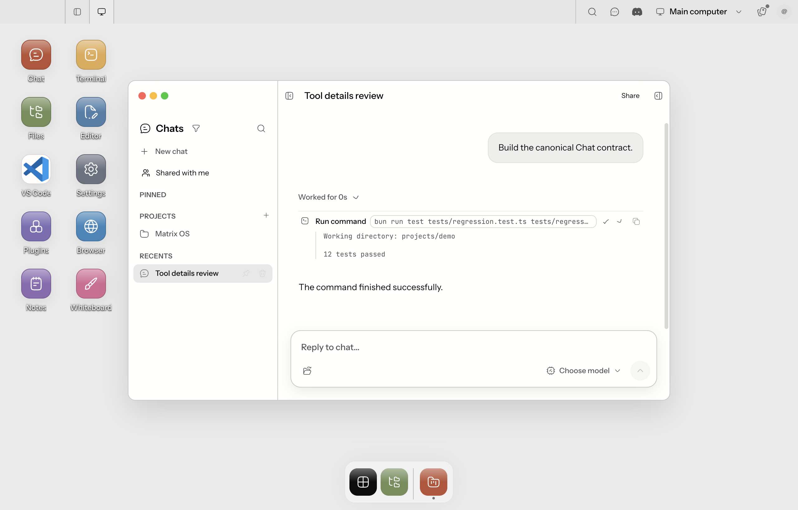

# Chat tool display and replay

Codex tool lifecycle records must retain their identity even when optional
preview text cannot be displayed. A command preview uses the thread event's
1,000-character/4,000-byte bound; working-directory detail uses its
2,000-character/8,000-byte bound. Neither field is a 120-character tool label.
Rejected optional metadata is omitted independently. An incomplete preview/kind
pair is omitted together, without discarding the start event.

All arbitrary tool result text is **private owner content**, including text that
contains no recognizable secret marker. A denylist cannot prove a string safe.
The detached Codex runner seals bounded results with AES-256-GCM before writing
the journal. Hermes uses the same sealing path before yielding a provider event.
The tool call ID is authenticated as associated data; tampering, a different
identity or a different key fails closed. General `tool.output.text` remains a
coarse notice, while `protectedOutput` carries only a bounded encrypted envelope.
This applies equally to terminal, file-read and MCP text envelopes. Arbitrary
objects and binary content are never serialized.

The per-runtime 32-byte key is owner configuration under
`system/.tool-output.key`, created exclusively with mode 0600 and no temporary files. Bounded retries
handle concurrent incomplete writes; partial keys are never used. Concurrent startup
and gateway/runner restarts reuse the same key. Symlink keys, invalid lengths,
other-user ownership and group/world permissions are rejected. The key must be
preserved with owner configuration during backup/recovery; losing it leaves old
results unavailable. Missing, unreadable or invalid keys degrade new results to summaries with a
coarse server-side warning; they do not abort Gateway or runner startup. A key
left incomplete by a crash requires operator repair and is never overwritten.
No key or plaintext result is placed in the provider event or database outbox.

Only the authenticated personal-owner Chat detail response and content stream
may decrypt. They require both matching Chat ownership and the configured VPS
owner, reject shared Chats, and never mutate repository/outbox objects. Legacy
thread views, generic event consumers, telemetry, collaboration and share
snapshots do not decrypt. Share snapshots select user/assistant text only, not
activities. This does not prevent an assistant/user from deliberately quoting
content in a message; message sharing remains an explicit separate action.
Known credential/path patterns and sensitive command context are still withheld
as defense in depth, but are not the privacy boundary. The authorized owner can
see unmatched opaque private content; this is not a public-safe text guarantee.
Host/process compromise and an owner reading their own runtime key are outside
this boundary. No new cross-owner filesystem or provider authority is granted.

Output remains capped at 4,000 UTF-16 units / 16 KiB and reports truncation.
Hermes retains only the tool name and a private-context bit across
start/completion frames, including when completion omits its name/arguments.
Unknown envelopes remain summary-only. Unencrypted historical output is not
backfilled or represented as retroactively encrypted by this change. Old detached
runner events are reduced to allowlisted coarse notices at ingestion and the
canonical adapter; only sealed envelopes retain actual output across replay.

Canonical activities remain the source of truth for live delivery and reload.
Renderers combine working-directory/status detail with tool output instead of
letting one hide the other, cap expanded detail at 16,000 characters, and mark
truncation. Web Canvas, Web Desktop and Web Mobile share the Web Chat component;
Native Mobile shares the activity projection and offers a bounded expandable
result. Electron Desktop retains its existing activity presentation and copy
command action. The legacy project transcript now displays its validated command
preview and working directory, while retaining its payload-free output summary.

Existing consecutive-tool grouping remains in place. This fix does not introduce
new grouping rules, expose arbitrary raw argument objects, or reconstruct data
that an older runner/parser already discarded. It does not change execution,
authorization, database ownership, or share/export visibility rules.

## Authorization and persistence checks

| Path | Required identity | Result handling |
| --- | --- | --- |
| Personal Chat detail | Authenticated matching Chat owner and runtime owner | Decrypt response copy only |
| Personal content stream, live/replay | Same owner checks after stream authorization | Decrypt frame copy only |
| Wrong owner, shared Chat | No private output grant | Coarse notice |
| Journal, Postgres activities, outbox | Runtime write authority | Ciphertext and coarse notice |
| Share snapshot, telemetry, legacy thread | No private output grant | No decryption |

## Regression checks

- `tests/gateway/protected-tool-output.test.ts`: opaque text, authenticated
  encryption, concurrent key creation and restart key reuse.
- `tests/gateway/owner-tool-output.test.ts`: owner/wrong-owner/shared boundaries,
  live/replay delivery, and unchanged encrypted repository/outbox/telemetry.

- `tests/gateway/codex-tool-display-contract.test.ts`: long commands, long
  directories, malformed/unsafe optional fields and multiline results.
- `tests/gateway/codex-tool-output.test.ts`: safe text, private context and size
  bounds before journal persistence.
- `tests/gateway/chat-coding-provider.test.ts`: live and snapshot replay retain
  output through the canonical adapter.
- `tests/gateway/coding-agents-codex-app-server-reliability.test.ts`: a spawned
  detached runner journals a long command and its result, then replays both.
- `tests/desktop/chat-tool-output-parity.test.ts`: desktop/web/mobile projection
  retains preview, metadata, result and truncation after serialization/reload.
- `tests/shell/tool-call-details.test.tsx` and Native Mobile
  `__tests__/chat-tool-activity.test.tsx`: expandable output and status.
- `tests/e2e/desktop/chat-tool-details.e2e.test.ts`: built Electron Desktop with
  a disposable profile and synthetic gateway; open Chat, select Tool details
  review, expand Worked for and Run command, then repeat after reload.

For the Electron check, build with `bun run build:desktop`, then run
`MATRIX_DESKTOP_E2E_REQUIRED=1 pnpm exec vitest run --config vitest.e2e.config.ts tests/e2e/desktop/chat-tool-details.e2e.test.ts`.
Evidence is written to `output/chat-tool-details/`; the disposable profile and
gateway are cleaned up after the test. This fixture check is not a production
provider call or human approval.

## Current visual evidence

Built Electron Desktop, synthetic owner Chat: expanded long command, working
directory and result after reload. This is the user-prioritized surface. Native
Mobile physical-device acceptance remains deferred; its interaction regression
is covered by the component test, not represented as device acceptance.

