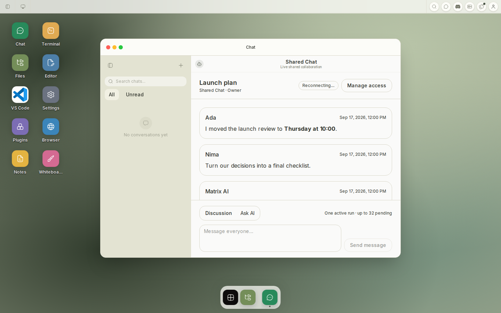
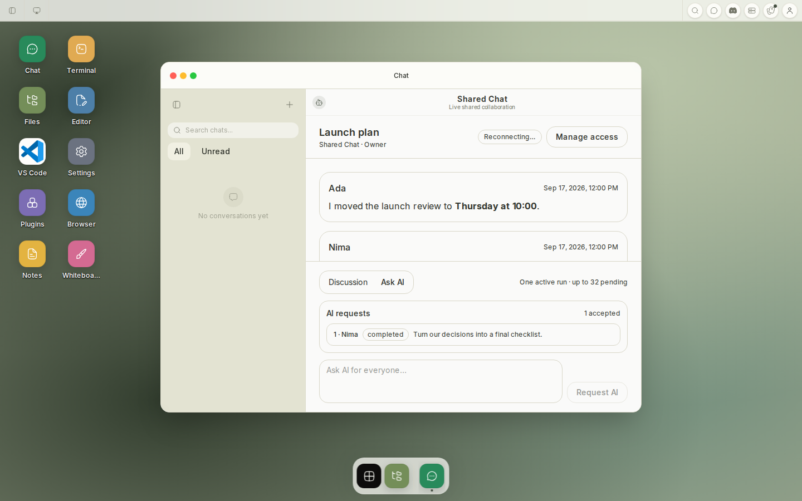
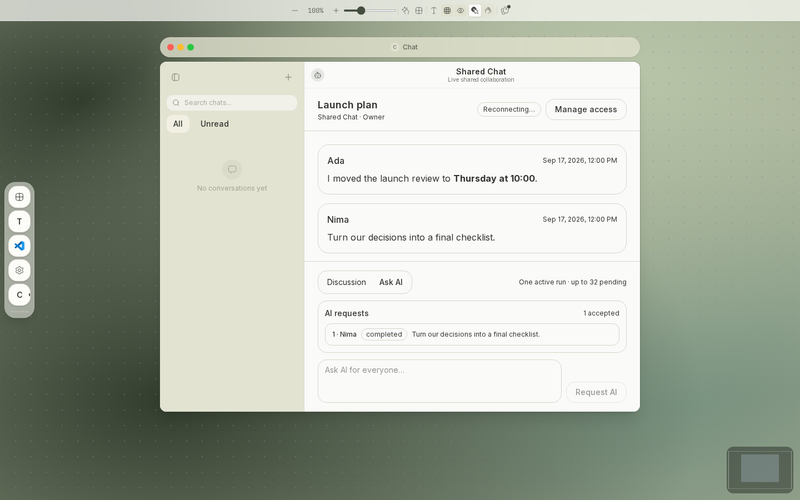
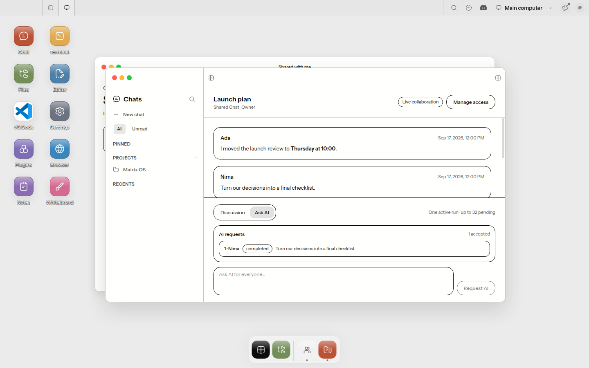

# Integrated shared Chat evidence

Captured from the production builds of this PR on Linux using synthetic collaboration fixtures. No customer accounts, messages, identifiers, or credentials were used.

## Web Desktop

The direct `/shared/chat/:scopeId` route bootstraps the complete authenticated shell, focuses Chat, and retains Chat navigation/chrome around the shared controller.





## Web Canvas

The same open Chat survives the OS-view presentation switch and preserves the private Ask AI composer mode and queue.



## Electron Desktop

This is a real Electron 41 capture under Xvfb, using the production main, preload, and renderer bundles. The journey opens **Shared with me**, selects the Chat, and verifies the canonical Chat workspace and shared panel before capture.



The Web fixture intentionally rejects the scoped WebSocket after loading canonical data, so the screenshots also demonstrate the non-destructive reconnect state while Discussion and Ask AI remain available from the last server-authorized projection. The Electron fixture shows the connected state.

## Reproduction

```bash
E2E_TEST_BYPASS=1 NEXT_PUBLIC_E2E_TEST_BYPASS=1 \
  NEXT_PUBLIC_CLERK_PUBLISHABLE_KEY=pk_test_Y2ktc2FmZS5leGFtcGxlLmNvbSQ= \
  NEXT_PUBLIC_CLERK_SIGN_IN_URL=/sign-in NEXT_PUBLIC_CLERK_SIGN_UP_URL=/sign-up \
  NEXT_PUBLIC_POSTHOG_KEY=phc_local_evidence \
  NEXT_PUBLIC_POSTHOG_PROJECT_TOKEN=phc_local_evidence \
  NEXT_PUBLIC_POSTHOG_HOST=https://eu.posthog.com NEXT_PUBLIC_POSTHOG_API_HOST=/relay \
  pnpm --filter shell build
pnpm --filter shell exec playwright test e2e/shared-chat.spec.ts

pnpm --filter desktop build
xvfb-run --auto-servernum pnpm exec vitest run --config vitest.e2e.config.ts \
  tests/e2e/desktop/shared-chat.e2e.test.ts
```

## Surface matrix

| Surface | UI | Behavior | State/recovery | Automated tests | Real evidence |
| --- | --- | --- | --- | --- | --- |
| Web Canvas | pass | pass | pass | pass | pass: `web-canvas-ai.png` |
| Web Desktop | pass | pass | pass | pass | pass: `web-desktop-discussion.png`, `web-desktop-ai.png` |
| Electron Desktop | pass | pass | pass | pass | pass: actual Electron capture `electron-desktop.png` |
| Web Mobile | N/A: intentionally gated to the desktop-width shell; shared URLs bootstrap the normal mobile shell without exposing collaboration | N/A | N/A | desktop-gating contract coverage | N/A: outside the requested Canvas/Desktop surfaces |
| Native Mobile | N/A: no Shared with me entry point or shared-Chat route exists in the native client | N/A | N/A | shared-controller coverage | N/A: outside the requested Canvas/Desktop surfaces |
