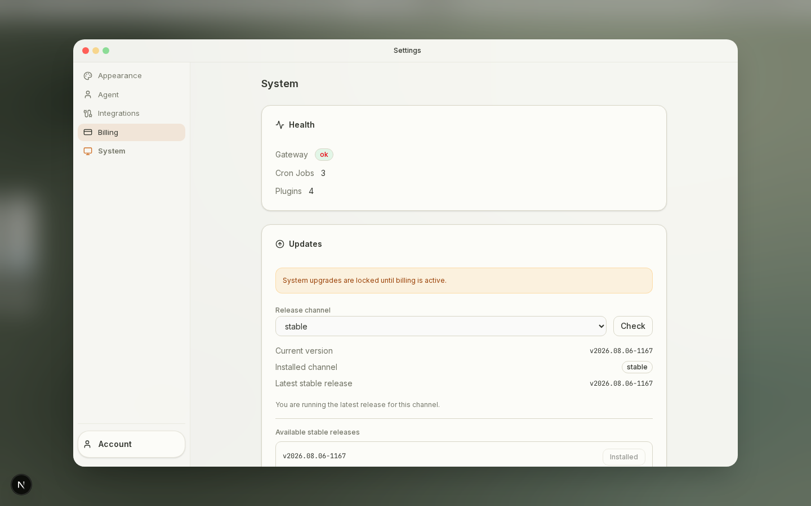
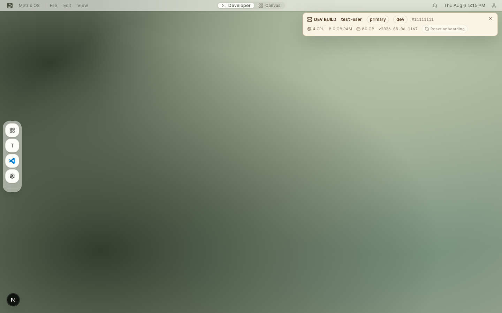

# PR 1167 release-channel evidence

Captured from PR #1167 with the shell running locally in the documented E2E
authentication-bypass mode. Gateway responses used deterministic test identity
and release metadata; no customer data or credentials were used.

## Stable subscription with dev artifact provenance

The mocked system response sets `updateChannel` to `stable` while the immutable
installed release metadata still says `dev`. The capture asserts that:

- System Settings initializes the release-channel selector to `stable`;
- System Settings reports the installed channel as `stable`;
- the `Current Matrix VM` development banner is absent.

## Dev subscription

The mocked system response sets `updateChannel` to `dev`. The capture asserts
that the `Current Matrix VM` card is visible and labeled `DEV BUILD`.

