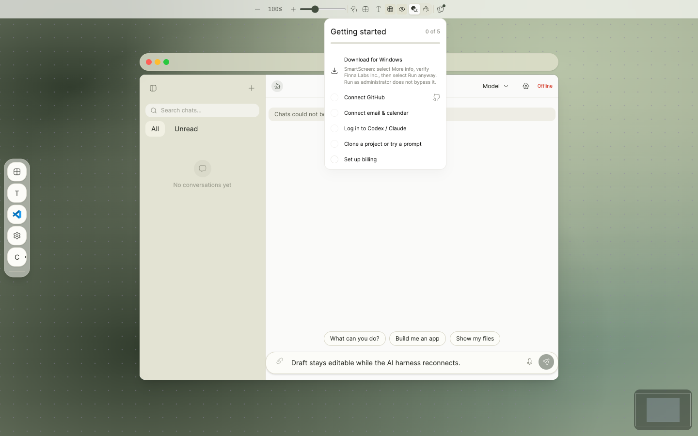
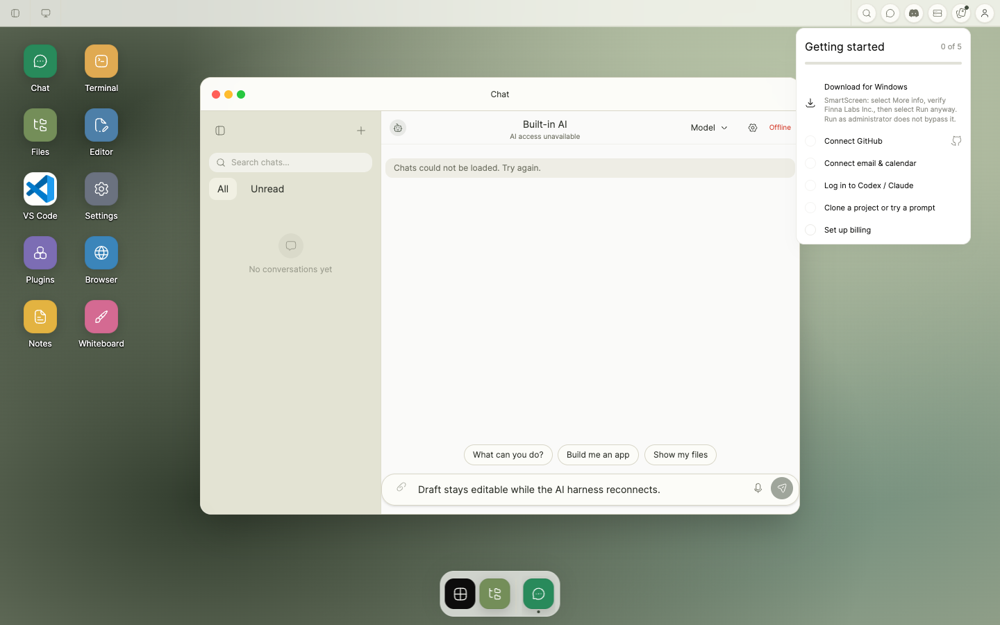

# PR 1620 — disconnected browser Chat composer

Captured from the production-built browser application at product-code commit
`6defc27cc8c530a9e2938ffdad3fd06d85b53340`. The isolated Playwright fixture
deliberately leaves the gateway unavailable while returning a ready speech
capability. It uses synthetic text and contains no account, credential, or
customer data.

## Current evidence

### Web Canvas



### Web Desktop



Both focused journeys prove the state before taking the screenshot:

- Chat reports **Offline** and AI access unavailable.
- The canonical **Message chat** textarea remains editable and retains the
  typed draft shown in the image.
- **Start voice input** remains enabled.
- **Send** remains disabled while no AI harness is connected.

The captures are first generated under ignored `output/playwright/` and copied
here only after review. The local build used deterministic repository-installed
font files so a live font service could not change the capture.

## Surface matrix

| Surface | UI | Behavior | State/recovery | Automated tests | Real evidence |
| --- | --- | --- | --- | --- | --- |
| Web Canvas | Pass — mounts the changed browser `ChatInput` | Pass — draft and microphone remain usable while Offline; Send remains disabled | Pass — the typed draft remains present | Pass — the exact-head capture journey asserted all four states | Pass — `web-canvas.png` |
| Web Desktop | Pass — mounts the changed browser `ChatInput` | Pass — draft and microphone remain usable while Offline; Send remains disabled | Pass — the typed draft remains present | Pass — committed Playwright journey asserted all four states | Pass — `web-desktop.png` |
| Electron Desktop | N/A to this PR delta — it renders `SharedChatComposer` and `DesktopSpeechInputControl`, not the changed browser `ChatInput` | N/A — the separate Electron composer has no diff against this PR's base | N/A — no Electron state/recovery behavior changes in this PR | N/A — existing Electron coverage is unchanged | N/A — a Web screenshot cannot prove Electron behavior, and this PR makes no Electron renderer change |
| Web Mobile | Excluded by explicit task-owner direction; it shares the browser `ChatInput`, so this is a scope exclusion rather than an architectural N/A | Not run | Not run | Not run | Not captured or claimed |
| Native Mobile | N/A to this PR delta — the Expo client does not render the browser `ChatInput` and has no diff in this PR | N/A | N/A | N/A | N/A; physical-device validation is not claimed |

The Electron Desktop and Native Mobile N/A entries follow from separate
renderer architectures and a zero diff for those renderers. Web Mobile is
listed separately because the browser component does apply there, but the task
owner explicitly excluded mobile validation from this evidence pass. Reviewer
direction for this pass was explicit: **skip mobile**. No mobile validation or
physical-device acceptance is claimed.

## Reproduction

Build the exact product commit used for the captures:

```bash
test "$(git rev-parse HEAD)" = "6defc27cc8c530a9e2938ffdad3fd06d85b53340"

E2E_TEST_BYPASS=1 NEXT_PUBLIC_E2E_TEST_BYPASS=1 \
  NEXT_PUBLIC_CLERK_PUBLISHABLE_KEY=pk_test_Y2ktc2FmZS5leGFtcGxlLmNvbSQ= \
  NEXT_PUBLIC_CLERK_SIGN_IN_URL=/sign-in NEXT_PUBLIC_CLERK_SIGN_UP_URL=/sign-up \
  NEXT_PUBLIC_POSTHOG_KEY=phc_local_evidence \
  NEXT_PUBLIC_POSTHOG_PROJECT_TOKEN=phc_local_evidence \
  NEXT_PUBLIC_POSTHOG_HOST=https://eu.posthog.com NEXT_PUBLIC_POSTHOG_API_HOST=/relay \
  pnpm --filter shell build
```

The committed Web Desktop journey is reproducible with:

```bash
PLAYWRIGHT_CHROMIUM_EXECUTABLE="/Applications/Google Chrome.app/Contents/MacOS/Google Chrome" \
  pnpm --filter shell exec playwright test e2e/screenshots.spec.ts \
  -g "disconnected Chat keeps its draft editable"
```

The Web Canvas capture used the same fixture and assertions after selecting
**Mode: Canvas** before opening Chat. That one-off capture scenario was removed
after the image was generated so this documentation-only follow-up does not
change product or test code.

Validation on the product commit:

- production browser build passed;
- Web Desktop disconnected composer journey: 1/1 passed;
- Web Canvas disconnected composer journey: 1/1 passed;
- both PNG references resolve and both files are 1440 × 900 RGB images.
