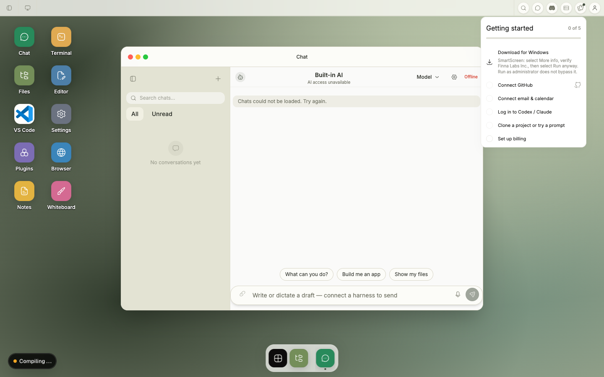

# PR #1662 disconnected speech-draft evidence

When no AI harness is available, the shared Chat composer displays **“Write or dictate a draft — connect a harness to send”**. The text area and ready microphone remain enabled so the user can create and edit a draft, while Send remains disabled until a harness is connected.

| Surface | Contract in this PR | Evidence |
| --- | --- | --- |
| Web Canvas | Shared `ChatApp` and `ChatInput`; editable typed or dictated draft; Send disabled | Provider-state and shared speech-input tests |
| Web Desktop | Same shared composer contract | Current Playwright screenshot and assertions |
| Electron Desktop | Uses the shared shell Chat composer and contract | Shared component tests; no Electron-only behavior is introduced |
| Web Mobile | Uses the shared Chat composer with the same copy and state rules | Shared component tests |
| Native Mobile | No browser speech-dictation entry point in this PR | Out of scope for this browser preview fix |

The screenshot test first types and verifies an editable disconnected draft, then clears it so the current explanatory copy is visible in the captured state. This evidence covers only disconnected copy, draft editability, and send gating. Waveform and active-recording visuals belong to the downstream speech interaction work and are intentionally not duplicated here.
