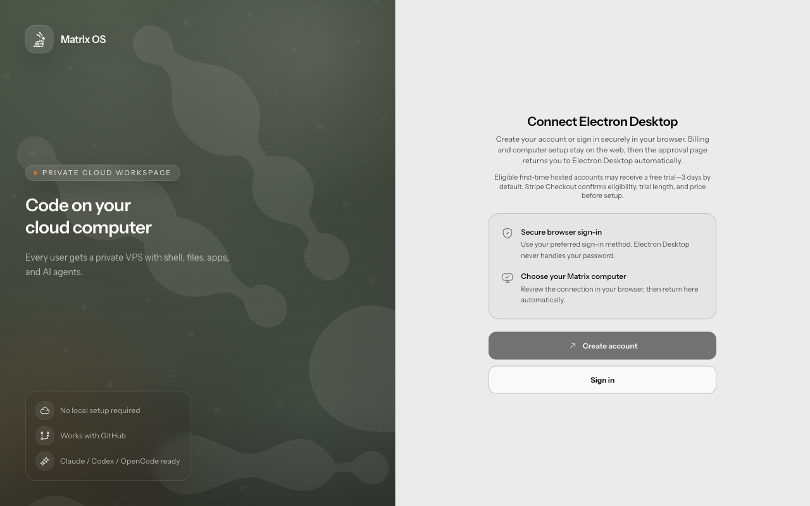

# PR 1809 — Electron Desktop account onboarding

Captured from the production-built Electron Desktop renderer on 2026-09-21 at
1280 × 800. The app used a disposable profile and the repository's isolated
stub gateway; no customer account, credential, subscription, or computer was
used. The E2E assertion verifies both **Create account** and **Sign in** before
capturing the image.



The browser remains the trusted Clerk and Stripe surface. Electron Desktop
only selects the initial account intent, opens the bounded approval URL, and
polls the existing device authorization. After browser billing and provisioning,
the signed native callback focuses Electron Desktop; it carries no credential.

## Surface matrix

| Surface | UI | Behavior | State/recovery | Automated tests | Real evidence |
| --- | --- | --- | --- | --- | --- |
| Web Canvas | N/A — pre-runtime native account entry does not render inside Canvas | N/A — existing browser Clerk and billing flow is unchanged | N/A — browser recovery remains platform-owned | N/A — no Web Canvas code changed | N/A — an Electron Desktop screenshot cannot establish Web Canvas evidence |
| Web Desktop | N/A — pre-runtime native account entry does not render inside Web Desktop | N/A — existing browser sign-in remains available | N/A — browser recovery remains platform-owned | N/A — no Web Desktop code changed | N/A — an Electron Desktop screenshot cannot establish Web Desktop evidence |
| Electron Desktop | pass — separate Create account and Sign in actions | pass — intent selects the matching Clerk screen; missing runtime continues through billing and provisioning | pass — device polling, expiry, safe errors, and signed native return remain authoritative | pass — focused renderer, IPC, auth-service, platform-route, and real Electron E2E coverage | pass — current production Electron capture above |
| Web Mobile | N/A — this Electron-only entry screen is not a responsive web surface | N/A — existing browser sign-in is unchanged | N/A — browser recovery remains platform-owned | N/A — no Web Mobile code changed | N/A — no Web Mobile UI changed |
| Native Mobile | N/A — Native Mobile owns a separate authentication client | N/A — its account entry and token exchange are unchanged | N/A — its existing recovery behavior is unchanged | N/A — no Native Mobile code changed | N/A — no Native Mobile UI changed |

## Reproduction

```bash
./node_modules/.bin/tsc -p packages/brand/tsconfig.json
./node_modules/.bin/tsc -p packages/observability/tsconfig.json
(cd desktop && ../node_modules/.bin/electron-vite build)
./node_modules/.bin/vitest run --config vitest.e2e.config.ts \
  tests/e2e/desktop/operator.e2e.test.ts \
  -t "shows Electron Desktop account choices"
```

The E2E launches `desktop/out/main/index.js` with a disposable
`OPERATOR_USER_DATA_DIR`, targets `tests/e2e/desktop/fixtures/stub-gateway.ts`,
asserts the exact Electron Desktop heading and both actions, and writes the
capture in this directory.
