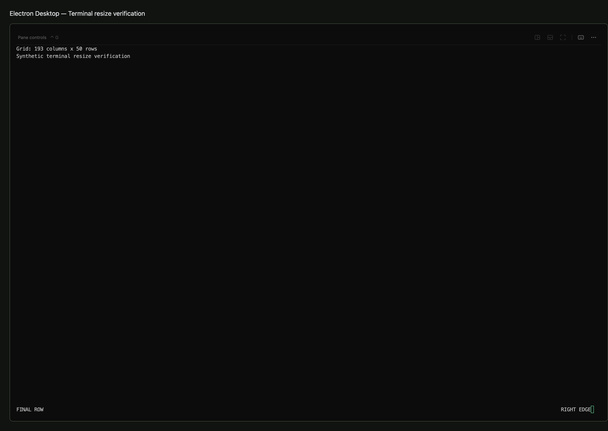
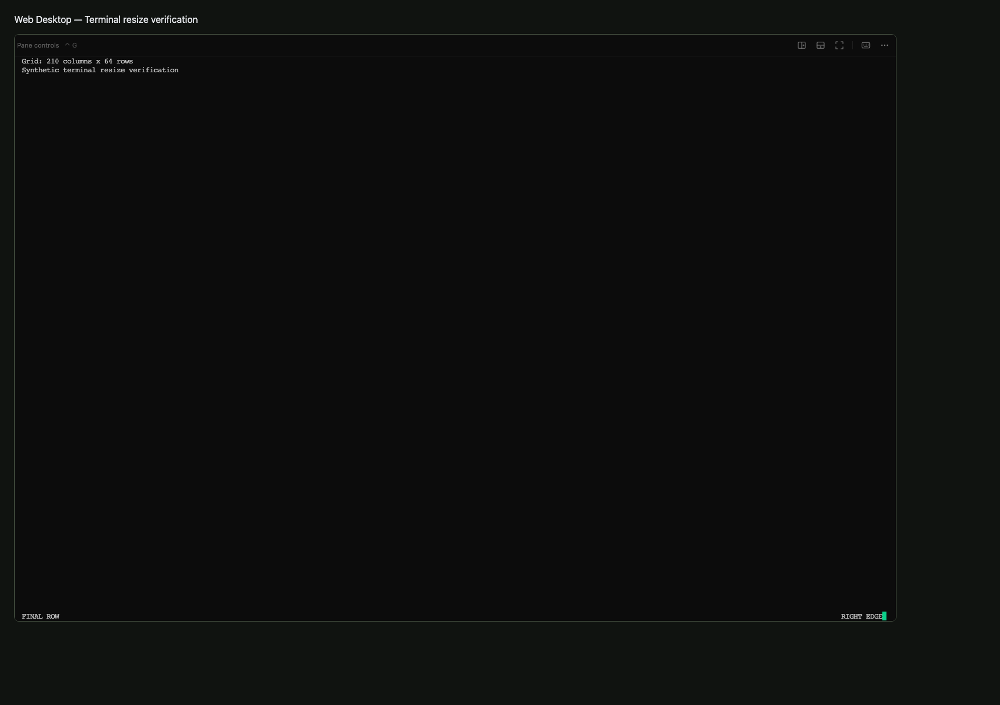
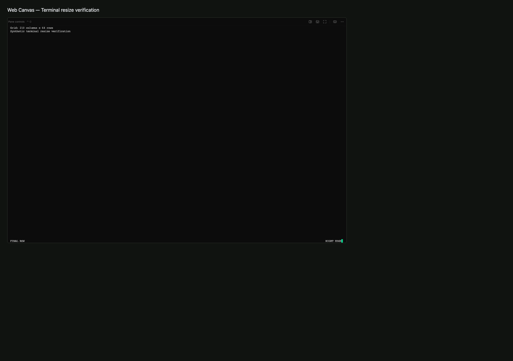

# Terminal viewport sizing

The acknowledged desktop writer declares the actual viewport grid at the configured font. Previously a 120x36 grid stayed at 120x36 when the viewport expanded because clients sent soft resize requests and local scale was capped at one.

## Validation

- 184 focused renderer, socket, runtime and scrollbar tests passed; includes a Unix-socket notification from a resize on another tab.
- 7 Chromium renderer scenarios passed: writable growth/shrink in Web Desktop, Web Canvas and Electron Desktop; observer fit/pan, selection and history in those surfaces plus Web Mobile.
- 2 native Electron renderer scenarios passed using an isolated profile, real xterm and synthetic terminal frames.
- Real Zellij 0.44.3 watcher sizing smoke passed. This independently checks PTY sizing; it does not replace full product Human Review.
- Repository typecheck, pattern scan (zero violations), production shell build (CI test Clerk key), and Electron production build passed.
- Latest React Doctor 0.9.14 changed-scope audit: Electron has zero findings; shell has zero new errors and one complexity warning. The same warning (cyclomatic 16, cognitive 13, nesting 2, line 153) exists on unchanged main; changed component span makes the scanner classify it as new. Full baseline shell audit reports 56 errors / 182 warnings. Baseline remediation is explicitly deferred to [#1763](https://github.com/HamedMP/matrix-os/issues/1763); this is not a clean full-project audit claim.

## Surface matrix

| Surface | Result |
| --- | --- |
| Web Desktop | Writable grid fills enlarged/reduced viewport; observer stays soft |
| Web Canvas | Same behavior under 0.75 parent zoom |
| Electron Desktop | Same behavior in Chromium fixture and native Electron |
| Web Mobile | Existing canonical soft fit/pan regression passes |
| Native Mobile | No renderer changes; runtime soft-client/reconnect tests pass. The human owner explicitly approved deferring physical-device acceptance to [#1764](https://github.com/HamedMP/matrix-os/issues/1764): no connected phone is available. Local Jest results match untouched main (52 suites / 334 tests pass; 13 suites / 1 test fail), and native typecheck has baseline React Native type errors. |

## Review regressions

- 218 runtime, sizing-lease, gateway-wiring and ownership tests pass, including clearing revoked proposals without disconnecting observers and revocation before runtime stream assignment.
- 240 runtime/CLI tests previously passed, including independent geometry/output revisions and real Unix-socket recovery after PTY resize failure.
- The requester passed fullscreen, native scrolling and deletion feedback through the combined Preview / Electron Desktop and authorized merge after review and CI.

## Human Review

Use the matching gateway/runtime and Electron Desktop build. Open a disposable terminal, run `stty size`, enlarge/fullscreen the window, run it again, then shrink it. Rows and columns should follow the usable viewport, with no stale wide blank strip. Reconnect at the same size and confirm sizing remains correct. Open a second device as observer: it should scale/pan without changing the writer's dimensions. Repeat in Web Desktop and Web Canvas.

Native Zellij scrollbar synchronization is tracked separately in #1745; the local-history fixtures above are not evidence that native history is synchronized.
