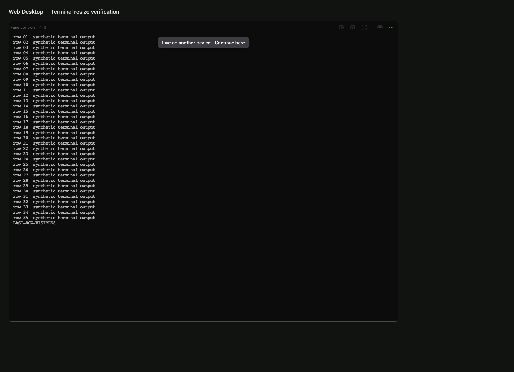
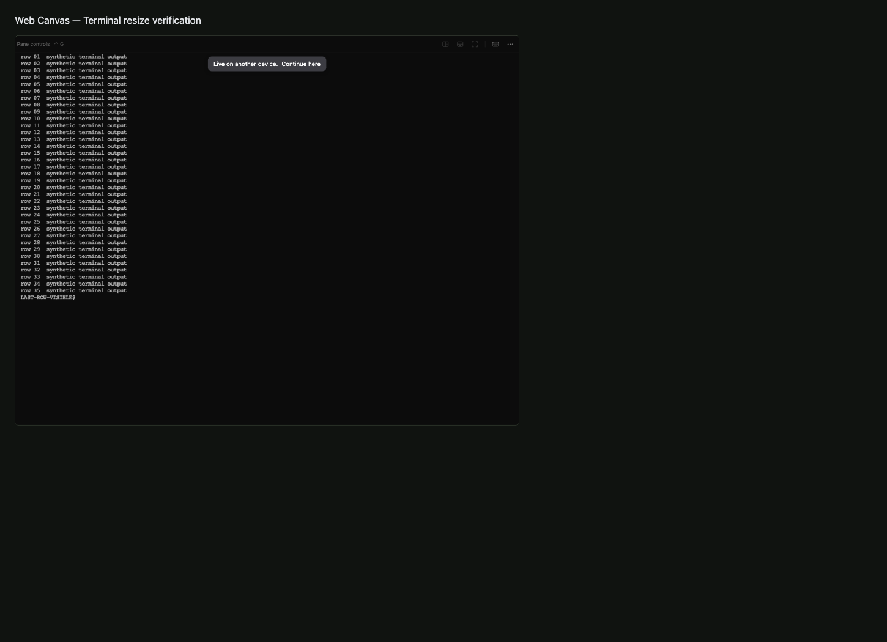
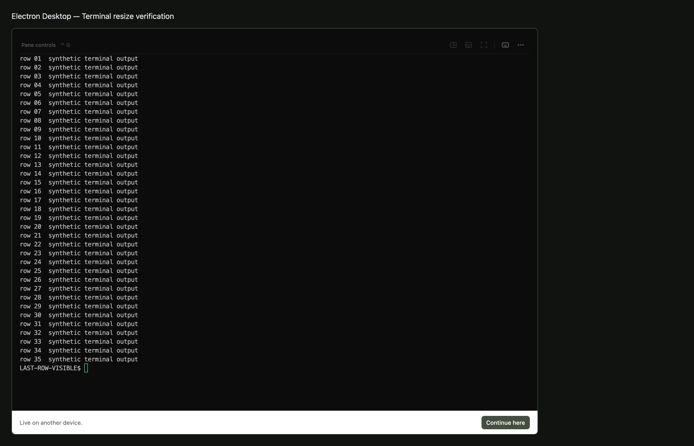

# Native terminal history synchronization

Zellij handles mouse-wheel history inside its native buffer; xterm's local scrollback counters therefore do not describe that history. The shared rail now reads native above/below/visible-row counts and sends absolute seek requests to that same buffer. Only the current input owner may seek.

## Validation

- 161 focused UI, transport, runtime and gateway tests passed. New coverage includes geometry, drag coalescing, ownership, unavailable-query recovery, reconnect cleanup, permission preservation, symlink rejection, artifact hashes, and a delayed query that must not block typing/pings.
- Real Zellij 0.44.3 integration passed using an isolated home and real node-pty attachment: native mouse wheel, top/line31/bottom seek, and output appended while viewing history.
- Three Chromium renderer integrations passed: actual Web Desktop, Web Canvas at 0.75 zoom, and Electron Desktop components with synthetic native protocol responses. One native Electron integration also passed. They verify capability negotiation, polling, native seek, observer rejection, and polling cleanup after unmount.
- Full-suite native import regressions were fixed using the package imports map; all 38 follow-up contract/UI tests passed. The full run had 33 failures; see the PR for remaining failure boundaries.
- Repository typecheck, runtime build, Electron production build, production shell build (CI test Clerk key), and pattern scan (0 violations) passed.
- Rust 1.98.1 locked build completed; shipped asset/source hashes are tested. Full repository suite is tracked in the PR description.
- React Doctor latest requests project installation; the runnable pinned 0.0.29 scan reports findings scoped to this branch base (shell 17 compiler errors / 5 warnings, Electron 4 warnings). This is not a clean React Doctor result and has not been compared against an untouched base.

## Surface matrix

| Surface | Evidence |
| --- | --- |
| Web Desktop | Real component + xterm/protocol fixture |
| Web Canvas | Same component at 0.75 zoom |
| Electron Desktop | Native Electron + real component/xterm/protocol fixture |
| Web Mobile | Shared protocol helper; native rail is not newly enabled on touch-only layout |
| Native Mobile | No custom rail added; optional protocol frames preserve existing behavior; device acceptance pending |

The screenshots show renderer/observer behavior with synthetic text, not real native-history content. macOS may hide the scrollbar thumb while idle. Real native history is checked independently by the Zellij integration test.

## Human Review

Pending matching runtime and client builds. In a disposable terminal, print 200 numbered lines, use the mouse wheel to view earlier output, drag the rail to the top/middle/bottom, and confirm thumb position follows the same history. Append delayed output while scrolled up, switch tabs and reconnect. Repeat in Web Desktop, Web Canvas and Electron Desktop. An observer must not move shared history until choosing Continue here. Confirm typing remains responsive during a cold native bridge startup.

No customer runtime was changed, and no deployment or merge has occurred. Fullscreen grid sizing is separately implemented in PR #1758; combine both heads and repeat product Human Review before release.
