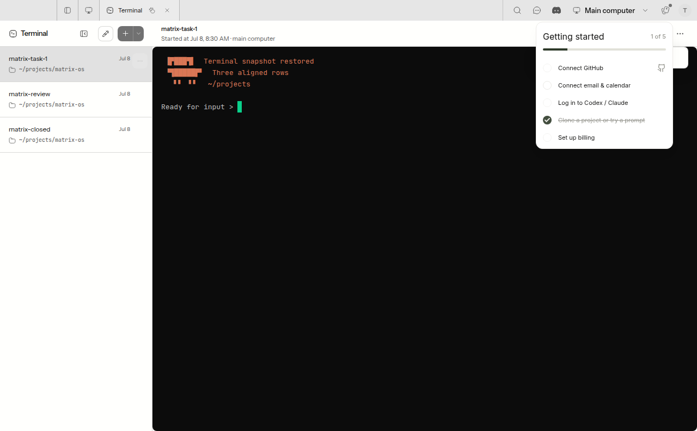

# Terminal snapshot recovery evidence

Captured from the production Electron Desktop build of this PR on Linux under Xvfb, using the isolated stub gateway. The app uses its real WebSocket client, TerminalView, and xterm renderer; only gateway data and authentication are test fixtures. No customer session or content is used.



The fixture first sends an ordinary shell prompt, then a saved screen with LF-only rows. The test verifies that the restored rows keep their intended indentation, the previous prompt is removed, and no false output-gap marker appears. The screenshot records the maximized Terminal window after restoration.

Reproduce after building Electron Desktop:

```sh
xvfb-run --auto-servernum pnpm exec vitest run --config vitest.e2e.config.ts tests/e2e/desktop/terminal-snapshot.e2e.test.ts
```

The test writes `output/playwright/terminal-snapshot/restored.png`. Tests for the bootstrap output buffer separately verify that the initial redraw arrives before incremental output and that failed/oversized openings clean up.

## Surface coverage

| Surface | UI | Behavior | State/recovery | Automated tests | Real evidence |
| --- | --- | --- | --- | --- | --- |
| Web Canvas | N/A: renderer unchanged | pass: shared snapshot transport | pass: shared bootstrap + Web terminal tests | pass | N/A: transport-only change |
| Web Desktop | N/A: renderer unchanged | pass: shared snapshot transport | pass: shared bootstrap + Web terminal tests | pass | N/A: transport-only change |
| Electron Desktop | pass | pass | pass | pass | pass: actual Electron capture above |
| Web Mobile | N/A: renderer unchanged | pass: shared snapshot transport | pass: shared bootstrap + Web terminal tests | pass | N/A: transport-only change |
| Native Mobile | N/A: renderer unchanged | pass: shared snapshot transport | pass: shared bootstrap contract | pass: transport contract | N/A: transport-only change |

The non-Electron `pass` entries describe shared automated boundary coverage, not manual device runs. The shared server change only normalizes LF/CRLF in snapshot ANSI before transmission; it changes neither the frame schema nor live-output bytes. No non-Electron renderer, navigation, controls, copy, or layout is modified. Their N/A visual-evidence rationale is that this PR's client-side reset and gap-marker change exists only in Electron Desktop; the common runtime behavior is exercised by real Unix-socket and bootstrap tests. Reviewer acceptance of those N/A entries is requested; no browser screenshot is presented as Native Mobile evidence.
