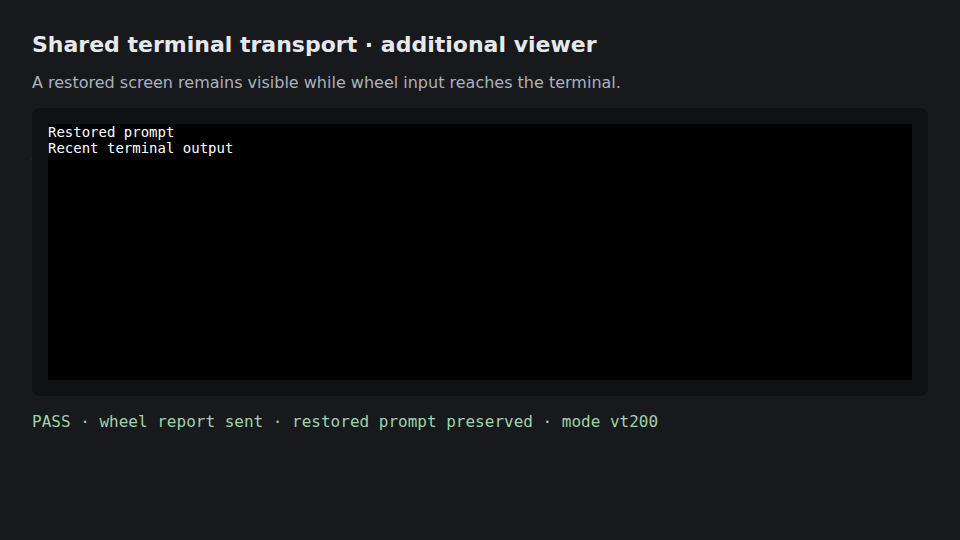

# Additional-viewer scrolling verification

The screenshot is a **synthetic transport fixture using real xterm in Chromium**.
It is not a screenshot of the Matrix OS Web Desktop or Electron Desktop UI.
No customer sessions, screenshots, or content were used.



## Reproduction and assertions

`tests/e2e/terminal-viewer-scroll.e2e.test.ts` creates an isolated real
`TerminalRuntime` with a simulated Zellij attachment. A first viewer receives
mouse-mode initialization; a second viewer joins the same attachment. The
second viewer's initialization bytes come from the production runtime.

The test restores a nonempty screen in real xterm, applies those bytes, and uses
Playwright wheel gestures. It asserts that SGR, default binary, and small-delta
pixel-SGR input reaches the simulated attachment through `viewer.write`, while
the restored prompt remains visible. It also verifies mouse disable behavior.
It does not claim to verify live Zellij history movement or unchanged app chrome.

Run with a locally installed Chrome channel, or specify the Chromium executable:

```sh
PLAYWRIGHT_CHROMIUM_EXECUTABLE=/path/to/chromium \
  node node_modules/vitest/vitest.mjs run --config vitest.e2e.config.ts \
  tests/e2e/terminal-viewer-scroll.e2e.test.ts --maxWorkers=1
```

The test runs in the existing E2E test glob and saves its screenshot under
`output/playwright/terminal-viewer-scroll/`.

## Results and scope

- 148 tests passed across all 14 non-live terminal-runtime suites.
- Three Chromium wheel/trackpad integration cases passed.
- Terminal-runtime TypeScript check passed.
- Pattern scan: zero violations; five existing warnings.
- Original late-viewer regressions failed on both the pinned base and #1703.
- No renderer component, navigation, layout, copy, or persistence format changed.
- React Doctor and new renderer builds are not applicable to this backend-only change.

| Surface | Applicable behavior | Evidence | Renderer visual validation |
| --- | --- | --- | --- |
| Web Canvas | Shared attachment mouse initialization | Runtime tests and real xterm wheel fixture | N/A: renderer unchanged |
| Web Desktop | Shared attachment mouse initialization | Runtime tests and real xterm wheel fixture | N/A: renderer unchanged |
| Electron Desktop | Shared attachment mouse initialization | Runtime tests and real xterm wheel fixture | N/A: renderer unchanged |
| Web Mobile | Shared attachment initialization | Shared runtime tests; no touch-device run claimed | N/A: renderer unchanged |
| Native Mobile | Shared attachment initialization where this transport is used | Shared runtime tests; no native-device run claimed | N/A: renderer unchanged |

The fixture establishes the corrected transport boundary and mouse-input path,
not full manual validation of each product surface. Renderer N/A entries were
accepted by the task coordinator for this backend-only scope.

## Dependencies and limitations

Merge #1703 first: that PR retains startup output and fixes screen snapshot
presentation. This change only retains current mouse reporting/encoding state;
it does not replay startup output or reconstruct complete emulator state.
Viewport sizing and panning remain separate work.

The local canonical `bun run test` invocation initially stopped in its kernel
build prerequisite after exhausting the default 512 MiB Node heap. The direct
focused and broad terminal-runtime runs above completed; repository-wide gates
remain the responsibility of the required label-triggered CI before completion.
