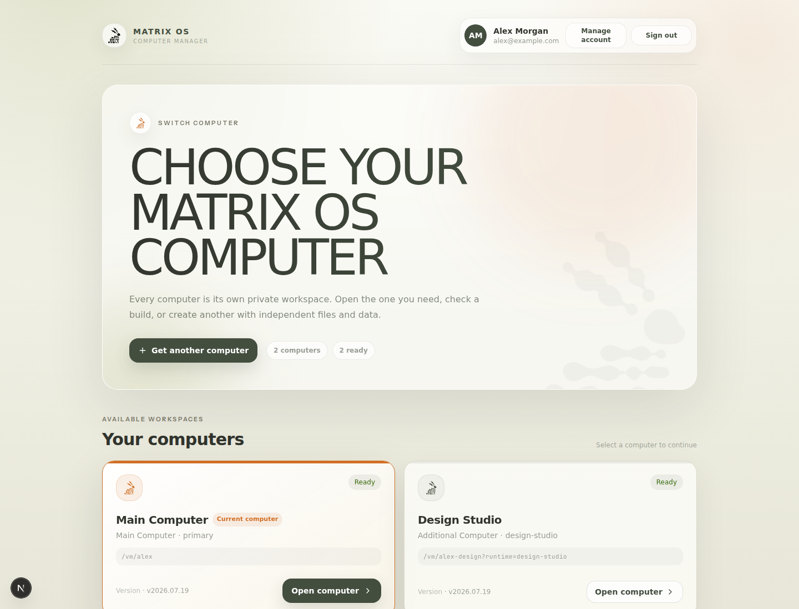
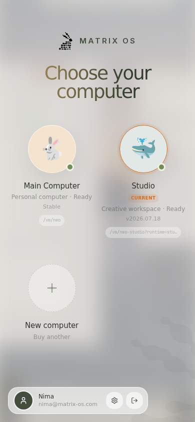
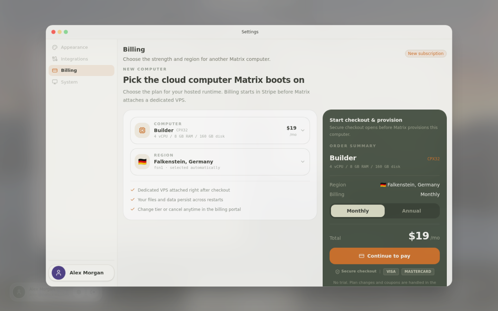

# Feature Specification: Stripe Runtime Plans

**Feature Branch**: `084-stripe-runtime-plans`
**Created**: 2026-05-30
**Status**: Draft
**Input**: Move Matrix paid plans from Clerk Billing to Stripe Billing while preserving Clerk identity, making plan changes safe for owner data and VPS machines, supporting internal engineer testing without payment, and leaving room for multiple machines as a paid feature.

## Summary

Matrix needs paid plans that control real runtime capacity: whether a user can access Matrix and which Hetzner server type a particular VPS runtime can use. Clerk remains the identity/session provider. Stripe Billing becomes the money and subscription source of truth. Each customer computer has one independent Stripe subscription, associated by `(clerk_user_id, runtime_slot)`, and Matrix projects those subscriptions into platform Postgres so provisioning and routing never make live Stripe calls.

The core invariant is: **billing changes may affect access, provisioning, and routing, but must never delete, overwrite, or mutate owner data directly.** Machine upgrades, downgrades, and internal test changes must be reversible and auditable.

## Goals

- Use Stripe Checkout Sessions in `mode: "subscription"` for initial purchases and Stripe Customer Portal for self-service plan changes, payment method updates, cancellations, invoices, and promotion-code support.
- Use Stripe Prices, not deprecated Plans, as the configured billing objects.
- Do not offer trials for the paid beta. Public copy should say users can start with account/onboarding exploration, but launching hosted runtime requires payment.
- Enable Stripe Tax with `automatic_tax: { enabled: true }` for subscription checkout and portal-managed subscriptions.
- Map Stripe price IDs to Matrix plan entitlements in platform config/data.
- Keep Clerk as the auth source of truth, reuse one Stripe Customer per Clerk user, and store each Stripe subscription against one runtime slot.
- Support internal Matrix engineers and customer support with audited entitlement overrides that do not require payment and do not create fake Stripe invoices.
- Support multiple active runtimes per user as a first-class feature through independently billed `runtime_slot` subscriptions.
- Make plan changes data-safe: access may be suspended, new provisioning may be blocked, or routing may be limited, but owner home files, owner Postgres data, R2 backups, and existing VPS disks are not destroyed automatically.
- Provide a staging/test path using Stripe CLI, test-mode Stripe objects, and internal overrides.

## Non-Goals

- Usage-based token metering or AI spend billing.
- Marketplace payouts or Stripe Connect.
- Treating any Hetzner server type or add-on price as permanently fixed. Hetzner shapes, regions, and prices may change and must be represented by a Matrix-controlled catalog.
- Automatic deletion of machines after cancellation, downgrade, or payment failure.
- Migrating existing Clerk Billing subscriptions. If any exist, handle them manually or with a separate migration task.
- Organization/team seat billing beyond a single account owner controlling one or more runtimes.
- Free trials, card-required trials, or no-card trials for hosted runtime plans.

## Migration Decision

Production fleet evidence captured at 2026-07-21 16:28 UTC found no existing billable additional computers: all non-primary machines were operator PR previews, which are explicitly excluded from customer billing. Existing Stripe-derived entitlement rows are therefore backfilled to `runtime_slot=primary`, and launch requires no grandfathering or retroactive charging. The launch migration fails closed if a pre-cutover, non-preview, non-primary customer machine without either an exact subscription or active internal override is discovered; computers created under the new model are not reclassified by that one-time cutover check.

## Current State

- Clerk sessions identify the user in the platform and shell.
- Runtime routing already supports multiple machines through `user_machines.runtime_slot`.
- `user_machines` stores the server type and region used for display, fleet visibility, and recovery-safe reprovisioning.
- Provisioning currently uses the global `HETZNER_SERVER_TYPE` from platform config.
- Runtime access is currently gated by the env-based `MATRIX_PAID_BETA_ENTITLEMENT_STATUS`, not by Clerk or Stripe.
- `/runtime` already renders a picker when multiple machines are active.

## Decisions

### Source Of Truth

- **Identity**: Clerk user ID.
- **Payment/subscription lifecycle**: Stripe Billing.
- **Per-computer entitlement used by Matrix**: `billing_subscriptions` rows derived from Stripe webhooks and keyed by Stripe subscription ID, with `(clerk_user_id, runtime_slot)` selecting the current subscription for one computer. Internal overrides remain an audited user-wide exception.
- **Machine ownership and data**: `user_machines`, owner-controlled VPS disk, owner-local Postgres, and R2 backups.

Runtime and provisioning code MUST read the exact runtime slot's Matrix subscription projection, not Stripe directly and not the coarse user summary. Stripe webhook processing is the only path that turns paid subscription events into normal entitlements. `billing_entitlements` may remain as a derived user-level summary for legacy/audit consumers, but it is not the source of truth for an individual computer. Admin/internal overrides are a separate audited path.

### Stripe Surface

- Checkout: Stripe Checkout Sessions, `mode: "subscription"`.
- Subscription management: Stripe Customer Portal.
- Discounts: Stripe Coupons and Promotion Codes.
- Tax: Stripe Tax with `automatic_tax: { enabled: true }`.
- API version: latest configured SDK/API version, currently `2026-05-27.dahlia`.
- API keys: prefer restricted API keys (`rk_`) per environment and per service where permissions allow it.
- Do not pass `payment_method_types`; allow dynamic payment methods from Stripe Dashboard configuration.

### Plan Projection

Stripe price IDs map to Matrix plan slugs. Plan slugs are stable app contracts; Stripe price IDs can rotate for new pricing.

Proposed initial entitlement shape:

| Matrix plan slug | Public? | Monthly price | Included machines | Default server type | Allowed server types | Intended use |
|------------------|---------|---------------|-------------------|---------------------|----------------------|--------------|
| `matrix_starter` | yes | $14/mo or $140/yr | 1 | catalog default for Starter | Starter catalog profile | paid beta entry |
| `matrix_builder` | yes | $19/mo or $190/yr | 1 | catalog default for Builder | Starter + Builder catalog profiles | stronger single machine |
| `matrix_max` | yes | $49/mo or $490/yr | 1 | catalog default for Max | Starter + Builder + Max catalog profiles | strongest single computer |
| `internal` | no | none | configurable | configurable | all staging-approved types | Matrix engineers, support, demos |

The `internal` plan is not a Stripe plan. It is an audited Matrix override that can expire and can be scoped to staging or production.

The public labels are marketing names. Current UI copy may present them as **Starter**, **Builder**, and **Max**. The `early_adopter` Clerk-era slug is legacy only and should not be the new billing source of truth.

### Server-Type Catalog

Hetzner server types, locations, storage options, and their upstream prices can change independently from Matrix plan names and Stripe price IDs. Matrix MUST keep a platform-owned runtime catalog that maps product concepts to currently allowed provider SKUs.

Initial catalog entries are based on the existing shell billing profiles:

| Catalog profile | Current Hetzner type | Current resources | Existing monthly cap reference |
|-----------------|----------------------|-------------------|--------------------------------|
| Starter | `cpx22` | 2 vCPU, 4 GB RAM, 80 GB disk | EUR 8.49 |
| Builder | `cpx32` | 4 vCPU, 8 GB RAM, 160 GB disk | EUR 14.49 |
| Max | `cpx52` | 12 vCPU, 24 GB RAM, 480 GB disk | EUR 36.99 |

The catalog must be editable through environment/config first, and later through an operator DB table if needed. Stripe prices buy Matrix entitlements; they do not hardcode provider SKUs forever.

### Independent Computer Subscriptions And Coupons

Starter, Builder, and Max each buy one computer. A second computer uses the same standard plan Prices in a new Stripe Checkout subscription under the user's existing Stripe Customer. Matrix does not add an extra-runtime item to an existing subscription and does not use Customer Portal to purchase another computer. Future storage or provider-backed add-ons are outside this change and must not alter this one-subscription-per-computer invariant implicitly.

Discounts should be implemented with Stripe coupons and promotion codes. Required discount families:

- percentage off for a bounded number of months;
- pay for X months, receive Y month(s) free, represented as an equivalent coupon/promotion-code strategy where Stripe supports it;
- referral or customer-specific promotion codes.

### Machine Policy

Plan changes change **policy**, not data.

- Purchase another computer: create a separate Checkout subscription for its runtime slot and allow provisioning only after the signed subscription webhook activates that exact slot.
- Upgrade to a bigger default server type: do not resize existing machines automatically. Show the current server type and offer a safe "create upgraded runtime" or "migrate this runtime" action.
- Downgrade or cancel one computer: preserve every machine and owner-data record, but after the applicable grace period gate only the runtime slot whose subscription no longer grants access. Other subscriptions and computers remain unaffected.
- Payment failure or subscription end: continue routing during the 3-day grace period, then block paid runtime routing or show a payment-required recovery page. Machines, backups, and data remain intact. Actual stop/delete policies require separate retention decisions.
- Internal engineer test changes: allow changing entitlement and creating extra runtime slots in production and staging without payment. Do not mutate production customer subscriptions.

### Runtime Slots

Multiple machines are represented by stable runtime slots:

- `primary`: user's main Matrix computer.
- `dev`, `staging`, `preview`, or generated safe slugs: optional extra machines.

Each slot has independent owner data and backups. Moving data between slots is a migration operation, not an implicit side effect of changing plans.

## User Stories And Acceptance Criteria

### User Story 1 - Subscribe And Get Entitlement

A signed-in user chooses a paid plan, completes Stripe Checkout, and receives the correct Matrix runtime entitlement without support intervention.

**Acceptance Criteria**

1. Given a signed-in Clerk user with no Stripe customer, when they start checkout, then Matrix creates or reuses one Stripe customer linked to the Clerk user.
2. Given checkout succeeds, when Stripe sends subscription events, then Matrix upserts one subscription projection for the exact Clerk user and runtime slot with the mapped Matrix plan.
3. Given the webhook is duplicated or arrives out of order, then processing remains idempotent and does not regress a newer entitlement with older data.
4. Given Stripe is temporarily unavailable during checkout creation, then the browser receives a generic retryable error and no entitlement is granted.
5. Given two requests race for the same runtime slot, then Matrix atomically claims one active Checkout attempt and uses its ID as the Stripe idempotency key, so only one Checkout Session is created for that slot and selection.

### User Story 2 - Change Plans Without Losing Data

A user upgrades, downgrades, cancels, or fails payment without Matrix deleting owner data or silently changing machines.

**Acceptance Criteria**

1. Given one computer changes from `matrix_starter` to `matrix_builder`, when its subscription projection updates, then that computer's policy changes while every other computer remains unchanged.
2. Given one computer's subscription is canceled or fails payment, when its grace period ends, then only that runtime slot is gated and all machines remain recorded and recoverable.
3. Given a subscription becomes past due, canceled, unpaid, incomplete, incomplete_expired, or ended, when runtime routing is attempted, then Matrix gates its exact runtime slot without deleting VPSes, backups, home files, or owner Postgres data.
4. Given that subscription reactivates, when the webhook is processed, then its runtime slot becomes accessible again without changing other slots.

### User Story 3 - Internal Engineers Test Paid Plans

A Matrix engineer can test every plan and machine policy without paying, without creating fake customer invoices, and without losing their current machine.

**Acceptance Criteria**

1. Given an authorized operator grants an internal override to a Clerk user, when the user opens Matrix, then effective entitlement reflects the override and audit metadata records who granted it, why, and when it expires.
2. Given an engineer changes override from `matrix_starter` to `matrix_max`, when they create extra runtime slots, then existing slots remain untouched and new slots provision only after explicit action.
3. Given an override expires, when the user is over the normal entitlement, then Matrix gates access or new provisioning according to policy but preserves all machines and data.
4. Given staging Stripe test objects are used, when webhook events are replayed through Stripe CLI, then entitlement updates can be tested end to end without production Stripe side effects.

### User Story 4 - Multiple Machines As A Feature

A user can buy multiple independently billed Matrix runtimes and switch between them from `/runtime`.

**Acceptance Criteria**

1. Given the exact runtime slot has an active subscription, when the user creates a new slot with a safe slug, then Matrix provisions a separate VPS for that slot.
2. Given multiple slots exist, when the user opens `/runtime`, then the authenticated platform app shell lists all slots with status, version, resource label, and the authoritative server-provided `gatewayPath`.
3. Given the user routes to `/vm/:handle` or a runtime-specific path, then Matrix resolves the intended slot deterministically and never leaks access between Clerk users.
4. Given a slot is failed, recovering, provisioning, payment-gated, or suspended, then the manager shows its state and only exposes safe recovery or selection actions.
5. Given the customer enters a computer name, then the browser normalizes it to a unique safe runtime-slot slug, rejects `primary`, empty results, duplicates, and names over 32 characters, and displays the slug in readable title case without storing another name column.
6. Given a customer starts another computer, then setup reuses the first-time plan, region, interval, and default-install controls and creates a standard Stripe Checkout subscription for that runtime slot.
7. Given Checkout returns before its subscription webhook, then the manager polls the exact runtime slot and does not provision from the redirect alone.
8. Given an internal override account has capacity, then the same setup controls are reused but Checkout is bypassed; at override capacity the manager does not expose a Stripe action.
9. Given a preview machine exists, then it is visible in inventory but does not consume customer entitlement capacity.
10. Given a second computer becomes ready, then the manager refreshes inventory and opens it only through its returned `gatewayPath`; it never reconstructs a secondary URL.
11. Given a user starts another computer from `/runtime`, then Matrix fully navigates to the platform-owned root shell at `/?billing=setup&handoff=add-computer` and reuses the first-run Settings/Billing strength, interval, region, and default-install controls; Checkout records those selections for the requested runtime slot, and the selected region is retained for provisioning and recovery. The legacy exact `/onboarding/computer` route redirects to this shared entry point.

## Functional Requirements

- **FR-001**: Matrix MUST use Stripe Billing as the payment and subscription lifecycle source of truth.
- **FR-002**: Matrix MUST use Clerk user IDs as the identity key when linking Stripe customers and Matrix entitlements.
- **FR-003**: Matrix MUST create subscription Checkout Sessions server-side with dynamic payment methods and without `payment_method_types`.
- **FR-004**: Matrix MUST provide a server-side Customer Portal session endpoint for subscription management.
- **FR-005**: Matrix MUST verify Stripe webhook signatures before processing events.
- **FR-006**: Matrix MUST process Stripe webhook events idempotently and record the Stripe event ID.
- **FR-007**: Matrix MUST map Stripe price IDs to stable Matrix plan slugs through server-side configuration/data.
- **FR-008**: Matrix MUST support promotion codes and coupons through Stripe-hosted checkout/portal configuration.
- **FR-009**: Matrix MUST enable Stripe Tax automatic tax for subscription checkout and managed subscriptions.
- **FR-010**: Matrix MUST store each Stripe subscription independently in platform Postgres so routing/provisioning does not call Stripe on hot paths.
- **FR-011**: Matrix MUST support audited internal entitlement overrides independent of Stripe subscriptions.
- **FR-012**: Matrix MUST compute the effective entitlement for an exact runtime slot from its current subscription plus an optional internal override, with clear precedence rules.
- **FR-013**: Matrix MUST require one active standard-plan subscription for each customer runtime slot before provisioning a new VPS; internal overrides are the only capacity-based exception.
- **FR-014**: Matrix MUST enforce allowed server types before provisioning or migrating a runtime.
- **FR-015**: Matrix MUST preserve owner data and machine records on all billing lifecycle changes.
- **FR-016**: Matrix MUST serve authenticated `/runtime` and the add-computer root-shell handoff from the platform app shell and send signed-out visitors through Clerk authentication; exact `/onboarding/computer` remains a platform-owned compatibility redirect and nested onboarding paths remain protected.
- **FR-017**: Matrix MUST expose hosted profile actions for switching computers and starting another-computer setup, while self-hosted profiles MUST omit hosted-only actions.
- **FR-018**: Matrix MUST validate the exact runtime slot against its webhook-projected subscription and MUST NOT grant access from a Stripe return redirect.
- **FR-019**: `POST /billing/portal` MUST remain a generic subscription-management flow and MUST NOT sell an additional computer or select an extra-runtime Price.
- **FR-020**: `GET /api/journey` MUST validate an optional runtime slot and return slot-specific provisioning progress without rerunning account onboarding.
- **FR-021**: Add-computer telemetry MUST use a fixed low-cardinality event vocabulary and MUST exclude names, slots, handles, email, and other PII.
- **FR-016**: Matrix MUST not auto-delete or auto-overwrite VPSes as a direct webhook side effect.
- **FR-017**: Matrix MUST keep every machine visible when its exact subscription is downgraded, canceled, or payment-gated.
- **FR-018**: Matrix MUST provide operator/audit visibility for subscription state, entitlement state, overrides, and runtime count.
- **FR-019**: Matrix MUST include staging instructions using Stripe test mode and Stripe CLI webhook forwarding/replay.
- **FR-020**: Matrix MUST document the production Stripe object setup: products, prices, portal settings, coupons/promotion codes, tax registrations, webhook endpoint, and required restricted-key permissions.
- **FR-021**: Matrix MUST support monthly and annual Stripe Prices for each public plan.
- **FR-022**: Matrix MUST use the six standard Starter, Builder, and Max monthly/annual Prices for every computer and MUST NOT require extra-runtime Prices or focused portal configurations.
- **FR-023**: Matrix MUST model Hetzner server types through a Matrix runtime catalog so upstream provider changes do not require changing plan slugs or Stripe price IDs.
- **FR-024**: Matrix MUST preserve runtime routing for paid users through the active billing period and a 3-day grace period after payment failure or subscription end.
- **FR-025**: Additional-computer setup MUST reuse the canonical onboarding strength, region, and default-install components rather than maintaining a second set of controls.
- **FR-026**: Matrix MUST validate the selected server type against the effective entitlement, validate the selected region against the platform allowlist, and persist both on the machine record before asynchronous provisioning.

### Effective Entitlement Precedence

1. A non-revoked internal override wins over Stripe when it has no expiry or its expiry is in the future.
2. Revoked overrides and expired overrides are ignored for access decisions but remain queryable in audit views.
3. If no active override exists, the current `billing_subscriptions` row for the requested `(clerk_user_id, runtime_slot)` is used. A different slot's subscription never grants access.
4. Slot subscriptions with `active` status grant runtime access. `current_period_end` is retained for audit/period display only and MUST NOT be used as a hard cutoff during normal renewal. Slot subscriptions with `past_due`, `unpaid`, `canceled`, or `ended` status grant runtime routing only when `grace_period_ends_at` is present and still in the future.
5. If neither an active override nor a usable Stripe entitlement or grace window exists, the effective entitlement is `none`.
6. Unknown or trial-like Stripe states never grant hosted runtime access. This product has no hosted runtime trials; a `trialing` Stripe subscription is treated as a misconfiguration and projected as no paid access until corrected.

## Data Model Draft

### `billing_customers`

- `clerk_user_id` primary key.
- `stripe_customer_id` unique, nullable until first checkout.
- `created_at`, `updated_at`.

### `billing_subscriptions`

- `stripe_subscription_id` primary key.
- `stripe_customer_id`.
- `clerk_user_id`.
- `runtime_slot`.
- `plan_slug`.
- `stripe_price_id`.
- `billing_interval`: `monthly` or `annual`; nullable only for legacy primary backfill rows whose opaque Price ID does not reveal an interval safely.
- `status`.
- `current_period_end`.
- `grace_period_ends_at`.
- `latest_event_created_at`, `latest_event_id`.
- `updated_at`.

The latest event projection per `(clerk_user_id, runtime_slot)` is authoritative for that computer. A stale webhook cannot overwrite a newer row for the same Stripe subscription.

### `billing_entitlements` (derived compatibility summary)

- `clerk_user_id` primary key.
- `source`: `stripe`.
- `plan_slug`.
- `status`: `active`, `past_due`, `canceled`, `incomplete`, `incomplete_expired`, `unpaid`, `ended`, `none`. `none` is stored only when the latest Stripe subscription projection has no recognized paid base plan or is in a trial-like/unknown state; it is not a deletion marker.
- `max_runtime_slots`: derived count of currently accessible slot subscriptions; it is not authorization for a particular slot.
- `default_server_type`.
- `allowed_server_types` JSON array.
- `included_runtime_slots`: same derived accessible-subscription count.
- `addon_runtime_slots`: always `0` for normal Stripe billing.
- `grace_period_ends_at`.
- `stripe_subscription_id`.
- `stripe_price_id`.
- `effective_from`, `effective_until`.
- `updated_at`.

This row remains for legacy summary and audit consumers. Runtime routing, recovery, resize, journey, and provisioning MUST resolve the exact slot from `billing_subscriptions`.

### `billing_checkout_attempts`

- `id` primary key and Stripe idempotency key.
- `clerk_user_id`, `runtime_slot`.
- `plan_slug`, `billing_interval`, `region_slug`, `server_type`, `developer_tools`.
- `stripe_session_id`, `checkout_url` after Stripe session creation.
- `status`: `creating`, `open`, `paid`, `expired`, `abandoned`.
- `created_at`, `resolved_at`.

At most one `creating` or `open` attempt may exist per `(clerk_user_id, runtime_slot)`. Interrupted `creating` claims use a shorter bounded sweep than open Stripe Sessions, and a repeated identical request reuses the stored Checkout URL.

### `billing_entitlement_overrides`

- `id`.
- `clerk_user_id`.
- `plan_slug`.
- `status`: `active` only. Revocation and expiry are represented by `revoked_at` and `expires_at`, not by additional status strings.
- `max_runtime_slots`.
- `default_server_type`.
- `allowed_server_types`.
- `reason`.
- `created_by`.
- `expires_at`.
- `revoked_at`.
- `created_at`.

### `billing_runtime_catalog`

- `sku` primary key, for example `starter`, `builder`, `max`.
- `provider`: `hetzner`.
- `server_type`, for example `cpx22`.
- `vcpu`, `memory_gb`, `disk_gb`.
- `included_storage_gb`.
- `active`.
- `metadata` JSON.
- `created_at`, `updated_at`.

### `billing_webhook_events`

- `stripe_event_id` primary key.
- `event_type`.
- `created_at_from_stripe`.
- `processed_at`.
- `status`: `processed`, `ignored`, `failed`.
- `error_code`, not raw error text.

## API Draft

| Route | Auth | Purpose |
|-------|------|---------|
| `POST /billing/checkout` | Clerk session | Atomically claim and create a Stripe subscription Checkout Session for a selected plan, interval, region, and runtime slot |
| `POST /billing/portal` | Clerk session | Create Stripe Customer Portal Session |
| `GET /billing/status?runtimeSlot=...` | Clerk session | Return the exact slot entitlement, or the derived user summary when no slot is supplied |
| `GET /api/auth/computers` | Clerk session | Return authoritative customer and preview computer inventory with `gatewayPath` |
| `POST /api/auth/provision-runtime` | Clerk session | Idempotently start a customer runtime build from `{ runtime, developerTools, serverType?, location? }` after strict request validation and transactional entitlement enforcement |
| `GET /api/journey?runtimeSlot=...` | Clerk session | Return account or validated slot-specific journey progress |
| `POST /api/journey/retry-provision` | Clerk session | Retry a failed build for a validated runtime slot |
| `POST /billing/webhooks/stripe` | Stripe signature | Process Stripe webhook events |
| `GET /admin/billing/accounts/:clerkUserId` | operator auth | Read billing customer, subscription, effective entitlement, active/expired/revoked overrides, and runtime slot count for audit/debug |
| `POST /admin/billing/overrides` | operator auth | Grant or update internal override |
| `DELETE /admin/billing/overrides/:id` | operator auth | Revoke internal override |

Mutating routes require request body limits, Zod validation, safe generic client errors, and server-side audit logs.

`POST /billing/portal` is management-only. The removed `add_computer` intent is
rejected rather than selecting a Price or portal configuration. All return paths
pass through the platform same-origin allowlist. Stripe API work has a 10-second
budget and returns only generic billing errors to the browser.

## Webhook Events

Initial supported events:

- `checkout.session.completed`
- `customer.subscription.created`
- `customer.subscription.updated`
- `customer.subscription.deleted`
- `invoice.payment_succeeded`
- `invoice.payment_failed`

Authoritative entitlement grant:

- `customer.subscription.created` and `customer.subscription.updated` are the only events that may grant active runtime entitlement or change one computer's plan shape.
- `customer.subscription.deleted` never grants active runtime entitlement, but it MUST change the latest entitlement projection for that subscription into a non-active state (`canceled` or `ended`) and set the grace window; it may revoke access after grace, but it must not delete machines or billing audit rows.
- `checkout.session.completed` may link/verify the Stripe customer and session metadata, but it MUST NOT grant hosted runtime access by itself.
- A subscription grants its runtime slot access only after Matrix projects a known base plan Price and valid `matrix_runtime_slot` metadata from the Stripe subscription object. Legacy subscriptions without slot metadata map to `primary` only.
- `invoice.payment_succeeded` and `invoice.payment_failed` may help explain billing state, but runtime access still comes from the latest subscription projection plus the 3-day grace policy.

Implementation contract:

- Override records have a one-value status enum: `active`. Effective lookup MUST ignore any override with `revoked_at` set or with `expires_at` in the past.
- Initial paid runtime access MUST be created from the first qualifying `customer.subscription.created` or `customer.subscription.updated` projection only; no checkout or invoice event may independently create an entitlement.
- `customer.subscription.created`, `customer.subscription.updated`, and `customer.subscription.deleted` MUST upsert `billing_subscriptions` for the Stripe subscription ID in the same transaction as the processed event ID and derived user summary. The stored snapshot includes the customer, Clerk user, runtime slot, plan, Price, interval, status, period end, grace end, latest event timestamp/ID, and update time.
- `grace_period_ends_at` is set when projecting the first event in each non-active paid subscription episode (`past_due`, `unpaid`, `canceled`, or `ended`) and equals that Stripe event processing time plus 3 days. It is cleared when the subscription returns to `active`, so a later `active -> past_due` or `active -> canceled` transition starts a fresh 3-day grace window.
- `customer.subscription.deleted` follows the same setter path as other non-active subscription projections: that subscription row is rewritten to `canceled` or `ended` and its `grace_period_ends_at` is populated from that deletion event processing time when the current non-active episode has no grace window yet.
- The webhook projector is the only writer for Stripe-derived `grace_period_ends_at`; request handlers and UI reads must not recompute grace from `current_period_end`, invoice timestamps, or local read time.
- Cancellation scheduling remains Stripe-managed. It is not a local grace-period setter and must not replace webhook-time `grace_period_ends_at`.

Processing rules:

- Verify signature before parsing trusted payload.
- Record event ID before side effects or within the same transaction as entitlement updates.
- Use Stripe object IDs and event timestamps to avoid stale event regression.
- Unknown events are recorded as ignored.
- Failed processing returns non-2xx so Stripe retries, unless the event is permanently invalid and safely ignored.
- Webhooks update entitlement rows only. They do not provision, delete, recover, resize, or stop machines directly.

## Machine Lifecycle

### New Machine

1. The browser validates and normalizes a requested display name into a safe unique runtime slot and reuses the canonical first-time plan, interval, region, and default-install controls.
2. `POST /billing/checkout` atomically claims that slot's Checkout attempt, maps the selected standard plan to a server-owned Price, and creates a subscription under the existing Stripe Customer with Clerk user, runtime slot, and region metadata.
3. On return, the manager polls `/billing/status?runtimeSlot=...` until the signed webhook projection activates that exact slot; a redirect never authorizes provisioning.
4. The platform transaction takes the owner provisioning lock, re-resolves that exact subscription inside the transaction, and inserts the unique active slot and durable provisioning job atomically.
5. Platform provisions through the existing customer VPS path with the selected plan's allowed server type and allowlisted region, storing both on `user_machines` before asynchronous dispatch.
6. The manager polls the slot-specific journey, offers the existing retry contract on retryable failure, refreshes inventory when ready, and uses the returned `gatewayPath` to open it.

### Upgrade Machine

First implementation should avoid in-place resizing.

1. User or operator requests an upgraded runtime for a slot.
2. Platform requires a fresh backup/snapshot or explicit empty-start confirmation.
3. Platform creates a new candidate machine from backup with the target server type.
4. Platform marks candidate as recoverable/testable before promotion.
5. User/operator promotes the candidate or abandons it.
6. Old machine remains recoverable until explicit cleanup policy is executed.

### Cancellation / Payment Failure

1. Webhook updates only the affected slot subscription and recomputes the coarse user summary transactionally.
2. Existing machine records stay visible and no machine is deleted.
3. Runtime routing continues for that slot through the 3-day grace period, then blocks that unpaid slot without affecting independently subscribed computers.
4. A replacement subscription can reactivate the slot through the same signed webhook projection; deletion is never automatic in this feature.

## Edge Cases

- Stripe checkout completed but subscription webhook is delayed.
- Webhook arrives before the platform has linked a Clerk user to a Stripe customer.
- Two tabs start Checkout for the same runtime slot: a unique active-attempt claim and Stripe idempotency key converge on one session.
- Checkout session creation succeeds but storing the URL fails: the same attempt ID remains the Stripe idempotency key; the interrupted claim is abandoned or swept before a bounded retry.
- User changes plans twice before the first webhook finishes processing.
- Stripe sends duplicate events.
- Stripe sends events out of order.
- Price ID is unknown or removed from config.
- Promotion code makes a paid plan temporarily free.
- Subscription contains an unknown or legacy extra-runtime item: ignore it for computer capacity; only the recognized base plan controls that slot.
- Subscription is `incomplete`, `incomplete_expired`, `past_due`, `unpaid`, `canceled`, deleted, or unexpectedly `trialing` despite no-trial product policy.
- Customer Portal schedules a downgrade at period end.
- User has a valid internal override and a failed Stripe subscription.
- Override expires while user owns slots without independent paid subscriptions.
- Existing users have machines but no Stripe customer yet.
- User is in Sweden/EU and tax registration or address collection is incomplete.
- Stripe API key lacks permissions.
- Stripe webhook signing secret is missing or wrong.
- Admin grants override to the wrong Clerk user.
- Machine provisioning succeeds but entitlement changes before registration.
- Machine migration candidate boots but restore fails.
- Old and new machines are both healthy during migration.
- R2 backup is missing for a requested migration.
- Runtime slot slug collides with an existing active slot.
- `/runtime` shows machines from mixed entitlement states.
- Two tabs request the same normalized slot concurrently.
- Stripe redirects before its signed webhook projection is visible.
- A webhook omits runtime-slot metadata: it may affect `primary` only and must not authorize another slot.
- Browser storage is unavailable or contains a stale/malformed add-computer draft.
- Inventory refresh succeeds after provisioning but the new machine is not visible yet.

## Security And Compliance

- Store Stripe keys only in environment/secrets, never in source.
- Prefer restricted API keys with minimum permissions for checkout/portal/session creation and read-only subscription/customer operations.
- Use separate Stripe keys and webhook secrets for staging and production.
- Verify webhook signatures with Stripe's signing secret.
- Never expose raw Stripe errors, provider IDs that are not needed by the client, database errors, stack traces, or environment values to browser clients.
- Do not trust client-submitted price IDs. Clients submit Matrix plan slugs; the server maps slugs to allowed Stripe price IDs.
- Use server-side allowlists for plan slug, price ID, server type, and runtime slot slug.
- Validate `/?billing=setup&handoff=add-computer` return paths through the existing same-origin allowlist; reject absolute, protocol-relative, encoded traversal, nested onboarding, and non-allowlisted paths.
- Never derive a secondary computer URL from a handle or slot in the browser. Only use inventory `gatewayPath` values validated by the shared contract.
- Keep add-computer telemetry PII-free: fixed event names and bounded enums/counts only, never computer names, runtime slots, handles, Clerk IDs, or email addresses.
- Audit all internal overrides and all machine-affecting entitlement decisions.
- Stripe Tax registrations are an operator setup requirement before broad launch; automatic tax may be enabled before registrations exist.

## Testing

### Unit Tests

- Price ID to Matrix plan mapping.
- Effective entitlement precedence: internal override vs Stripe entitlement.
- Stripe status to access decision mapping.
- Exact-slot subscription enforcement.
- Server-type allowlist enforcement.
- Over-limit downgrade behavior.
- Idempotent webhook event processing.
- Stale webhook event rejection.

### Integration Tests

- Checkout session creation validates Clerk identity and uses a server-side price mapping.
- Customer Portal session creation only for the signed-in user.
- Stripe webhook signature validation rejects invalid signatures.
- Webhook updates entitlement in one transaction with event recording.
- Provisioning rejects a new runtime slot without its own active subscription.
- Internal override grants entitlement without Stripe subscription.
- Authenticated `/runtime` and the root-shell add-computer handoff proxy to the platform app shell while signed-out requests enter Clerk authentication; exact `/onboarding/computer` redirects to that shared handoff.
- A new standard-plan Checkout provisions and opens a second slot from refreshed inventory.
- Stripe return resumes only after the webhook activates the requested runtime slot.
- Concurrent same-slot Checkout and provisioning remain idempotent.
- Preview machines remain excluded from customer capacity while customer-provisioned preview-shaped slots remain counted.

## Integration Wiring And Failure Policy

- The platform startup injects the existing Postgres-backed machine repository,
  entitlement projector, Stripe client, Clerk resolver, and customer VPS service
  into the existing billing, auth, inventory, journey, and provisioning routes.
  No new database, global registry, or cross-package singleton is introduced.
- `/runtime`, the root-shell add-computer handoff, and the exact `/onboarding/computer` compatibility redirect are built into the platform-owned Next.js app shell. The profile menu
  ships in customer host bundles, while routing, billing, and both platform pages
  require a platform/app-shell deployment.
- Browser API calls use 10-second timeouts. Billing projection and journey polls
  use one bounded timer per mounted manager and clear pending timers on cleanup.
  Billing projection waits at most two minutes before presenting a safe retry.
- Provisioning remains the existing transactional source of truth: exact-slot
  subscription revalidation and unique-slot enforcement occur under the owner
  lock in the write transaction, and Stripe/provider calls are outside that
  transaction. An accepted build may outlive a closed
  browser; journey state and machine inventory reconcile it on the next visit.
- No files, unbounded collections, or long-lived connections are added. The only
  browser persistence is one bounded `sessionStorage` draft containing a display
  name, validated slot, bounded tool allowlist, selected server type/region, and timestamp;
  malformed drafts are ignored and no secret or account PII is stored there.
- Failures never delete, replace, rename, resize, or migrate an existing machine.
  `409` returns to naming or the in-progress Checkout, `402` returns to billing, managed accounts
  get a non-Stripe explanation, and provider/network failures use generic retryable
  copy while detailed error kinds stay in server/client logs.

## Current UI Evidence

The customer computer manager was validated from the real React component with
deterministic account, inventory, and billing adapters at desktop and mobile
viewports:

The dedicated platform-owned add-computer route reuses the same onboarding
controls after leaving the runtime inventory:

### Staging Manual Tests

- Use Stripe test mode products/prices.
- Use Stripe CLI to forward webhooks to staging.
- Complete checkout with Stripe test cards.
- Replay subscription update, payment failure, cancellation, and reactivation events.
- Grant and expire an internal override.
- Create a second runtime slot under an allowed plan.
- Cancel the second computer's subscription and verify the primary remains accessible and all machine records remain visible.
- Upgrade to a stronger plan and create a new candidate runtime without replacing the original.

## Stripe Object Setup Draft

Required staging objects:

- Product: `Matrix OS`.
- Prices:
  - `matrix_starter_monthly`
  - `matrix_starter_annual`
  - `matrix_builder_monthly`
  - `matrix_builder_annual`
  - `matrix_max_monthly`
  - `matrix_max_annual`
- Annual prices are required for launch, not optional.
- Customer Portal configuration with:
  - subscription updates enabled,
  - cancellation enabled or cancellation-contact flow selected,
  - promotion codes enabled if desired,
  - invoice history enabled.
- No extra-runtime Price or focused add-computer portal configuration is required.
- Coupons and promotion codes:
  - launch discount,
  - founder discount,
  - support/customer-specific discount.
- Stripe Tax:
  - automatic tax enabled in Checkout Sessions,
  - Dashboard tax registrations configured by operator.
- Webhook endpoint:
  - `POST https://<platform>/billing/webhooks/stripe`
  - events listed in this spec.

## Open Questions

1. Should the first migration/upgrade flow create a new runtime slot (`primary-upgrade`) or replace the same slot through a candidate/promote workflow?
2. Which route owns the public pricing UI long term: `www` marketing site, platform app, shell settings, or a shared component?
3. Which exact Stripe Product/Price IDs should be used in staging and production after objects are created?

## Implementation Slices

1. Stripe/runtime catalog and plan mapping module with tests.
2. Billing DB tables and entitlement computation with tests.
3. Checkout and portal endpoints.
4. Stripe webhook endpoint and idempotent processing.
5. Runtime/provisioning entitlement enforcement with 3-day grace.
6. Internal override admin endpoint and audit logs.
7. Per-computer subscription projection and exact-slot authorization.
8. `/runtime` and settings UI updates for first-time Checkout reuse and multiple slots.
9. Landing/pricing copy update: no trials, monthly/annual pricing, coupons supported through Stripe.
10. Staging Stripe CLI runbook and a separate public-docs PR in `FinnaAI/matrix-os-site`.
