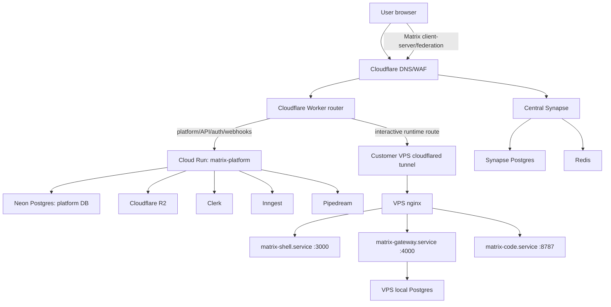

# 085 Cloud Run Platform Migration

Status: draft for immediate implementation
Owner: Matrix OS platform
Date: 2026-06-04

Companion docs:

- [Agent implementation guide](agent-implementation-guide.md)
- [Operator setup guide](operator-setup-guide.md)

## Goal

Move the production control plane out of the current single platform Docker Compose host and into managed cloud services while keeping the Matrix OS runtime model intact.

- Cloud Run runs the centralized platform API/control plane.
- Neon stores platform Postgres data.
- Cloudflare R2 stores host bundles, sync objects, backups, exports, and object data.
- Clerk remains the identity provider.
- Pipedream remains platform-owned integration infrastructure.
- Inngest runs durable background workflows.
- User browsers reach their assigned VPS runtime directly through Cloudflare, not through Cloud Run on the interactive hot path.
- Each customer VPS continues to run the owner runtime gateway, shell, code service, local owner Postgres, and sync/update agents.
- Synapse is centralized for beta rather than installed on every user VPS.

Downtime is acceptable for this migration because there are no production users yet.

## Non-Goals

- Do not migrate owner/app/runtime data from each VPS into Neon.
- Do not run the customer runtime on Cloud Run, Workers, or serverless functions.
- Do not put Pipedream, Clerk, Stripe, Neon admin credentials, or global platform secrets on customer VPSes.
- Do not make Cloudflare Workers the platform source of truth.
- Do not deploy Synapse per VPS for beta.
- Do not introduce D1, SQLite, or another persistence layer for platform state.

## Target Services

| Layer | Service | Region | Purpose |
|-------|---------|--------|---------|
| DNS, WAF, TLS, routing | Cloudflare | global | Public entrypoint for Matrix OS domains |
| Edge router | Cloudflare Worker | global | Session bootstrap, runtime route token minting, dispatch to Cloud Run or selected VPS tunnel |
| Platform API | Google Cloud Run | `europe-west3` Frankfurt | Central Hono platform/control-plane API |
| Platform DB | Neon Postgres 18 | AWS Europe Central 1, Frankfurt | Canonical platform data |
| Object storage | Cloudflare R2 | EU jurisdiction if available/required | Host bundles, sync objects, backups, exports |
| Auth | Clerk | Matrix domains | User sessions and identity |
| Integrations | Pipedream | platform-owned | OAuth/integration proxy source of truth |
| Workflows | Inngest | hosted or self-hosted later | Provisioning, deploy fanout, reconciliation, webhook jobs |
| User runtime | Hetzner Cloud VPS | start with `fsn1` or `nbg1` | Per-user Matrix computer |
| Runtime DB | Local Postgres on each VPS | same VPS | Owner/app/runtime data |
| Messaging | Central Synapse cluster | Germany/Frankfurt | Matrix homeserver for beta |

## Selected Platform Database

Use this Neon project for the first migration target:

```text
Project name: matrixos_platform
Postgres version: 18
Region: AWS Europe Central 1 (Frankfurt)
```

The production branch holds platform data only. Use Neon branches for staging and pull-request validation.

## Target Request Paths

Platform/API paths go through Cloudflare to Cloud Run, then to Neon, R2, Clerk, Pipedream, or Inngest. Examples include `/auth/*`, `/billing/*`, `/containers/provision`, `/vps/*`, `/system-bundles/*`, `/api/integrations/*`, internal integration routes, operator routes, and webhooks.

Interactive runtime paths must not proxy through Cloud Run after the route is known:

```text
Browser -> Cloudflare DNS/WAF -> Cloudflare Worker -> selected customer VPS cloudflared tunnel
  -> VPS nginx -> matrix-shell.service :3000
  -> matrix-gateway.service :4000
  -> matrix-code.service :8787
```

Matrix protocol paths go to central Synapse:

```text
Matrix client or federated homeserver -> Cloudflare -> matrix.matrix-os.com -> central Synapse reverse proxy
```

## Architecture



## Data Ownership

Neon is canonical for platform-owned control-plane data: Clerk user mapping, handles, VPS/machine registry, runtime slots, entitlement projections, release metadata, deploy fanout records, integration metadata, Pipedream mapping, audit logs, and launch readiness state.

Each customer VPS remains canonical for owner-owned data: `~/system/*`, `~/apps/*`, `~/agents/*`, app data in local owner Postgres, runtime sessions, terminal/code workspace state, and owner-local backups before upload. R2 mirrors or backs up owner data, but does not become the canonical owner database.

## Security Model

All public traffic enters through Cloudflare. Configure WAF managed rules, route-specific rate limits, bot/abuse controls for signup/onboarding, `CDN-Cache-Control: no-store` for authenticated runtime/code responses, and immutable public asset caching only where safe.

Clerk remains the end-user session source of truth. Platform operator APIs use `PLATFORM_SECRET` bearer auth until an admin session model replaces it. Internal VPS calls use per-host `UPGRADE_TOKEN` or a new per-machine HMAC/JWT credential. Route-token minting must be short-lived and bound to user, machine handle, runtime slot, host class, and expiry.

The VPS must reject direct browser traffic without a platform-signed route token or Cloudflare Access/service-token proof. Required Worker-to-VPS headers are `X-Matrix-Route-Token`, `X-Matrix-Handle`, `X-Forwarded-Host`, `X-Forwarded-Proto`, and `CF-Connecting-IP`. For `code.matrix-os.com`, continue sending `X-Matrix-Code-Proxy-Token`.

Never copy platform-only Pipedream, Clerk, Stripe, Hetzner, or global platform secrets into customer VPS env files.

## Observability

PostHog is required across Cloud Run platform, Worker router, shell client, customer VPS gateway, sync/update agent, Inngest workflows, and central Synapse coarse health. Do not send raw prompts, file contents, message bodies, provider secrets, database URLs, filesystem paths, or upstream error bodies. Use stable `matrix_*` event names and coarse error categories.

## Code Changes

### 1. Split platform deployment mode from legacy Docker mode

Files:

- `packages/platform/src/main.ts`
- `packages/platform/src/orchestrator.ts`
- `packages/platform/src/customer-vps-config.ts`
- `packages/platform/src/db.ts`

Changes:

- Add `PLATFORM_RUNTIME_MODE=cloud_run|compose|local`.
- In `cloud_run` mode, refuse to initialize Dockerode-dependent legacy user-container orchestration.
- In `cloud_run` mode, require `CUSTOMER_VPS_ENABLED=true`.
- In `cloud_run` mode, fail startup if `PLATFORM_DATABASE_URL` is missing or points at localhost.
- Keep `/containers/provision` as a compatibility route, but route only to customer VPS provisioning.
- Make `/api/admin/proxy-usage` optional or remove its hard dependency on `http://proxy:8080`.
- Ensure all startup checks are Cloud Run compatible and do not require `/var/run/docker.sock`.

Acceptance checks:

- `PLATFORM_RUNTIME_MODE=cloud_run CUSTOMER_VPS_ENABLED=true` starts without Docker socket.
- `PLATFORM_RUNTIME_MODE=cloud_run CUSTOMER_VPS_ENABLED=false` fails startup with a clear operator error.
- Legacy compose local development still works.

### 2. Add direct runtime route-token protocol

Add `POST /runtime/routes/resolve` with Clerk auth. Resolve primary runtime and explicit owned `/vm/<handle>` routes. Mint short-lived HMAC/JWT route tokens with `sub`, `handle`, `slot`, `host`, `pathClass`, `exp`, and `jti`. Return generic unauthorized and missing-machine errors.

### 3. Add Cloudflare Worker router

Add `packages/edge-router`. Match host/path, send platform routes to Cloud Run, resolve interactive runtime routes through Cloud Run, forward runtime HTTP/WebSocket requests to selected VPS tunnel/origin, preserve code proxy token behavior, and apply no-store headers to authenticated/runtime/code responses.

### 4. Update customer VPS ingress for route-token validation

Install and run `cloudflared`, add nginx route-token validation before shell/gateway/code, preserve WebSocket upgrade headers, keep code-server proxy token validation, and expose no public HTTP ports on the VPS.

### 5. Centralize Synapse

Add deployment artifacts for Synapse, Postgres, Redis, and reverse proxy config. Use one central Synapse for beta.

### 6. Keep host-bundle release flow

Keep GitHub Actions host bundle builds and R2 immutable publishing. Register releases in Neon through Cloud Run and trigger deploy fanout through Cloud Run/Inngest.

### 7. Add Inngest workflows

Add workflow client, functions, routes, and tests for user lifecycle, VPS provisioning/reconciliation/deploy, release publishing, integrations, and billing entitlement changes.

### 8. CI/CD changes

Add Cloud Run and edge-router workflows. Deploy Cloud Run revisions with no traffic, smoke tagged revisions, shift traffic gradually or through manual blue/green approval, and roll back on failed smoke.

## Migration Plan

1. Freeze and backup old platform compose, platform Postgres, R2 metadata, active VPSes, and Cloudflare routes.
2. Prepare managed services: Neon, R2, Cloud Run, Worker, Inngest, and central Synapse.
3. Make platform Cloud Run compatible.
4. Deploy platform to Cloud Run with no traffic and smoke `/health`, `/system-bundles/releases`, `/vps`, `/runtime/routes/resolve`, and `/billing/config`.
5. Deploy edge router to staging, then route `app.matrix-os.com` and `code.matrix-os.com`.
6. Migrate one disposable VPS ingress, validate HTTP/WebSocket direct paths, then roll host bundle to test VPSes.
7. Cut over onboarding, webhooks, release registration, and deploy fanout.
8. Retire old compose platform after rollback path is documented.

## Rollback Plan

Move Cloudflare routes back to old compose platform, restore old platform Postgres if Neon state is incompatible, disable Worker runtime direct routing, re-enable existing platform proxy path, and restart old platform compose. Do not roll back owner data unless a specific migration touched owner data.

## Verification Checklist

Platform: Cloud Run health, Neon connection, no Docker socket requirement, VPS provisioning, admin VPS routes, release metadata, and Inngest test event.

Edge router: auth/device and runtime platform routes, selected VPS runtime routes, owned `/vm/<handle>` checks, WebSockets, and generic unauthorized responses.

VPS: cloudflared active, nginx rejects missing/expired route token, shell/gateway/code/local Postgres active, host bundle update works, and R2 sync/backup works.

Synapse: client-server API, well-known files, Postgres not SQLite, Redis configured, and explicit federation decision.

## Open Decisions

1. Should `app.matrix-os.com` continue to serve auth pages from auth-shell, or should platform-owned auth routes fully replace it before Cloud Run migration?
2. Should route tokens be HMAC JWTs with `PLATFORM_JWT_SECRET` or asymmetric JWTs so VPSes only hold a public key?
3. Should every VPS get its own Cloudflare Tunnel, or should shared tunnel connectors route by origin metadata?
4. Should Synapse run on Cloud Run, GKE, or a VM? Recommendation today: VM or small Kubernetes deployment, not Cloud Run.
5. Should Inngest own all provisioning steps immediately, or only reconciliation/deploy fanout first?

## Implementation Order

1. Cloud Run compatibility mode in platform.
2. Neon platform database wiring.
3. Route-token resolve endpoint.
4. Cloudflare Worker router.
5. VPS route-token ingress.
6. Cloud Run CI/CD.
7. Worker CI/CD.
8. Inngest workflows.
9. Central Synapse deployment.
10. Cutover and old compose retirement.
