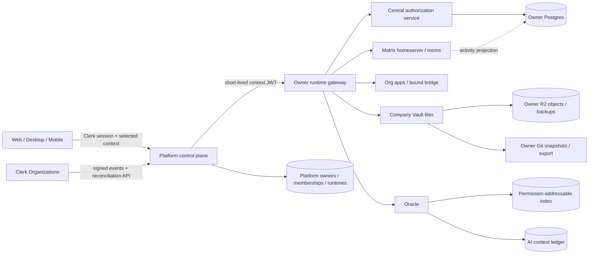
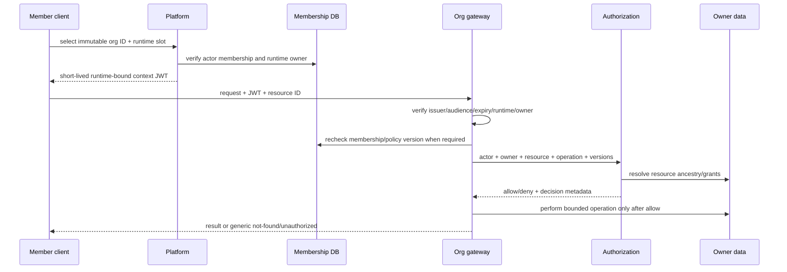
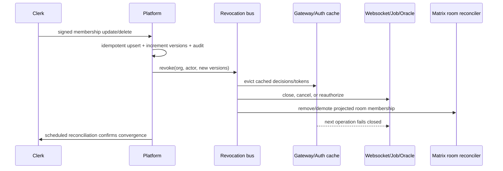
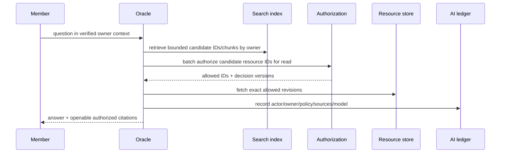

# Company OS and Oracle: Product Specification and Implementation Plan

**Feature branch**: `spike-company-os-owner-context`

**Worktree**: `/home/deploy/matrix-os.worktrees/company-os-spike`

**Created**: 2026-08-03

**Status**: Draft for Hamed review; not approved for implementation

**Canonical document**: this file; no separate `plan.md`

**Worktree base**: `origin/main` at `70356175a8ad690609a77a6b435b257fd4290fdd` (`feat(onboarding): capture acquisition source (#1138)`)

**Final current-main audit**: `origin/main` at `d4e52381e674918839309510585714abb1fec612` (`feat(onboarding): rebuild continuous signup billing handoff (#1096)`)

**Research window**: 2026-08-03 UTC

**Spike**: complete in an isolated test-only directory; 23 targeted tests pass

## 1. Document status and evidence

This document specifies Company OS, a durable organization-owned Matrix product
surface, and Oracle, its permission-aware knowledge agent. It combines product
requirements and the implementation plan so decisions do not drift between a
short specification and a separate plan.

The evidence base is:

- current code and tests at the reviewed commit;
- architecture, domain, context, quality, UX, and feature specifications listed
  in the evidence appendix;
- local and remote branches, recent commits, and GitHub pull requests available
  on 2026-08-03;
- official Clerk documentation retrieved on 2026-08-03; and
- executable spike code in `spike/company-os-owner-context/` and
  `tests/spike/company-os-owner-context.test.ts`.

Evidence labels used below:

- **Implemented**: wired current code with an executable path or test.
- **Partial**: a reusable seam exists, but not the end-to-end Company OS behavior.
- **Specified only**: described in a document but not wired on current main.
- **Contradicted/superseded**: current source or the constitution chooses a
  different model.
- **Open**: no sufficient current implementation or approved contract exists.

### Limitations

1. The requested dormant ref `081-company-brain-sharing` is absent locally and
   remotely. `git show 081-company-brain-sharing:specs/081-company-brain-sharing/spec.md`
   failed; commit prefix `13df86c92` is absent from all local refs/object storage,
   GitHub did not resolve it, and searches for `company-brain-sharing` found no PR.
   Therefore a statement-by-statement audit of that inaccessible artifact is
   impossible. This document does not invent its contents. It audits every 081
   hypothesis supplied in the task and the accessible Company Brain work instead.
2. No live Clerk instance, customer data, production database, R2 bucket, VPS,
   Matrix homeserver, deployment, or configuration was changed or queried.
3. The spike uses ephemeral PGlite and injected in-memory authorization inputs.
   It proves architectural seams, not production operations or latency.
4. The public docs site is in private repository `FinnaAI/matrix-os-site`; no docs
   PR was created because this work is not approved for implementation.
5. Open PR state is a point-in-time snapshot. No branch name was treated as
   shipped unless its behavior exists at the reviewed `origin/main` commit.
   During the final pass, `origin/main` advanced by one commit after the worktree
   was created. Its complete 27-file delta was reviewed. The only platform
   routing changes add a bounded signup/billing handoff route and do not alter
   Clerk claims, owner/runtime identity, membership, authorization, or the
   Company OS conclusions. The dirty spike worktree was intentionally not
   rebased, reset, stashed, or switched.
6. The mandatory Spec Kit `before_specify` extension was not run because it would
   create/switch a feature branch in the existing dirty checkout. The stricter
   user and constitution rule required a manually created persistent worktree
   from `origin/main`. The optional auto-commit hook was also not run because the
   task explicitly forbids committing without Hamed's approval.

## 2. Executive decision

### Selected architecture

Company OS uses **separate durable owners and runtimes**, not a shared employee
VPS:

1. Canonical owner identity is `OwnerRef = { type: "user" | "organization";
   id: immutableId }`. `shared_resource` and `published` are access/distribution
   modes, not new owners.
2. Each organization gets an organization-owned primary runtime and owner-scoped
   Postgres, files, app data, R2 namespace, Git history, indexes, agents,
   integrations, audit, export, and recovery jobs.
3. Clerk is authoritative for user identity, organizations, invitations,
   membership, and coarse roles. Matrix mirrors that state with monotonic
   membership/policy versions and remains authoritative for runtimes, resources,
   fine-grained grants, audit, revocation, export, deletion, and AI authorization.
4. The platform issues a short-lived, runtime-bound Matrix context JWT. The
   gateway constructs a verified principal; clients, iframes, slugs, routes, and
   resource IDs never self-assert owner context.
5. A single Matrix authorization service evaluates every file, app-data,
   websocket, room-link, job, and Oracle operation. It uses default deny,
   nearest-ancestor inheritance, explicit deny, versioned policy, and
   non-enumerating failures.
6. Company Vault pages are Markdown-canonical for an explicitly supported schema.
   Tiptap is the first-party editor projection. Revisions and optimistic
   concurrency are server-owned. Yjs is deferred to collaborative beta.
7. Whiteboards use the Excalidraw scene format and first-party component in a
   later slice. The current Whiteboard is a custom SVG app, and shell Canvas's
   hidden Tldraw layer is a different product concept.
8. Matrix rooms carry discussion and activity links. Room membership is a
   compensated projection of Matrix authorization, never its source of truth.
9. Oracle indexes and retrieves only authorization-addressable resource chunks.
   Every query and mutation is evaluated as the initiating member and recorded in
   an AI context/action ledger.

### Why this fits Matrix

The design extends existing owner-aware seams—request principals, owner-scoped
messages, Postgres app schemas, per-runtime routing, R2 prefixes, file path
guards, and versioned Canvas repositories—while correcting their current
user-only assumptions. It implements Constitution principles I, VII, VIII, IX,
and X without a company-only parallel stack.

### Internal dogfood decision

The architecture is viable, but Company OS is **not yet safe for sensitive
dogfood data**. A narrow alpha becomes acceptable only after the alpha success
gates in section 25 pass in a controlled environment. Until then, Obsidian and
Google Drive remain canonical and Company OS may contain only synthetic,
public-safe, or low-sensitivity copied material.

### Deferred

Realtime multi-cursor Tiptap/Yjs, Excalidraw multiplayer, generic shared apps,
offline org replicas, guests beyond a controlled pilot, public/published pages,
federated company rooms, automatic private-content ingestion, and in-place owner
transfer are deferred. Alpha promotion copies a named resource into org ownership
and preserves an audited source reference; it does not silently move or link a
private tree.

## 3. Terminology

- **Company OS**: an organization-owned Matrix runtime and product context with
  its own data, apps, policies, agents, integrations, lifecycle, and audit.
- **Oracle**: the Company OS knowledge/action agent that retrieves and acts only
  through the requesting member's current effective permissions.
- **Owner context**: verified actor, owner, runtime, membership, and policy state
  attached to an operation.
- **Personal runtime**: a runtime whose owner is one user. Membership in a company
  never changes its owner or grants company admins access.
- **Org runtime**: a runtime whose owner is one organization. It survives member
  departure and is administered through company policy.
- **Company Vault**: the organization-owned resource tree containing collections,
  folders, pages, attachments, whiteboards, apps, and projects.
- **Resource grant**: a versioned allow or deny for a subject on one resource,
  optionally inherited by descendants.
- **Company room**: a Matrix room for organization-wide discussion/activity.
- **Resource room**: a Matrix room linked to one authorized resource or project.
- **AI context ledger**: immutable record of actor, owner context, policy version,
  source chunks, citations, tools, and mutations used in an Oracle operation.
- **Promotion**: explicit copy of a named personal resource into an
  organization-owned destination with a new owner and audit record.
- **Membership mirror**: Matrix's operational projection of Clerk organization
  membership, used for low-latency checks and revocation versioning.

## 4. Verified baseline

### Reusable current capabilities

| Capability | Status | Current evidence and implication |
|---|---|---|
| User identity verification | Implemented, user-only | `packages/platform/src/clerk-auth.ts` verifies Clerk tokens but retains only `sub` and `sid`. |
| User synchronization | Implemented, user-only | `packages/platform/src/clerk-users.ts` backfills/synchronizes users; no org membership mirror exists. |
| Per-user runtime registry | Implemented | `packages/platform/src/db.ts` stores `user_machines` and partial unique active `(clerk_user_id, runtime_slot)` indexes. |
| Provisioning convergence | Implemented | `packages/platform/src/customer-vps.ts` uses local/advisory locks, transactions, unique-conflict recovery, durable jobs, and retry/reconciliation. |
| Preview sharing | Implemented and constrained | `accessibleUserMachinePredicate` permits owner access or explicitly shared **preview** access only. It is not an org model. |
| Session routing | Implemented, user-only | `session-routing-identity.ts` resolves `{handle,userId,runtimeSlot}`; no owner type, org ID, membership, or policy version. |
| Gateway principal | Implemented, user-only | `request-principal.ts` exposes `{userId,source}` and hard-codes `ownerScopeFromPrincipal()` to user. |
| File path defenses | Implemented/partial | `path-security.ts`, file blob routes, and home mirror use lexical containment, realpath/lstat, no-follow/exclusive temp writes, size caps, and cleanup. |
| Personal sync | Implemented | Sync manifest/presign/commit and home mirror operate on the authenticated caller's immutable user namespace. |
| Sharing metadata | Partial, deliberately fail-closed | `sync_shares` and invite/accept/revoke events exist, but `sync/routes.ts` states the data plane remains caller-only. |
| Owner-scoped messaging | Partial | `messages/` scopes records by `owner_id`, validates room IDs, gates Hermes per room, records selected audit events, and uses canonical Matrix event IDs. Owner type and member ACLs are absent. |
| App Postgres schemas | Implemented per runtime | `app-db.ts` provides schema-per-app storage inside the runtime's database. It assumes the runtime boundary supplies the owner. |
| Tiptap Notes | Implemented as personal app | Notes stores both `content` Markdown and `content_json`; Tiptap `StarterKit` edits a limited schema. |
| Versioned shell Canvas documents | Implemented | `packages/gateway/src/canvas/` and shell store support owner-scoped docs, revisions, conflict responses, export, and recovery behavior. This is not Company Vault or whiteboard collaboration. |
| Git helpers | Code exists, not wired | `git-versioning.ts` defines auto-commit, snapshot, history, diff, and restore; only exports were found, not runtime/UI registration. |
| R2/VPS recovery primitives | Partial | R2 uses immutable Clerk user IDs and slot-aware DB pointers. Generic owners, complete org export, and tested org restore are absent. |

### Partial, incomplete, or unsafe for Company OS

1. Current sync JWT claims are `sub`, `handle`, `gateway_url`, optional
   `runtime_slot`, `iss`, `aud`, `iat`, and `exp`, with a 24-hour default.
   They contain no owner type/id, runtime ID, membership reference, role, or policy
   version (`packages/platform/src/sync-jwt.ts`,
   `packages/gateway/src/auth-jwt.ts`).
2. App sessions are fixed to `principal: "gateway-owner"` and
   `scope: "personal"`; runtime routes reject non-personal manifests
   (`app-runtime/app-session.ts`, `server/app-runtime-routes.ts`).
3. The shell validates iframe source, origin, and top-level app name, but a custom
   app can forward a permitted `/api/bridge/*` request whose nested body names a
   different app schema. Bridge query/data routes accept client-supplied `app`.
   The gateway must bind app slug/capabilities server-side before Company OS.
4. Sync share CRUD does not authorize manifest, presign, commit, websocket change,
   home mirror, or local mount paths. Revocation deletes metadata and emits an
   event, but cannot revoke an already issued presigned URL or remove offline
   bytes. A grantee file read/write trace stops at the caller-only namespace.
5. `ws-events.ts` caps peers/users but has no stale-touch TTL sweep or explicit
   shutdown drain. Company realtime requires both plus per-message policy checks.
6. Notes autosave updates whole rows without an expected revision. Two editors
   can overwrite one another. Its Markdown conversion supports headings 1-3,
   paragraphs, emphasis, inline/code blocks, blockquotes, and flat ordered/
   unordered lists, but drops unsupported HTML/Tiptap constructs. It is not
   lossless for arbitrary Markdown and has no backlinks, wikilinks, attachments,
   revision UI, restore, or collaboration.
7. File editor GET emits an mtime/size ETag for cache validation, but write does
   not require `If-Match` or a revision. CodeMirror history is local session undo,
   not user-visible durable history.
8. Whiteboard is a custom React/SVG scene (`version: 1`) stored in app Postgres,
   with local undo and debounced whole-document updates. It does not import or
   embed Excalidraw and has no server revisions, ACLs, or multiplayer.
9. Shell `WorkspaceCanvas` imports Tldraw, but renders it hidden and transparent
   under a `pointer-events-none` layer with local `persistenceKey`; it is not an
   interactive collaborative whiteboard. Shell Canvas is for arranging Matrix
   workspace nodes and must remain distinct.
10. Current Company Brain is an in-memory, capped onboarding readiness service.
    It records owner-only/authorized-teammates labels but has no durable ACL,
    search, organization, runtime, or Oracle retrieval path
    (`onboarding/company-brain-readiness.ts`).
11. Conversations, summaries, skills, identity, memory, and prompt assembly are
    largely resolved from one runtime `homePath`. Integration accounts are keyed
    to user rows. Background cron/agent paths do not carry a general verified
    org/resource context end-to-end.

### Spec-only, contradicted, or stale work

- Spec 066 described shared folders, but its current follow-ups explicitly mark
  the grantee data plane incomplete. It must not be represented as shipped.
- Spec 058 proposed Matrix-owned `organizations` and `org_memberships` rather than
  Clerk Organizations. That identity choice is superseded here: Clerk owns
  membership/coarse roles; Matrix owns fine-grained resources and policy.
- Spec 070's one-user/one-VPS model is the implemented personal baseline, not the
  org model.
- Spec 077 provides valuable owner-scoped room, idempotency, permission, and
  revocation patterns; it does not provide Company OS membership authorization.
- Spec 083 and `ux-guide.md` contain historical statements about static/default
  apps that current AGENTS rules and Vite app code supersede.
- The constitution already requires personal/org separation and org Postgres/RBAC,
  but current runtime/token/storage code has not implemented it.
- Merged PR #170 (`b2bc75c8...`) shipped the narrow onboarding Company Brain
  readiness/draft workflow. It did not ship organization ownership.
- Remote branch `origin/codex/second-sync-sharing-data-plane` points to follow-up
  documentation/current caveats; branch existence is not shipped functionality.
- Open PRs inspected were dominated by terminal, desktop, integration, and golden
  snapshot stacks. Relevant in-flight seams include integration and shell/runtime
  hardening, but no open PR supplied a generic org-owner model at the evidence
  cutoff.

## 5. Goals and non-goals

### Internal alpha goals

1. Provision one durable org-owned primary runtime per Clerk organization.
2. Make personal/company context explicit and verified in web first, with
   compatible desktop/mobile token contracts.
3. Mirror a small internal organization and four coarse roles from Clerk.
4. Provide a Company Vault with collections, Markdown pages, safe Tiptap editing,
   search, backlinks, attachments, revisions, restore, and audited permissions.
5. Support team-wide, founders-only, project, and controlled guest collections.
6. Copy named personal pages/files into Company Vault through an explicit,
   audited promotion flow.
7. Let Oracle answer with authorized citations and perform a tightly allowlisted
   set of audited mutations.
8. Prove onboarding, demotion/removal, backup/restore, export, suspension, and
   delete workflows with test accounts.

### Collaborative beta goals

- Tiptap/Yjs collaboration, presence, comments, mentions, room links, and an
  Excalidraw document surface with versioning and bounded multiplayer.
- Fine-grained guest grants and controlled named-resource sharing.
- Broader first-party org apps after bridge capability binding.

### B2B/SME product goals

- Multi-tenant self-service organization lifecycle, regional placement, billing,
  SSO/domain controls as later Clerk capabilities, policy administration,
  compliance exports, retention, legal deletion, support-safe operations, and
  measured scale without changing the owner or authorization model.

### Non-goals

- Sharing an employee's personal runtime as the company.
- Giving company admins implicit employee-private access.
- Copying the complete company vault into every member runtime.
- Treating Git, filesystem names, frontmatter, client state, or Matrix room
  membership as authorization.
- Automatically ingesting private memories, files, chats, or integrations into
  Oracle.
- Replacing Obsidian/Google Drive before exit gates pass.
- Shipping production SQL, deploying, changing Clerk configuration, or migrating
  real data in this specification/spike.

## 6. User stories and acceptance scenarios

### US-1 — Create a Company OS (P1)

**Independent test**: create one test Clerk organization, issue duplicate
provision requests, and observe one org owner and one active primary runtime.

1. **Given** an authorized organization owner, **when** Company OS creation is
   requested twice concurrently, **then** one durable org runtime is returned and
   both requests converge to it.
2. **Given** provisioning partially fails, **when** retried, **then** the same
   runtime advances generation and resumes or reaches a recoverable failed state.

### US-2 — Switch personal and company context (P1)

1. **Given** a member belongs to Acme, **when** they select Acme, **then** the
   visible context, token, route, runtime, and owner all bind to Acme.
2. **Given** a personal token, **when** it reaches Acme's runtime, **then** the
   request fails generically before resource lookup.
3. **Given** two browser tabs in different contexts, **when** each fetches, **then**
   each sends its explicitly acquired bearer token rather than relying on a global
   active-org cookie.

### US-3 — Invite and manage membership (P1)

1. **Given** Clerk creates/updates/deletes a membership, **when** Matrix receives
   the signed event, **then** the mirror upserts idempotently, advances version,
   audits the change, and emits revocation if access narrowed.
2. **Given** a webhook is delayed or missed, **when** reconciliation runs, **then**
   Matrix converges to Clerk without rolling a newer local version backward.

### US-4 — Use Company Vault pages (P1)

1. A viewer can open/search/cite a permitted Markdown page but cannot edit it.
2. An editor can save against a base revision and receives a conflict without
   losing local edits when another revision wins.
3. An authorized user can view revisions and restore by creating a new revision.

### US-5 — Create collection boundaries (P1)

1. Team members can read Team; only founders can read Founders; explicit project
   editors can write Project Alpha; guests see only named grants.
2. A denied or missing resource returns the same external response.

### US-6 — Promote named personal work (P1)

1. **Given** Alice owns a private page, **when** she reviews a promotion into Team,
   **then** Matrix names source, destination, actor, new owner, included assets,
   initial grants, and resulting audit event before copying.
2. The org copy gets a new resource ID and owner; Alice's source remains private
   unless she separately deletes it. Alpha does not perform in-place transfer.

### US-7 — Revoke active access (P1)

1. **Given** a member has HTTP, websocket, app, file, room, and Oracle activity,
   **when** membership is removed, **then** new HTTP/app/AI/file actions fail and
   active sockets close within the tested target.
2. Cached URLs and clients expire or enter a revoked/read-only state; no new
   company data is delivered.

### US-8 — Ask Oracle (P1)

1. Oracle retrieves only chunks whose resource IDs pass current authorization,
   cites pages the member can open, and does not confirm denied resource existence.
2. Oracle reauthorizes every mutation at execution time and records its sources,
   tools, policy version, and outcome.

### US-9 — Export, restore, suspend, and delete (P1/P2)

1. Org export contains org-owned Postgres, Markdown/files, R2 objects, ACLs,
   audit, revisions, and room-link metadata, and excludes member-private data.
2. Restore validates the manifest owner and region and refuses an org archive in
   a personal namespace.
3. Suspension blocks mutation and token issuance while preserving recoverability.
4. Delete is a resumable tombstoned job ordered after export/retention checks.

### Later stories (P2/P3)

- Named-resource sharing, resource rooms, comments/mentions, Tiptap/Yjs presence,
  offline reconciliation, and Excalidraw multiplayer ship only after their phase
  gates and revocation behavior pass.

## 7. Functional requirements

### Alpha requirements

- **FR-001**: Matrix MUST represent user and organization owners with a canonical,
  immutable, validated `OwnerRef` and MUST NOT use mutable slugs as keys.
- **FR-002**: Organization membership MUST NOT make a member the runtime or data
  owner.
- **FR-003**: Each Company OS MUST have at most one active primary org runtime,
  enforced by a database constraint and idempotent create path.
- **FR-004**: Existing personal runtime lookups MUST remain compatible during
  migration and preserve their unique active slot invariant.
- **FR-005**: Active owner context MUST be visible before read, write, share,
  delete, export, integration, or AI operations.
- **FR-006**: Platform context tokens MUST bind actor, owner, runtime ID, slot,
  membership reference/role, membership version, policy version, issuer,
  audience, issue time, expiry, and JWT ID.
- **FR-007**: Gateway MUST verify signature, audience, issuer, expiry, runtime,
  owner, actor relationship, and current membership/policy before org operations.
- **FR-008**: Clerk membership MUST be necessary but insufficient for
  fine-grained resource access.
- **FR-009**: Matrix MUST mirror Clerk organizations/memberships idempotently and
  reconcile them on a bounded schedule and on suspicious/stale state.
- **FR-010**: Resource access MUST support viewer, editor, and resource-admin
  grants, explicit deny, deterministic inheritance, and default deny.
- **FR-011**: All HTTP, websocket, file, app-data, room-link, background-job, and
  Oracle operations MUST use the same authorization decision contract.
- **FR-012**: Owner/admin coarse roles MUST allow company administration but MUST
  NOT imply access to employee-private owners.
- **FR-013**: Missing and unauthorized org resources MUST be externally
  indistinguishable.
- **FR-014**: Membership or grant narrowing MUST invalidate caches, close or
  reauthorize active subscriptions, revoke jobs, and reconcile room membership.
- **FR-015**: The Company Vault MUST implement organization-owned resource trees,
  Team/Founders/Project boundaries, Markdown pages, safe Tiptap projection,
  search, backlinks, attachments, revisions, and restore.
- **FR-016**: Page mutations MUST require `baseRevision` in the write predicate and
  MUST preserve local edits on conflict.
- **FR-017**: Org storage MUST use immutable owner namespaces in Postgres, files,
  R2, manifests, Git refs, exports, and backups.
- **FR-018**: Personal-to-company promotion MUST be explicit, previewable,
  copy-based for alpha, idempotent, and audited.
- **FR-019**: Oracle MUST authorize candidates before content retrieval and again
  before source access or mutation.
- **FR-020**: Oracle answers MUST cite stable authorized resource/revision IDs and
  MUST redact denied/missing-source differences.
- **FR-021**: Every security-sensitive operation MUST produce an audit record with
  actor, owner, policy version, operation, target, outcome, correlation ID, and
  safe metadata.
- **FR-022**: Export, restore, suspension, and deletion MUST operate independently
  on org-owned data and MUST exclude employee-private owners.
- **FR-023**: Org integrations and credentials MUST be created/stored under the
  org owner and MUST NOT reuse personal integration rows or tokens.
- **FR-024**: App sessions MUST be server-bound to actor, owner, runtime, app slug,
  resource capabilities, schema, expiry, and policy version.
- **FR-025**: Custom/compromised apps MUST NOT select another app schema or
  unrelated resource through bridge request bodies.
- **FR-026**: Alpha MUST exclude realtime Tiptap, multiplayer whiteboard, generic
  shared apps, public publishing, broad guests, and offline org replicas.

### Later-phase requirements

- **FR-027**: Collaborative beta MAY add Yjs only with resource-scoped auth,
  snapshot compaction, bounded update logs, awareness expiry, and revoke drains.
- **FR-028**: Excalidraw multiplayer MAY ship only with the same resource/policy
  contract and server-owned snapshot/revision lifecycle.
- **FR-029**: Matrix rooms MUST remain projections linked to canonical resources;
  room membership MUST NOT authorize file/app/Oracle access.
- **FR-030**: Guest/public access MUST use explicit expiring capabilities and
  cannot weaken internal default deny.

## 8. Non-functional requirements

| Area | Alpha requirement |
|---|---|
| Isolation | Zero cross-owner reads in negative route, DB, R2, bridge, websocket, export, restore, and AI tests. Owner ID must lead every relevant composite key/index. |
| Least privilege | Deny by default; no admin-to-private implication; jobs and agents receive no broader capability than initiating actor. |
| Token lifetime | Org context JWT target 5 minutes; refresh only after current membership check. Personal compatibility tokens migrate from current 24-hour default. |
| Revocation | New HTTP/app/file/AI actions blocked within 5 seconds p95 after Matrix observes a revoke; websocket close/recheck within 10 seconds p95. Clerk-to-Matrix webhook delay is separately measured; reconciliation target 5 minutes. |
| Authorization latency | Cached decision p95 <10 ms; uncached owner-Postgres decision p95 <50 ms within region. Never bypass checks to meet latency. |
| Page latency | 50 KiB page read p95 <300 ms and revision-checked save p95 <500 ms within region, excluding client network. |
| Oracle | Permission-filter stage p95 <100 ms for 1,000 candidate IDs; answer latency is model-dependent and reported separately. |
| Availability | Read-only degraded mode is permitted only with a recently validated policy snapshot and no known revoke; fail closed on missing membership/policy dependencies. Mutations fail closed. |
| Backup | Alpha RPO <=24 h and RTO <=4 h after a tested restore; beta target RPO <=1 h/RTO <=2 h. Postgres and object/file generation must be mutually recorded. |
| Audit retention | 365 days for alpha security/audit events, configurable by org policy later; deletion/legal retention decisions are explicit. |
| Scale assumption | Alpha: 1 org, <=25 members, <=50k resources, <=100 GB objects, <=100 concurrent sockets. Private beta: 100 orgs, 250 members/org, 1M resources/org. |
| Limits | Bounded request bodies, page/attachment sizes, tree depth, grants/resource, sockets/member, subscriptions, search candidates, AI sources, jobs, and in-memory caches. |
| Accessibility | WCAG 2.2 AA for context switcher, tree, page editor, permission dialogs, history, and Oracle citations; full keyboard and screen-reader paths. |
| Multi-shell | Web Canvas is alpha primary; Desktop remains compatible. Mobile can browse/search/ask Oracle and perform safe edits, but admin and recovery may be web-only initially with explicit messaging. |
| Observability | Owner-safe dimensions only; never log content, tokens, private paths, integration secrets, or raw provider errors. |

## 9. Architecture and trust boundaries

### Component diagram



### Request flow



### Revocation flow



### Promotion flow

```mermaid
sequenceDiagram
  participant U as Personal owner
  participant PR as Promotion service
  participant PA as Personal authorization
  participant OA as Org authorization
  participant OD as Org data transaction/job
  U->>PR: source resource + destination + requested grants
  PR->>PA: verify source read/export as owner
  PR->>OA: verify destination create/administer
  PR-->>U: immutable manifest preview + resulting owner
  U->>PR: confirm with idempotency key
  PR->>OD: create org resource/revisions/assets + audit atomically where possible
  OD-->>PR: new org resource ID
  PR-->>U: receipt; personal source unchanged
```

### Trust rules

1. Clerk proves identity/membership, not Matrix resource access.
2. Platform selects and signs owner/runtime context; clients may request but never
   assert it.
3. An org gateway trusts only tokens bound to its immutable runtime and owner.
4. Owner Postgres is authoritative for resource metadata, ACLs, versions, index
   records, audit, room links, and jobs.
5. Files/R2 contain bytes but do not grant access by path/key possession except
   narrowly expiring signed delivery capabilities.
6. Rooms, apps, indexes, and AI are downstream consumers of authorization.

## 10. Domain model and source of truth

Exact SQL is proposed until reviewed and migrated. All timestamps are UTC;
mutable rows carry revision/version fields; multi-row changes are transactional.

### Canonical identifiers

```ts
type OwnerRef =
  | { type: "user"; id: `user_${string}` }
  | { type: "organization"; id: `org_${string}` };

type OwnerContext = {
  actorUserId: `user_${string}`;
  owner: OwnerRef;
  runtimeId: `rtm_${string}`;
  runtimeSlot: string;
  membershipId?: `mem_${string}`;
  organizationRole?: "owner" | "admin" | "member" | "guest";
  membershipVersion?: number;
  policyVersion: number;
};
```

The prefix examples express types, not a promise to reuse raw Clerk IDs forever.
Alpha may store Clerk's immutable `user_*`, `org_*`, and membership IDs directly
as external IDs while Matrix UUID primary keys support provider independence.
Every table must choose one immutable ID; slugs/handles are display/routing aliases.

### Candidate platform/control-plane schema

| Entity | Required keys/constraints/indexes | Authority and lifecycle |
|---|---|---|
| `owners` | `owner_pk UUID PK`; unique `(owner_type, external_owner_id)`; `owner_type CHECK`; status, region, policy_version | Matrix registry; user owner backfilled from current users, org owner created from Clerk org. Tombstone before purge. |
| `organizations` | `owner_pk PK/FK`; unique `clerk_org_id`; mutable slug/name; membership_version; reconciliation cursor/time/status | Clerk owns identity fields; Matrix owns operational status/version. Slug changes never re-key data. |
| `organization_memberships` | `membership_pk`; unique `(organization_owner_pk, clerk_membership_id)` and `(organization_owner_pk, actor_user_owner_pk)`; role/status/version; source_updated_at | Clerk authoritative; idempotent webhook/reconcile upsert. Never hard-delete before audit/retention. |
| `runtimes` | `runtime_id UUID PK`; owner FK; slot; class; status; generation; machine/provider IDs; partial unique `(owner_pk, runtime_slot) WHERE deleted_at IS NULL` | Matrix authoritative. `production` org runtimes cannot use preview access lists. |
| `runtime_jobs` | job/idempotency key; runtime FK; generation; state; retry/lease timestamps | Durable provisioning/recovery state machine. |
| `membership_events` | unique Clerk/Svix event ID; received/source timestamps; payload hash; outcome | Idempotency/detection evidence; raw payload retention minimized. |

### Candidate owner-database schema

| Entity | Required columns and constraints | Lifecycle/deletion |
|---|---|---|
| `resources` | `resource_id UUID`; `owner_type`, `owner_id`; `parent_id`; kind; title/slug; state; `acl_revision`; content revision; created_by; unique sibling slug among live rows; FK parent constrained to same owner | Soft delete with immutable tombstone; recursive ownership enforced. Purge via job. |
| `resource_closure` | `(ancestor_id, descendant_id, depth)` PK; same owner | Transactionally maintained for bounded, indexed inheritance queries; alternatively recursive CTE first, measured before closure. |
| `resource_grants` | grant ID; resource; subject type/id; role; effect; expires; revision; granted_by; unique live logical grant | Revoke tombstones/increments policy; no check-then-insert. |
| `vault_pages` | resource PK; canonical Markdown object/ref; current revision; schema version; checksum | Current pointer only; revisions immutable. |
| `page_revisions` | `(resource_id, revision)` PK; Markdown; checksum; actor; base revision; created_at; mutation ID | Immutable; restore creates a new revision. |
| `page_links` | source resource/revision; normalized target token; resolved target resource nullable; link kind/offset | Rebuilt transactionally/asynchronously with revision guard; denied target never leaks. |
| `attachments` | resource; immutable object ID; media metadata; checksum; scan state; created_by | Quarantined until scanned; reference-counted or job-cleaned. |
| `whiteboard_revisions` | resource/revision; Excalidraw schema version; scene object/checksum; asset manifest; actor/base | Immutable snapshots; later Yjs updates stored separately and compacted. |
| `audit_events` | event UUID; owner; actor/effective actor; membership/policy versions; operation; target; outcome; correlation/idempotency IDs; safe metadata; occurred_at | Append-only, partitioned, retained by policy. Content/secrets excluded. |
| `room_links` | resource/org; Matrix room ID; room version/state; desired membership hash; reconcile status/retry | Projection only. Delete/revoke triggers compensation. |
| `search_documents` | chunk ID; resource/revision; owner; content hash; classification; index generation | Text may live in owner DB/index; each result carries resource ID for authorization. |
| `ai_context_ledgers` | request/run ID; actor/owner/runtime; membership/policy; prompt class; model; status; citation/tool counts; safe hashes | Append-only record; detailed sources/tools in child rows. |
| `ai_context_sources` | run; resource/revision/chunk; authorization decision ID; cited flag/order | No inaccessible content snapshot beyond retention need. |
| `ai_actions` | run; tool; target; arguments hash/safe summary; auth decision; mutation ID; result | Reauthorization immediately before mutation. |
| `owner_jobs` | export/delete/restore/index/room/promotion job; generation; lease; retry; cursor; terminal state | Idempotent resumable state machines with caps and cleanup. |

### Key decisions

1. **Generic runtime table plus compatibility view**, not adding org IDs directly to
   `user_machines`. `user_machines` encodes user ownership in names, foreign keys,
   helpers, billing, and access predicates. A new `owners`/`runtimes` model is
   clearer. During migration, a `user_machines_compat` view or repository adapter
   maps user-owned runtime rows to the current shape while callers move in small
   PRs. Do not maintain two writable sources indefinitely.
2. **Founder-private material remains personal for alpha** unless it is explicitly
   copied into a Founders collection. This avoids pretending a company admin role
   protects founder material from other company owners/admins and keeps truly
   private founder memory/integrations in a separate owner/runtime.
3. **Shared resource is a grant relationship**, not owner type. It retains its
   owner and receives named subjects/capabilities. Published is a distribution
   state with a separate later policy.
4. **Org deletion is staged**: suspend token issuance/mutations; snapshot and
   optional export; drain realtime/jobs; tombstone resources; delete room
   projections/integrations/indexes; quarantine object prefixes; purge after
   retention; retain minimal deletion/audit proof.

## 11. Authorization model

### Coarse and fine roles

Clerk coarse roles determine organization administration eligibility and default
product capabilities. Matrix grants determine content/resource access.

| Operation | Owner | Admin | Member | Guest | Resource viewer | Resource editor | Resource admin |
|---|---:|---:|---:|---:|---:|---:|---:|
| View org switcher/runtime health | Yes | Yes | Yes | Limited | N/A | N/A | N/A |
| Manage org membership/invitations in Clerk | Yes | Policy | No | No | N/A | N/A | N/A |
| Manage Company OS runtime/billing | Yes | Policy | No | No | N/A | N/A | N/A |
| Create top-level collections | Yes | Yes | No by default | No | No | No | Yes if parent grant |
| Read resource content | Only with grant | Only with grant | With grant | With expiring grant | Yes | Yes | Yes |
| Edit content | Only with grant | Only with grant | With grant | Rare/explicit | No | Yes | Yes |
| Manage resource grants/settings | Org safety override + audit | Org safety override + audit | With grant | No | No | No | Yes |
| Export entire org | Yes + step-up | Policy + step-up | No | No | No | No | Per-resource only if granted |
| Delete/suspend org | Owner + step-up/quorum | No by default | No | No | No | No | No |
| Access member-private owner | No | No | No | No | Only explicit future share | Same | Same |
| Ask Oracle about resource | With content grant | With content grant | With content grant | With content grant | Yes | Yes | Yes |
| Oracle mutate resource | With edit/admin grant | Same | Same | Rare/explicit | No | Yes | Yes |

“Org safety override” means an explicitly audited governance capability to revoke
access, quarantine a resource, or assign a new resource admin. It does not reveal
content by default. Whether owner/admin may force-read org-owned content is a Hamed
policy decision; alpha should default to no implicit content read.

### Effective permission algorithm

1. Validate actor and exact owner/runtime context.
2. For organization owners, require active current membership unless the actor is
   a narrowly defined system principal on an owner job.
3. Load resource by `(owner_type, owner_id, resource_id, deleted_at IS NULL)`.
   Missing/other-owner/denied all map to the same public not-found result.
4. Build ancestry from resource to root with maximum depth 32 and cycle checks.
5. At each depth from nearest to farthest, collect live, unexpired subject grants.
   An explicit deny for the requested operation wins over allow at the same depth.
   The first depth containing a relevant decision wins.
6. `resource_admin` includes read/write/administer; `editor` includes read/write;
   `viewer` includes read. Coarse org admin supplies administer/governance only,
   not content read/write.
7. If no decision allows the operation, deny.
8. Return internal decision metadata (decision ID, matched grant/resource,
   membership/policy/ACL revisions, cache TTL) without exposing it to clients.

### Inheritance and collection models

- Team-wide: allow viewer/editor to an organization-members subject group at Team.
- Team-private: allow a Matrix group/collection membership subject; deny or omit
  organization-wide access at that subtree.
- Founders: explicit founder-group allow at the Founders collection, with no
  company-root or organization-member content grant to inherit. Non-founders are
  denied by default. Truly personal founder material stays in a personal owner.
- Project: explicit project group/user grants; may inherit Team baseline.
- Guest: named user/membership grant with expiry, no root-wide default.
- Child exception: a nearer deny overrides inherited allow. Moving a resource
  requires transactionally re-evaluating/confirming resulting access and auditing
  the change.

### Versioning, caching, and revoke

- `membership_version` changes on role/status/membership changes.
- `policy_version` changes on any membership/group/grant/owner policy narrowing or
  expansion relevant to the org; resource `acl_revision` supports narrower cache
  invalidation.
- Cache key includes actor, owner, resource, operation, membership version,
  policy version, and ACL revision. Cache entries are bounded LRU with <=30-second
  TTL, but revoke events evict synchronously.
- High-risk mutations, exports, deletes, integrations, signed URLs, Oracle tools,
  and websocket subscribe always recheck authoritative state.
- Websockets store last-touch and versions; authenticate/authorize before success,
  reauthorize on each mutation/message and heartbeat, evict failed/dead senders,
  TTL-sweep stale connections, and drain on shutdown.

## 12. Identity, token, routing, and app-session contracts

### Clerk behavior verified on 2026-08-03

Official Clerk documentation says current v2 session tokens include an `o` claim
only for the active organization, with compact ID/slug/role/permission fields.
Older v1 tokens used `org_id`, `org_slug`, `org_role`, and `org_permissions`.
The active organization can differ across tabs, while the browser session cookie
is global; Clerk recommends using a token acquired for the focused tab in the
Authorization header. Session cookies have practical 4 KB limits and Clerk
recommends keeping custom claims below about 1.2 KB. Webhooks are asynchronous,
eventually consistent, signed, retried, and replayable. Backend APIs can list a
user's or organization's memberships.

Matrix therefore MUST decode through the supported Clerk SDK/API version rather
than manually depending on one raw claim layout. Clerk's token establishes the
actor and active membership hint; Matrix's context JWT establishes the selected
Matrix runtime and policy snapshot.

### Proposed context JWT

| Claim | Meaning | Trust/use |
|---|---|---|
| `sub` | authenticated actor user ID | Derived from verified Clerk session. |
| `sid` | Clerk/Matrix session reference | Revocation/correlation, not authorization alone. |
| `owner_type`, `owner_id` | immutable selected owner | Platform resolves; never slug-derived. |
| `runtime_id`, `runtime_slot` | exact target runtime | Gateway must match its configured immutable runtime. |
| `membership_id` | org membership reference | Required only for org owner. |
| `org_role` | role snapshot | UX/coarse checks; exact current value rechecked for sensitive operations. |
| `membership_version` | member state generation | Exact DB comparison; stale rejects. |
| `policy_version` | org authorization generation | Exact or minimum-current comparison; stale rejects. |
| `jti`, `iat`, `nbf`, `exp` | token identity/lifetime | Five-minute target, no silent long-lived org bearer. |
| `iss`, `aud` | Matrix platform and target service | Exact allowlist. Separate audiences for gateway/download/job capabilities. |

Do not include full grant lists, resource IDs, organization trees, or integration
permissions in the context token. They drift, leak structure, and exceed cookie
budgets. Resource IDs remain request inputs verified against owner and policy.

### Surface contracts

- **Web**: context switch calls platform with immutable owner/runtime selection;
  per-tab bearer token is held in memory/secure session mechanism. The visible
  context banner comes from verified response, not URL slug.
- **Desktop/mobile**: device/app session exchanges Clerk/native session proof for
  the same Matrix context JWT. Secure OS storage holds refresh/session material,
  not durable org access tokens.
- **Routes**: `/api/owners/:ownerType/:ownerId/...` may be explicit at platform;
  owner gateway resource routes can omit owner in URL because token+runtime bind
  it. Any URL owner segment must exactly match principal.
- **Deep links**: carry resource/runtime hints only. Client resolves them through
  platform, selects context, receives token, then opens. A deep link never grants
  access or switches silently.
- **Iframe apps**: server mints an HttpOnly app session bound to actor, owner,
  runtime, app slug, manifest digest, allowed resource capabilities/schema,
  versions, issuer/audience, and <=5-minute expiry. Gateway ignores any nested
  body `app`/owner that differs from session.
- **Websockets**: browser query-token path is explicitly allowlisted; token is
  exact route/runtime audience; subscription frames have bounded Zod schemas and
  name resources; subscribe is awaited and authorized before success.
- **Background jobs**: durable job stores initiating actor, owner, resource set,
  membership/policy version, purpose, and bounded capability. Worker reauthorizes
  on lease and before each mutation. No user bearer token is replayed indefinitely.
- **System jobs**: use typed system principals scoped to one owner/job type with
  explicit policy, not an administrator identity.

## 13. Storage, sync, versioning, backup, and recovery

### Contracts

- **Markdown/files**: canonical page bodies and inspectable owner files. Atomic
  writes, normalized paths, no symlink traversal, explicit revisions.
- **Postgres/Kysely**: canonical resources, ACLs, versions, links, indexes, audit,
  rooms, ledgers, app data, and jobs. No new embedded database/ORM.
- **R2**: immutable objects/assets/exports/backups and optional immutable page
  bodies above a measured size. Object metadata never substitutes for DB ACL.
- **Git**: automated owner-scoped snapshots/diffs/restore/export for supported
  files. It is not the collaboration or authorization protocol.

### Generic R2 layout

```text
owners/v1/{ownerType}/{immutableOwnerId}/
  runtimes/{runtimeId}/system/vps-meta.json
  vault/blobs/sha256/{digest}
  vault/attachments/{objectId}/{version}
  sync/manifests/{manifestGeneration}.json
  db/snapshots/{backupGeneration}.dump
  exports/{exportJobId}/manifest.json
  whiteboards/assets/{assetId}/{digest}
```

Keys never use org slug/handle. Database rows record key, checksum, owner,
resource, revision, residency, scan state, retention, and generation. Presigned
URLs are GET-only, single object, audience/purpose-bound where provider permits,
<=60 seconds for revocable company content, never list-capable, and minted after a
fresh permission check. Highly sensitive content should stream through the
gateway instead because no signed URL can be revoked after issuance.

### Migration from current namespaces

1. Introduce generic key builders and dual-read behind a feature flag; personal
   current `matrixos-sync/{userId}` remains authoritative initially.
2. Backfill owner registry and mapping without copying bytes.
3. For each owner, produce a checksummed migration manifest; copy immutable
   objects to `owners/v1/user/...`; do not repoint until manifest verifies.
4. Freeze/transactionally advance manifest generation, switch reads, keep old
   namespace rollback pointer, then garbage-collect only after retention and live
   reference audit.
5. New org owners write only generic namespaces. No org data is ever written into
   a user prefix.

### Sync/offline policy

Alpha Company Vault has online access and bounded browser caches only. It does not
mount or mirror the org vault into member personal homes. Service workers and
clients clear/invalidate org caches on context switch/revoke/logout and encrypt
platform storage where supported. Revocation cannot erase screenshots or exported
copies; UI, policy, audit, DLP guidance, and watermarking are later deterrence,
not false guarantees.

### Backup/restore/export

- A backup generation records Postgres snapshot, R2/file manifest, Git commit,
  encryption/key reference, owner, region, schema versions, checksums, and cutoff.
- Restore creates an isolated staging namespace, validates owner/type and all
  checksums, restores DB and objects, runs migrations, verifies ACL/resource
  counts and negative cross-owner probes, then atomically promotes routing.
- Export contains `manifest.json`, Markdown/resources, attachment/whiteboard
  objects, Postgres logical data for resources/ACLs/audit/links/revisions, room
  link metadata, and machine-readable checksums. Secrets/integration credentials
  use a separate explicit policy and are excluded by default.
- Delete uses tombstones and a resumable job. It rejects or orders against active
  restore/export/promotion/edit leases and retains a minimal purge receipt.

## 14. Page/editor architecture

### Canonical representation

Markdown is canonical for the alpha-supported schema. Tiptap JSON is a derived
editing projection/cache tagged with source checksum and serializer version; it
must never diverge as a second authority. Existing Notes' dual-write model is not
reused as canonical Company Vault persistence.

Supported alpha Markdown:

- UTF-8 text; YAML frontmatter only for allowlisted non-security metadata;
- headings 1-6, paragraphs, hard/soft breaks;
- bold, italic, strike, inline code;
- fenced code blocks with language;
- ordered/unordered/task lists with bounded nesting;
- blockquotes, horizontal rules;
- links, images/attachments through resource-aware URLs;
- tables; and
- `[[wikilinks]]` plus optional heading anchors, parsed as links, never ACLs.

Raw HTML, scripts, iframes, arbitrary embedded components, executable Markdown,
and authorization frontmatter are excluded. Unsupported syntax opens in safe
source mode and is preserved byte-for-byte until a compatible editor is used; the
rich editor must not silently rewrite it.

### Tiptap projection

Use a reviewed extension set mapping one-to-one to supported Markdown. One
server-owned parser/serializer package owns deterministic round trips and golden
fixtures. Before rich editing, parse -> serialize -> compare semantic AST; if
unsafe/lossy, show source mode. HTML is sanitized at render boundaries.

### Save and conflicts

`PUT page` requires `{baseRevision, markdown, clientMutationId}`. The transaction
performs `UPDATE ... WHERE current_revision = baseRevision`, inserts immutable
revision/link/index outbox rows, and emits realtime only after commit. Duplicate
mutation IDs return the original result. Conflict returns current revision and
safe metadata while keeping local edits visible; user chooses compare/merge/retry.
Do not reload and overwrite optimistic edits automatically.

Alpha autosave debounces but captures page ID/revision at scheduling time and
checks the active document before applying completion. Deletes clear UI only
after server confirmation. Revision restore creates a new revision with source
revision metadata.

### Links, search, and attachments

- Wikilinks resolve within authorized owner/resources by stable ID plus title
  aliases. Search/backlink queries filter authorized resource IDs before returning
  titles/snippets/counts; denied targets look unresolved.
- PostgreSQL full-text/trigram search is alpha default. A vector index is optional
  only after owner/resource filtering and deletion/reindex semantics are proven.
- Attachments upload to quarantine using short capability, validate size/type/
  checksum, malware-scan where applicable, then atomically attach. Page rendering
  requests a fresh authorized delivery URL.

### Later collaboration

Yjs adds an authorization-scoped document/channel, bounded update store,
awareness TTL, snapshots/compaction, reconnect protocol, offline merge policy,
revoke drain, and conversion from Yjs state to canonical Markdown revisions.
Yjs state is not the ACL source and cannot bypass revision/audit checkpoints.

## 15. Whiteboard architecture

### Decision

Use `@excalidraw/excalidraw` for Company OS whiteboard documents, not the current
custom Whiteboard scene and not shell Canvas/Tldraw. The dependency exists in the
repository, but no current first-party app import was found; implementation must
be a dedicated reviewed slice.

### Persistence and versioning

- One whiteboard is a resource with immutable Excalidraw scene revisions.
- Store canonical JSON envelope `{schemaVersion, elements, appStateSubset,
  filesManifest}` after strict size/count/schema validation. Strip ephemeral UI,
  collaborator, clipboard, and unknown dangerous fields.
- Assets are immutable R2 objects keyed by owner and digest, with DB metadata and
  authorization; exports include `.excalidraw`, PNG/SVG/PDF as generated artifacts
  with timeouts and cleanup.
- Save uses `baseRevision` and mutation ID; restore creates a new revision.
- Resource viewer/editor/admin permissions map to view/edit/share/delete/export.

### Later multiplayer

Collaborative beta may add encrypted/bounded realtime updates or Yjs adapter only
after measuring Excalidraw collaboration APIs. Every join/message checks the same
resource policy; awareness expires; revoke closes connections; snapshots compact
updates; reconnect conflicts have explicit UX. Alpha uses single-editor optimistic
concurrency and read-only viewers.

## 16. Oracle AI architecture

### Indexing

1. Resource revision transaction writes an outbox event containing owner,
   resource/revision, checksum, classification, and ACL/policy versions—never an
   administrator-derived permission list.
2. Index worker uses an owner-scoped system capability to read that exact revision,
   chunks it deterministically, and stores each chunk with resource/revision ID.
3. The index does not materialize “admin can see everything.” Authorization is
   evaluated at query time against candidate resource IDs.
4. Delete/revoke moves resources out of serving immediately via policy, then
   asynchronously removes chunks. Stale chunks remain inaccessible.

### Query flow



Candidate retrieval must not return denied titles, counts, snippets, or timing
differences to the user. Batch authorization happens before text enters the model.
Final citations are rechecked because policy may change during generation. If all
sources become unavailable, Oracle returns a generic insufficient-access/context
answer without confirming hidden material.

### Actions and ledger

- Tools declare operation/resource schema, body/argument limits, timeout,
  idempotency, cleanup, and audit category.
- Oracle's initiating context is immutable for the run. Subagents/tools receive a
  narrower signed capability; `bypassPermissions` or a broad admin identity is
  forbidden.
- Before every mutation, Oracle rechecks current membership/policy and resource
  permission. High-impact actions require human confirmation/step-up.
- Ledger records actor, owner/runtime, membership/policy, model/prompt version,
  authorized resource/revision/chunks, citations, tools, mutations, approvals,
  duration, outcome, and safe error category. It does not store secrets or hidden
  source text unnecessarily.
- Personal/company crossing is explicit: a company Oracle run cannot query
  personal memory/integrations. Promotion is a separate authorized service; future
  shared resources retain owner and named capability.

### Integrations

Org integrations live in org-owned credential records/vault, have org-specific
consent and scopes, and are callable only from org context. Personal Pipedream or
provider accounts remain user-owned and are invisible to Company OS. Revocation
invalidates tool capabilities and queued jobs before external calls.

## 17. Matrix rooms and collaboration

### Role

Matrix protocol provides company/team/project discussion, notifications, and
agent activity. Canonical page/app/ACL/audit data remains in owner Postgres/files.
Messages' existing owner IDs, room mapping, permission registry, idempotent event
IDs, draft approval, and audit patterns are reusable after generic owner context.

### Topology

- One company announcement/activity room, with restrictive history.
- Optional team/project/resource rooms created only when useful.
- One Oracle activity room or thread for visible actions, not hidden chain of
  thought.
- Per-org Synapse topology is preferred initially because current production
  messaging is VPS-native/per-owner; a shared homeserver requires a separate
  isolation/operations spike before B2B scale.

### Reconciliation

`room_links` stores desired and actual room state. A transactional outbox requests
create/invite/remove/power-level/archive actions. A reconciler retries with
timeouts/idempotency and detects drift. Resource authorization is checked before
linking or opening a room. Removal/demotion triggers immediate Matrix deny for
canonical resources and best-effort room removal; room failure never preserves
file/app/Oracle access.

Alpha room history uses invited/joined visibility that prevents pre-join history
where supported and documents that clients may retain already received messages.
Sensitive Founders content should not be posted into broad rooms. Room retention,
redaction, encryption/key lifecycle, federation, and backup need explicit tests
before sensitive use.

## 18. Security architecture

### Route/operation/auth matrix

All mutating routes, including DELETE, use Hono `bodyLimit`; path/query/body/frame
inputs use strict Zod schemas; external calls use timeouts; errors are generic.

| Surface/operation | Authentication | Authorization/recheck | Limits and safe failure |
|---|---|---|---|
| Select owner/runtime; mint context | Verified Clerk token acquired for tab/device | Current membership + owner/runtime row; rate limit; audit | Small strict body; generic 404/403; no slug trust. |
| Org/runtime create | Clerk actor + step-up/idempotency key | Clerk owner/admin policy; DB constraint/transaction | One active slot; durable job; retry converges. |
| Org/membership webhook | Verified Svix signature; public route otherwise | Event type/schema/instance allowlist; source timestamp/version | Raw body cap; idempotent event ID; non-2xx on failure. |
| Reconciliation | Narrow platform system principal | Clerk Backend API + local monotonic version rules | Paginated <=500/page, 10s calls, rate/backoff. |
| Resource list/read/search | Context JWT | Owner/runtime + membership + central `read`; batch filter | Bounded pagination/query; non-enumerating not-found. |
| Page/file/whiteboard mutation | Context/app capability | Fresh `write` + base revision/version | Size/depth/count caps; conflict preserves local; audit. |
| Grant/move/delete/restore | Context JWT + step-up for sensitive scopes | Fresh `administer`; policy version in write | Transaction/outbox; deny cross-owner; tombstone/idempotency. |
| Attachment upload/download | Context JWT then one-purpose capability | Fresh write/read on resource | Quarantine, size/type/scan, <=60s GET, no redirects. |
| App session/bridge | Context JWT -> HttpOnly app session | Bound app/owner/runtime/schema/resource capability | Body/action schemas; no client app override; rate/cap. |
| Websocket subscribe/message | Route-scoped query token | Await current read/write; heartbeat/message recheck | Frame cap/schema; TTL/LRU; dead sender eviction; shutdown drain. |
| Oracle query | Context JWT | Current membership + batch resource read | Candidate/source/token/tool caps; safe no-context response. |
| Oracle mutation | Run capability + confirmation where required | Fresh central write/admin check | Tool schema, timeout, idempotency, ledger/audit. |
| Room provision/reconcile | Narrow org room job capability | Current room link/resource policy | Retry/outbox; compensation; room failure cannot grant data. |
| Export/backup/restore/delete | Step-up context or narrow job lease | Org owner/policy, fresh versions, owner manifest | Concurrency locks/generations; checksum; resumable; audit. |

### Threat model

| Threat | Prevention | Detection | Safe failure, cleanup/recovery, tests |
|---|---|---|---|
| Member sends an org ID they do not belong to | Platform resolves immutable ID and current membership; gateway rechecks signed context | Denied mint/route metric by safe code | Generic deny; no runtime/resource lookup details; negative token test. |
| Valid member targets another org runtime/resource | Token runtime+owner binding and owner-leading DB queries | Cross-owner denial/audit anomaly | Generic not-found, close socket; route/DB/R2 isolation tests. |
| Personal token at org runtime or org token at personal runtime | Exact owner type/id/runtime/audience binding | Runtime mismatch counter | Reject before route; Spike A and E2E both directions. |
| Stale token after removal/demotion | Short TTL plus exact membership/policy version checks and revoke bus | Version mismatch and webhook lag SLO | Fail closed; evict cache/close socket/cancel jobs; spike stale tests and controlled drill. |
| Iframe/custom app forges context | HttpOnly bound app capability; gateway overrides app/owner/schema | App capability mismatch/audit | Generic deny/session invalidation; bridge cross-schema tests. Current bridge gap is a release blocker. |
| Websocket survives revoke | Per-message/heartbeat recheck, versioned lease, revoke fanout, TTL sweep | Active revoked socket gauge | Close 4403-equivalent, remove registry, no further sends; spike lease + integration test. |
| Presigned URL survives revoke | <=60s single-object GET; gateway streaming for sensitive data | Signed URL issuance/access logs by object/correlation | Accept bounded residual window or stream; never refresh after revoke; expiry tests. |
| Path traversal/symlink escape | Resource ID -> server root; `resolveWithinHome`, realpath/lstat/no-follow; no path ACL | Rejected path/symlink metrics | Generic invalid path; recurring symlink-safe temp cleanup; traversal/race tests. |
| Inheritance exposes sensitive child | Nearest decision, explicit deny, move preview, max depth/cycle checks | ACL diff/audit and access simulation | Reject move or require confirmation; founder negative tests. |
| Admin confused with private access | Owner type boundary; coarse admin grants no personal-owner capability | Cross-owner admin attempts | Generic deny; admin-private negative tests (Spike C/E2E). |
| Job/agent broader than initiator | Narrow durable capability with actor/owner/resource/versions; fresh mutation check | Ledger compares requested/effective capabilities | Cancel on version change; no fallback admin; tool/job tests. |
| Oracle index built as admin leaks data | Index by resource/revision; authorize candidates at query time | Canary denied resources and citation audits | Drop denied chunks before model; recheck citations; retrieval negative tests. |
| Room history leaks before/after membership | Restricted history, separate sensitive rooms, prompt removal/redaction policy | Room membership/history drift monitor | Canonical data revoked immediately; reconcile/remove; test accounts verify history. Acknowledge retained client copies. |
| Offline cache survives revoke | No alpha offline org replica; bounded encrypted caches cleared on revoke/context change | Cache-version telemetry | Stop sync, clear local cache; document irreversibility of exports/screenshots; client tests. |
| Restore crosses namespace | Signed/checksummed manifest includes owner type/id; staging verification | Owner mismatch security event | Abort/quarantine; never promote; restore isolation tests. |
| Org delete races export/sync/edit | Owner lifecycle state + generation/leases + ordered jobs | Conflicting-job and active-lease metrics | Suspend mutations, drain, resume idempotently; race tests. |
| Duplicate runtime provisioning | Partial unique index + atomic upsert + durable generation/job | Conflict/convergence metric | Return same runtime or recoverable job; Spike B/production DB test. |
| Slug change orphans storage | Immutable IDs in DB/R2/Git/routing; slug alias only | Alias/storage consistency job | Update alias transactionally; no byte move; rename tests. |
| Malicious app queries unrelated schemas | App session binds slug/schema/capabilities; bridge ignores nested app selector | Cross-app attempt audit | Generic deny, revoke app session; exact regression test. |
| Personal credentials visible in org | Owner-keyed credential store and explicit org consent | Cross-owner credential query alerts | Empty/generic deny; integration isolation/export tests. |
| SSRF through links, embeds, imports | Validate URL, resolve/reject private/link-local/etc., `redirect:error`, timeout; pin address where needed | Blocked-host category metrics | Generic reachability boolean; no raw upstream status; DNS-rebinding residual documented/tested. |

### Additional mandatory controls

- Separate signing keys/audiences for Clerk verification, context JWTs, app
  sessions, downloads, and jobs; rotate by `kid`; never log or store bearer values.
- Database queries include owner predicates and targeted revision conditions in
  writes. Related writes plus outbox/audit are one transaction.
- Every Map/Set/cache has cap, TTL/LRU, sweep, shutdown cleanup, and metrics.
- External provider fetches use 10-second API/30-second download timeouts and
  redirect/SSRF policy. Provider/raw DB/filesystem errors stay server-side.
- Apps run sandboxed with manifest capabilities, CSP, schema binding, network/file
  allowlists, and revocation. “First-party” is not a substitute for enforcement.
- Audit metadata uses allowlisted fields and safe IDs; no page content, prompt
  content, secrets, filesystem paths, raw SQL/provider errors, or private member
  identifiers in public logs.

## 19. Concurrency, failure modes, and recovery

| Failure/race | Required behavior |
|---|---|
| Duplicate org/runtime create | Unique active-owner/slot constraint is authority. One atomic insert/upsert returns existing row; one durable job/generation owns side effects. Concurrent callers receive the same runtime/job. |
| Provision succeeds externally before DB update | Reconciler looks up provider resource by idempotency label/runtime generation, adopts exact match, or quarantines orphan for operator review. Never create a second active runtime. |
| DB row exists but provider call failed | Mark recoverable failure with safe code and next retry. Retry increments generation exactly once under lock/upsert and resumes durable steps. |
| Membership changes during request | Read may complete only if decision was current at data-read boundary; mutations recheck inside/just before transaction. Long responses/jobs periodically recheck/cancel. Audit versions used. |
| Simultaneous page edits | `UPDATE ... WHERE current_revision=baseRevision`; one wins, one gets conflict. Client retains local state and offers merge/retry. |
| Resource move changes inherited access | Transaction locks/guards resource revision, computes before/after access summary, rejects cycles/cross-owner parent, requires confirmation for expansion, increments policy/ACL versions, audits. |
| Partial grant + audit/revoke | Grant row, policy increment, audit, and outbox write are one DB transaction. Revoke fanout is retried from outbox. DB deny is effective even if fanout is delayed. |
| Room create/invite/remove fails | Canonical resource remains available/denied per Matrix ACL. Room link enters retry/degraded state; compensation archives/removes partial room. No room failure grants data. |
| Index update fails or lags | Search marks index generation stale; direct reads remain canonical. Oracle may omit stale content but never use unauthorized old chunks. Retry from outbox/checksum. |
| Export races edits | Export captures a declared DB snapshot/cutoff and object manifest generation. Later edits are excluded consistently and reported. |
| Delete races export/restore/promotion/edit | Lifecycle transition to `suspending/deleting` prevents new mutation leases. Existing leases drain/cancel; job ordering/locks choose one generation. |
| R2 object written but DB commit fails | Object stays unreferenced with creation/job tag and TTL cleanup. No list/read path exposes it. |
| DB references missing R2 object | Coarse degraded error, integrity alert, retry/restore from backup; do not return storage/provider detail. |
| Clerk webhook delayed/out of order | Event ID idempotency plus source `updatedAt` and local monotonic versions. Older event cannot roll back newer state. Scheduled reconciliation repairs gaps. |
| Clerk outage | Existing low-risk reads may use a short, last-validated local membership snapshot only if no revoke signal and policy allows; token refresh/high-risk mutations fail closed. |
| Matrix homeserver outage | Pages/apps/Oracle remain governed by owner ACL. Room operations queue with bounded retry. No direct fallback channel that bypasses audit. |
| R2 outage | Metadata reads may work; object reads/mutations fail generically. Never redirect to another owner's backup. |
| Realtime registry pressure | Per-owner/member/resource caps and LRU/TTL eviction; notify/close evicted clients; metrics and backpressure. |
| Restore migration failure | Keep staging isolated, retain current active runtime, record safe failure, permit idempotent retry or discard staging after TTL. |

Recovery states must be explicit (`pending`, `running`, `degraded`, `retry_wait`,
`blocked_policy`, `failed_recoverable`, `failed_terminal`, `completed`,
`cancelled`). Timers/leases are bounded and cleared on shutdown. Only resource
owners close DB pools they created.

## 20. Spike report

### Hypotheses

1. Actor and owner can be represented distinctly and bound to one runtime token.
2. Current user runtimes can migrate into a generic owner/runtime model while an
   organization gets exactly one active primary runtime.
3. One deterministic evaluator can serve files, app data, AI, and realtime and
   revoke access without putting ACLs in folder names/frontmatter.

### Implementation

The spike is deliberately isolated:

- `spike/company-os-owner-context/context-token.ts`
- `spike/company-os-owner-context/runtime-model.ts`
- `spike/company-os-owner-context/resource-authorization.ts`
- `spike/company-os-owner-context/model.ts`
- `spike/company-os-owner-context/README.md`
- `tests/spike/company-os-owner-context.test.ts`

No production module, migration, route, Clerk setting, external system, or real
data was touched. The ephemeral database uses repository-installed PGlite through
Kysely and Postgres DDL/partial indexes.

### Test evidence

Red:

```text
pnpm exec vitest run tests/spike/company-os-owner-context.test.ts --reporter=verbose
```

Failed before collection because `model.js` was intentionally absent.

Final green rerun:

```text
Test Files  1 passed (1)
Tests       23 passed (23)
Duration    12.33s
```

Cases include:

- personal actor/owner/runtime success;
- org membership/policy recheck success;
- wrong runtime, wrong scope, missing/revoked/stale membership, stale policy,
  stale role, malformed IDs, actor/owner confusion, and expiry rejection;
- personal user lookup compatibility;
- 24 concurrent org creates converging to one active primary runtime;
- eight retries after simulated failed provisioning converging to the same
  runtime and generation 2;
- member access through membership rather than runtime ownership;
- prevention of resolving a user preview as an org runtime;
- Team read, Founders deny, explicit Project editor write;
- org admin administration with denial at both users' private owners;
- deterministic nearest-grant inheritance and deny precedence;
- identical missing/forbidden external error;
- reuse across file/app-data/AI surfaces; and
- next-check HTTP/write/realtime failure after grant/version revoke.

An intermediate green attempt showed five failures caused only by calling a
nonexistent `pglite.close()` after all DB assertions passed. The harness was
aligned with repository practice (`db.destroy()`), then fully passed.

### Conclusions

- **Confirmed**: the proposed `OwnerRef`, runtime binding, versioned membership
  proof, generic runtime uniqueness, and central evaluator are technically viable.
- **Rejected**: JWT-only org authorization, shared employee VPS, preview-sharing
  reuse, implicit admin-private access, and folder/frontmatter ACLs.
- **Constrained**: short token TTL is not sufficient alone; high-risk and
  long-lived operations need authoritative version checks/revocation.
- **Performance**: token/pure decisions were millisecond-scale. PGlite startup
  dominated DB tests (roughly 1.7-2.3 seconds/test); the concurrency case completed
  around 1.9 seconds including startup. This is not a production benchmark.
- **Verdict**: architecture viable; prototype works; not yet safe to dogfood.

### Discarded approaches

- Add nullable `organization_id` to every `user_machines` path: preserves a
  misleading user-owner model and spreads branches through billing/routing.
- Company as shared preview: preview access predicates are intentionally limited
  and lack membership, policy, audit, lifecycle, and owner data isolation.
- One admin-built Oracle index: produces inference/existence leaks.
- Dual canonical Markdown + Tiptap JSON: guarantees divergence/loss ambiguity.
- Room membership as ACL: eventual and client-retained history cannot protect
  canonical resources.

### Production work and next slice

Build the owner-context contract, membership mirror schema, generic runtime
registry, and compatibility repository under disabled flags. Do not provision a
live org runtime or build Vault/Oracle UI until migration and auth reviews pass.

## 21. Implementation plan

### Phase 0 — Approve contracts and policy

1. Hamed decides the questions in section 26: admin force-read policy, Clerk ID
   mapping, alpha users/data, region, and recovery/retention targets.
2. Security review the OwnerRef/token/evaluator, route matrix, bridge gap, and
   migration model.
3. Create a separate docs-site plan/PR deliverable in `FinnaAI/matrix-os-site`
   for public behavior only when implementation is approved.

### Phase 1 — Owner control plane (highest risk)

- Domain ownership: `packages/platform` + shared contracts.
- Add `owners`, `organizations`, `organization_memberships`, generic `runtimes`,
  event idempotency, and membership/policy versions through reviewed Kysely/
  Postgres migrations.
- Backfill user owners/runtimes and expose read-only compatibility adapter/view.
- Implement signed Clerk webhook endpoint with body limit/signature/schema,
  idempotent transactional upsert/audit/outbox, and paginated reconciliation.
- Generalize current provisioning locks/jobs to owner key; keep actual org
  provisioning disabled.
- Observability: convergence conflicts, webhook lag, reconcile drift, version
  mismatch, no owner identifiers in high-cardinality public metrics.

### Phase 2 — Context JWT and gateway principal

- Extend shared contracts and platform token minting with owner/runtime/version
  claims and five-minute org lifetime.
- Upgrade gateway `RequestPrincipal` to contain actor and verified owner context;
  enforce configured runtime ID/owner type, not handle alone.
- Migrate web/native/mobile/deep-link/websocket token acquisition while preserving
  personal behavior.
- Add revocation bus/cache contract and exhaustive token/runtime negative tests.
- Feature flags: `company_os_owner_context`, `generic_runtime_reads`; default off.

### Phase 3 — Central resource authorization

- Domain ownership: a focused gateway/shared authorization package plus owner DB
  repository.
- Add resources, hierarchy, grants/denies, membership groups, audit, outbox, cache
  invalidation, batch evaluation, realtime leases, and non-enumerating mapper.
- Bind app sessions/bridge slug/schema before enabling org apps.
- Add route adapter helpers so every surface supplies operation, validation,
  limits, timeout, cleanup, audit, and tests.

### Phase 4 — Generic storage and Company Vault alpha

- Introduce generic owner R2/manifest/file roots and personal dual-read migration
  tooling. New org owner writes generic-only.
- Implement collection/page/attachment/revision/link/search APIs with optimistic
  concurrency and transactional outbox.
- Build Canvas-first Company Vault UI using `@matrix-os/brand`; explicit context
  chrome; stable Zustand selectors; safe conflict/delete/export error handling.
- Build one Markdown parser/serializer and Tiptap editor schema with golden
  round-trip fixtures. Unsupported syntax remains source-only.

### Phase 5 — Oracle alpha

- Owner/resource-addressable index and reindex/delete outbox.
- Batch authorization before source text, citation recheck, safe no-existence
  behavior, source/action ledger, narrow tool capabilities, and current-policy
  mutation checks.
- Alpha tools limited to create/edit/move Company Vault page and create a draft;
  destructive/external actions require confirmation or stay disabled.
- Org integrations remain disabled until separate credential isolation passes.

### Phase 6 — Lifecycle and controlled dogfood

- Promotion copy workflow; backup/export/restore/suspend/delete jobs; checksum and
  owner-isolation drills.
- Provision one disposable/internal org runtime through normal platform path under
  explicit approval, not this spec.
- Onboard/offboard test accounts; measure revoke SLO across HTTP, WS, bridge,
  file, room, and Oracle.
- Admit only permitted data classes after gates pass.

### Phase 7 — Collaborative beta and B2B hardening

- Resource rooms and membership reconciliation.
- Tiptap/Yjs and Excalidraw single-player then multiplayer slices.
- Org integration credentials, guest policies, comments/mentions/presence.
- Regional scale, self-service billing/lifecycle, compliance, support controls,
  load/failure testing, and private beta exit review.

## 22. Reviewable PR stack

Every PR uses a manual worktree/Graphite stack, Conventional Commit title, current
CI, exact-head Greptile 5/5, explicit invariants, and no mechanical refactor mixed
with behavior. Approximate sizes exclude generated snapshots and stay below Matrix
review limits.

| PR | Objective / key domains | Invariants and tests | Base / size / rollback |
|---|---|---|---|
| 1. `feat(owners): define owner context contracts` | Shared OwnerRef, actor/owner/runtime/token schemas, error vocabulary; contracts only | Invalid IDs/scopes/runtime combinations; personal compatibility; no production route | `main`; ~250-400 LOC; no runtime effect |
| 2. `feat(platform): add generic owner and runtime registry` | `packages/platform` migration/repository, user backfill adapter, uniqueness/generation | Transaction/unique concurrency with real Postgres/PGlite; current user lookup parity; preview cannot be org | PR1; ~500-800 LOC split migration/tests if needed; flag + compatibility view |
| 3. `feat(platform): mirror Clerk organization memberships` | Signed webhook, idempotency, monotonic versions, reconciliation, audit/outbox | Signature/body/event schemas, duplicates/out-of-order, pagination, retry/non-2xx, removal version bump | PR2; ~600-900 LOC, split webhook/reconciler if review smell; endpoint flag/off |
| 4. `feat(auth): issue runtime-bound owner context tokens` | Platform mint and gateway verify contracts | Wrong owner/runtime/aud/expiry/stale membership; five-minute lifetime; personal legacy compatibility | PR3; ~500-700 LOC; mint flag/off |
| 5. `refactor(gateway): carry verified owner principals` | Request principal and adapters; no org routes yet | Existing route parity, configured-runtime binding, dev fallback unchanged only in dev | PR4; ~400-700 LOC; compatibility mapper |
| 6. `feat(authz): add resource permission evaluator` | Owner DB resource/grant schema and pure evaluator | Inheritance/deny/depth/cycle/group/expiry/nonenumeration/batch/cache versions | PR5; ~700-1,000 LOC; package unused/flagged |
| 7. `fix(apps): bind bridge sessions to owner and app capabilities` | App session, bridge query/data/service, iframe fetch policy | Cross-app/schema/owner attacks, expiry/revoke, body/action schemas | PR6; ~500-800 LOC; personal compatibility switch |
| 8. `feat(realtime): enforce resource authorization leases` | WS registry, subscribe, heartbeat, revoke, TTL/shutdown | Awaited auth, malformed frames, stale socket, dead sender, revoke p95 harness | PR6; ~500-750 LOC; org WS off |
| 9. `feat(storage): add generic owner object namespaces` | R2 keys, manifests, owner roots, migration manifest | Cross-owner keys, slug rename, dual-read, checksums, signed URL expiry | PR6; ~600-900 LOC; personal old namespace rollback |
| 10. `feat(vault): persist resource tree and page revisions` | Resources/pages/revisions/links/search/outbox APIs | Transactions, base revision, move ACL delta, soft delete, owner predicates | PR8+9; ~800-1,200 LOC, likely split schema/service/routes |
| 11. `feat(vault): add Canvas-first Company Vault` | Shell context UI/tree/viewer/editor/history | Canvas first, Desktop parity, a11y, conflict/local edit, screenshots | PR10; ~800-1,200 LOC split tree/editor/history |
| 12. `feat(vault): add explicit personal promotion` | Copy manifest/job/audit/UI | Source/destination auth, idempotency, assets, rollback/orphan cleanup, private source unchanged | PR10+11; ~500-800 LOC |
| 13. `feat(oracle): index authorized resource revisions` | Outbox/index/chunk/delete/reindex | Owner isolation, stale chunk denial, bounded candidates, no admin indexing leak | PR10; ~600-900 LOC |
| 14. `feat(oracle): answer with authorized citations and ledger` | Oracle retrieval/action ledger/read-only answers | Candidate auth before model, citation recheck, existence redaction, ledger completeness | PR13; ~700-1,000 LOC |
| 15. `feat(company-os): add org backup export and restore` | Lifecycle jobs/R2/Postgres/Git manifests | Owner mismatch refusal, R2 divergence, export exclusion, restore ACLs | PR10; ~800-1,200 LOC split backup/export/restore |
| 16. `feat(company-os): run internal dogfood gate` | Flags/onboarding/offboarding/drills/observability/docs | All section 25 gates and controlled evidence; no automatic sensitive enablement | prior alpha stack; docs/evidence focused; disable flag |
| 17+. Collaborative beta | Rooms, Yjs, Excalidraw, org integrations each separate | Each has auth/revoke/limits/recovery/load/visual gates | Post-alpha; independently disabled |

The first three implementation PRs are PR1 contracts, PR2 generic registry, and
PR3 Clerk membership mirror. They do not expose Company Vault or provision an org
runtime.

## 23. Test and verification plan

### Unit/contract

- OwnerRef/ID/token schemas, claim combinations, issuer/audience/expiry/clock.
- Permission role matrix, nearest inheritance, explicit deny, depth/cycles,
  groups/guests/expiry, non-enumerating mapper, bounded caches.
- Markdown AST/Tiptap golden round trips and unsupported-syntax preservation.
- Excalidraw envelope/asset manifest validation when introduced.

### Database/concurrency

- Real Postgres in CI for partial unique indexes, advisory/transaction behavior,
  duplicate owner/runtime/membership events, failed provisioning convergence.
- `WHERE revision=baseRevision` conflicts; related page/revision/link/audit/outbox
  atomicity; resource move/delete races; policy monotonicity/out-of-order webhook.
- Owner predicates for every repository method and cross-owner ID collision cases.

### Route authorization

- Full matrix for public/signed/context/app/job routes; every path/query/body
  schema and body limit including DELETE.
- Personal->org, org->personal, cross-org, wrong runtime/slot/audience, stale role/
  policy, missing dependencies, malformed IDs, generic errors.

### Realtime

- Browser query token registration, awaited subscribe/auth, frame size/schema,
  per-message/heartbeat recheck, revoke close, stale TTL, capacity eviction,
  dead-sender isolation, shutdown drain.

### R2/files/Git/backup

- Key/property tests across owner types and malicious IDs; path traversal/symlink
  races; manifest lock/version conflicts; signed URL scope/expiry.
- Backup snapshot/object-generation consistency, owner mismatch restore refusal,
  corruption/missing object, rollback, export private exclusion, deletion cleanup.
- Verify Git jobs are actually registered and surfaced, not merely exported code.

### App bridge

- Compromised iframe sends other owner/app/schema/resource in top-level and nested
  bodies; forged/expired/revoked app session; manifest digest change; CSP/origin/
  source; oversized or unknown action.

### Oracle

- Synthetic canary resources for Team/Founders/Project/private/cross-org; candidate
  filter before model; denied title/count/snippet/timing behavior; citation recheck
  after revoke; subagent/tool narrowing; mutation reauth; ledger completeness;
  stale index/delete; prompt-injection/external content boundaries.

### End to end

1. Create personal Alice/Bob and Acme test owners/runtimes.
2. Establish Team/Founders/Project grants and negative probes across web, Desktop,
   and mobile token clients.
3. Open HTTP/WS/app/file/Oracle activity, remove Alice, and measure each revoke.
4. Promote one named Alice page; prove source remains private and export separation.
5. Backup, corrupt staging, restore, verify ACL/owner/citations, then delete test org.
6. Run real onboarding/offboarding drill with test Clerk organization only after
   explicit configuration/deployment approval.

### Visual/editor evidence

- Canvas-first screenshots at desktop/mobile widths for context switch, tree,
  viewer/editor, conflict, permissions, history, Oracle citations, and denied
  states; Desktop compatibility; keyboard/screen reader and contrast evidence.

## 24. Milestones and estimates

Estimates include design/security review, TDD, migration/compatibility, CI,
Greptile loops, controlled operations, and docs—not only coding. Staffing assumes
two senior full-stack/platform engineers plus 0.5 product/design and 0.25 security/
SRE support. One engineer roughly doubles calendar duration and increases risk.

| Milestone | Scope | Estimate | Confidence / critical uncertainty |
|---|---|---:|---|
| Completed research spike | Repository audit + isolated A/B/C tests + this spec | 2-4 engineering days target; completed in this review worktree | High for architectural feasibility, low for production latency |
| Contract/control-plane foundation | PRs 1-6, no user-visible org | 4-7 weeks | ±2 weeks: migration/backfill and Clerk reconciliation review |
| Internal alpha | Vault pages/search/revisions/promotion, read-first Oracle, lifecycle drills | Additional 8-12 weeks; total 12-19 weeks | ±4 weeks: bridge hardening, backup/restore, editor serializer, revoke E2E |
| Collaborative beta | Rooms, comments/presence, Yjs, single-player then multiplayer Excalidraw, selected org integrations | Additional 8-14 weeks | ±5 weeks: realtime/offline/revoke and room history policy |
| B2B/SME private beta | self-service lifecycle, regional/compliance/support/billing/scale hardening | Additional 12-20 weeks | ±8 weeks: tenancy scale, compliance/SSO needs, operations |

Critical path: owner/runtime migration -> membership mirror/versioning -> context
JWT/gateway principal -> central authz -> generic storage -> Vault -> lifecycle
drills -> Oracle. UI collaboration is intentionally not on the alpha critical path.

## 25. Dogfood rollout and exit criteria

### Initial rollout

- Start with 4-8 Matrix team test accounts in one test Clerk organization and one
  disposable/org runtime approved through normal platform operations.
- Data classification initially allowed: synthetic, already public, low-risk
  product notes copied from canonical sources. No customer secrets, credentials,
  HR/legal/finance, production incidents, private founder memory, or sensitive IP.
- Obsidian/Google Drive remain canonical; Company Vault is a read/copy sandbox.
- Feature flag defaults off; per-org allowlist; one-click suspend and documented
  rollback to existing tools.

### Required drills

1. Invite/promote/demote/remove test members while HTTP, WS, app bridge, file,
   Oracle, and rooms are active; meet revoke SLO.
2. Prove admin cannot read both employees' personal owners.
3. Run backup, isolated restore, checksum/ACL/source citation verification.
4. Export org and mechanically prove personal data absence.
5. Delete disposable org/runtime through resumable path and verify object/index/
   room/integration cleanup without deleting personal owners.
6. Exercise Clerk webhook outage/out-of-order events and reconciliation.

### Alpha gates

- [ ] Personal token cannot access org runtime/resources.
- [ ] Org token cannot access personal runtime/resources.
- [ ] Cross-org identifiers reveal no existence.
- [ ] Removal blocks HTTP, websocket, app bridge, file, room canonical links, and
  Oracle actions within targets.
- [ ] Admin cannot query employee-private content.
- [x] Isolated spike: concurrent org creates converge to one active runtime.
- [ ] Production repository/real Postgres: same concurrency invariant passes.
- [ ] Vault backup/restore preserve owner and ACLs.
- [ ] Export includes org content and excludes private content.
- [ ] Oracle cites only currently authorized sources.
- [x] Isolated spike: Team/Founders/Project negative permissions pass.
- [ ] Full route/data-plane equivalent passes.
- [ ] Audit exists for membership, role, grant, revoke, promotion, export, delete,
  restore, and Oracle mutation.
- [ ] Real test-account onboarding/offboarding drill passes.

Sensitive/team-private data remains prohibited until every box is checked plus a
security review signs off. Obsidian/Drive may stop being canonical only after two
successful restore drills at least one week apart, 30 days of stable alpha,
measured revoke SLO, complete export, and explicit Hamed approval.

## 26. Decisions, open questions, and follow-ups

### Decided by this specification

1. `OwnerRef` is a user/organization discriminated union with immutable IDs.
2. Shared/published are access/distribution states, not owners.
3. New generic owner/runtime registry plus temporary personal compatibility view.
4. Clerk owns membership/coarse role; Matrix owns resources/fine grants/runtime/
   policy/audit; webhook plus reconciliation, never webhook-only.
5. Context JWT carries compact actor/owner/runtime/version claims; grants remain DB.
6. Central Matrix evaluator with default deny, nearest inheritance, explicit deny,
   non-enumerating failure, and versioned revoke.
7. Founder-private alpha material remains a personal owner unless explicitly
   copied into a Founders org collection.
8. Promotion is copy-based, named, previewed, idempotent, and audited in alpha.
9. Markdown canonical, safe Tiptap projection, optimistic revisions; Yjs later.
10. Excalidraw for Company whiteboards later; current custom Whiteboard and shell
    Tldraw Canvas are not reused as the Company whiteboard document model.
11. Rooms are discussion/activity projections, not ACL/canonical app store.
12. Oracle filters candidate resources before the model and reauthorizes citations
    and mutations; org credentials stay separate.
13. No offline company replica in alpha; presigned URL residual lifetime bounded.

### Needs Hamed decision before implementation

1. Should org owner/admin have an audited emergency force-read of org-owned
   content, or governance-only access unless granted? Recommendation: governance
   only for alpha, with a later step-up/quorum break-glass design.
2. Which internal users and Clerk organization may participate, and what data
   classification is allowed? Recommendation: new test org, 4-8 users, low-risk
   copies only.
3. Should raw Clerk IDs be canonical external owner keys or mapped to Matrix UUIDs?
   Recommendation: Matrix UUID PK + unique Clerk external ID; tokens may carry a
   stable compact Matrix owner ID after lookup.
4. Alpha region, RPO/RTO, audit retention, and deletion grace period. Proposed:
   current approved EU region, 24h/4h, 365 days, 30-day purge grace.
5. Whether alpha Oracle mutations are enabled. Recommendation: read-only first;
   page draft/create/edit only after citation/ledger gates, with confirmation.
6. Approval to recover the inaccessible 081 artifact from another machine/private
   backup. Its absence is the only material historical-review gap.

### Needs further spike/measurement

- Real Postgres concurrency under platform repository and advisory/durable job
  behavior.
- Clerk event catalog/payload/version ordering against the configured SDK version
  without changing live Clerk settings.
- Current production backup scripts' full DB/file/R2 generation consistency and
  restore drill in disposable infrastructure.
- Markdown/Tiptap golden corpus and unsupported syntax UX.
- Authorization batch query/index choice at 1M resources; closure table vs
  recursive CTE.
- Excalidraw schema/assets/export and later collaboration lifecycle.
- Synapse per-org resource floor vs shared isolated topology for B2B scale.

### Explicitly deferred

Public/published pages, broad guests, external sharing links, offline org sync,
Yjs multiplayer, Excalidraw multiplayer, generic org apps, personal-resource live
mounts, automatic private ingestion, federation/room E2EE migration, and policy
customization beyond the defined roles.

## 27. Evidence appendix

### Repository and workflow evidence

- Original checkout: `/home/deploy/matrix-os`, branch `main`, initial HEAD
  `70356175a8ad690609a77a6b435b257fd4290fdd`.
- Final fetched `origin/main`: `d4e52381e674918839309510585714abb1fec612`.
  That one-commit delta was inspected in full; it changes signup/billing handoff
  routing and UI, not Company OS ownership or authorization seams. The original
  checkout advanced to that commit outside this worktree during research; this
  work did not pull, switch, reset, stash, or edit it.
- Initial existing changes preserved: modified
  `distro/observability/docker-compose.observability.yml`; untracked `www/`.
- Remote: `git@github.com:HamedMP/matrix-os.git`.
- Manual worktree: `/home/deploy/matrix-os.worktrees/company-os-spike`, branch
  `spike-company-os-owner-context`, created from fetched `origin/main`.
- No commit, push, PR, deploy, production migration, Clerk mutation, or external
  write was performed.

### Required and targeted files inspected

Product/specification:

- `AGENTS.md`; `.specify/memory/constitution.md`; `ARCHITECTURE.md`; `DOMAIN.md`;
  `CONTEXT.md`; `specs/quality-gates.md`; `specs/ux-guide.md`.
- `specs/066-file-sync/{spec.md,plan.md,follow-ups.md,contracts/sync-api.md}`.
- `specs/058-app-gallery/{spec.md,plan.md,data-model.md,research.md}`.
- `specs/070-vps-per-user/spec.md`.
- `specs/077-matrix-messaging-bridge/spec.md` plus targeted plan/research/spike
  evidence.
- `specs/082-paid-beta-readiness/{spec.md,tasks.md}` for accessible Company Brain
  history.
- `specs/083-default-apps-worldclass/spec.md`.
- `specs/085-cloud-run-platform-migration/operator-setup-guide.md`.
- `specs/093-codebase-domain-structure/gateway-domain-map.md`.

Platform/identity/runtime:

- `packages/platform/src/clerk-auth.ts`, `clerk-users.ts`, `db.ts`,
  `session-routing-identity.ts`, `session-cookies.ts`, `sync-jwt.ts`,
  `app-session-routes.ts`, `customer-vps.ts`, `customer-vps-schema.ts`,
  `customer-vps-routes.ts`, `customer-vps-preview.ts`, `customer-vps-r2.ts`,
  `matrix-provisioning.ts`, `orchestrator.ts`, `platform-startup.ts`.
- `.agents/skills/clerk-orgs/SKILL.md` and
  `.agents/skills/clerk-webhooks/SKILL.md`.

Gateway/apps/security:

- `packages/gateway/src/auth.ts`, `auth-jwt.ts`, `request-principal.ts`,
  `app-runtime/app-session.ts`, `server/app-runtime-routes.ts`, `app-db.ts`,
  `app-db-query.ts`, `platform-db.ts`, `server.ts` bridge query/data/service paths.
- `shell/src/components/AppViewer.tsx`, `shell/src/components/app-viewer-bridge-policy.ts`,
  `shell/src/lib/os-bridge.ts`, `shell/src/lib/app-session.ts`.

Files/sync/sharing/versioning:

- `packages/gateway/src/server/file-routes.ts`, `file-blob-routes.ts`,
  `path-security.ts`, `git-versioning.ts`.
- `packages/gateway/src/sync/{routes.ts,r2-keys.ts,runtime-scope.ts,manifest.ts,
  presign.ts,sharing-db.ts,sharing.ts,ws-events.ts,ws-peer-lifecycle.ts,
  home-mirror.ts,r2-client.ts}`.
- `packages/platform/src/customer-vps-r2.ts` and customer VPS R2/provisioning
  integration points.

Pages/whiteboard/Canvas:

- `home/apps/notes/{matrix.json,src/App.tsx,src/RichEditor.tsx,src/markdown.ts,
  src/notes-model.ts}`.
- `shell/src/components/file-browser/`, `shell/src/components/preview-window/`,
  `shell/src/hooks/usePreviewWindow.ts`.
- `home/apps/whiteboard/{matrix.json,src/App.tsx,src/whiteboard-model.ts}`.
- `shell/src/components/canvas/WorkspaceCanvas.tsx`, Canvas renderer/store/tests,
  and `packages/gateway/src/canvas/`.
- Root/package lock dependencies and actual Excalidraw/Tldraw imports.

Messages/AI/integrations:

- `packages/gateway/src/matrix-client.ts`;
  `packages/gateway/src/messages/{README.md,routes.ts,repository.ts,schemas.ts,
  permission-registry.ts,appservice-events.ts,hermes-capability.ts,audit.ts}`.
- `distro/customer-vps/systemd/matrix-homeserver.service` and cloud-init messaging
  service wiring.
- `packages/gateway/src/{conversations.ts,conversation-summary.ts,memory-extractor.ts,
  agent-session-manager.ts}`; conversation-history routes; kernel prompt, memory,
  memory-search, skills, and conversation-history sources.
- `packages/gateway/src/integrations/`, `platform-db.ts`, coding-agent principal/
  file/runtime modules, cron and background startup/shutdown wiring.

### Historical refs, commits, and PRs

- `081-company-brain-sharing` and commit `13df86c92`: unavailable after local/all
  refs, remote heads/tags, object database, GitHub commit, and phrase searches.
- Merged PR #170, `feat(onboarding): add company brain and draft workflows`, merge
  commit `b2bc75c8d99e7304158a1f16be28469c8663da35`.
- Merged Clerk user sync #423, session routing #725, computer inventory/contracts
  #921-923, sync data-plane caveat #381, and relevant owner/runtime commits.
- Remote branches containing Clerk, sharing, Tldraw, owner, and audit work were
  inspected as leads; current main source remained the implementation authority.
- Open GitHub PRs were listed at the research cutoff and keyword-screened for org,
  owner, sharing, permissions, Clerk, R2, editors, rooms, Matrix, and audit.
- Final current-main delta: merged PR #1096, commit
  `d4e52381e674918839309510585714abb1fec612`, including targeted inspection of
  `packages/platform/src/request-routing.ts`,
  `packages/platform/src/session-routing-middleware.ts`, and their routing tests.

### Commands and tests

Representative read-only commands:

```text
git status --short --branch
git rev-parse HEAD origin/main
git remote -v
git worktree list --porcelain
git fetch origin --prune
git show 081-company-brain-sharing:specs/081-company-brain-sharing/spec.md
git cat-file -t 13df86c92
git ls-remote --heads --tags origin
git for-each-ref ...
git log --all ...
gh pr list --repo HamedMP/matrix-os --state open ...
gh api ...
rg ...
```

Worktree creation:

```text
git worktree add -b spike-company-os-owner-context \
  /home/deploy/matrix-os.worktrees/company-os-spike origin/main
```

Spike red/green command:

```text
pnpm exec vitest run tests/spike/company-os-owner-context.test.ts --reporter=verbose
```

Final validation commands and their results are recorded in the review handoff
and `spike/company-os-owner-context/README.md` after this document's final pass.

### Official external documentation consulted (retrieved 2026-08-03)

- Clerk, “Session tokens”: <https://clerk.com/docs/guides/sessions/session-tokens>
- Clerk, “Organizations”: <https://clerk.com/docs/guides/organizations/overview>
- Clerk, “Roles and Permissions”: <https://clerk.com/docs/guides/organizations/control-access/roles-and-permissions>
- Clerk, “Webhooks overview”: <https://clerk.com/docs/guides/development/webhooks/overview>
- Clerk, “Sync Clerk data to your app with webhooks”:
  <https://clerk.com/docs/guides/development/webhooks/syncing>
- Clerk, `getOrganizationMembershipList()`:
  <https://clerk.com/docs/reference/backend/user/get-organization-membership-list>

### Coverage limitations

No live control-plane/provider call, real Postgres server, Clerk org event, R2
bucket, customer VPS, Synapse room, browser E2E, mobile/desktop visual run,
production restore, load test, or Oracle model call was performed. Those are
deliberately implementation/dogfood gates, not evidence claimed by this draft.
