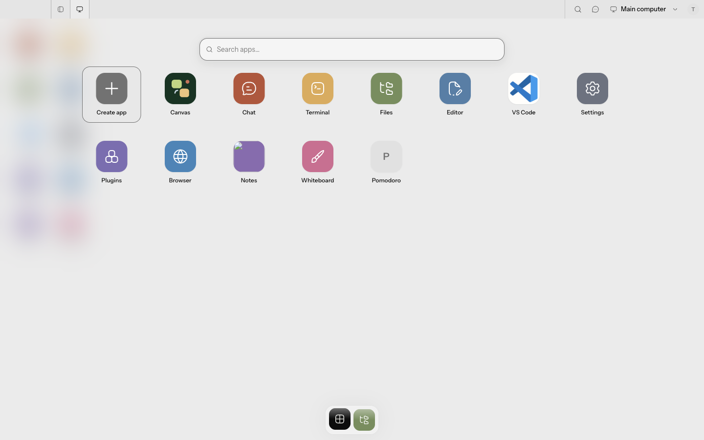
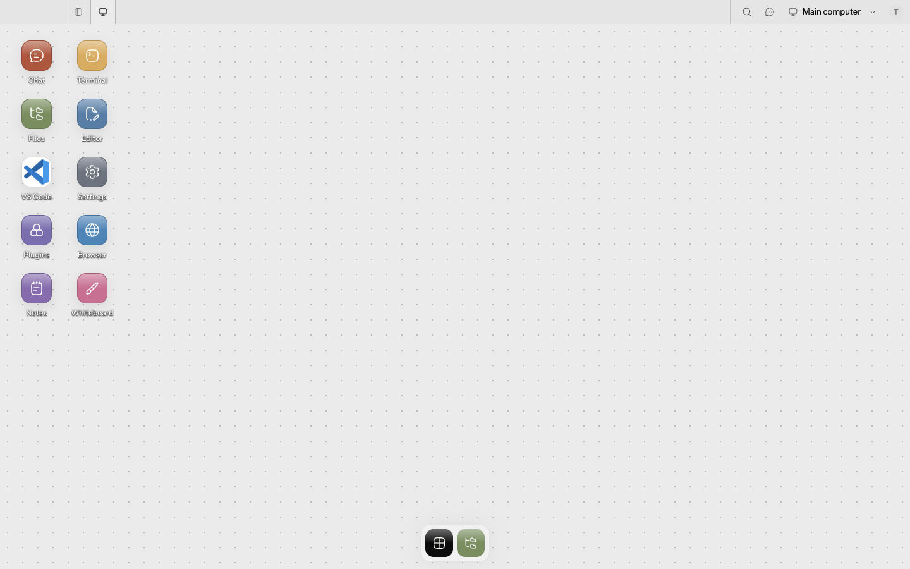

# Electron OS-view evidence

Captured on 2026-08-30 from the production-built Electron renderer at 1440 × 900, using the repository's local stub gateway and a fresh Electron user-data directory.

## Electron Desktop launcher

The launcher exposes Canvas as its first reciprocal OS-view destination, ahead of the shared first-class app sequence.

## Electron Canvas

Selecting Canvas closes the launcher and switches the retained Electron shell to its free-form Canvas presentation.

## Reciprocal Desktop destination

Reopening the launcher from Canvas exposes Desktop in the same launcher position, without replacing the shared app set.

The capture exercised the real launcher controls in the built Electron app: `Desktop → Canvas → reopen launcher`. The automated Electron tests separately assert that shared tabs survive the switch and that Desktop and Canvas geometry restore independently.
