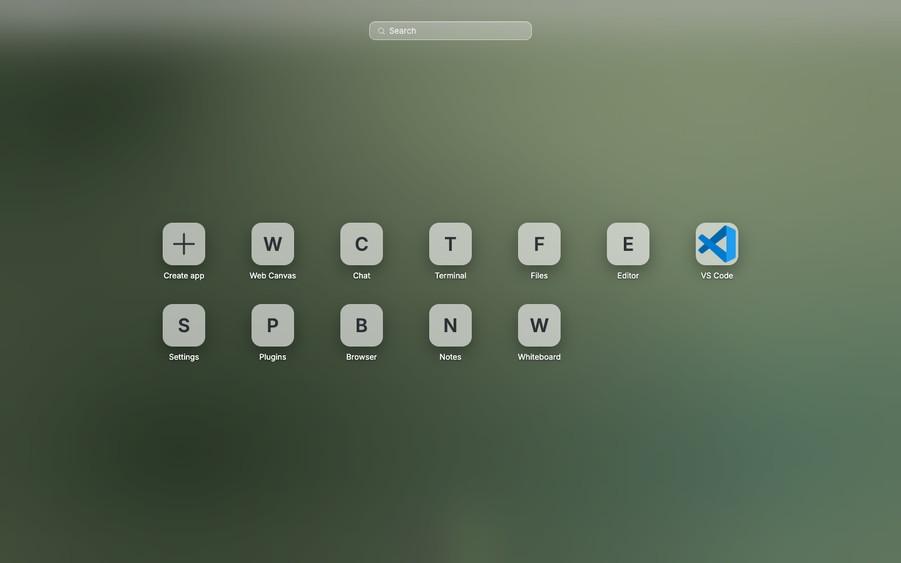
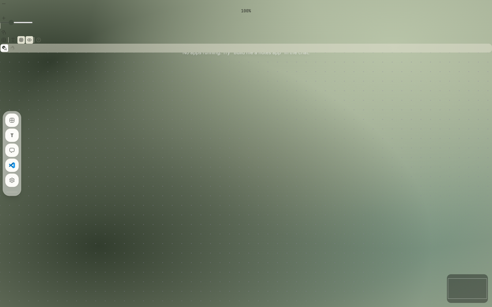
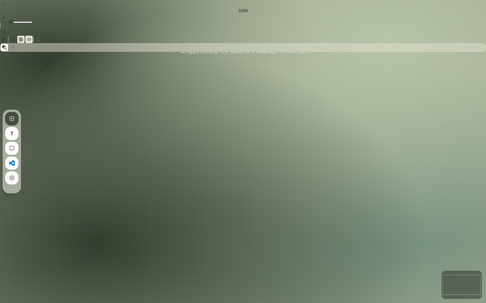

# OS-view parity evidence

Captured on 2026-08-30 and 2026-08-31 from production-built Web Desktop, Web Canvas, and Electron Desktop renderers at 1440 × 900. Both capture sessions used a fresh client state and a local stub gateway; the Web Desktop/Web Canvas session additionally used the repository's E2E authentication bypass.

## Surface matrix

| Surface | Reciprocal launcher destination | Presentation switch | Core-app fixture |
| --- | --- | --- | --- |
| Web Desktop | Web Canvas | pass | Chat, Settings, Terminal, Files |
| Web Canvas | Web Desktop | pass | Chat, Settings, Terminal, Files |
| Electron Desktop | Canvas presentation / Desktop presentation | pass | Chat, Settings, Terminal, Files |

The screenshots below prove the rendered destinations and real launcher interaction. The shared automated interaction fixture proves that the same four canonical app paths open in Web Desktop, Web Canvas, and Electron Desktop and survive presentation changes; it is intentionally complementary evidence rather than a substitute for these real-renderer captures.

## Web Desktop launcher

The Web Desktop launcher exposes Web Canvas as its first reciprocal OS-view destination, ahead of the shared first-class app sequence.

## Web Canvas

Selecting Web Canvas closes the launcher and switches the retained browser OS view to its free-form Canvas presentation.

## Reciprocal Web Desktop destination

Reopening the launcher from Web Canvas exposes Web Desktop in the same launcher position, without replacing the shared app set.

The Web Desktop/Web Canvas capture exercised the real launcher controls in the production-built browser app: `Web Desktop → Web Canvas → reopen launcher`.

## Electron Desktop launcher — Desktop presentation

The Electron Desktop launcher exposes its Canvas presentation as the first reciprocal OS-view destination, ahead of the shared first-class app sequence.

## Electron Desktop — Canvas presentation

Selecting the Canvas presentation closes the launcher and switches the retained Electron Desktop surface to free-form navigation.

## Electron Desktop — reciprocal Desktop-presentation destination

Reopening the Electron Desktop launcher from its Canvas presentation exposes the Desktop presentation in the same launcher position, without replacing the shared app set.

The Electron Desktop capture exercised real launcher controls in the production-built app: `Electron Desktop (Desktop presentation) → Electron Desktop (Canvas presentation) → reopen launcher`.

## Core interaction smoke

The final parity gate imports one canonical fixture for Chat (`__chat__`), Settings (`__settings__`), Terminal (`__terminal__`), and Files (`__file-browser__`). It checks the Web Desktop app controls, Web Canvas ↔ Web Desktop state retention, Electron Desktop launcher ordering, Electron Desktop shared-tab retention, and the shared durable OS-view client/repository contract. Web Desktop and Electron Desktop logical geometry, plus Web Canvas and Electron Desktop Canvas-presentation geometry, are verified in independent presentation namespaces.

These checks run in the dedicated `OS View Parity` CI job whenever shared Web, Electron, brand, UI, contract, or relevant gateway paths change. The path planner and its workflow wiring have their own focused test.
