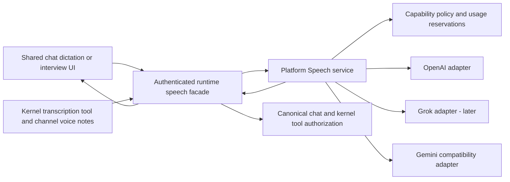

# Platform Speech implementation plan

Status: proposed implementation design, following accepted product direction. This plan does not enable credentials or deploy a service.

## Service boundaries

- `packages/contracts/src/speech/`: versioned capability, request, result, lifecycle event, and safe error schemas. No long-lived key or provider-native event crosses this boundary.
- `packages/platform/src/speech/`: one service owning provider selection, secrets, policy admission, normalization, cancellation, and settlement. Keep adapters for different capabilities focused; do not force a transcription model to implement conversation tools.
- `packages/gateway/src/speech/`: thin owner/runtime-authenticated facade and managed platform client. It handles owner file access and canonical chat/tool integration, not provider calls or provider selection.
- `packages/ui/src/speech/`: shared recording state/controller and Web/Electron components. Surfaces supply authenticated transport, permission adapters, and draft identity. Native Mobile later supplies its own microphone adapter using the same contracts.
- Existing platform AI funding repositories remain the budget source of truth. Extend operation/model policy and verified speech usage; do not build a second wallet or use arbitrary text-token estimates for audio.
- Provider credentials reside only in platform infrastructure. The runtime facade uses its existing verified machine identity, with a speech-specific capability authorization. It receives neither the OpenAI key nor a broad-purpose provider token.

One implementation means one service and client lifecycle with explicit adapters. Purpose-specific interview/onboarding prompts can differ; transport, policy, storage, and execution must not fork.

## Proposed endpoint authentication matrix

All routes are proposed names. Verify platform routing order and reserve these namespaces before implementation.

| Route | Caller/authentication | Owner/runtime authority | Public? | Phase |
|---|---|---|---|---|
| `GET /api/speech/capabilities` | Existing authenticated Web/Electron gateway session | Gateway principal and selected runtime | No | 1 |
| `POST /api/speech/transcriptions` | Same gateway auth; body limit before buffering | Same; caller supplies request/draft ID, never authoritative owner | No | 1 |
| `GET /internal/speech/capabilities` | Verified runtime-to-platform credential | Platform resolves machine, runtime and owner from authenticated registration | No | 1 |
| `POST /internal/speech/transcriptions` | Same, plus explicit speech capability policy | Same; reservation keyed to verified identity and operation | No | 1 |
| `POST /api/speech/sessions` | Authenticated gateway principal | Binds chat/draft, mode and runtime server-side | No | Later |
| `DELETE /api/speech/sessions/:id` | Same; body limit even with empty body | Session owner and runtime match | No | Later |
| Session media channel, path selected by spike | Authenticated short-lived session grant or authenticated relay | Session bound to owner/runtime; grants scoped to one capability/session | No | Later |
| Existing `/ws/vocal` or STT aliases during migration | Existing route auth, then canonical authorization | Same service; no local provider fallback | No | Transition only |

Platform service authentication is not just accepting an owner ID passed by a VPS. Resolve and compare machine/runtime ownership using the platform database, reject inactive/revoked credentials, and verify speech policy for each admission. Local/self-hosted gateways without a managed platform relationship report speech unavailable; do not silently fall back to a runtime key.

## Recording request lifecycle

1. Read coarse capability readiness and limits. Missing configuration is an unavailable service, not “file not found.”
2. Bind a request ID to owner, runtime, chat/draft and draft generation. Capture begins only on user action.
3. Record with a supported codec; prefer negotiated WebM/Opus or MP4 for browser compatibility. Stop/cancel always releases tracks.
4. On Stop, upload bounded audio to the gateway facade. The facade validates media headers, actual supported format and size; authenticated identity is never taken from audio metadata.
5. Platform checks capability eligibility, rate and concurrency limits, and creates an atomic usage reservation before provider work. The provider/model are selected from server policy.
6. Platform adapter transcribes and validates the response. For optional streamed file output, normalize provisional updates and one final result; never equate a chunk with an independently submitted chat message.
7. Reconcile the final result into the same draft once. Preserve intervening typing and attachments. Display overflow instead of silently truncating.
8. Release buffers; settle usage exactly once. The ordinary Send path later creates the chat turn.

### Retry and uncertain outcomes

Use a request ID scoped to verified owner/runtime plus a bounded content fingerprint to reject ID reuse with different audio. Do not persist raw transcripts at the platform for replay. Keep non-content operation/usage metadata in Postgres with explicit retention and reconciliation.

A lost response after provider execution is an uncertain outcome: no silent automatic re-run. The client retains its local recording only within its bounded active attempt, shows a deliberate retry action and sends a new request ID for a new billable attempt. Pre-execution retries use the existing ID and admission state. Reserve/start/finalize transitions must prevent concurrent duplicate upstream execution and double settlement.

## Limits, cancellation and privacy

- Proposed first release bounds: 120 seconds, 10 MiB audio, 32,000 transcript characters; 10-second control requests and 65-second end-to-end file transcription deadline. Validate deadlines against measured model behavior.
- Enforce upload limits at every receiving boundary using streaming body limits. Do not trust client-reported duration or infer seconds from compressed byte size.
- To enforce duration/cost, spike a bounded media probe in platform infrastructure or reserve a safe encoding-specific worst case validated against actual format. The implementation must not claim a hard duration limit without server-side verification.
- Per-owner/runtime and global concurrency/rate caps, bounded registries, TTL/stale eviction and shutdown drains. Initial policy values must be explicit and tested; these are operational limits, not new commercial prices.
- Provider URLs are platform configuration allowlists, never user URLs; reject redirects. Cancellation propagates through gateway and platform to the provider connection, subject to upstream cancellation semantics.
- No raw audio or transcript in platform logs, analytics, exception payloads or usage rows. Provider retention requirements must be separately verified; use available controls without asserting guarantees not supported by the account.
- No automatic microphone resume after navigation, disconnect or session restart. Dictation UI keeps typed draft state on errors.
- Avoid temp files where possible. If a media probe needs one, use exclusive creation, bounded storage, symlink-safe recurring cleanup, and finally cleanup.

## Live dictation and interviews

### Enhancement A: progressive transcript after Stop

Retain the recording/upload lifecycle. If the OpenAI file adapter supports it, stream partial text into a separate preview and commit the authoritative final text once. This improves perceived wait without maintaining an open microphone session.

### Enhancement B: true live dictation

Use a transcription-only session. Normalize `segmentId`, revision/sequence, provisional text, finalized text and end reason. Share the recorder/audio pipeline where practical, but use the negotiated PCM/WebRTC encoding rather than sending MediaRecorder chunks as if each were a complete file. Never fake live streaming with repeated overlapping uploads.

A live failure does not trigger automatic full-recording retranscription. Preserve finalized text, mark incompleteness, and offer a deliberate retry/re-record action. Any fallback to batch must use valid retained audio, explicit user action, and its own admission decision.

### Later: interview and action sessions

- One session controller handles connecting, listening, thinking, speaking, interrupted, reconnecting, ended and failed states. Shared transcript and controls ship on Web Canvas, Web Desktop and Electron Desktop.
- Session creation carries a Matrix mode (`dictation`, `interview`, `assistant`) and bounded topic/context. It does not accept arbitrary provider tools or an unrestricted system prompt from the browser.
- Platform adapters normalize audio input/output, transcript deltas/finals, interruptions, usage and tool requests. Provider/model selection is pinned for the session.
- The gateway validates and executes tool requests through the existing canonical chat/kernel path. Stable tool IDs, owner scope, approvals and bounded results are mandatory. Provider tool requests never directly run shell commands or bypass the selected harness's permissions.
- Interview mode asks questions and produces a reviewable brief. “Start work from this brief” is explicit. Retain no separate provider conversation store as Matrix's user data source of truth.
- Reuse/upgrade the current Gemini Vocal flow through a compatibility adapter, then retire `/internal/containers/:handle/gemini-live` and provider-specific client events after rollout. Onboarding stays a workflow using the same session engine.
- Prefer an initial platform-relayed media path when it is needed to enforce session lifetime, tool authority and metering. Spike direct WebRTC with ephemeral credentials and a server control channel for latency. A short-lived connection token is not enough to prove active-session cost limits or trusted settlement.
- OpenAI and Grok adapters must each prove interruption, cancellation, usage accounting and tool-call deduplication. Shared JSON similarity is not proof of API interchangeability.

## Native Mobile chat streaming companion work

Reproduce the failure on the current Expo development client and latest gateway. Compare authenticated HTTP content streaming via Expo-compatible streaming fetch with extending the existing native WebSocket route to opt into content. Prefer the transport with demonstrated device behavior and least duplicate infrastructure; choose based on the spike, not the paused prototype.

Whichever transport wins, use shared canonical content reducers and message-version negotiation, replay-gap snapshot recovery, bounded cursor deduplication, heartbeat/inactivity handling, fresh credentials and AppState foreground recovery. Prevent an older REST response from rolling back a newer streamed revision. Polling remains a bounded recovery path instead of the normal token delivery path. Test list creation/deletion updates as well as active-chat content.

## Consolidation and delivery sequence

1. **Contracts and platform foundation**: failing tests for auth, key isolation, capability policy, admission, usage, safe errors and adapter normalization; implement OpenAI file transcription. Scope the funded-policy schema extension before coding. Extract focused modules instead of adding substantial behavior to `server.ts` or `ipc-server.ts`.
2. **Caller migration and UI**: migrate chat capture, kernel `transcribe`, and channel STT to the same managed client. Wire every consumer at registration. Remove duplicate direct provider STT code and the unused Web Speech API path. Preserve TTS/telephony separately and test their STT dependencies. Never remove or rotate owner-supplied keys as part of this cleanup.
3. **Cross-surface validation**: Web Canvas first, Web Desktop next, Electron Desktop next; Web Mobile capture compatibility. Check Electron microphone permission description/entitlement, CSP, origin checks and trusted renderer permission handling. Test stop/cancel, draft identity, limits, accessibility, language and privacy.
4. **Native Mobile streaming repair**: independently ship the chosen transport/reducer/recovery changes after real-device reproduction and acceptance tests. Keep the original repair objective visible; do not bury it inside voice work.
5. **Progressive file transcription / live dictation spike**: benchmark latency, audio format, interruption/recovery, permission behavior and verified usage. Enable each capability only when all applicable surfaces pass; keep batch dictation available otherwise.
6. **Interview/session migration**: adapt Gemini compatibility, add OpenAI and Grok session adapters, connect canonical tools, and ship one shared interview UI. Remove the old Vocal provider-specific stack once workflow parity is verified.
7. **Documentation and delivery**: implementation PR(s) plus a separate `FinnaAI/matrix-os-site` documentation PR under `content/docs/`, covering microphone setup, retention, limits, language support and modes. Greptile 5/5 before merge. Roll out platform service before enabling client capabilities. Validate an exact host bundle on a disposable feature VPS; native packaging is a separate release gate.

## Verification and completion evidence

- Contract fixtures run unchanged against OpenAI, alternate test adapter, and later Grok/Gemini adapters.
- Route auth matrix tests cover unauthenticated, wrong-owner/runtime, revoked credential, malformed input, body limits and disabled policy.
- End-to-end mocked wiring test: shared client → gateway → platform admission/provider stub → final transcript; assert no chat turn before Send, no key at runtime, and exactly one usage settlement.
- Kernel/channel tests prove delegation to the same client, safe file resolution, registration-time dependencies and consistent error behavior.
- UI/component and packaged-device tests cover all US-01–03 and US-06–08 states. Real audio latency/language results are recorded without committing private recordings.
- Mobile tests cover live deltas, final outcomes, gap recovery, stale REST responses, network partitions, expired tokens, account/runtime switches and foreground recovery.
- Static inventory confirms no active direct STT provider calls remain outside platform adapters; compatibility aliases have callers, tests, removal criteria and no independent provider state.
- Scoped tests/typechecks precede broader required checks. No success claim based solely on the earlier runtime-local prototype's green tests.
