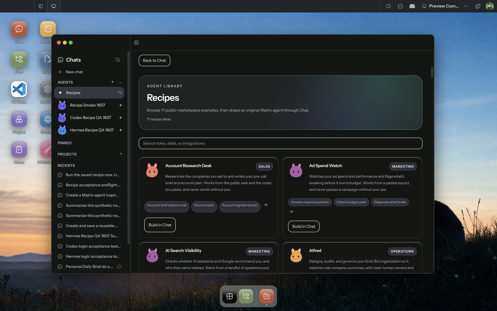

# Saved Agents surface review — September 16, 2026

This is the real Electron Desktop renderer, built from combined stack commit
`c7c594a37325769ea155930af94dc4230948f998`, using the existing authenticated
Preview Computer. Its loaded renderer URL points into the isolated
`recipe-stack-publish/desktop/out/renderer` build. The server was still on the
preceding combined runtime `ec670a39`; this screenshot establishes the current
shared recipe-library appearance and native sidebar integration, not final
backend or permission-flow acceptance. Names and snippets shown are synthetic
validation data. No credentials or private account contents are included.

The Recipes action opened this surface from the native Work sidebar. Selecting
Account Research Desk via Build in Chat returned to the existing composer with
the generated original-agent prompt and did not send it automatically. Selecting
a saved Agent inserted its typed reference and showed per-request access context.
The final New Chat reset correction is covered by two additional regressions;
this library screenshot predates that composer-only correction.

| Surface | Integration | Evidence / remaining check |
| --- | --- | --- |
| Web Canvas | Shared Chat in CanvasWindow, wired by #1687 | Automated Web/shared tests; earlier theme/390px screenshots are at the stack tip. Final preview interaction check remains required. |
| Web Desktop | Shared Chat in Desktop, wired by #1687 | Earlier real Codex creation, skill snapshot and read-only GitHub MCP execution passed. Final-head visual/interaction repeat remains required. |
| Electron Desktop | Shared library/editor plus native Work/composer, wired by #1607 | Current real screenshot above; recipe-to-draft and typed saved-Agent selection observed. Composer/queue regressions and production build pass. |
| Web Mobile | Shared Chat with mobile chrome, wired by #1687 | Shared/Web tests and earlier narrow-screen screenshots; final 375px visual/overflow repeat remains required. |
| Native Mobile | Explicit feature limitation | This stack does not expose saved Agents, recipe handoff or typed-Agent transport on Native Mobile. Native implementation is a separate parity follow-up before advertising that capability, as specified in implementation.md at the stack tip. |

The shared components are intentionally preparatory in #1686: the Web and native
callers arrive in #1687 and #1607. All surfaces must be evaluated using the
combined stack. Final current-head CI, real-provider checks and Yuhan's Human
Review remain separate pre-merge gates; this document does not mark them passed.
