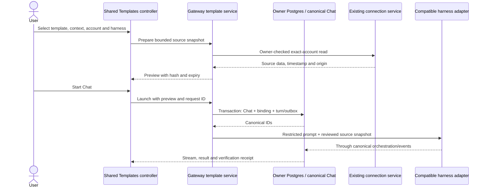

# Chat agent templates

Status: Proposed for Yuhan review. Research/spec only. Tracking: [OM-214](https://linear.app/matrix-os/issue/OM-214/research-grok-bot-workflows-and-specify-matrix-native-agent-templates).

## Outcome and scope

Inside Chat, a user opens **Templates**, chooses a job, supplies context and explicitly selected existing connections, chooses a compatible harness/account/model, reviews the scope, and starts a canonical Chat. Follow-ups continue that Chat and its pinned template contract. “Agents/Templates” is the discovery concept; MVP navigation uses **Templates** to avoid confusion with Settings → Agents & providers or the future Custom agents editor.

Ship two original templates: **Meeting Brief** and **Sponsorship Reply Draft**. Both accept pasted text and optionally read selected Gmail/Calendar context through the gateway. Both return drafts in Chat. No external write tools are granted. This is a concrete scope reduction from the Grok operational loops, not a claim of feature equivalence. [Research rationale](research.md).

MVP includes discovery, setup, preview, start, continue, explicit source refresh, provenance, reconnect guidance and recoverable errors. There is no separately installed agent instance: the canonical Chat is the user's configured instance. Recent template Chats are a filtered projection of existing Chat records, not a second roster or lifecycle store.

Non-goals: template authoring/builder; editing `~/agents/custom/`; automatic learned memory; autonomous tool use; sends/publishing/payments; scheduled/event/webhook triggers; multi-agent orchestration; a new approvals center; importing remote manifests or MIT skill scripts; Grok execution adapter; sharing/store/RBAC; generated persistent apps; video processing; full CRM/SEO/ATS integrations. OM-209–OM-213, Zellij-from-Chat and Pi output repairs are separate work and must not be folded into this implementation.

## User flow

1. **Browse:** Templates is available from Chat's new-conversation area and navigation. Cards show original name, job, draft-only behavior, needed inputs, optional connections and compatibility. Empty/search-empty/loading/error states have distinct copy and retry behavior.
2. **Choose and configure:** Selecting a card opens an inline setup view. Enter the meeting objective or sponsor inquiry and commercial constraints; optionally pick an existing Project for organization. Add pasted source text. No automatic access to every file in that Project.
3. **Bind sources:** Select an exact connection account and bounded source selection. Multiple accounts never silently fall back to the first account. An optional missing connection can be skipped explicitly; a selected required source that fails blocks Start until repaired or deliberately removed. “Manage connections” opens existing settings and returns to the preserved draft; setup does not launch OAuth itself.
4. **Choose execution:** Existing Provider V3 selection supplies harness, account, access source and model. Keep the user's current choice if compatible; otherwise show why it cannot run this template and let the user select. Never silently substitute a paid source, model or harness. Show that selected source content will be sent to that inference route.
5. **Preview:** “Prepare context” reads only the selected sources, displays source identities, freshness, exclusions, missing data, contract limits and a proposed first message. Preparing context is a real read, clearly labeled. “Start Chat” uses that exact snapshot; an expired/changed preview requires preparing again. Editing setup never sends a Chat turn.
6. **Start:** One Start creates one Chat, a pinned binding and one canonical turn/run admission. Disable duplicate clicks, but server idempotency is authoritative. If navigation/reload fails after admission, recover the existing Chat with the same request ID.
7. **Continue:** Template badge opens a read-only contract/source summary. Normal follow-ups retain the contract. “Refresh sources” is a deliberate new bounded read and preview for the next turn. “Use template again” opens a fresh setup with blank private context and unbound accounts. Switching templates creates a new Chat. No insertion into an unrelated existing Chat in MVP.
8. **Review result:** Render the draft plus sources, missing/contradictory evidence and completion readback. A stopped or failed run remains distinguishable from a verified result. Requests to send or expand authority explain the draft-only boundary; they do not launch a new privileged run.

Changing harness in an idle template Chat triggers the same compatibility/data-disclosure check. Do not reuse provider-specific resume state with another harness. Continue using canonical transcript projection; if safe cross-harness continuation cannot be supported, explain the limitation and offer a new Chat with a reviewed context preview. An active run cannot change its binding or selection.

## Contract and storage

[contract.md](contract.md) defines the versioned data objects and original examples. The nine contract dimensions are job → trigger → inputs → authority → cap → proof → readback → escalation → owner.

- **Definition:** release-bundled Markdown with validated frontmatter under proposed `home/agents/templates/<id>/<version>.md`; no scripts, secret values or account IDs. This separate namespace does not create executable custom subagents. Server loads a bounded immutable catalog and fingerprints normalized definition bytes. Catalog content is owned by the repository and distributed under its license.
- **Binding:** owner-controlled Postgres/Kysely operational state keyed to canonical `chatId`, containing immutable definition snapshot/hash, selected inputs, exact connection references and source snapshot versions. It is not a second authoring source. Export with Chat; include source data in owner data deletion. No shared/org bindings in MVP.
- **Sources and proof:** bounded source snapshots and verification receipts live with the Chat's operational records. User-entered inputs and external content are data, not system authority. Credential material never enters these records, prompts or analytics.
- **Updates:** newly started Chats use a selected catalog version; existing Chats retain their snapshot. No silent upgrades or changed permissions. If a version is administratively disabled for safety, keep history readable and block further starts/continuations under it with a safe explanation.

## Architecture and runtime wiring

Add shared Zod 4 contracts to `packages/contracts/src/`, focused template catalog/context/binding modules under `packages/gateway/src/chat/templates/`, a shared controller and feature UI under `packages/ui/src/chat-templates/`, and thin shell/native adapters. Names are proposed module locations, not existing APIs.

Gateway owns admission and source access; kernel/harness retains execution responsibility. The template service calls the existing integration service through injected dependencies, never self-fetches with a privileged token or executes an upstream URL from the manifest. Extract exact-account read operations from the existing route into a focused service; do not duplicate connector routing or OAuth logic. Template reads enforce the intersection of owner access, current connection status, catalog read risk, template allowlist and user-selected source constraints. A label is display metadata, never account identity.

The main execution change is a proposed **restricted template execution profile**: no shell, browser, file mutation, network tool, general MCP, subagent delegation or inherited project/user plugins. Only reviewed text context and inference credentials needed by the chosen harness are available. Remove broad Matrix gateway tokens and unrelated credentials from the execution environment. A prompt saying “do not send” is not enforcement. A generic supervised mode is not proof that tools cannot execute. A candidate adapter must demonstrate these restrictions before being offered as compatible.

No general capability broker or per-run tool proxy is required for this snapshot-only MVP. If live tools are added later, a separate design must bind authority to owner/chat/run/account/action/resource, support revocation and prevent bypass through broad MCP or terminal access. Do not reuse this MVP's draft label for a full-access run.

### Canonical lifecycle and atomicity

Launch extends existing canonical admission through a shared transaction-aware service. Commit Chat, template binding, initial turn/run admission and outbox together; refactor existing admission primitives if necessary. Never call independent create and turn endpoints and present that as atomic. Unique `(owner, clientRequestId)` plus stored payload hash returns the same IDs on exact retry and rejects reuse with different input. Existing base-revision checks and single-active-run rules remain authoritative.

Source reads happen before the transaction; no external I/O inside DB locks. Preview records are owner-bound, content-addressed, capped and expiring. At admission recheck catalog version, preview expiry/hash, connection ownership/status and provider readiness. Persist the accepted snapshot inside the transaction, then dispatch via the existing outbox. A disconnect after dispatch blocks future refreshes; already transmitted content cannot be recalled. Removing a connection never silently binds a replacement.

Acceptable intermediate state: an unconsumed preview that expires, or a committed pending canonical outbox item reconciled after restart. Unacceptable: running orphan with no Chat, duplicate first turn, binding without its Chat, or a failed source read represented as empty success. Source refresh inserts a new snapshot and attaches it to the next admitted turn with revision protection; do not mutate snapshots used by active or completed runs.

## Endpoint authentication and limits

All routes below are proposed unless marked existing. Production uses the same gateway auth middleware and `RequestPrincipal` resolution as canonical Chat: verified JWT/platform identity or authenticated single-user host identity. Never accept owner IDs or unverified identity headers from payloads. Missing auth is 401, inaccessible owner resources use safe 404, malformed input 400, stale revision/payload conflict 409, unavailable dependencies 503. No public template API in MVP.

| Route | Caller/auth and authorization | Validation / bounds |
| --- | --- | --- |
| `GET /api/chat-templates` | Authenticated owner; catalog metadata only | Search ≤200 chars; cursor/limit Zod validated, page ≤50 |
| `GET /api/chat-templates/:templateId` | Same; selected published version only | Safe slug ≤80, version ≤32; response ≤64 KiB |
| `POST /api/chat-templates/sources` | Same; own exact connection; explicit discovery request | `bodyLimit` 8 KiB; Gmail query or Calendar interval union; ≤20 metadata rows, no pagination loop; same preparation quota/time/response bounds |
| `POST /api/chat-templates/preview` | Same; own exact connections and Project | `bodyLimit` 64 KiB; typed per-template input and source union; 10 previews/owner/hour, ≤10 live previews |
| `POST /api/chat-templates/launch` | Same; own preview, current V3 readiness | `bodyLimit` 8 KiB; request ID, preview ID/hash and selection; idempotent |
| `POST /api/chats/:chatId/template-context` | Same plus own existing idle template Chat | `bodyLimit` 64 KiB; revision + typed refresh intent; creates preview only |
| `POST /api/chats/:chatId/turns` (existing, extended) | Canonical principal/owner rules plus pinned binding policy | Existing 128 KiB bound; optional fresh preview reference; revalidate restrictions every turn |
| Chat detail/events/cancel/delete (existing) | Existing owner/auth checks; no public reads | Include bounded binding/readback projection; deletion includes new child rows; keep DELETE body limits |
| `GET /api/integrations` and `/available` (existing) | Existing authenticated owner | Setup metadata only; do not expose tokens |

The source endpoint returns minimal selectable metadata, not a body-content preview or a permission grant. Only explicitly selected records can enter the subsequent prepared snapshot. Reuse an existing source picker if it satisfies these same bounds. No browser WebSocket route is added; use the existing authenticated canonical event stream, including its query-token registration and replay behavior. Use same-origin requests and existing explicit CORS policy, never wildcard origins.

Each upstream read: 10-second timeout, ≤1 MiB decoded response, at most 10 calls total per preview, no automatic retries in MVP. Overall preparation ≤30 seconds; cancel pending reads on request cancellation. Maximum 20 selected source items, 8 KiB normalized text each, 48 KiB total context including pasted text; reject excess or let the user explicitly deselect sources, never silently drop relevant evidence. Calendar range ≤7 days; email discovery page ≤20 IDs, followed only by user-selected message IDs. Preview expires after 15 minutes; hourly recurring DB cleanup removes expired previews and clears timer on shutdown. Stop per-run execution after 120 seconds or 16 KiB assistant output; report partial results honestly. No claimed dollar budget when an access source cannot enforce one.

Bound catalog to 100 definitions, 64 KiB each; startup validation fails closed on duplicate IDs/versions or malformed definitions. Use a fixed catalog map; no unbounded caches. Shared owner DB pool lifecycle remains with its existing owner. In-flight source requests and timers drain during gateway shutdown.

No user-URL fetch occurs in this MVP. Source links are generated from validated connector records; pasted URLs are text references, not fetch instructions. If arbitrary fetching is later introduced it requires SSRF validation, DNS pinning or documented residual risk, redirect revalidation and independent tests.

## Harness compatibility

The definition is portable; current adapters are not certified for the restricted profile. V3 must publish explicit, versioned restriction support and fail closed on unknown/stale evidence. Existing rootChat/resume/cancellation/model flags remain necessary but insufficient.

| Harness | Evidence in current tree | MVP gate |
| --- | --- | --- |
| Claude Code | `claude-provider-adapter.ts` maps supervised/auto/full-access permissions and start/resume | Verify explicit tool exclusion and isolated config/environment on both start and resume; supervised alone is insufficient. |
| Codex | `coding-provider-adapter.ts` maps approval/sandbox settings | Verify no inherited MCP, tools, workspace reads or execution escape; approval policy alone is insufficient. |
| OpenCode | Shared coding adapter, provider registry/catalog | Verify restricted invocation and canonical continuation for its exact version. |
| Hermes | `hermes-provider-adapter.ts` currently requires `full_access` | Block until an isolated restricted profile is implemented and tested. |
| OpenClaw | Dedicated provider adapter and catalog | Verify gateway/session configuration cannot inherit broad tools; otherwise block. |
| Pi | Coding provider/catalog path | Same restriction gate. Do not couple this task to paused Pi output work. |
| Matrix kernel | `kernel-provider-adapter.ts` currently requires `full_access` | Do not use it as a hidden privileged fallback. |

The first implementation task is a disposable restriction spike, not building the UI around assumed support. Target Claude Code and Codex first; certify at least two harnesses for MVP release. Each remaining harness must be visibly unsupported with an actionable reason until certified. If no two adapters can enforce the profile, return a scope decision to Yuhan rather than silently relaxing it. No Grok Bot adapter is promised.

## Surface parity

Web Canvas, Web Desktop and Electron Desktop share template schema, client/controller, cards, setup, capability filtering, draft/readback and recovery derivations. Entry stays inside canonical `__chat__`; do not add an Agents app/window built-in. Electron Desktop is the shared visual/interaction reference; use brand tokens/primitives. Validate Web Canvas first, then Web Desktop, then Electron Desktop.

Web Mobile and Native Mobile both have Chat and are in scope: same templates, source/account selection, review/start/continue/refresh/error semantics. Native layouts may use native controls and an equivalent presentation adapter, but must consume shared contracts and derivation. Stack panels on narrow screens; preserve Back navigation and drafts. No hover-only action, no icon-only authority disclosure. Keyboard focus enters setup on selection and returns to the chosen card on cancel. Pending errors announce through accessible live regions.

No surface may ship “coming soon” while the same capability is enabled on another without a separately approved spec limitation. Disabled feature flag keeps existing template Chats readable and disables new starts/refreshes; it never deletes data.

## Acceptance criteria

| ID | Observable condition |
| --- | --- |
| AC1 | Both original definitions validate; catalog/version/hash and all nine dimensions are inspectable. No upstream prompts, credentials or private discussion text ship. |
| AC2 | Full browse → context → exact account → compatible harness → preview → Start → follow-up works on all five surfaces; ordinary Chat is unchanged. |
| AC3 | Two simultaneous identical launches, lost response retry and process restart produce one Chat/first turn/run; altered payload with same key conflicts. |
| AC4 | Wrong owner, disconnected account, renamed account, stale preview, missing required source and changed catalog fail safely; no fallback account or partial silent context. |
| AC5 | Every certified harness denies tools/inherited configuration on initial and resumed turns, including malicious instructions in source text; at least two harnesses pass real-adapter tests. Others are visibly blocked. |
| AC6 | Provider V3 unavailable/auth/funding/policy states disable Start; model selection is never replaced silently. Unknown restriction evidence fails closed. |
| AC7 | Result includes source IDs/freshness, missing data and readback. Invented source IDs, missing required sections, empty output or timeout never receive a verified-complete receipt. |
| AC8 | Cancel/retry/reload/delete/export retain canonical lifecycle and owner boundaries; refresh is explicit and old snapshots remain immutable. |
| AC9 | A send/publish request remains a blocked scope expansion, including in follow-up; no approval click can widen this template's authority. |
| AC10 | Limits, shutdown cleanup, DB transaction rollback and event replay are tested; UI keeps draft input on preparation, admission or navigation failures. |
| AC11 | Separate public documentation PR in `FinnaAI/matrix-os-site` explains the actual shipped flow and limitations and is reviewed alongside implementation. |

## Review and documentation

Yuhan's decisions: accept the snapshot/draft-only MVP, two initial templates, restriction-based harness availability and five-surface scope. These are recommendations awaiting product review, not permission to implement now. Implementation and a separate public-docs PR follow [tasks.md](tasks.md). This task ends with research/spec PR and Linear deliverables; no deploy or merge.
