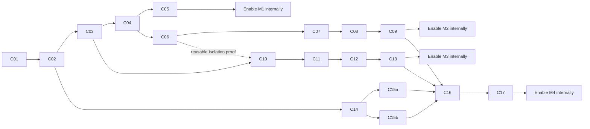

# Milestones and PR Delivery Plan

**Status:** Approved milestone order, proposed engineering PR boundaries. No implementation PRs have been opened by this planning command.
**Related:** [spec](spec.md), [technical plan](plan.md), [acceptance guide](quickstart.md).

## How work becomes usable

A **merge gate** proves one PR can safely land on main. A **milestone gate** proves the connected feature is usable and may be enabled for an internal cohort. Merging a foundation PR never enables a half-wired feature automatically.

The first usable milestone is shared Chat history and human discussion. Shared AI remains disabled there by the server, for owners as well as collaborators. This internal intermediate state is explicitly approved; the complete P1 commitment is not considered fulfilled until the remaining P1 capabilities are delivered.

| Milestone | Usable outcome | PRs | Still unavailable at this point |
| --- | --- | --- | --- |
| M1 — Shared Chat discussion | Invite/accept, shared history, attributed human messages, viewer access, private drafts, live revoke/reconnect | C01–C05 | Shared AI, shared terminals, whole-project sharing |
| M2 — Shared AI | M1 plus explicit AI requests, shared ordered queue, isolated execution, owner approvals, permitted cancel/retry | C06–C09 | Shared terminal participation and whole-project sharing; private-project files are not lent to a standalone Chat |
| M3 — Shared Terminal | Invite to the same eligible pre-isolated session, observe bounded output, pass control, revoke access | C10–C13 | Whole-project sharing; unrestricted legacy personal sessions remain ineligible |
| M4 — Whole project | One complete inventory confirmation, all contents shared, future inheritance, project files/apps/layout and lifecycle | C14, C15a, C15b, C16, C17 | Only the final spec's explicit exclusions |

There are 18 implementation PRs because C15 is deliberately split into two independent adapter slices. D1–D4 are additional documentation PRs in the site repository. These are review boundaries, not fixed effort estimates. If a slice exceeds 1,000 additions, inspect its responsibilities; do not exceed the repository's 3,000-addition/50-file hard split limit.

## Dependency graph

The **user rollout order** is M1 → M2 → M3 → M4. Engineering can prepare Terminal after C03 and project inventory after C02; those independent investigations must not delay M1. M3 can reuse M2's native isolation implementation, but is not coupled to its Chat queue internals. M4 depends on every adapter and applicable prerequisite milestone being ready.

## Universal merge gate

Every implementation PR includes failing tests first, implementation, green focused tests, relevant repository checks, and current-head review with Greptile 5/5 before merging. A PR adds no endpoint before its auth/body/validation design is implemented. Every behavior includes failure, permission and recovery tests in that PR; a later UI PR is not a substitute for backend verification.

Changes are additive and off by default. Personal workflows retain their behavior unless an item explicitly becomes shared; shared items reject old unsafe paths. Shared UI logic and permission derivation are reused. Backend seams are independently mergeable while UI stays unavailable. Cross-surface adapter commits may be split further, but a milestone gate stays closed until applicable surfaces are complete.

Implementation normally starts a new manual worktree from current origin/main after its dependencies merge. If concurrent development needs an actual stacked PR, use the repository's Graphite workflow and merge only after the base is main. This plan does not require retaining one long-lived feature branch until everything is complete.

## M1 — Shared Chat history and human discussion

**First daily-use target:** two internal accounts open one Chat, discuss the work, and see the same history without sharing their computers.

| PR | Proposed title and responsibility | Depends on | Evidence required in this PR |
| --- | --- | --- | --- |
| C01 | `feat(contracts): define collaboration scopes and actions` — direct/inherited scope, roles, actor/owner distinction, error/capability projection, event envelopes and schema limits | Spec/plan accepted | Contract tests reject role/owner injection, invalid scope/reference combinations and malformed frames. No runtime routes exposed. |
| C02 | `feat(gateway): add collaboration membership authority` — versioned owner-Postgres scopes/members, invitations, cap/expiry, role changes, revoke/export/lifecycle guards, audit/outbox, server availability evaluator | C01 | Real-Postgres invite/accept cap races, stale revision, last-owner guard, expiry, revoke-versus-mutation, outbox atomicity and rollback. No cross-user ingress yet. |
| C03 | `feat(platform): route scoped collaboration sessions` — discovery/index reconciliation, signed actor/runtime/scope proof, exact HTTP/WS namespace, one-use connection tickets, cohort policy | C02 | Two distinct accounts route only to the selected scope; wrong runtime/path/purpose/digest rejected; personal routes/token minting denied; stale directory cannot grant access; no primary VPS needed for invitee. |
| C04 | `feat(chat): add shared discussion and scoped delivery` — message actor/purpose, member-private state, discussion append/outbox, scoped read/search/replay, revocation drain, all-route AI gate and safe conversion of idle existing Chats | C03 | Discussion starts zero runs; owner legacy start/queue/steer/retry/approval bypass denied; full history/reference privacy; reconnect dedupe; actor-isolated state; accepted writes race safely with revoke. |
| C05 | `feat(collaboration): expose shared Chat discussion` — shared invitation/accept/member/revoke controls and “Shared with me”, participant labels, private drafts, explicit discussion-only availability in applicable clients | C04 | Whole two-account journey and named-surface evidence; viewer cannot send; owner can revoke from UI; old/unsupported client has a truthful disabled state. |

**Internal enablement gate M1:** C01–C05 merged, D1 ready, capability versions installed on one disposable VPS-native environment, and owner/editor/viewer/outsider tests pass. Invitee without a primary computer can join. Removing either actor from the cohort closes access as specified. Revoke/export/recovery remain usable. Existing active private runs prevent conversion; there is no personal AI streaming into a discussion-only shared Chat.

**Rollback:** switch M1 to read_only to stop shared mutations and preserve reads/export, or off to close guest access. Owner can revoke/recover/export. Do not delete scopes, messages or grants, and do not return a shared Chat to old unrestricted personal execution automatically.

## M2 — Shared AI requests and control

**Daily-use target:** both participants intentionally request AI work, follow one queue and shared output, and understand who initiated and controlled each attempt.

| PR | Proposed title and responsibility | Depends on | Evidence required in this PR |
| --- | --- | --- | --- |
| C06 | `test(collaboration): prove scoped AI execution boundaries` — bounded native/SDK spike, fixed isolation profile and adapter eligibility contract; no feature enablement | C04 | Actual supported harness on disposable Linux host: no personal memory/home/environment/socket/network escape, no private resume reuse, scoped context preserved. Commit public-safe evidence and failure cases. If proof fails, stop that adapter's integration; M1 stays usable. |
| C07 | `feat(chat): bind shared runs to isolated scope context` — implement proven native supervisor/broker and canonical adapter seam, scope/generation provenance, supported-capability advertisement, lifecycle ownership | C06 | Registration failure closes capability, non-root execution, secret-free child environment, current scope recheck at dispatch, clean fresh shared context, shutdown/restart reconciliation; legacy full-access adapter rejected. |
| C08 | `feat(chat): coordinate participant requests and decisions` — extend existing queue to 32, immutable shared order, actor-keyed idempotency, one-run guard, durable approval/cancel/retry commands and attribution | C07 | Idle and busy concurrent submissions, 33rd pending rejection, duplicate IDs across actors, revoke-before-start, two approvals, editor-own controls, unknown external outcome, restart without automatic duplicated effects. |
| C09 | `feat(chat): expose shared AI queue and run controls` — shared discussion/AI composer mode, queue, pending approvals, action states and failure-preserved drafts across applicable clients | C08 | Two-account AI round trip, ordering/authorship, decision permissions and mode clarity; all named applicable surfaces; M1 remains available if M2 is off. |

**Internal enablement gate M2:** C06–C09 merged and real supported-adapter proof recorded, D2 ready, exact bundle/profile and existing access-source readiness verified, and full two-account queue/control/restart tests pass. Inference funding remains existing policy; no billing product is added. Standalone Chat cannot gain parent project files through its tools. At least one adapter must actually pass and be usable; an all-disabled catalog does not complete M2.

**Rollback:** disable new shared AI requests and dispatch, preserve discussion and queue records with an explicit paused/unavailable state, and fence late accepted commands. Already-running work follows existing safe cancellation/recovery policy; it is not silently restarted. Do not resume a private owner session as fallback.

## M3 — Standalone terminal sharing

**Daily-use target:** invite a colleague into an eligible running terminal, see identical output, and pass control without starting another process.

| PR | Proposed title and responsibility | Depends on | Evidence required in this PR |
| --- | --- | --- | --- |
| C10 | `feat(terminal): launch scope-isolated shareable sessions` — native profile integration, eligible session creation before sharing, stable identity/incarnation, bounded restore and eligibility checks; reuse C07 where available | C03; C06 isolation contract/proof before enablement | Real native-host shell escape probes, no owner credentials/home/process/network access, same process survives invitation, restore cannot bind another incarnation. Unrestricted existing sessions remain private and intact. |
| C11 | `feat(terminal): authorize shared control and lifecycle` — actor/role/creator authority and mandatory epoch across input, paste, resize, takeover, stop, REST and WS paths | C10 | Simultaneous acquisition, delayed REST paste after transfer/revoke, editor stop-own rule, viewer input rejection, creator identity and last-controller expiry. No optional-lease bypass for shared sessions. |
| C12 | `feat(terminal): stream scoped replay and session state` — membership-aware attach, bounded replay/live output, exit state, stale-sender cleanup and shutdown drain | C11 | No sibling replay or stale incarnation leak, disconnect/reconnect, buffer saturation, exit continuity, <=60s connection closure, immediate mutation fencing. |
| C13 | `feat(collaboration): expose terminal invitations and control` — reuse common sharing UI, watch/control labels, request/pass/resume interaction and CLI/native adapters | C12 | Owner/editor/viewer journey across applicable Web/Electron/mobile/CLI surfaces; same running session; no new terminal creation authority from standalone sharing. |

**Internal enablement gate M3:** C10–C13 merged, D3 ready, execution profile and controller race tests pass, and at least one real eligible running session is shared end to end. Gate is not satisfied by a UI that marks every terminal unavailable. No dependency on the unmerged terminal-workspace PR stack is assumed; if that stack lands first, adapt the tested stable session seam without broadening this feature's scope.

**Rollback:** remove shared input capability, release control, discard stale pending input, preserve process/replay data and owner recovery. For emergency access-off, close participant attachments. Never fall back to the unrestricted owner terminal route or terminate processes merely because a viewer closes a tab.

## M4 — Whole-project sharing

**Daily-use target:** inspect one complete inventory, confirm once, then collaborate on every project-owned resource with automatic inheritance for new contents.

| PR | Proposed title and responsibility | Depends on | Evidence required in this PR |
| --- | --- | --- | --- |
| C14 | `feat(collaboration): model project inventory and inheritance` — authoritative containment inventory, fingerprint, direct-to-inherited conversion effects, readiness and lifecycle/fence schema | C02 | Existing/new child inheritance, scope collision, external reference vs ownership, child grant reconciliation; unsupported owned item blocks complete readiness. No publication yet. |
| C15a | `feat(projects): authorize shared files and source control` — scoped file/read/write/search/export/git adapters and writer fence through existing/legacy routes | C14 | Traversal/symlink/moved-root rejection, viewer indirect-write denial, private-project isolation, save/revoke and source-write/cutover races; export/delete scoped correctly. |
| C15b | `feat(projects): authorize shared apps and layout` — project app-data/bridge and shared spatial state adapters, per-member viewport/read state, compatible app readiness | C14 | App cookie/bridge cannot become owner credentials, viewer mutation denial, app data ownership, common layout with personal viewport, unsupported app safe state and complete inventory. |
| C16 | `feat(projects): commit recoverable sharing transitions` — stage/fence/final inventory check, authority-pointer publication, membership and child grant reconciliation, rollback journal, inherited Chat/Terminal creation | C15a, C15b, C09, C13 | Crash at every transition step; no two writable authorities; changed inventory reconfirms; unmovable owned session blocks without replacement; replay of confirm is idempotent; future resources inherit; retained source is backup. |
| C17 | `feat(collaboration): expose whole-project sharing` — one inventory confirmation, no exclusions, inherited-access display, project discovery, owner lifecycle controls and full journey | C16 | Complete mixed project including files, Chat, app/data, layout and running eligible terminal; all roles; all applicable surfaces; revoke, export/delete, recovery and future creation. |

**Internal enablement gate M4:** all listed slices merged, D4 ready, representative complete-project fixture passes every resource adapter and lifecycle path, inventory cannot omit an incompatible owned resource, and source/destination authority is validated on an isolated VPS. Empty-project-only validation does not complete M4.

**Rollback:** disable new project conversions first. Existing shared projects retain one declared authority; use read_only/off modes as needed, leaving owner export/revoke/recovery. Never restore a writable personal peer, revive old direct grants, delete the backup automatically, or run an older binary that ignores writer fences.

## Documentation PRs

| ID | Repository | Deliverable / dependency |
| --- | --- | --- |
| D1 | `FinnaAI/matrix-os-site` | Explain internal discussion-only Chat scope, invitations, roles, revocation, unavailable AI and recovery; accompanies C05. |
| D2 | `FinnaAI/matrix-os-site` | Explain explicit AI requests, ordering, supported adapter/context limitations and run controls; accompanies C09. |
| D3 | `FinnaAI/matrix-os-site` | Explain eligible terminal sessions, watch/control, disconnection and owner recovery; accompanies C13. |
| D4 | `FinnaAI/matrix-os-site` | Explain whole inventory, future inheritance, transition blockers, backup/export/delete and no partial sharing; accompanies C17. |

Public documentation must accurately label internal-only availability; publishing docs does not promote a cohort or promise future milestones. Keep private participant identifiers and host evidence out of public docs.

## Release promotion and evidence ownership

Each milestone record contains: merged PR/head SHAs, installed host/platform/client versions, supported execution-profile generation where applicable, cohort policy revision, individual surface evidence, Postgres race results, known limitations, and a tested disable/recovery action. The implementation owner assembles it; the feature owner reviews internal enablement. Nothing in this planning PR provisions machines, changes cohorts, promotes releases, or merges runtime work.

Promotion sequence is off → internal cohort → reviewed wider cohort → enabled. Pilot duration is evidence-driven, not an invented deadline. New capabilities start off even when an earlier milestone is enabled. A capability can be disabled without erasing data. Before public promotion, re-run revocation/isolation and complete-user-flow tests on the release artifact; passing a backend unit suite alone is not milestone acceptance.

## Spec coverage by milestone

| Scope | Requirements | Completion |
| --- | --- | --- |
| Common grants, identity, access, lifecycle foundation | FR-001–010, FR-031–038 | C01–C05 establish reusable authority and standalone Chat; C13 adds terminal; C17 completes project inheritance. |
| Shared Chat | FR-011–019 | M1 history/discussion/attribution/drafts and execution-denied state; M2 completes queued AI and controls. |
| Shared Terminal | FR-020–024 | M3; M4 applies inherited membership and transition behavior. |
| Whole project/files/apps/layout | FR-003–006, FR-025–030 | M4; no partial-project enablement in M1–M3. |
| End-to-end acceptance | SC-001–014 | Relevant criteria at every milestone; all final criteria, including complete-project fixtures, by M4. |

The proposed 18 slices may become more PRs after `/speckit-tasks`; scope, dependencies, and milestone gates stay explicit. Do not combine all slices into one implementation PR to meet an arbitrary milestone date.
