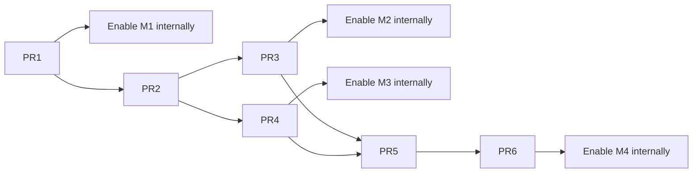

# Milestones and PR Delivery Plan

**Status:** Six planned implementation PRs across four approved usable milestones. These are planning IDs, not opened GitHub PRs.
**Related:** [spec](spec.md), [technical plan](plan.md), [acceptance guide](quickstart.md).

## How work becomes usable

A **merge gate** proves one PR can safely land on main. A **milestone gate** proves the connected feature is usable and may be enabled for an internal cohort. Contracts, backend wiring, UI and tests belong together where they form one reviewable change. Six implementation PRs are the starting plan to reduce repeated CI and review overhead; split further only when the actual diff is difficult to review or exceeds repository limits.

| PR | Scope | Usable result | Depends on |
| --- | --- | --- | --- |
| PR1 | Common sharing foundation plus complete Chat discussion, reusing #1551 Share UI | **M1:** share a Chat and discuss together | Spec/plan |
| PR2 | Prove and build isolated execution | Execution foundation; remains disabled until its milestone is complete | PR1 |
| PR3 | Shared AI queue, controls and UI | **M2:** prompt AI together | PR2 |
| PR4 | Terminal sharing, control and UI | **M3:** use the same terminal | PR2; M2 precedes M3 rollout |
| PR5 | Project inventory, resource adapters and migration | Project foundation; remains disabled until M4 is complete | PR3, PR4 |
| PR6 | Project sharing UI and full integration | **M4:** share an entire project | PR5 |

The user rollout order stays M1 → M2 → M3 → M4. Terminal development can proceed after PR2 without depending on Chat queue internals. Project inventory research can begin earlier, but PR5 integrates the completed Chat/Terminal adapters. Earlier milestones remain usable while later work continues.

Four PRs, one per milestone, are possible but are not the current plan: execution isolation and project migration each retain a separate review boundary. There is no automatic contract/backend/UI split, and internal commits or tasks do not imply additional PRs. All previously required behavior and tests remain in the consolidated scopes below.

## Dependency graph

The graph shows implementation dependencies. Milestone rollout follows the explicit M1–M4 order even where development can overlap. PR2 and PR5 expose no usable participant capability by themselves.

## Universal merge gate

Each implementation PR includes failing tests first, implementation, focused verification, relevant repository checks and current-head Greptile 5/5 before merge. Tests cover permissions, failure and recovery in the same PR as the behavior. No endpoint ships before its auth, body limits and validation are implemented. Fewer PRs do not remove checks or postpone authorization.

Changes are additive and capabilities start off. Personal workflows retain their behavior unless an item explicitly becomes shared; shared items reject unsafe legacy paths. Applicable named surfaces reuse common contracts, permission derivation and controls. A milestone stays closed until its complete flow, error/recovery states and applicable surface parity pass.

Use one manual worktree/PR per planned change, normally from current origin/main after dependencies merge. Use the repository's Graphite workflow if development actually needs stacked PRs. Keep reviewable internal commits for contracts, backend and UI within a PR. Inspect responsibilities above 1,000 additions and follow the repository's 3,000-addition/50-file hard split limit. Make any necessary split from the actual diff while preserving the milestone gate; do not pre-expand the plan back into separate technical-layer PRs.

## PR1 — Complete shared Chat discussion (M1)

**Proposed title:** `feat(collaboration): share Chat history and discussion`

Include shared scope/action schemas; actor/owner distinction; owner-Postgres membership, invitations, capacity/expiry, role changes, revoke/export/lifecycle guards and audit/outbox; platform discovery and actor-preserving HTTP/WS routing, one-use tickets and cohort policy; attributed canonical discussion, private member state, scoped read/search/replay; common invitation/member controls, Shared with me and discussion UI across applicable clients.

Build on merged [PR #1551](https://github.com/HamedMP/matrix-os/pull/1551): extend the common `ChatSharingButton` with **Share snapshot** and **Invite collaborators**, preserve `ChatShareDialog` and owner snapshot preview/consent/copy/revoke, and reuse Web/Electron adapters plus applicable Markdown/attachment/navigation presentation. Live data and file destinations still require scoped adapters. Preserve immutable snapshots, seven-day expiry, exclusions and anonymous read-only relay; do not replace canonical live history or grant membership through snapshot tokens. This reduces UI work inside PR1 and leaves the six-PR structure intact.

M1 is discussion-only. Gate shared AI start, queue, dispatch, steering, retry and approval on every path, including owner legacy routes. Conversion waits for active/pending private work to settle and fences further personal dispatch. This intermediate delivery does not claim final P1 completion.

**Tests and enablement:** contract/frame validation; real-Postgres invitation/acceptance/capacity/revoke races; outbox atomicity; proof tampering and route escape; outsider/viewer rejection; two-account invite/accept/open/discuss/downgrade/revoke/reconnect journey; zero AI runs from discussion; private drafts and state; no sibling/parent reference access. Include an invitee without a primary computer and truthful unsupported-client states. Install exact compatible versions on a disposable VPS-native environment before internal enablement. Owner revoke/export/recovery remains available. Re-run snapshot preview/renewed-consent/expiry/revoke regressions and add tests for the two action labels, token/proof separation, independent snapshot/member revocation, participant publishing denial and scope-safe attachment navigation.

**Rollback:** read_only stops shared mutations while preserving permitted reads/export; off closes participant access. Preserve scopes, grants and history. Do not return shared Chats to unrestricted personal execution automatically. Disabling live collaboration must preserve the existing snapshot feature under its own policy.

## PR2 — Prove and build isolated execution

**Proposed title:** `feat(collaboration): add proven scope-isolated execution`

First run the bounded native/SDK spike against the real supported harness. Record the fixed isolation profile, measured resource quotas, adapter eligibility and public-safe evidence. Only after proof succeeds, build the native supervisor/broker and canonical adapter seam, scoped execution/resume provenance, capability advertisement and lifecycle ownership in this same PR. Failure stops the affected adapter integration while M1 stays usable. Proof-first ordering remains mandatory inside the PR; it does not require a separate spike PR.

**Tests:** no personal home/memory/environment/credentials/socket/process/network access, supervisor injection or private resume reuse; non-root execution, bounded broker calls, unavailable dependency/profile handling, dispatch reauthorization, restart/shutdown and unknown-outcome reconciliation. Use actual disposable Linux host and harness versions. A cwd or mock-only test is not isolation evidence.

**Merge result:** tested reusable execution infrastructure. Shared execution stays disabled until its consumer milestone passes: M2 through PR3, terminal participation through PR4. Existing access-source policy remains authoritative; no new billing/credential product or unrestricted adapter fallback.

## PR3 — Complete shared AI (M2)

**Proposed title:** `feat(chat): add shared AI queue and controls`

Extend the existing canonical queue to 32 pending requests with immutable accepted order, actor-scoped idempotency, one active run and explicit attempt lineage. Add durable approval/cancel/retry decisions, original-actor reauthorization and attribution. Wire PR2's isolated adapter and deliver discussion/AI composer mode, queue, approvals, control/error states and preserved drafts in applicable clients.

**Tests and enablement:** simultaneous idle/busy submissions, 33rd pending rejection, duplicate IDs across actors, revoke-before-start, competing approvals, editor-own cancellation/retry, interrupted dispatch and restart without duplicate external effects. Demonstrate a complete two-account AI round trip and named-surface parity with at least one real supported adapter. Verify exact bundle/profile and existing access-source readiness. An all-disabled adapter catalog does not complete M2. Standalone Chat gains no parent-project files; M1 remains available when M2 is off.

**Rollback:** disable new shared AI requests/dispatch; preserve discussion and truthful paused/interrupted queue state. Fence late commands and follow existing safe running-work recovery. Never resume an unrestricted private session as fallback.

## PR4 — Complete standalone terminal sharing (M3)

**Proposed title:** `feat(terminal): share sessions with controlled input`

Reuse PR2 isolation for eligible sessions launched inside the boundary before sharing. Preserve the same stable session/incarnation/process. Implement actor/role/creator authorization and mandatory lease epochs across input, paste, resize, takeover, stop and every REST/WS path; scoped bounded replay/live output, exit/restore state, stale cleanup and shutdown. Deliver common sharing controls, watch/control labels and applicable Web/Electron/mobile/CLI adapters in this PR.

**Tests and enablement:** real native-host escape probes; simultaneous control acquisition; editor waits for release/expiry while owner can take over; delayed paste/input/resize after transfer or revoke; viewer input/creation denial; editor stop-own rule; stale incarnation rejection; reconnect and buffer saturation without replayed input; same process survives invitation. At least one actual eligible running terminal must work end to end. Existing unrestricted sessions remain private and intact; replacement processes do not count. No dependency on an unmerged terminal-workspace stack is assumed. M2 rollout precedes M3 rollout.

**Rollback:** remove shared input, release control and discard delayed input while preserving process/replay and owner recovery. Emergency off closes participant attachments. Never fall back to unrestricted owner routes or stop a process because an observer disconnects.

## PR5 — Project inventory, adapters and migration

**Proposed title:** `feat(projects): prepare complete sharing transitions`

Combine complete ownership inventory/fingerprint, direct-to-inherited grant effects and readiness with scoped files/search/export/Git adapters, project app-data/bridge and shared layout adapters. Preserve member-private viewport/read state. Include legacy writer fences, staged migration journal, final inventory validation, one authority-publication point, child grant reconciliation and inherited Chat/Terminal creation. Reuse PR3/PR4 adapters.

**Tests:** existing/new child inheritance; external reference versus actual ownership; conflicting item grants; traversal/symlink/moved-root and private-project isolation; viewer indirect-write denial through files/Git/apps/agents/Terminal; app bridge credential isolation; layout versus personal viewport; save/revoke and source-write/cutover races; crash at every journal step, idempotent confirmation and retained backup; changed inventory requires reconfirmation; unmovable owned terminal blocks intact. Prove no partial participant access or two writable authorities. Backend integration and migration tests belong here, not only in PR6.

**Merge result:** complete tested project backend, still disabled until PR6 completes M4. No partial-project pilot or publication through hidden/direct endpoints. Preparation leaves staged content inaccessible. Supported project contents are never silently omitted from inventory.

## PR6 — Complete project sharing (M4)

**Proposed title:** `feat(collaboration): expose whole-project sharing`

Add the single full-inventory confirmation, membership-effect review, inherited-access display, project discovery and lifecycle controls across applicable clients. Wire the complete PR5 transition and every resource adapter; no exclusions or per-child private overrides. Complete the full user journey and integration evidence.

**Tests and enablement:** a mixed project with files, Chat, app/data, shared layout and an eligible running terminal; all roles and applicable surfaces; new-content inheritance; no silent promotion of item-only members; changed inventory/reconfirmation, revoke, export/delete, transfer and recovery. Validate source/destination authority on disposable VPS-native infrastructure. An empty-project fixture or omitted incompatible resource does not complete M4.

**Rollback:** disable new conversions first; keep one authority for existing shared projects, using read_only/off and owner export/revoke/recovery as necessary. Do not revive a writable personal copy or old item grants, discard protected backups, or downgrade to a binary that ignores fences.

## Documentation alongside releases

Four documentation updates remain explicit deliverables in separate `FinnaAI/matrix-os-site` PRs under `content/docs/`. They accompany milestone releases and do not gate implementation PR merges or internal milestone enablement. Their work does not add implementation PRs or dependencies to the six-PR graph.

| Update | Accompanies | Content |
| --- | --- | --- |
| D1 | M1 / PR1 release | Share snapshot versus Invite collaborators, frozen-copy versus live scope, independent revocation, invitations, roles, unavailable AI and recovery. |
| D2 | M2 / PR3 release | Explicit AI requests, ordering, supported context/adapter limitations and run controls. |
| D3 | M3 / PR4 release | Eligible terminals, watch/control, disconnection and owner recovery. |
| D4 | M4 / PR6 release | Whole inventory, future inheritance, transition blockers, backup/export/delete and no partial sharing. |

Keep docs accurate about actual availability and keep participant/host identifiers private. Documentation publication does not change capability policy or promise a later milestone. Track these release deliverables alongside the feature without making them extra implementation gates.

## Promotion and evidence

Each milestone record contains merged PR/head SHAs, installed host/platform/client versions, applicable execution-profile generation, cohort policy revision, named-surface evidence, Postgres race results, limitations and a tested disable/recovery action. The implementation owner assembles it; the feature owner reviews internal enablement. This planning PR creates no implementation PRs, machines, cohorts or deployments.

Promote off → internal cohort → reviewed wider cohort → enabled. Duration follows evidence, not a fixed date. New capabilities start off even if earlier milestones are enabled. Re-run revocation/isolation and complete journeys on the release artifact before public promotion. Disabling a capability never erases data or bypasses scope checks.

## Spec coverage

| Scope | Requirements | Completion |
| --- | --- | --- |
| Common grants, identity, access, lifecycle | FR-001–010, FR-031–038 | PR1 establishes common authority and standalone Chat; PR4 adds Terminal; PR5/PR6 complete project inheritance. |
| Shared Chat | FR-011–019 | M1 discussion/history/attribution/drafts; PR2/PR3 complete M2 AI and controls. |
| Shared Terminal | FR-020–024 | PR4/M3; PR5/PR6 apply project inheritance and transition. |
| Whole project/files/apps/layout | FR-003–006, FR-025–030 | PR5/PR6/M4; no partial-project enablement earlier. |
| Acceptance | SC-001–014 | Relevant criteria at each milestone; every final criterion by M4. |

`/speckit-tasks` should organize implementation tasks and test-first work inside these six PRs. Reconsider a boundary only with concrete reviewability or repository-limit evidence; preserving the current CI/review overhead reduction is part of delivery planning.
