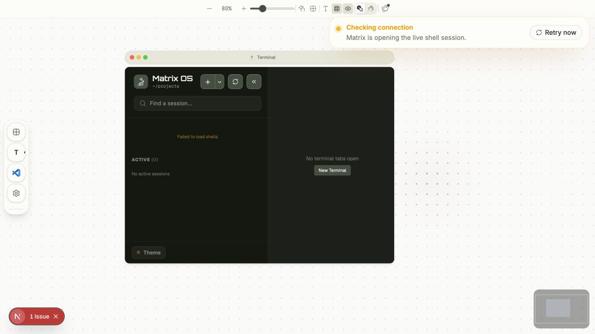
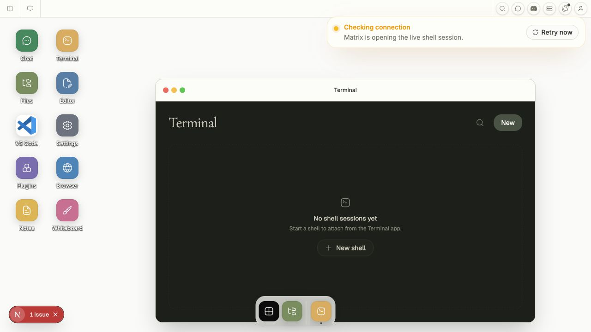
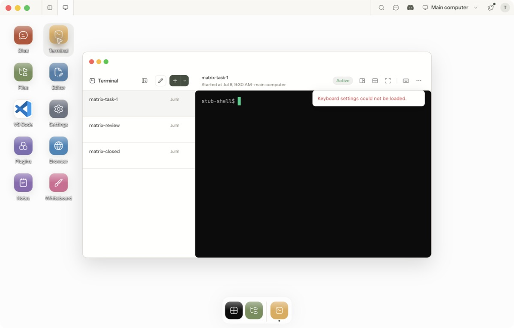
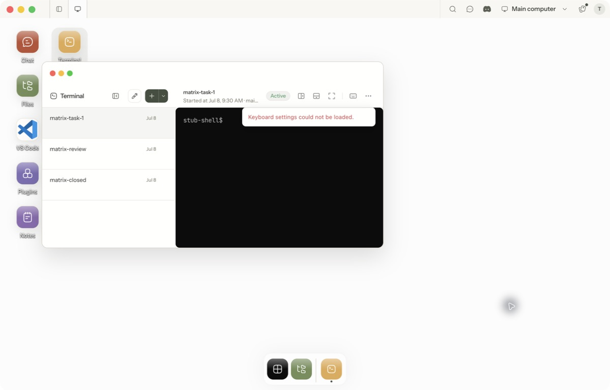

# Window-resizing review evidence

Captured on 2026-09-10 from the PR worktree after the accessible-separator fix. Images are direct captures of the running application interfaces; no generated or reconstructed UI is used.

## Web Canvas

The actual Next.js Web Canvas ran locally with the repository's E2E auth/billing bypass. At 80% zoom, dragging the right edge 80 screen pixels moved its measured DOM x coordinate from 922 to 842, preserving the opposite edge. The outer controls remain distinct from the Terminal sessions divider. All eight resize controls appeared by accessible name.

## Web Desktop

Dragging the northwest handle moved its measured DOM position from (121, 59) to (337, 172), shrinking Terminal below its former 1040 × 680 launch minimum while retaining the opposite corner. The actual Next.js Web Desktop supplied the frame and window store.

Web capture limitation: no gateway was running on port 4000. The connection notice, empty Terminal state and unavailable-session message are expected in this isolated run. These screenshots establish frame geometry and interaction, not authenticated backend persistence or live PTY behavior. Persistence and viewport recovery are covered by the named automated store suites.

## Electron Desktop

Built with `electron-vite build` after compiling the workspace brand package, then launched the real Electron executable with `OPERATOR_USER_DATA_DIR` pointing to a disposable profile and `OPERATOR_GATEWAY_URL` pointing to `tests/e2e/desktop/fixtures/stub-gateway.ts`. No owner credentials or real sessions were used. The window's left edge moved from approximately 192 to 82 while its right edge stayed near 1006; a subsequent southeast resize reduced the right edge to approximately 753 and bottom edge to 488. The accessibility tree exposed all eight named resize splitters outside Terminal content.

Clicking 6px beyond the right window edge left Terminal visible. Clicking 32px beyond it hid the window; selecting its running-app icon restored it. This checks the actual Electron Desktop background handler and frame composition. Automated placement tests cover exact overflow/clamp limits and each direction.

Electron capture limitation: the test gateway emits `stub-shell$` and does not implement keyboard-settings retrieval, explaining the visible settings error. It exercises rendered Terminal content without a real VPS PTY. Native Browser/VS Code WebContentsView containment and a signed installer were not exercised in this review run.

Web Mobile and Native Mobile have no floating-window controls in this change. Their N/A rationale and reviewer sign-off request are in the proposal's surface table.
