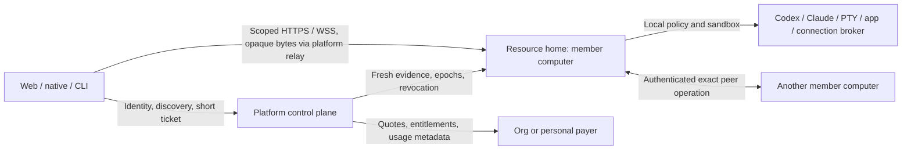

# Implementation plan: direct collaboration on member computers

**Branch:** `codex/org-collaboration-spec` · **Date:** 2026-09-20
**Baseline:** inspected main `94985f02e`; rebase and verify changed seams before implementation.
**Status:** Revision for review. No runtime implementation, live Clerk changes, billing activation or deployment performed.

## Result

Ship one coordinated replacement of collaboration transport and authorization. The platform coordinates identity, routing, generations, quotes and sponsorship; registered member computers serve canonical data, shared Codex/Claude execution, worktrees, apps, PTYs, integration actions and peer transfers. The platform relay is a retained transparent transport with no authorization, parsing or payload logging; it is not a compatibility path. No pooled organization-wide computer or rollout fallback to V1 authorization. No sharing outside an organization, and no release flag or rollout cohort: the organization is the only gate.

Reuse current authority/transition/Chat/worktree/provider/integration seams. Replace the current platform payload forwarding path and the standalone-only shared-AI adapter's capability limitations through tested adapters. Do not rewrite canonical Chat, provider V3 or worktree state into separate collaboration stores.

## Opinionated release boundary

The default is one owner-hosted project group Chat, one owner-selected AI source and owner-approved Git/PR operations. Collaborators join and discuss without provisioning a computer or configuring AI/Git accounts. Additional coding Chats/worktrees and advanced capability restrictions are available but not the join flow. Every share is scoped to one organization; specific members and admitted guests are audiences within it, and there is no person-to-person path. The confirmed 525 collaboration interaction model is the UI baseline; 124 adds state and controls inside that chrome, and any change to the model is a product decision recorded in spec.md, not an implementer choice. Participant AI accounts and copy-and-continue are future scope. Existing member-computer reassignment/data migration remains distinct from cloning a project for independent work.

Member AI submission is enabled per organization through Clerk organization public metadata and may be restricted per project by the owner; both default to owner-only. When enabled, members submit on the owner's configured source of any kind. Matrix surfaces the source kind and records the owner's provider-terms acknowledgement; it does not enforce provider eligibility. This is a recorded product decision (R4).

## Technical context

TypeScript strict/ESM, Node 24+, Hono HTTPS/WSS, Zod 4, Kysely/Postgres, Next.js/React, Electron, Expo and existing CLI/sync daemon. Use enrolled asymmetric runtime identity, proof-bound scoped sessions and OS-enforced per-run isolation. Provider APIs remain external inference; the existing managed Matrix AI service and vendor-hosted connectors are named exceptions to local execution custody, not collaboration payload relays.

Storage: platform metadata/billing only; canonical records/files and connection credentials on the appropriate member computer; existing object storage for owner-governed backups. Shared content traverses the platform relay as opaque bytes and must not be parsed, authorized, logged or traced there. Control metadata and membership checks still impose bounded platform cost.

## Runtime wiring

Platform bootstrap registers the Clerk membership projection, runtime endpoint/key directory, ticket issuer, control stream/fences and discovery. Quote, assignment, sponsorship and Matrix group services are deferred. Gateway bootstrap registers direct verifier/session store, current policy resolver, local resource catalog, isolation supervisor, run/account binder, local connection broker, worktree leases, transfer journal, resource/peer routes, then event fanout. Resolve dependencies at registration; unavailable dependencies deny affected capabilities. Register exact WS query-ticket paths. Shutdown fences admission, drains sessions/processes/staging/outboxes, and closes owned pools.

Browser clients hydrate resources directly after metadata discovery, including app iframe assets/bridges and downloads. The client transport dials the origin the resource directory returns for the resource home, never the user's selected personal runtime and never a hardcoded origin; in this release that origin is the platform relay. Endpoint changes require a fresh generation-bound ticket. Home registration reuses existing customer-VPS enrollment and routing; every enrolled VPS is eligible. Three rules keep a later direct upgrade protocol-compatible: clients resolve origins from the directory; tickets bind logical runtime ID and generation, not a TLS hostname; the home verifies tickets identically regardless of ingress. Per-home hostnames, browser-trusted certificates, physical/NAT computers and tunnels/mesh are deferred.

## Authority and execution decisions

- Clerk owns membership/coarse custom permissions; Matrix local grants own folder/app/Chat/task/connection selectors. Deny-wins restrictions and ceilings apply across every path. Migration preserves old allows without auto-granting new actions.
- Organization membership or guest admission is the only gate. `MATRIX_COLLABORATION_ENABLED`, the `collaboration_rollout_policy` cohort table and the gateway policy client are deleted in S20 before contracts freeze, so no later packet models a personal audience, departure-surviving grant or cohort branch. Wiring always constructs; missing signing/origin configuration fails closed.
- Fixed-expiry evidence with signed invalidation/control and local fences replaces per-payload platform authorization. The 60-second external removal goal is a measured provider gate, not a webhook promise.
- Resolve one owner-selected V3 binding per project and pin it per run, preserving requesting actor attribution. Reuse existing owner account settings; do not build participant account profiles, routing or quota rotation. Submit mode is org-enabled members or owner-only; it is an owner-side policy, not a provider-derived state.
- Both Codex and Claude shared execution must use the same authoritative queue/history and scoped sandbox. Verify actual harness/native subscription eligibility. Use a project/Chat-scoped session, never the owner’s private session. Recreate it on account/root/audience changes unless safe continuation is proven.
- Joining the default group Chat reuses its stable execution-root binding; optional additional coding Chats normally use separate worktrees. Lease conflicts serialize writers. Distinct worktrees can run in parallel. Owner Git identity/forge credentials are held by a broker, and exact commit/merge/push/PR operations require owner approval; participant attribution remains in audit. Restrictive folder access requires a filtered execution view and mediated Git, because raw shared object stores expose other paths/history.
- Integration grants name connection, tool/action and upstream scope. Broker holds credentials and rechecks before calls. Exporting a secret to arbitrary child processes defeats scoped grants and is prohibited. Approval never substitutes for a missing capability.
- A Chat's data ceiling covers its audience; output/artifact publication cannot widen input sensitivity without explicit approved release. Readiness exposes missing dependencies/accounts/permissions before a run, with an exact access request flow.
- One resource home at a time. Direct peer transfer uses staging, source fence, directory generation CAS, target activation and retained restricted recovery copy. No writable peer replicas or process/session transfer assumptions.

## Sol work packets

Each packet has failing tests, exact file responsibilities and exit criteria in tasks.md. IDs below replace the previous S00–S24 assignment ledger; do not use the superseded mapping. All packets join the same release gate; order is implementation dependency, not separate product rollouts.

| Packet | Responsibility | Dependencies | Lane |
| --- | --- | --- | --- |
| S00 | Baseline/provider/Clerk/TLS/isolation probes | None | Coordinator |
| S01 | Mechanical extraction of large platform/gateway seams | S00 | Foundation |
| S02 | Direct identity, capability, funding and peer contracts | S00,S01,S20 | Contracts |
| S03 | Clerk membership projection, freshness and control epochs | S02 | Identity |
| S04 | Local granular grants, ceilings and history audience rules | S02 | Authority |
| S05 | Transparent relay, home sessions, tickets and control transport | S03,S04 | Transport |
| S06 | Direct clients, WS and resource routing | S05 | Clients |
| S07 | OS sandbox, task profiles and publication boundaries | S04,S05 | Runtime |
| S08 | Single owner source and funding eligibility | S02,S04 | Owner AI source |
| S09 | Shared Codex/Claude execution and resume isolation | S07,S08 | AI execution |
| S10 | Shared Chat worktrees, leases, review and merge | S09 | Worktrees |
| S11 | Local/peer integration broker and action delegation | S07,S08 | Integrations |
| S12 | Direct files/apps/project adapters and sync | S06,S07 | Resources |
| S13 | Peer resource transfer and recovery (deferred from V1) | S10,S11,S12 | Transfer |
| S14 | Org payer, invite quote and member assignments (deferred from V1) | S03,S08 | Billing |
| S15 | Ready-to-work Share UI | S06,S10,S11,S12 | Shared UI |
| S16 | Managed Matrix group text (deferred from V1) | S03,S04 | Messaging |
| S17 | Native Mobile and CLI parity | S15 | Surfaces |
| S18 | One-shot migration and legacy serving-path removal | S17 | Cutover |
| S19 | Full release evidence and public docs | S18 | Coordinator |
| S20 | Org-only precondition and release-gate removal | S01 | Foundation |

S13, S14 and S16 are deferred from V1 and are not on the release path; their tasks stay in the ledger for the later administration release. Packet numbers are stable labels, not execution order. S20 executes immediately after S01 and before S02 so that the rollout gates and person-to-person paths are gone before any contract is frozen; S18 then removes only the proxy, WebSocket forwarding and V1 fallback. Parallel work is allowed only for independent file ownership after frozen contracts. Each code packet starts RED → GREEN → refactor; use real Postgres for leases, policy and migrations. Registration/shared exports/lockfile belong to coordinator. Keep new files focused and under 500 lines; extract existing 1000+ line files before adding behavior. Use small reviewed stacked PRs while keeping production collaboration activation gated until S19.

## Cutover and rollback

1. Verify all required provider modes, direct connectivity, sandbox restrictions and applicable clients against the candidate protocol.
2. Snapshot owner metadata/data and control metadata; inventory live scopes, pending invites, exact old action ceilings, accounts, connector custody and dirty worktrees. Apply the S20 disposition to any person-to-person record (terminate with notice or owner re-homes into an organization); zero is expected. No other user data cleanup is inferred.
3. Enter collaboration maintenance: reject new mutations/runs; drain/cancel running work with explicit states; freeze directory updates under a migration generation.
4. Run idempotent imports and compare IDs/counts/authorization; ambiguous or offline scopes are marked unavailable with recovery steps. Finish direct-capable connector migration/reconnect; do not retain central execution fallback for those connectors.
5. Install compatible clients/homes/control services, verify endpoint keys and policy snapshot acknowledgement, then activate the new generation. Release-level checks prove the relay performs no authorization, policy lookup or payload logging, and that V1 proof/ACL paths, the rollout flag and the cohort policy are absent and old clients get upgrade-required.
6. Resume collaboration only after the full acceptance matrix. Backup retention and recovery jobs are bounded and documented. Failed cutover keeps collaboration unavailable or returns to a compatible direct build; never activate old ACL or content forwarding as rollback.

This revision updates the existing specification PR. No paid test machine, provisioning or production rollout is executed by this planning task. Implementation validation should use disposable enrolled VPSes with separately authorized spend. One product cutover does not require a single giant code PR.

## Constitutional and release gates

Owner-controlled storage and explicit data/payer consent; headless shared contracts; TDD and exact ingress auth matrix; Postgres-only transactional writes; defense in depth beyond model prompts; all-surface business semantics; public documentation in separate `FinnaAI/matrix-os-site/content/docs/` PR. Org-owned data on a member computer requires org-controlled recovery; personally administered hosts cannot manufacture that guarantee. Missing prices disable affected paid selection; unsupported source eligibility is visible and never replaced by a personal payer. Live probe failures must be recorded and resolved before claiming the corresponding capability delivered.

## Later extension boundary

Participant AI account selection and independent Git-based copy-and-continue are deferred. Preserve stable run source IDs and resource provenance fields only where already required; do not implement dormant per-actor credential stores or clone endpoints. Future copy pins commit plus explicitly selected dirty state, uses fresh destination permissions/accounts, handles LFS/submodules and avoids exporting hidden history. It never moves the source authority or reuses its credentials.
