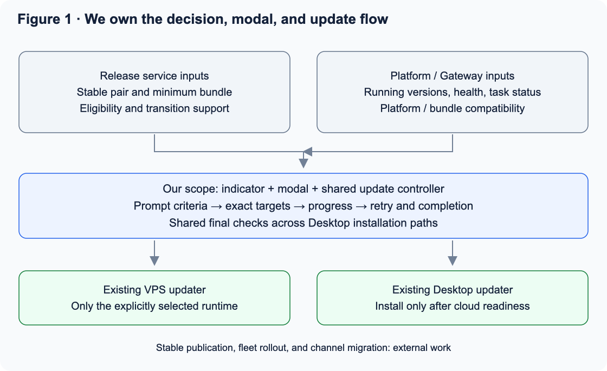
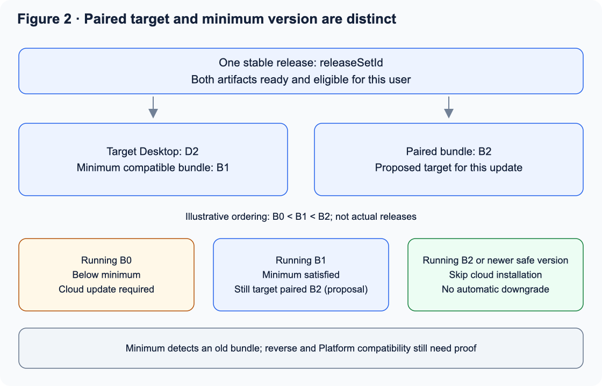
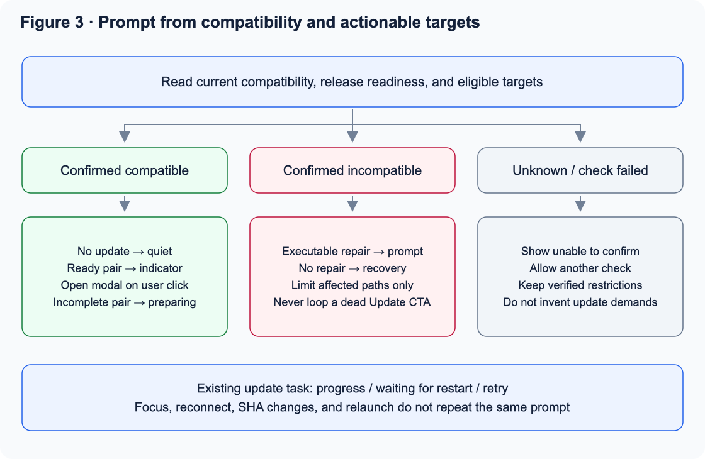
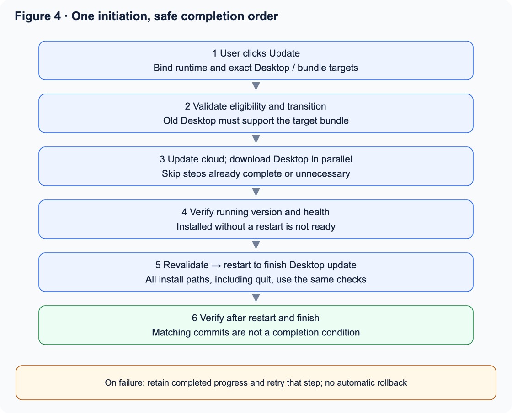
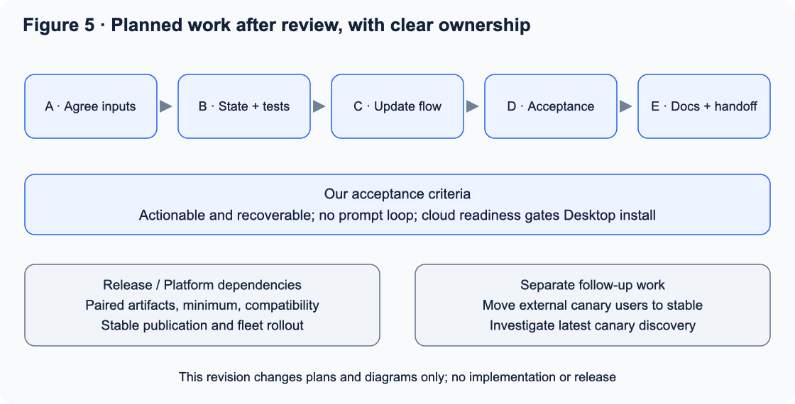

# Electron Desktop update modal and coordinated upgrade plan

Meeting revision · 2026-09-21 · Status: proposal only; implementation has not started

Formal requirements: [spec.md](spec.md) · Tracking: [OM-287](https://linear.app/matrix-os/issue/OM-287). The specification adopts the reviewable defaults previously left open in this supporting plan.

This revision follows the September 21 release meeting and replaces the earlier recommendation to ship stable releases independently. Our main scope is the Electron Desktop update indicator, modal, and their shared update state and orchestration. Meeting decisions, proposed implementation details, and external dependencies are distinguished below.

## 1. Agreed direction

**Coordinate Desktop and VPS bundle for every stable release. One update action in Desktop starts both updates, and Desktop installation completes after the cloud computer satisfies compatibility requirements. Commit identity is diagnostic metadata, not a reason to open the modal.**

| Meeting decision | Implication |
|---|---|
| Release Desktop stable and bundle stable together; re-pin stable and roll out each time | The modal consumes a ready release pair; publishing and rollout remain external work |
| Desktop update also starts the bundle update in the background | One entry point and one flow, without two separate update procedures |
| Each Desktop version declares its minimum compatible bundle | Check requirements for both the installed and target Desktop |
| Platform is stable only; bundle and Desktop use stable / canary | External users use stable; only internal users can switch Desktop channels; mapping existing dev naming remains to be agreed |
| Include Platform ↔ VPS mismatches | The modal consumes an authoritative compatibility result for this relationship too |

Coordinated publication is a release policy; compatibility is a runtime condition. Versions and SHAs need not match. Simultaneous publication does not make installed clients update simultaneously, so older clients, partial updates, failures, and offline runtimes still need explicit handling.

## 2. Our scope

| Work | Responsibility |
|---|---|
| Indicator, automatic prompt criteria, modal copy, dismissal and deduplication | Ours |
| Progress for both components, errors, retries, completion criteria | Ours |
| Shared controller using existing VPS and Desktop update capabilities, exact targets, and outcome verification | Ours, with interface gaps coordinated with their owners |
| Shared final admission checks for Settings, menus, and installation on quit | Our necessary integration work; not an OTA packaging or download rewrite |
| Paired release metadata, minimum bundle, reverse and Platform compatibility, candidate eligibility | Release / Platform / Gateway dependencies |
| Stable publication, fleet rollout, moving external canary users back to stable | Release and operations work, outside modal execution |
| Canary failing to discover the latest Desktop version | Separate investigation; OTA versus full-package behavior remains an unconfirmed hypothesis |

Full protocol negotiation, a capability catalog, a fixed 90-day support policy, and CLI / Native Mobile updater changes are deferred. They are neither prerequisites for this modal work nor agreed meeting decisions.

## 3. Minimum inputs for the modal

Propose a consistent release snapshot from the release service rather than independent reads of two changing latest pointers. Field names below are proposals, not claims about existing APIs.

| Input | Purpose |
|---|---|
| Installed Desktop version, artifact identity, and `minBundleVersion` | Evaluate the current installation; legacy versions need a verified mapping |
| Target Desktop version, artifact ID / digest, and `minBundleVersion` | Evaluate the new Desktop; bind requirements to the actual downloaded artifact |
| `releaseSetId` and paired bundle target | Identify one coordinated stable release, separately from its minimum compatible bundle |
| Stable runtime ID, running bundle, installed bundle, health | Downloaded or installed without a service restart is not ready |
| Eligible candidates and check status | Server filters channel, entitlement, rollout, platform/architecture, and withdrawals; a failed check is not an empty catalog |
| Desktop ↔ bundle and Platform ↔ bundle compatibility | compatible / incompatible / unknown, with safe reason codes and affected scope |
| Intermediate combination support | Whether the old Desktop supports the target bundle and that bundle supports the current Platform |

**A minimum version detects an old bundle. It does not establish that every newer bundle supports an older Desktop, or protect against breaking Platform changes.** Release owners must guarantee and test supported older Desktop clients against new bundles. Unknown and unsupported combinations remain explicit; `bundle >= minimum` is not complete proof of compatibility.

Compare versions only within each component using its canonical ordering rules. Do not compare Desktop version numbers with bundle versions, or infer compatibility from lexical ordering, build times, or commit ancestry.

Before exposing a stable candidate as actionable, propose verifying that both paired artifacts are published and available to this user. During rollout or distribution delays, return “Update is being prepared” instead of an update button that cannot finish. Pairing does not require identical SHAs.

Inaccessible canary / dev releases never enter candidate selection or ordinary-user copy. A dev-built artifact can become stable after official promotion; eligibility follows publication policy rather than its original build label. Revalidate installation eligibility server-side; hiding a channel selector is not authorization.

## 4. Prompt and modal behavior

Evaluate actual user impact, then whether a plan is executable: its targets are installable, resolve the issue, and have safe intermediate states. Network failures, missing metadata, and an update already in progress are separate states.

| State | Entry point / modal behavior | Primary action |
|---|---|---|
| Compatible; no eligible stable update | Quiet; Settings says “Your current version works. No updates available.” | None |
| Compatible; complete stable release available | Indicator; modal opens on click without automatic interruption | Update |
| Confirmed incompatibility; executable repair | One clear prompt describing impact and which components change | Update and repair |
| Confirmed incompatibility; no eligible repair | Recovery entry; “No compatible update is currently available.” | Check again / switch cloud computer / contact support |
| Current installation works; release pair not ready | No upgrade demand; explain preparation during an explicit check | Check later |
| Check failed or compatibility information missing | “Unable to confirm update status”; preserve verified restrictions without inventing an update requirement | Retry check |
| Updating / waiting for cloud reconnection | Existing task progress; focus and reconnect do not open another modal | Minimize |
| Cloud ready; Desktop downloaded | Explicitly state that Desktop will restart | Restart to finish |
| A step failed | Show the failed step and completed progress, not “Both up to date” | Retry that step |
| Running versions and compatibility verified | Complete the task and clear its notice | Done |

A feature-specific incompatibility limits the affected feature. Unsafe core connections keep a recovery view; dismissing the modal cannot bypass restrictions. No available repair does not authorize unsafe operations.

Suggested copy: “This update will update this cloud computer and the desktop app. Your cloud computer will briefly reconnect, then you’ll restart the desktop app.” Background upgrading removes a second procedure while retaining visible cloud progress and errors.

Persist bounded, expiring dismissal records keyed by account, stable runtime ID, reason, target release, and severity. Reconnects, focus, SHA changes, and app relaunch do not automatically reopen the same notice. A new repair target or increased impact can justify another prompt; check failures do not increase severity.

## 5. One action, two components

Propose bundle-first completion, followed by Desktop installation. Release owners must prove that the old Desktop can use the new bundle during this transition. Otherwise stop the plan and require compatibility support or a bridge release. Testing only the final pair is insufficient.

1. **Bind targets.** Capture account, runtime ID, current versions, release set, exact Desktop artifact and minimum bundle, and exact bundle target. Verify eligibility, release readiness, Platform compatibility, and the intermediate combination.
2. **Start one task.** The user clicks Update once. Desktop downloading may run alongside the VPS update; installation and restart wait for cloud readiness.
3. **Update the cloud computer.** Use the existing exact-version interface for the selected runtime. Skip installation if it already runs the paired target. Never automatically downgrade a newer, verified-compatible bundle merely to match the pair.
4. **Verify cloud readiness.** Services are healthy, the running version meets the plan, and the target Desktop minimum is satisfied. Installed metadata with old services still running is insufficient. Bound waits and surface a recoverable timeout.
5. **Finish Desktop.** Once the download is verified, offer Restart to finish. Immediately before installation, revalidate the same target, eligibility, runtime identity, and readiness. The first click initiates both updates; the user retains control over restart and unfinished work.
6. **Verify after restart.** Complete only when actual Desktop and runtime identities satisfy the plan and both compatibility relationships pass. Recover task state on failure. SHA equality is not a completion condition.

**Proposed default for review:** if the bundle meets the minimum but trails this release’s paired stable target, update it to the paired target as part of the operation. This follows the meeting’s coordinated upgrade direction. Retain a newer, verified-compatible installed bundle. The minimum and the paired target serve different purposes.

If Desktop already has the current release and VPS is behind, run only the cloud steps. If rollout already updated VPS, complete only the Desktop steps. Do not reinstall unchanged components. A repair is complete when its compatibility issue is resolved; unrelated optional updates do not keep it marked as failed.

## 6. Failures, concurrency, and installation paths

| Situation | Rule |
|---|---|
| VPS update or health verification fails | Pause Desktop installation; retain downloads and allow status checks and cloud-step retry |
| VPS succeeds; Desktop fails | Keep the successful cloud step; retry Desktop without automatically downgrading VPS |
| Request times out after possible server acceptance | Query the same task and running version first; require an idempotent task ID rather than blindly reinstalling |
| Feed changes, target is withdrawn, or eligibility changes | Invalidate and recheck; never silently substitute another Desktop artifact |
| Runtime / account changes | Bind subsequent actions to the captured target; pause Desktop installation until revalidation. Continue tracking an accepted cloud job rather than pretending it was canceled |
| Another client or server rollout updates the runtime | Reuse or observe its task; server-side coordination prevents conflicting installs |
| Modal is minimized or app exits | Cloud work is not canceled; restore progress later; quitting cannot bypass installation admission |
| No selected runtime or runtime is offline | Desktop checking/downloading may proceed; wait when readiness cannot be verified, without claiming compatibility or completion |
| Desktop connects to multiple runtimes | Upgrade only the explicitly selected computer by default, never the whole account silently. Release support guarantees cover other supported runtimes; block and explain known conflicts |

Indicator, modal, Settings, menus, and installation on quit share the same decision and admission checks. Electron main owns final installation admission. Disabling a renderer button is insufficient. Failed revalidation leaves the download staged; normal app exit must not secretly install an unverified target.

Security auto-updates and fleet rollout can occur first, so recovery always reads actual state. The modal does not own release authorization or automatically roll back bundles or user data. Preserve drafts, sessions, and native view state.

## 7. Minimal Platform compatibility integration

The modal does not update Platform. Platform / Gateway provides compatibility for current and candidate bundles and eligible repair targets. The modal reuses the same repairable / no repair / unknown behavior.

Platform owners must preserve authentication, update discovery, task status, and recovery for older bundles during transitions. Incompatible business APIs still need an authorized recovery path. Authentication failures must not be mislabeled as version mismatches. Platform-related changes follow the meeting’s coordinated stable release and rollout policy.

A Desktop minimum bundle field cannot prevent Platform-first changes from breaking old VPS runtimes. Control-plane backward compatibility, deployment order, and the support matrix are external deliverables; the modal accurately presents and invokes their results.

## 8. Planned delivery sequence

| Phase | Planned output | Completion criterion |
|---|---|---|
| A · Agree inputs | Fields, version ordering, legacy mappings, pair readiness, intermediate compatibility | Real input and error examples suitable for the modal |
| B · State and regressions | Failing tests first; replace SHA decisions with compatibility plus executable targets; shared indicator / modal state | No impossible upgrade demands; unknown is neither compatible nor outdated |
| C · Coordinated update | Existing interface integration, exact targets, progress recovery, retry, installation admission | Every installation path respects cloud readiness |
| D · Product acceptance | Real stable releases and an ordinary restricted account; update, reconnect, failure, quit/reopen; human modal review | One initiation updates both components; no repeated notice loop |
| E · Documentation and handoff | Separate documentation PR in `FinnaAI/matrix-os-site`, under `content/docs/`; release dependencies and evidence | User docs explain impact and recovery; release owners handle coordinated stable delivery |

Only plan documents and illustrations are updated now; none of these phases has started. Refresh the September 18 investigation before implementation. Relevant files include `RuntimeCompatibilityGate.tsx`, `CompatibilityUpdatePanel.tsx`, `compatibility-repair.ts`, `use-compatibility-repair.ts`, Electron `updates.ts` / `update-quit.ts`, and `update:install` IPC.

Earlier research found that commit differences can open the modal with no candidates, installation can recheck latest and substitute targets, and quitting can also trigger installation. These findings belong to the September 18 baseline and were not revalidated against production this turn; see [research.md](research.md). Both peers advertising protocol 1 is not sufficient proof of compatibility.

## 9. Essential acceptance cases

| Case | Expected outcome |
|---|---|
| Different SHAs, compatible, no eligible stable update | No required-update modal and no hidden canary / dev target |
| New Desktop, old VPS, eligible repair | Only necessary cloud steps; finish after verifying the running version |
| New VPS, older Desktop confirmed compatible | No forced update from version differences; ordinary update indicator is allowed |
| VPS is too new and incompatible with old Desktop | Repair Desktop using an authoritative result; otherwise recovery, not an incorrect “bundle too old” diagnosis |
| Both need updating | One initiation; cloud health verified before Desktop installation; intermediate pair tested |
| Both individually have no update, but the pair is incompatible | Explicit no-compatible-update state without a recurring Update button |
| Paired bundle unpublished or inaccessible | Preparation state if currently usable; no-repair state if incompatible; neither offers a dead CTA |
| Bundle installed while old processes still run | Keep waiting; do not restart into the new Desktop early |
| Changed target, runtime switch, timeout, duplicate clicks | No substituted artifact, wrong-computer update, or duplicate task |
| Installation outside modal or on quit | Same checks; no minimum-bundle bypass |
| Platform and bundle incompatible | Correct reason and server-provided repair; no incorrect Desktop reinstall demand |
| Quit/reopen or retry after failure | Recover actual progress, preserve completed steps, drafts, and sessions |

Beyond pure state tests, cover renderer → IPC → main-process admission and Gateway task integration end to end. Mock success is not actual OTA / VPS acceptance. Release owners also test both new/old directions and Platform transition combinations.

## 10. Interface boundaries and review items

These are design constraints; this revision does not add endpoints or change permissions.

| Interface / boundary | Authorization requirement | Public |
|---|---|---|
| Runtime information and update status | Existing identity verification and runtime access authorization | No |
| Exact VPS upgrade / task status | Runtime management authorization, server eligibility checks, idempotency and mutual exclusion | No |
| Audience-specific candidates / compatibility | Server derives eligibility from identity, not client-claimed channel permissions | No |
| Desktop installation IPC | Trusted window, strict payload validation, main-process target and precondition checks | No |
| Public stable download information, if retained | Public download access grants no VPS management rights; exclude restricted candidates | Per distribution policy |

Prefer existing APIs. Mutations require body limits, validation, timeouts, safe reason codes, and diagnostic logs. Progress and dismissal records need bounds and cleanup. System artifact updates must not overwrite owner data.

Async review must settle: who supplies paired release snapshots; how legacy Desktop minimums are mapped; whether to adopt section 5’s paired-target rule when the minimum is already satisfied; support for old Desktop / new bundle and Platform / old bundle; multiple-runtime and offline installation policy; and stable / canary / existing dev naming. Missing safety inputs prevent a production-readiness claim.

Separate release and operations tasks remain: roll out the latest stable bundle with the coordinated Desktop release; identify external canary users and arrange stable reinstalls; investigate canary discovery; incorporate the existing broader Platform / VPS compatibility proposal. None was executed and no users were contacted in this turn.
