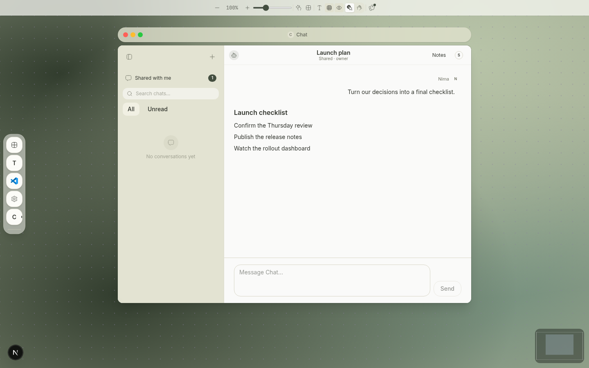

# Canvas Chat Evidence

Current-head artifacts are generated by `shell/e2e/shared-chat.spec.ts` and copied here for PR review.

| Artifact | Viewport/surface | Demonstrates |
| --- | --- | --- |
| [`web-canvas.png`](web-canvas.png) | 1440×900 Canvas | Shared Chat inside the ordinary Canvas Chat window, attributed human prompt, normal AI response, ordinary composer, restrained header controls |
| [`web-desktop.png`](web-desktop.png) | 1440×900 Web Desktop | Native Chat shell and stable session chrome |
| [`responsive-web.png`](responsive-web.png) | 390×844 responsive web | Compact title, Notes/access controls, readable transcript, and composer without horizontal overflow |

Fixture actor is the owner. Viewer, revoked, unavailable, queue, and feature-off behavior is covered by component/route tests; those states still need distinct PR-upload captures if required by review.
