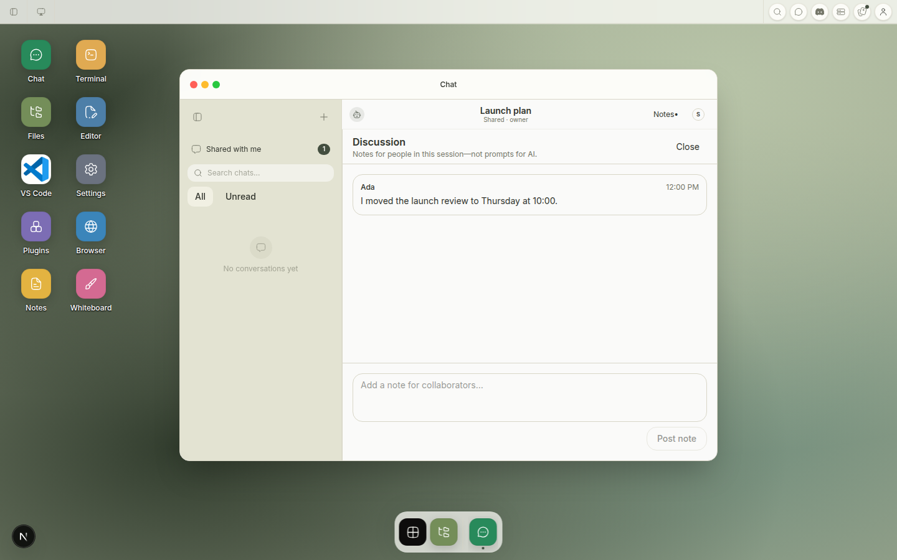

# Canvas Discussion Evidence

Generated by `shell/e2e/shared-chat.spec.ts` from the same canonical shared Chat fixture.

| Artifact | Viewport/surface | Demonstrates |
| --- | --- | --- |
| [`web-desktop.png`](web-desktop.png) | 1440×900 Web Desktop | Opaque right-side human-only drawer over the unchanged Chat footprint |
| [`responsive-web.png`](responsive-web.png) | 390×844 responsive web | Full-height responsive layer, distinct note composer, readable attribution, and retained native shell |

Escape, light dismiss, focus return/containment, viewer read-only behavior, private draft isolation, and reduced-motion-safe classes are asserted in focused UI tests.
