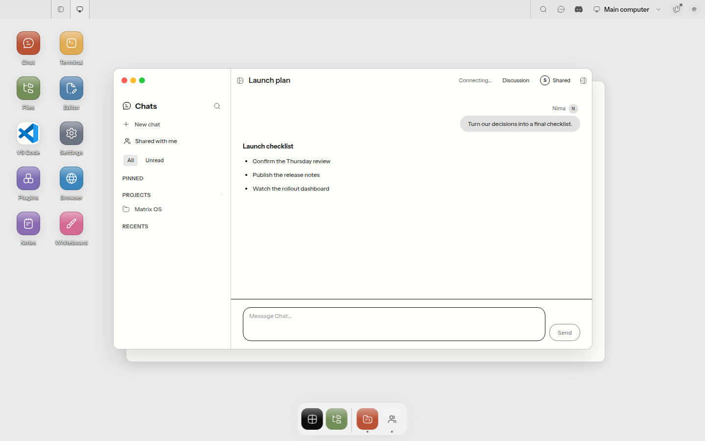
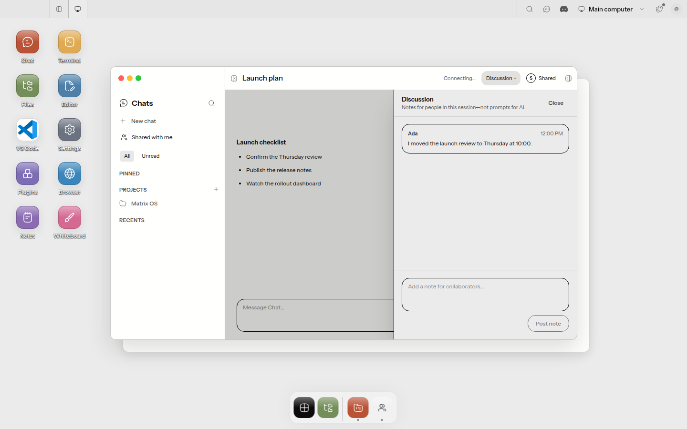

# Cross-Surface Evidence

| Artifact | Surface | Demonstrates |
| --- | --- | --- |
| [`../canvas-chat/web-canvas.png`](../canvas-chat/web-canvas.png) | Web Canvas | Native Chat window composition |
| [`../canvas-chat/web-desktop.png`](../canvas-chat/web-desktop.png) | Web Desktop | Native desktop-web Chat composition |
| [`../canvas-shared-with-me/web-desktop.png`](../canvas-shared-with-me/web-desktop.png) | Web Desktop | First-class discovery row, pending badge/actions, accepted resource, and native open action |
| [`../canvas-chat/responsive-web.png`](../canvas-chat/responsive-web.png) | Responsive web, 390×844 | Compact native session chrome |
| [`../canvas-discussion/responsive-web.png`](../canvas-discussion/responsive-web.png) | Responsive web, 390×844 | Full-height discussion treatment |
| [`electron-chat.png`](electron-chat.png) | Electron, 1440×900 | Shared with me opens a canonical Chat tab with title and controls in the native top bar |
| [`electron-discussion.png`](electron-discussion.png) | Electron, 1440×900 | Opaque discussion drawer overlays the canonical Chat without a standalone collaboration page |

Commands: `shell/e2e/shared-chat.spec.ts` through Playwright's dev-server configuration, and `tests/e2e/desktop/shared-chat.e2e.test.ts` through Xvfb/Vitest Electron configuration.

No physical Expo device is attached to this Linux runner. Mobile parity is covered by 46 Jest tests, but a materially distinct native-device capture remains required before the mobile layer can be marked review-ready.

