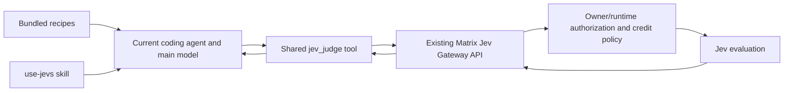

# Jev recipes + use-jevs / 设计

Updated: 2026-09-21. [Governing spec](spec.md). Proposed architecture, not implemented.

## Scope / 产品范围

首版只做三个 recipes、一个共享 Jev tool 和 `use-jevs` skill。全部 Jev 请求走我们的 AI Gateway，使用执行用户的 Matrix AI 额度。主模型可以继续用个人账号，二者的鉴权与计费独立。

用户通过现有 recipe/skill 入口使用，不填写 TypeSafe key、不配置 MCP URL、不选择 Jev 费用来源。MCP 是复用现有工具分发能力的内部接入方式，不新增独立 Jev 连接管理产品。个人 key、Ultrafast、原生 OS 导航均不在首版范围。

## Architecture

The authenticated runtime/run supplies owner authority outside the model's arguments. Main-model personal credentials never become Gateway credentials. Gateway service keys never enter recipe text, skill instructions, tool arguments, UI, logs or exports.

Reuse `matrix-integrations` or the equivalent existing trusted tool registry for the coding agent. Prefer one built-in tool registration over a custom remote-MCP server record and settings UI. Resolve dependencies at registration and advertise readiness honestly. The skill describes when/how to use the tool; it is not an alternative HTTP client carrying a global API key.

## Shared tool

Proposed name: `jev_judge`. Input is a strict Zod 4 object containing text state and uniquely identified choice/score/noul questions, with an optional operating confidence threshold. Recipes initially use only the question types they need. Normalize the actual Gateway evaluation response into stable question IDs, typed answers, available confidence/usage, model version, latency and completed/unavailable status. Validate IDs, choice membership and finite probabilities; do not invent confidence for a probability-only result.

No owner, billing source, key, endpoint or approval arguments. Fixed server-configured model and route, never user-controlled URLs. Initial product limits: 32 KiB text, 64 KiB total request, 1–16 questions, 2–32 choice options, 2–10 score levels, 128 KiB response; default confidence preference 0.80. Low/missing confidence or invalid output hands back to the main agent. The main agent interprets the decision and retains action authorization.

10-second external-call deadline, abort propagation, redirects rejected and bounded streamed responses. Reuse Gateway rate/concurrency controls; initial proposed ceiling two concurrent calls and 30/minute per owner, adjustable through existing policy. No automatic inference retries.

## Gateway integration and accounting

First identify Hamed's existing Jev API, authentication scheme, model mapping, input/output contract and usage data. Verify ordinary owner-runtime authorization and a real settled request. General chat-completions or catalog support does not imply evaluation support. If the route is elsewhere, add a narrow adapter to that verified route; do not rebuild the Gateway.

Reuse the existing scoped runtime credential lifecycle and owner credit ledger, budget admission and atomic settlement. Each Jev call has a trusted owner/runtime/request identity, validated before dispatch. No dependency on whether the main model selected Matrix AI. Policy denial or unavailable credit prevents dispatch; missing service configuration is unavailable, not an instruction to enter a personal key.

Use existing idempotent invocation/accounting mechanisms where sufficient. Duplicate delivery cannot trigger another inference/debit. Accounting retry is distinct from inference retry. Unknown upstream outcomes follow existing reservation reconciliation; do not claim no charge or refund an unknown call as if it never ran. No separate source-binding subsystem is needed: all Jev calls have one Gateway path.

If existing receipts need a narrow extension, persist only bounded execution/usage metadata in PostgreSQL/Kysely with defined retention (initial deduplication window 24 hours); funding ledger retention remains governed by existing accounting. Related writes use transactions and revision predicates; no DB transaction spans inference. Raw user evidence is not logged by default, and necessary Chat records retain owner storage/deletion policy.

## Auth matrix and boundaries

Reuse existing routes where possible. Exact Jev route naming is intentionally left to the verified existing API rather than inventing a second endpoint family.

| Operation | Authentication and authorization | Required behavior |
|---|---|---|
| Discover skill/recipe/tool | Existing authenticated runtime/user scope | Return bundled definitions and safe readiness; no secrets or billable test |
| Invoke jev_judge | Trusted owner/runtime/run and current tool-use policy | Bounded validated judgment input; no model-supplied payer |
| Gateway evaluation | Existing scoped runtime authority, Jev allowlist, owner credit/budget | Reserve/admit, dispatch and settle through existing accounting |
| Read Matrix AI availability/credits | Existing authorized owner funding-summary route | Safe readiness/recovery information; no inference |
| Disable Jev tool access | Existing authenticated owner policy mutation | Non-destructive policy change; retain recipes, credentials and credits |
| Execute a routed action | Existing action-specific permissions | Jev decision is never authorization |

Any added or touched HTTP mutation requires bodyLimit before parsing, Zod route/query/body validation and existing origin/CSRF protection. External calls use bounded deadlines and safe errors; no wildcard CORS or user-selected upstream endpoint. Missing tool dependencies fail at registration/readiness. Revoke future dispatch on policy disable; in-flight calls remain attributable and reconcilable.

There is no Jev credential delete route. Disable only changes existing tool policy and never deletes any user's credentials; this replaces the former ambiguous disable/delete proposal.

## Recipes and use-jevs skill

Implement email triage, research shortlist and task routing through existing recipe definitions and skill references. Readiness/dependency handling should be the smallest extension necessary, not a generic MCP configuration language. Old recipes remain valid.

The exact skill name is `use-jevs`. Bundle it with the existing skill distribution/catalog sync. Use the current agent's supported invocation syntax; do not promise a universal slash command. It should:

1. Confirm the shared tool is discoverable and Matrix AI is eligible without changing the primary model.
2. Prepare minimal task-specific text with stable item IDs and explicit labels/options; exclude credentials and unrelated personal content.
3. Batch independent judgments about that state in one request when suitable.
4. Call the shared tool under existing paid-tool authorization.
5. Interpret validated output, hand back ambiguity and verify important claims/outcomes independently.

Skip trivial deterministic checks and open-ended generation. Do not send entire conversations, install global hooks, rewrite context history or require Jev on every turn. Custom workflow means users choose the task and candidate labels within the tool contract, not arbitrary API/code execution.

Email triage uses fixture messages for the initial demo or an existing authorized connector. It only recommends categories; email mutations require separate user authorization and existing tools. Research shortlist preserves source references. Task routing chooses only actually available candidates and includes hand_back.

## Frontend and compatibility

Reuse the existing recipe browser/editor, skill discovery, Matrix AI status/credit recovery and Chat tool activity. Add concise Jev labels and readiness hints where necessary; do not add a source selector or credential form. Activity states distinguish running/completed/unavailable/main-model fallback; show only actual usage/settlement data.

A personal-main-model user may need Matrix AI enabled/credit for the Jev step, but must not be forced to select a Gateway conversational model. Optional Jev failures allow normal primary-model continuation; an explicitly required step stops and offers the existing repair path. Do not silently label fallback as Jev success.

Share state semantics in Web Desktop, Web Canvas and Electron Desktop; include mobile where the existing skill/recipe features are present. Test owner/runtime switches and stale responses using existing shared UI patterns. Capability-gate unsupported runtimes/agents; never silently lose a recipe requirement.

## Validation and release

Start with Matrix's real Hermes execution path for both recipes and the skill, plus a real personal-main-model/Gateway-Jev run. Name additional supported agents only after verifying their skill distribution, shared tool registration, runtime credentials and actual invocation. No endpoint availability or token savings claim is established by source inspection.

Deliver focused contract/auth/accounting/fallback tests, all three recipe demos, actual custom use-jevs workflow, applicable presentation parity and exact-head Human Review. Public docs ship through the separate site repository. No runtime implementation or deployment is included in this specification PR.
