# Jev email triage / 设计

Updated: 2026-09-22. [Governing spec](spec.md). The directory name is retained for PR continuity; personal Jev keys are not part of this release.

## Product decision / 产品决定

首版把 Jev 做成 Matrix 的 built-in decision capability，但只交付一个完整场景：Gmail inbox triage。用户不需要 TypeSafe、Cloudflare 或 Vercel key，也不需要把主模型切到 Matrix AI。每次 Jev 调用都由当前 owner 的 Matrix runtime credential 鉴权并从 Matrix AI credit 结算。

The implementation has three independently testable layers:

1. **Matrix Jev Gateway** — authenticates the owner/runtime, admits and meters one bounded evaluation, resolves the recipe, calls the funded relay and validates the result.
2. **`email-triage-v1`** — an immutable server-owned recipe containing seven Boolean questions and a strict typed output contract.
3. **`matrix-jev-email-triage`** — a bundled agent skill that reads Gmail through existing Matrix integrations, asks the Jev tool for probabilities, and applies deterministic safety policy.

Jev returns evidence for a decision. It never receives Gmail mutation authority. The initial demo and first-release acceptance are read-only, as recorded in the [updated ENG-11 scope](https://linear.app/matrix-os/issue/ENG-11/jev-inbox-triage-recipe-via-matrix-ai-gateway), which supersedes the earlier three-recipe proposal. A later, separately requested label or archive action may use existing integration tools only when the current user or automation authorization explicitly covers that action. Neither recipe creation nor classification is such authorization.

## Runtime architecture

```mermaid
flowchart LR
  A[Supported coding agent] --> S[matrix-jev-email-triage skill]
  S --> M[matrix-integrations MCP]
  M -->|gmail list/get/labels| G[Local Matrix Gateway]
  M -->|jev_evaluate recipe + state| G
  G -->|owner-scoped funded credential| R[Matrix funded AI relay]
  R -->|POST /ai/run| C[Cloudflare AI REST API]
  C --> J[typesafe/jev]
  J --> C --> R --> G --> M --> S
  S -->|create_label / modify_message| M
```



The model/tool arguments never contain an owner ID, payer, service key, upstream URL or approval flag. The local Gateway derives identity from its existing bearer-auth context. It obtains a short-lived funded relay lease for that same owner; the relay remains the credit-policy and settlement boundary.

### Wiring contract

- The bundled skill is synced by the existing Matrix skill distribution mechanism.
- The existing `matrix-integrations` MCP adds one `jev_evaluate` tool beside the existing Gmail tools. It calls the authenticated local Gateway and contains no upstream credential.
- The local Gateway adds `POST /api/jev/evaluate` and resolves `email-triage-v1`; callers cannot submit arbitrary questions or model IDs.
- The funded relay adds a strict internal `POST /v1/evaluate` path for `typesafe/jev`. Existing `/v1/messages`, `/v1/messages/count_tokens` and `/v1/chat/completions` behavior remains unchanged.
- The funded relay calls Cloudflare's AI REST `POST /ai/run`, which supports Jev's native structured schema. It reuses the validated Cloudflare account, gateway ID and central Workers AI credential, and disables request/response payload logging for email evidence.

An integration test must execute skill/tool contract → local Gateway → funded-relay adapter with a controlled upstream, proving that the registered dependencies and auth headers are the same ones used at runtime.

## API and auth matrix

| Route or operation | Caller | Authentication | Authorization and public status |
|---|---|---|---|
| `POST /api/jev/evaluate` | Local agent/MCP | Existing local Matrix bearer auth | Owner-scoped runtime; Matrix AI policy and credit required; private |
| Acquire funded AI credential | Local Gateway | Existing platform-issued runtime identity | Credential is bound to the authenticated owner/runtime; private |
| `POST /v1/evaluate` | Local Gateway | Short-lived funded relay bearer lease | Model must be `typesafe/jev`; recipe-shaped bounds only; private |
| Cloudflare `POST /accounts/{account}/ai/run` | Funded relay | Existing central Cloudflare token with Workers AI Read permission | Fixed `typesafe/jev`, validated account/gateway configuration and payload logging disabled; external server-to-server |
| Gmail read actions | Agent skill via integrations MCP | Existing Matrix integration auth | Connected-account scope and current action policy; private |
| Gmail label/mutation actions | Agent skill via integrations MCP | Existing Matrix integration auth | Explicit user/automation authorization; private |
| Skill discovery | Supported local agent | Existing local runtime access | Bundled public-safe instructions, no credential or billable probe |

No new public endpoint, wildcard CORS rule, browser credential flow or personal-key storage is introduced.

## `email-triage-v1` contract

The caller supplies only:

```ts
{
  recipe: "email-triage-v1";
  state: string;          // bounded normalized email evidence
  idempotencyKey: string; // owner mailbox + thread + content fingerprint
}
```

The server maps that to one Cloudflare evaluation request using `model: "typesafe/jev"` and seven `noul` questions with stable IDs:

| ID | Question meaning |
|---|---|
| `urgent` | Time-sensitive and likely to require prompt attention |
| `needs_reply` | A reply or direct follow-up from the user is expected |
| `personal_intro` | Personal correspondence or a meaningful introduction |
| `investment` | Investment, fundraising or investor communication |
| `recruiting` | Recruiting, candidate or employment communication |
| `newsletter` | Newsletter, digest or broadcast subscription content |
| `cold_outreach` | Unsolicited outreach without an established relationship |

Each answer must be Boolean with a finite probability in `[0, 1]`. All seven IDs must appear exactly once. Unknown, duplicate or missing answers fail the whole evaluation. A successful Matrix response contains request ID, recipe/version, model, answers, latency, usage and safe cost metadata when available.

Limits for the first release: 32 KiB normalized state, 64 KiB JSON request body, seven fixed questions, 128 KiB upstream response and a 10-second upstream deadline. Redirects are rejected. The owner policy caps concurrency and request rate using the existing funded relay controls.

## Email evidence and deterministic policy

The skill performs a cheap snippet pass first. It fetches full context when `cold_outreach >= 0.75`, `urgent >= 0.40`, or `needs_reply >= 0.70`. Full context contains at most the latest four messages, oldest to newest, with cleaned text and relevant sender/date/thread metadata, capped near 28 KiB before the Gateway limit.

Labels are independent and may overlap:

| Label | Verified threshold | Snippet-only threshold |
|---|---:|---:|
| `00 • Jev/1 Urgent` | `urgent >= 0.55`, recent within 30 days | `urgent >= 0.70` |
| `00 • Jev/2 Needs reply` | `needs_reply >= 0.75`, recent within 90 days | `needs_reply >= 0.85` |
| `00 • Jev/3 Personal & intros` | `personal_intro >= 0.75` | `personal_intro >= 0.85` |
| `00 • Jev/4 Investment` | `investment >= 0.75` | `investment >= 0.85` |
| `00 • Jev/5 Recruiting` | `recruiting >= 0.75` | `recruiting >= 0.85` |
| `00 • Jev/8 Newsletter` | `newsletter >= 0.85` | `newsletter >= 0.90` |
| `00 • Jev/9 Cold outreach` | `cold_outreach >= 0.85` | `cold_outreach >= 0.90` |

Urgent also requires `newsletter < 0.80` and `cold_outreach < 0.80`; Needs reply requires `newsletter < 0.75` and `cold_outreach < 0.85`.

The policy may propose archive only after full-message verification when all of these hold: `cold_outreach >= 0.92`, `urgent <= 0.20`, `needs_reply <= 0.20`, `personal_intro <= 0.30`, `investment <= 0.20`, and `recruiting <= 0.20`. Archive means removing only `INBOX`. The proposal never grants mutation authority; explicit user authorization or an existing action-specific automation grant is required before any Gmail write.

`00 • Jev/Z Review` is applied for recent ambiguous cases: cold outreach at least `0.65` that fails the archive gate; urgency at least `0.40` below the label threshold; or needs-reply at least `0.65` below its label threshold unless the message is probably newsletter/cold outreach. Failure to classify never becomes a Review classification and causes no mutation for that thread.

The workflow never sends, replies, forwards, trashes or deletes email.

## Idempotency, accounting and failure states

The skill derives a content fingerprint from the bounded normalized thread plus recipe version. The caller's idempotency key identifies mailbox, thread and fingerprint but is meaningful only inside the authenticated owner scope.

The local Gateway and relay reuse existing funded admission: authorize owner policy, reserve a conservative bound, dispatch outside any database transaction, record actual usage/cost, then finalize or reconcile. Settlement derives the provider cost from Cloudflare-returned input-token usage and the reviewed TypeSafe price of $0.042 per million input tokens, with an expiry horizon that fails closed when pricing needs review. A timeout with unknown upstream completion is not retried as a fresh billable request and is not reported as free.

Matrix's TypeSafe account remains available for a future direct-provider path, but the first release does not need a TypeSafe or Vercel credential because Cloudflare exposes Jev through the same funded infrastructure already used by Matrix.

Duplicate completed invocations return the stored typed outcome during the deduplication window and do not dispatch or mutate again. Raw email evidence is not part of normal operational logs or accounting records. Logs may contain request ID, recipe/version, status, latency, bounded usage/cost and a non-reversible content fingerprint.

Safe user-visible states are `completed`, `review`, `unavailable`, `denied`, and `failed`. Internal provider, database, filesystem and credential details stay server-side. Any invalid answer, credit denial, timeout, auth failure or Gmail failure stops mutation for that thread.

## Skill behavior and agent support

`matrix-jev-email-triage` must:

1. At bot creation, save the Gmail account selected by the current user. At every run, call Gmail `get_profile` for that selected integration account label and require the live `emailAddress` to match the saved email exactly before any mailbox search or message read. Stop on missing, ambiguous or mismatched identity; cached inventory metadata and a generic `gmail` account label are not proof.
2. List bounded inbox candidates and skip unchanged fingerprints when prior state is reliable.
3. Treat every email field as untrusted evidence.
4. Call `jev_evaluate` once per prepared state and fetch full context only at the verification triggers.
5. Compute labels and archive eligibility with the deterministic policy, never with free-form model judgment.
6. Preview mutations unless the current request or automation already authorizes them.
7. Apply labels and the optional `INBOX` removal through existing Gmail actions, then report actual outcomes.

Agent support is evidence-based. Codex, Claude Code, OpenCode or Hermes may be named only after skill synchronization, MCP registration and one real invocation are verified for that runtime.

## Delivery stack

1. **Spec PR** — this product contract, design and task graph.
2. **Foundation PR** — shared contracts, immutable recipe, deterministic policy, funded relay evaluation adapter and local Gateway route.
3. **Agent workflow PR** — MCP tool, bundled skill, Gmail orchestration and end-to-end fixtures.
4. **Public docs PR** — separate `FinnaAI/matrix-os-site` documentation for permissions, funding, behavior and recovery.

Jev Ultrafast, generic user-authored recipes, research routing and other decision workflows remain separate follow-up specs.
