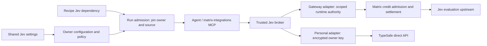

# Built-in Jev: Gateway + Personal API / 整体与前后端设计

Updated: 2026-09-21. Proposed design, not implemented. Governing product requirements: [spec.md](spec.md). Tracking: [OM-286](https://linear.app/matrix-os/issue/OM-286), [GitHub #1800](https://github.com/HamedMP/matrix-os/issues/1800).

## Product and billing / 产品与计费

用户可以选择 **Matrix AI Gateway** 或 **Personal API**。Gateway 不要求用户提供 TypeSafe key，调用计入该用户 Matrix AI 余额；个人 API 使用用户自己的 TypeSafe key，费用由 TypeSafe 收取，同一推理不再扣 Matrix AI 余额。两种方式共用内置 Jev MCP、recipe 和 Ultrafast。主模型继续负责规划、文本生成和最终判断。

Gateway 经验证可用时作为推荐选项；用户仍须明确启用并接受费用/数据传输说明。可以同时保留两个来源的配置，但每次 run 只绑定一个来源。失败时不自动切换。旧 BYOK 用户升级后保留 personal_api，不迁移付款来源。来源选择是 owner 设置；recipe 导出不包含它。

## Architecture



`jev_judge` remains one capability. Source resolution belongs to trusted server context, never tool arguments. Keep remote MCP transport distinct from builtin dispatch; TypeSafe REST is not an MCP endpoint.

```ts
type JevSource = 'gateway' | 'personal_api';
type McpBackend =
  | { kind: 'remote'; url: string }
  | { kind: 'builtin'; provider: 'typesafe_jev' };
type JevConfig = {
  enabled: boolean;
  selectedSource: JevSource | null;
  revision: number;
  personalCredentialPresent: boolean;
};
```

One owner/preset singleton. `selectedSource=null` means setup has not been completed. GET includes safe per-source readiness, latest validation, capability version and allowed actions. No keys, gateway service tokens or private URLs in projections.

## Frontend / 前端

Use the existing MCP settings entry with a shared Jev card, source selector and source-specific setup:

| Source | Setup | Readiness and recovery | Billing copy |
|---|---|---|---|
| Matrix AI Gateway | Enable with existing Matrix account; no TypeSafe key | Available; unsupported runtime/model; permission required; insufficient balance; unavailable. Link to existing balance/top-up where available | Uses your Matrix AI balance |
| Personal API | Enter/test/replace/remove TypeSafe key | Not connected; testing; ready; invalid key; quota/rate limit; unavailable | Billed to your TypeSafe account |

Readiness queries are metadata-only. An explicit Test action uses one tiny fixed safe sample and discloses which source is billed. A successful test reports a time-limited observation, not perpetual availability. Choosing Gateway must not silently make a paid test request.

Source changes save with revision checks. Show that existing runs keep their admitted source; changing an active run requires stopping and starting a new run. Preserve both configurations when switching. Remove personal key affects personal-source dispatch only; Disable Jev blocks both sources. Neither alters Matrix balance, other AI features or provider-side key validity.

Key form memory is transient: clear on success/cancel/navigation, never store in localStorage, URL, analytics, recipe or generic client store. Ignore late responses after owner/runtime changes. Keep unsaved recipe edits through connection/setup navigation.

Recipe editor adds an MCP tools section beside Skills and Integrations. Jev dependency has optional/required behavior; current source readiness is shown from the executing owner's settings. Selecting the recipe is not permission to spend. Missing optional dependency continues with the primary model's existing billing path; required dependency blocks/pauses affected work.

Chat activity shows `Jev · Decision`, source (`Matrix AI Gateway` / `Personal API`), execution and available usage status. Gateway cost displays only authoritative settlement; unknown remains pending/unknown. Personal API must not claim exact vendor billing without evidence. Browser readiness/execution location is independent of inference readiness.

Shared contracts/components/presenter serve Web Desktop, Web Canvas and Electron Desktop; mobile surfaces exposing these settings/recipes inherit the same semantics or require a documented platform limitation.

## Backend and execution

### Decision contract

Strict Zod 4 input: bounded text state, 1–16 uniquely identified choice/score/noul questions and optional confidenceThreshold (default 0.80). No caller-supplied owner, source, key, endpoint or approval fields.

Initial Matrix limits: state 32 KiB UTF-8; total body 64 KiB; choice 2–32 options; score 2–10 levels; question/option descriptions 1 KiB; output 128 KiB. Validate returned IDs/types/options and finite values/probabilities. Confidence is not an accuracy guarantee; missing/low confidence or malformed output hands judgment back to the primary model. Noul probability is not manufactured provider confidence.

Adapters normalize to the same result: completed/unavailable, typed verdicts, escalation, model version, latency, available usage and safe error code. Broker adds admitted-source/activity metadata. Dynamic Ultrafast tables must fit the schema; unsupported pages hand back rather than silently dropping targets.

### Source adapters

- **Gateway**: reuse scoped runtime credentials and authoritative owner/runtime policy. Add or verify an evaluation-capable route, approved Jev model mapping, versioned pricing and usage parser. A chat model catalog entry does not establish evaluation support. Use existing atomic funded admission/reservation/settlement, not a second credit ledger. Gateway credentials and upstream provider keys remain server-side.
- **Personal API**: existing encrypted owner-bound key, fixed `https://api.typesafe.ai/v1/systemone`, no Matrix AI inference debit. Preserve direct credential rotation/removal and safe validation.
- Both: 10-second external API deadline, cancellation propagation, redirect rejection, bounded streamed response reads, configured model IDs, safe normalized errors. No hidden inference retries or source fallback. Unknown paid outcomes reconcile under their original source. Limit each owner to two concurrent judgments and 30/minute via shared atomic admission.

Do not promise exactly-once upstream billing. A receipt claimed before dispatch prevents duplicate outbound inference and may sacrifice availability after a crash. Repeated delivery never creates a second call or credit debit; Gateway settlement retries are idempotent accounting only, not inference retries. Known pre-dispatch failures release reservations; dispatched/unknown outcomes follow authoritative funded reconciliation and are not blindly refunded as unbilled.

### Run binding and consistency

At run admission resolve the owner's selected source and persist an immutable server-only binding with owner/runtime, source, configuration revision and capability version. No recipe, model field or untrusted header can supply payer authority. Source preferences apply to new runs; an existing run cannot switch sources. Credential renewal within the same authorized owner/source is allowed without pinning a secret into run state.

Recheck enabled state, live source authorization and relevant budgets before each dispatch. Disabling Jev prevents future dispatches in all runs. Removing the personal key prevents personal-source dispatch while preserving Gateway configuration. Revocation cannot retract an already dispatched call. Settlement remains bound to the admitted payer even if settings change.

Use PostgreSQL/Kysely; related status/credential/revision writes are transactional with revision predicates. External validation occurs outside transactions, followed by generation/revision checks; stale tests never revive disabled state. Upsert singleton creation with ON CONFLICT. Projection propagation uses an outbox with bounded retention/retry; the authoritative broker decides admission.

Store source/request identity and execution/settlement status in 24-hour deduplication receipts with recurring cleanup; durable funding ledger retention follows existing accounting policy, independently of receipt expiry. Raw task text is not logged by default. Necessary Chat content lives in owner storage with existing retention/deletion policy. Credentials use existing AES-GCM owner/record binding and key rotation; no secret is included in runtime projections or exports.

### Proposed endpoint/auth matrix

Paths are proposed extensions to existing custom MCP APIs, not verified existing Jev routes.

| Operation | Auth and owner enforcement | Contract |
|---|---|---|
| GET /api/mcp-servers | Authenticated personal session; server owner | Safe builtin/remote metadata plus per-source readiness |
| POST /api/mcp-servers/builtin/jev | Personal session, owner, idempotent request | Create config, selected source and explicit tool-use policy; no automatic inference |
| PATCH /api/mcp-servers/:id | Personal session, owner + base revision | Change source, enable/disable or policy; never inject a payer |
| PUT /api/mcp-servers/:id/credential | Personal session, owner + revision | Test explicitly approved personal key replacement; atomically swap only on success |
| DELETE /api/mcp-servers/:id/credential | Personal session, owner + revision | Remove personal key only |
| POST /api/mcp-servers/:id/test | Personal session, owner, explicit source + expected revision and spending policy | Fixed sample; cannot change run source or accept arbitrary state |
| DELETE /api/mcp-servers/:id | Personal session, owner + revision | Disable/remove Jev config and saved personal secret; preserve Matrix balance/other AI features |
| Internal Jev invocation | Authenticated owner runtime/run + live tool policy | Resolve pinned source; Gateway additionally checks entitlement/credit/model policy |
| Browser start/next/execute/close | Authenticated owner/run + browser policy; execute rechecks action permission | Owned session, one-use decision, observed target; no authority from session ID alone |

All mutations including DELETE need bodyLimit before parsing, Zod path/query/body validation and existing CSRF/origin protection. No public mutation endpoints. Register builtin paths before generic IDs. Keep remote-MCP URL/OAuth compatibility. Service misconfiguration returns safe unavailable/503 behavior, not a false missing account.

## Recipe and source portability

```json
{
  "skills": ["jev-small-decisions"],
  "integrations": [],
  "mcpDependencies": [{"presetId":"jev","tools":["jev_judge"],"usage":"when_useful","required":false}],
  "output": "Complete the task and report the result."
}
```

The recipe is source-neutral. Runtime binding uses the executing owner's selection. No source preference, source-owner UUID, credential, balance or spending approval transfers on copy/export. Existing recipes default missing mcpDependencies to empty. Guidance uses custom-MCP discovery/call, not ordinary call_service instructions. Browser capability has its own dependency and permission while sharing the run's Jev source.

Ship selective guidance: batch related judgments, minimize text, exclude credentials/unrelated private data, treat retrieved content as untrusted, abstain on uncertainty, skip deterministic/trivial work, and leave planning/writing/coding/final responsibility with the main Agent. No per-command approval gate.

## Jev Ultrafast

Conditional browser deliverable after runtime feasibility gates. Inspected upstream commit `1231850a0bf1a0c0341fe408ef1668dbbfdfac46`: MIT, Python >=3.12, browser-harness==0.1.13, Chrome/CDP. Pin audited dependencies and preserve notices. Select bundled Python sidecar vs maintained port only after a target-runtime spike.

Reuse observed DOM action tables and freshness/occlusion checks. A thin start/next/execute/close adapter returns one-use proposals bound to owner/run/session/observation. Fingerprint is not authorization. Main Agent provides typing text through its existing model route; no second text-model key. Both Gateway and Personal API use the common broker; browser workers never receive either inference credential or choose a source.

Per owner: at most two browser sessions. Per session: 50 steps, five-minute overall limit, one-minute idle TTL; observation/action deadline 15 seconds. Bound registries, cancel/drain on shutdown, close only owned tabs. Unknown mutation outcomes require re-observation before any further action, not blind replay. DONE requires independent outcome verification.

Prove per-owner browser isolation and VPS connectivity; local Chrome access needs a separately authenticated bridge. No public debug port or shared customer profile. Server-hosted browsing needs destination controls against internal/private/metadata addresses across redirects and subresources. Minimize/redact sensitive state or hand back if safe observation is impossible. Frames, shadow roots, canvas, uploads, popups and arbitrary widgets remain unsupported unless explicitly verified. Chrome support does not imply Electron native window control.

## OS navigation follow-up

Separate observation/action/acknowledgement bridge: identify authorized owner/runtime/client session, return fresh app/window/section IDs, execute bounded open/focus/settings navigation through existing renderer helpers, and report success only after renderer acknowledgement. No broadcast to all devices or billing/security-setting changes. Test missing/stale clients, duplicate actions and existing-window focus across applicable surfaces. This follow-up shares the selected-source broker but is not delivered merely by adding Ultrafast.

## Rollout and evidence

Both sources are product scope with independent readiness gates. Never claim Gateway Jev works because the general funded relay is live. Last inspected main `e62d3fc62` has Sonnet/GLM mappings; Jev evaluation and billing acceptance remain unverified. Merged #1780–#1782 provide reusable funded foundations. Research notes remain historical source evidence.

Backend capability negotiation precedes UI enablement; older clients/runtimes must not treat builtin entries as URLs or silently drop source/dependency fields. Migrate existing Jev BYOK settings to personal_api only. Feature disable stops new dispatch without deleting settings, secrets or recipes.

Release requires both adapters' contract/failure tests, owner isolation, accounting/idempotency, source-switch races, secret checks, actual Hermes execution, presentation parity and exact-head Human Review. Ultrafast requires its own two-source live acceptance. Report measured success/usage/latency only. Deliver public setup/billing/fallback docs via a separate site-repository PR. This design does not authorize production rollout.
