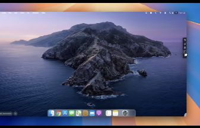
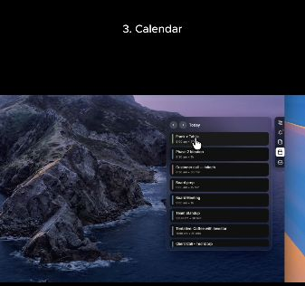
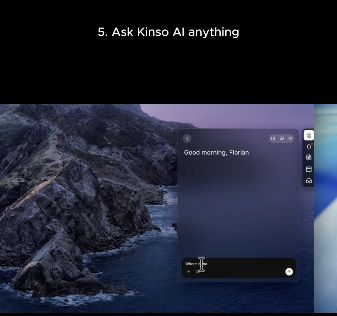

# Assistant dock: visual reference and design contract

**Status:** Proposed design refinement of [R2](./spec.md#r2-compact-assistant-dock-and-input)

**Added:** 2026-09-23. No runtime UI is implemented by this document.

## Source and interpretation

The product requester supplied this public [Kinso reference reel by Jacques
Greeff](https://www.instagram.com/reel/DcKH43ajfrN/) as an example of the intended
widget design. The reel is approximately 29.44 seconds long. It was viewed in the
browser; the three images below are direct browser screenshot crops of its video
region, captured around the stated playback times. They are third-party reference
material, not Matrix mockups or implementation acceptance evidence. Attribution
remains with the original creator. The original video is linked, not redistributed.

The relevant control is the **narrow vertical rail on the right**, with a panel
opening to its left. The horizontal macOS application dock visible at the bottom
is a separate control. Use **assistant dock** for the interaction pattern and
**compact panel** for its expanded content. “Widget” remains a general product term;
it should no longer imply that a large dashboard card is permanently open.

These are low-resolution crops from the rendered reel. They support shape,
placement, layering and content hierarchy; they do not establish exact pixels,
type sizes, icon identities, animation timing or the contents of tiny text.
Third-party sample records in the public video are not Matrix fixture data.

## Captured evidence

### A. Collapsed rail, approximately 00:15.6

The desktop retains nearly all of its working area. A compact dark rounded rail
holds vertically stacked light icons near the right edge. There is no permanently
open dashboard or conversation window. The desktop background is visible around it.

### B. Calendar panel, approximately 00:18.1

The reel labels this segment “3. Calendar”. A tall rounded panel extends to the
left of the rail. Its dark translucent surface allows the wallpaper colors to
remain perceptible. A compact header sits above stacked event rows. The active
rail icon has a bright rounded backing; the remaining icons stay in the rail.

### C. Assistant panel, approximately 00:26.2

The reel labels this segment “5. Ask Kinso AI anything”. The same side-panel
pattern now contains a short greeting, open conversation space, and a bottom
text composer with a circular action control. The active icon changes, while the
rail retains its position. This is evidence for compact contextual content and
an assistant entry, not proof of voice capture, tool execution or approval safety.

The observed meeting-transcription segment also uses the side-panel pattern.
Features and providers depicted by this other product do not automatically become
Company OS requirements. In particular, comment-thread suggestions about hover
behavior are not the requester's instructions or verified behavior of the reel.

## Company OS adaptation

The following is the proposed Matrix contract derived from the reference, not a
claim that every behavior below occurs in the video.

### Anatomy and visual treatment

- **Rail:** compact vertical capsule, close to the right viewport edge, below
  protected top chrome. Use a small set of recognizable destinations with accessible
  labels. Today/priorities and the master assistant must be reachable; the final
  destination set is a design decision, not a copy of Kinso's integrations.
- **Selected state:** one clearly selected icon with a rounded backing, distinct
  from hover, focus, unread activity and connection status. Do not signal state
  solely through color or fabricate unread/activity indicators.
- **Panel:** one rounded surface opens inward from the rail. Align it consistently
  with its anchor, retain the rail, and scroll the content internally. Use a header,
  main content region and contextual footer/composer. Do not stack six large panels.
- **Information:** the priorities panel carries Company OS identity, truthful
  connection status and up to three Decide / Review / Prep items. The assistant
  panel carries compact voice/text input and evidence-backed results. Keep the six
  full workspace pages in the separate expanded workspace defined by R4-R9.
- **Material:** adopt the reference's restrained translucent layer, rounded corners,
  subtle border and shadow. Resolve colors through `@matrix-os/brand`, including
  light/dark surfaces and existing forest-green/lime accents; do not hardcode the
  reel's dark-purple wallpaper colors as a new theme. Use an opaque accessible
  fallback when transparency or background contrast is unsuitable.
- **Sizing:** a starting design proposal is a 48-56 CSS px rail, at least 44x44 px
  interactive targets, 8-12 px rail-to-panel gap and a 320-400 px compact panel.
  These are review targets, not measurements from the reel. Clamp to the available
  viewport, preserve safe margins and avoid main-surface horizontal scrolling.

### Interaction and state

| Trigger | Expected behavior |
| --- | --- |
| First open, or restore without a saved open panel | Show the rail; do not cover the user's current work with an unsolicited dashboard |
| Click/tap or keyboard-activate an inactive destination | Open its compact panel and mark the destination selected |
| Activate another destination | Replace content in the single anchored panel; preserve each destination's draft and selected context |
| Activate the selected destination, explicit close, Escape or outside click | Collapse to the rail without discarding drafts, clearing results or stopping a run |
| Hover or focus an icon | Show an explanatory label; opening must not depend on hover, and passing the pointer across the rail must not unexpectedly switch content |
| Start voice input | Require explicit activation, show microphone state and keep stop/cancel accessible; retain R2 permission and privacy behavior |
| Dismiss while recording | Stop microphone capture and preserve the transcript already obtained; do not keep recording invisibly |
| Expand | Open/focus the existing Company OS workspace with the same owner, selected item, draft and run; avoid a second independent conversation |
| Collapse the workspace back to compact view | Restore the associated compact state without changing the owner or source scope |
| New result while another application has focus | Update honest status without stealing focus or opening the panel automatically |

Keyboard activation moves focus to meaningful panel content; Escape/explicit close
returns focus to the triggering icon. Outside-click dismissal leaves focus at the
clicked destination. During source/workspace changes, retain draft ownership and
fence stale async results. Closing UI must never approve or execute an action.

Use a short anchored reveal/collapse and restrained content transition so the rail
feels stable. Exact easing/duration requires prototype review. Reduced motion uses
an immediate or minimal transition; no bouncing, continual pulsing or fake activity.

### Surface integration and limits

- On **Web Desktop** and **Electron Desktop**, anchor within the Matrix application
  viewport. Do not infer an OS-wide always-on-top window over other applications
  from this reference; that would require a separate native capability proposal.
- On **Web Canvas**, keep the rail viewport-anchored, not attached to the infinite
  canvas coordinates. Panning or zooming must not move or scale its controls.
- Share selection, drafts, scope and run semantics across presentations. Reuse
  existing shell z-index and notification-host contracts. Settings, hard gates and
  critical notifications remain usable; the assistant dock must not obscure them.
- On **Web Mobile**, adapt to one compact launcher and a bounded sheet or full-width
  panel when a side rail plus panel cannot fit. Preserve actions and state semantics;
  do not squeeze desktop dimensions into a narrow viewport. **Native Mobile** scope
  remains governed by D8; no native delivery is established by this reference.
- Dock dragging, left-edge placement, auto-hide and global shortcuts are not yet
  agreed. The first prototype uses the specified right-edge placement and explicit
  activation; do not implement extra desktop behavior solely because it is common
  in other docks.

## Review evidence required for S1

Capture the actual Matrix prototype in collapsed, priorities, assistant-input,
result and expanded-workspace states. Demonstrate destination switching, repeated
open/close, keyboard navigation and focus return, viewport resize, reduced motion,
microphone dismissal, draft recovery, shell-chrome overlap and presentation switching.
Use the reference images to review the dock/panel relationship, and the main spec
to review content, source truth and action boundaries. Source screenshots alone
cannot satisfy product Human Review.
