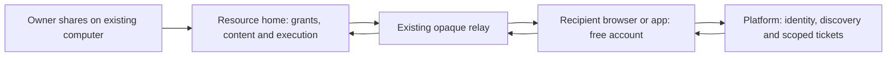

# Architecture and Authorization Constraints

**Status:** Planning input, not a finalized API or implementation claim.
**Source baseline:** main `5f9fc536265ac0d22e0ccdf52f166fcc23a186c9`, inspected 2026-09-26.

## Verified starting points

| Existing seam | Observation | Required extension |
| --- | --- | --- |
| `shell/src/app/shared/**/page.tsx`, `OnboardingGate`, `BootSequence`, `ShellHome` | Shared entry currently traverses the machine onboarding and full shell bootstrap | Platform-served authenticated collaboration entry that does not load personal-runtime configuration or require billing |
| `shell/src/lib/collaboration.ts`, shared direct client | Resource connections already target the resource home, independent of selected personal computer | Reuse transport/session cleanup; add account-only discovery and scoped guest authorization |
| Platform identifier resolver and ticket issuer | Identifier resolution and connection admission currently require organization membership | Explicit personal-recipient and organization-guest grant paths; retain organization-member validation rather than removing it globally |
| Gateway collaboration authority, repositories, direct sessions and event registries | Owner-local authority, revisions, scoped sessions, replay and revocation exist | Guest-grant provenance and policy leases across every adapter, including queued execution |
| `shared-ai-runtime.ts`, shared Claude/Codex adapters | Current code contains both shared harness adapters and owner-source resolution | Reuse canonical queue/adapters; verify real capabilities and add safe document proposals, not a parallel AI stack |
| Shared UI and 525/124 evidence | Chat chrome and discovery components exist; recorded evidence has incomplete live/Native Mobile gates | Reuse components and measure real account-only journeys, including Native Mobile transport repair |

These source observations are not production verification. The earlier conversation's Claude-only limitation described an older checkout and is not a requirement to rebuild adapters.

## Authority and data ownership

The platform authenticates stable account IDs, stores bounded invitation/discovery/control metadata, resolves the resource home and issues short-lived scoped tickets. The home remains authoritative for resource grants, content, document edits/history/comments, queues and execution. Postgres/Kysely remains the persistence standard in each owner boundary. The existing relay forwards opaque content; it must not acquire a second document store or log content. Existing relay visibility and inference-provider processing must be described accurately; do not claim end-to-end secrecy.

Invitation delivery may use a platform outbox containing only the target address, opaque invitation ID, expiry and a generic link. Resource titles, document excerpts and Chat content are retrieved from the home only after intended-recipient authentication. Do not disclose account existence through invitation creation or lookup. The full technical plan must specify address encryption/access/retention, digest normalization, actor binding and deletion propagation before implementing email invitation storage.

An unregistered-email invitation binds to an immutable account ID only after current verified-email proof matches. Home acceptance commits the grant, invitation state, audit and directory-outbox event atomically; an identity match alone never creates a connection grant. Duplicate acceptance returns the original result. Pending invitation credentials can access only their acceptance preview/decision, never normal content, execution or a parent resource. Renewed verification is required on a mismatched or stale identity proof.

Guest is a relationship, not an organization role or blanket permission. A personal share needs no organization. An organization guest grant is additionally constrained by that organization's external-sharing policy and policy epoch; removal/disable invalidates derived tickets and sessions. A former org member cannot retain an old org-bound guest grant by falling back to a different grant source. An independently created personal grant to a different personal resource is unaffected. Duplicate grants within a scope must have explicit effective-capability derivation, last-grant revocation and audit tests.

Existing member-owned content stays member-owned; hosting does not transfer ownership and authorship does not silently create organization ownership. Export/deletion flows must include new documents and comments under the same authority.

## Runtime wiring

The `/shared/*` web entry loads platform identity and metadata, then obtains a resource-specific ticket, establishes the existing direct session through the relay, and renders common resource components. It must neither select a recipient machine nor accidentally issue personal `/api/system/info`, desktop-config or private Chat-history requests as a boot prerequisite. A recipient without any machine can also enter `/shared` directly. Explicit shared routes must survive platform routing, signup handoff and billing middleware before the React boundary is reached.

An authenticated owner creates a home-authorized invitation, commits a directory/delivery outbox event, and sees delivery status. The platform sends a generic email with retry/deduplication. The recipient verifies identity and accepts against the home; grant commit precedes ticket/content admission. If the home is offline, the invitation can be discovered but acceptance remains pending/retryable. Never invent successful acceptance in a platform projection.

Clients share schemas, capability derivations, identity-keyed drafts and document state transitions. Surface adapters supply chrome/navigation only. A minimal collaboration frame can render without personal machine state while using the same Chat/Terminal/document components as the full OS view. Free participants must be able to switch among authorized resource homes.

## Required authorization matrix

Paths marked proposed are logical route families to finalize in the technical plan. The final route map must enumerate concrete endpoints, including errors and WebSocket upgrades; no family below is anonymous content access.

| Route or operation family | Authentication and authority | Public behavior |
| --- | --- | --- |
| `/shared`, `/shared/invitations/:id`, `/shared/{chat,project,terminal,document}/:id` (document proposed) | Account session before resource hydration; validated return destination | Signed-out frame/sign-in only, no title, membership or content preview |
| Existing `/api/collaboration/inbox`, `/api/collaboration/shared` | Platform account session, actor-bound bounded directory projection | None; no machine/subscription prerequisite |
| Invitation create/resend/revoke (home, proposed guest extension) | Owner direct session, scope ownership, current org policy if applicable, idempotency/revision | None; uniform recipient lookup behavior |
| Invitation preview/accept/decline (proposed recipient path) | Platform-verified recipient proof bound to invitation and intended account; home state and expiry | Link alone grants nothing; preview contains only intended share disclosure |
| Existing `/api/collaboration/connections` | Account session; exact resource grant or narrowly scoped invitation-purpose proof; applicable policy freshness | None; guest proof cannot mint owner-runtime tickets |
| Existing `/api/collaboration/direct-sessions` and renew | Home validates ticket, actor, audience, purpose, grant/policy epoch, expiry and resource | None |
| Existing `/ws/collaboration/direct/scopes/:scopeId/:purpose`; new presence/document purposes | Scoped browser-compatible session authentication and frame schemas; home reauthorization and bounded replay | None; register exact browser upgrade paths, never trust client actor/role |
| Document/comment/history/export/proposal route families (proposed home APIs) | Current scoped direct session; read/edit/export/approve capability per operation; revision guards | None |
| Mention/activity metadata/read state (proposed) | Actor session for own activity; home authorizes content hydration and mention targets | None; no cross-scope recipient enumeration |
| External-sharing policy (proposed platform org setting) | Fresh organization owner/admin authority; server-derived org; versioned update and audit | None; policy permission grants no content access |
| Existing internal runtime/control/directory operations | Existing runtime/service authentication plus exact owner/runtime binding | None; never substitute a guest credential |

Every mutating HTTP endpoint, including DELETE, requires streaming body limits; boundary schemas bound all IDs, strings, frames, cursors and arrays. Validate return paths and reject cross-origin redirects. Reuse request-origin/CSRF protections for cookie-authenticated mutations. External delivery/identity calls use bounded timeouts. User-controlled fetches retain SSRF and redirect protections. Safe errors reveal no credentials, raw provider errors, private paths or account existence.

## Concurrency, recovery and lifetime rules

- Grant/invitation/policy mutations update authoritative rows, audit and outbox in a transaction. Conditional revision updates or row locks enforce races at the write; retries carry actor-scoped idempotency keys and bounded retention.
- The technical plan must select and spike an operation-merging editor protocol against concurrent edits, comment anchors, scoped undo, persistence, compaction and browser/mobile compatibility. Do not prescribe a new database or treat a last-writer whole-document save as simultaneous editing.
- Acknowledgment follows durable commit. Restore and AI-accept commit document change, revision/provenance and notification outbox atomically. Stale target revisions must fail or be explicitly rebased; accepting a proposal is idempotent.
- AI admission atomically reserves available managed funding where supported and enforces owner per-scope/requester limits. For sources without reliable cost reservation, enforce request/concurrency bounds and display unknown usage rather than guaranteeing currency ceilings. Pin the original source and payer across retry/recovery.
- Guest document-AI runs receive only authorized document context and tools. Existing organization-member broad integration behavior is not silently inherited by external guests. If the adapter cannot constrain indirect integration/Git/terminal access, guest AI remains unavailable while reading/editing works. The next plan must define supported broader guest capabilities explicitly before offering them.
- Reauthorize queued work at dispatch and proposals at apply. Following grant loss, reject all new reads/writes/tool operations. Stop or cancel guest-authorized active runs best-effort, reconcile their durable state, discard unpublished results for the removed audience and record already committed side effects honestly. Do not retry an unknown paid/external outcome automatically.
- Policy/grant freshness leases expire within 60 seconds, including partitions; healthy connected revocation converges within five seconds. Existing longer-lived tickets must not override a shorter policy lease. Home-local revocation denies new operations at commit; remote org disable/departure takes effect through invalidation or bounded lease expiry. Clock skew and renewal are acceptance cases.
- Presence is ephemeral and resource-scoped, with a 30-second stale cutoff, bounded actor/device/scope registries, send-failure eviction and shutdown drains. Durable history is not an unbounded presence log.
- Planning must set and test caps for pending invitations, send rate, per-account attempts, sockets, document/operation/comment sizes, history pages, retained notification metadata and idempotency records. Start with the existing eight-participant cap; pending reservations must be released on decline/expiry and acceptance capacity must be atomic.
- Private drafts and pending document edits are keyed by actor/resource home/scope/document. Bound cache size/retention; clear renderable shared previews and sessions on sign-out/revoke. Do not silently delete an unsent private draft on transient network failure. Local recovery text must never be sent under a different account or to a different audience.
- Account/resource deletion schedules bounded recurring cleanup of pending email deliveries, discovery metadata, activity, grants and caches; parent deletion cascades or tombstones child history consistently. Owners close shared DB pools; shutdown stops timers/subscribers before dependencies.

## Planning proof obligations

Before implementation, finalize schema migrations, endpoint-by-endpoint auth, email invitation capability format and redemption, guest/member policy union rules, editor protocol, retention limits, Native Mobile compatibility, managed/custom-source budgets and exact active-run interruption semantics. Add fail-first tests for each boundary and full real-Postgres races. Probe undocumented editor/harness behavior before depending on it.

No rollout flag or cohort policy from retired collaboration architecture is reintroduced. Compatible host capability negotiation may expose unavailable states until an implementation milestone is supported. Old hosts must reject unknown guest/document tickets and never fall back to an owner session or unrestricted legacy route. Upgrade/rollback preserves grants and content; downgrades that cannot represent new grants must fail closed and keep owner export/recovery available.
