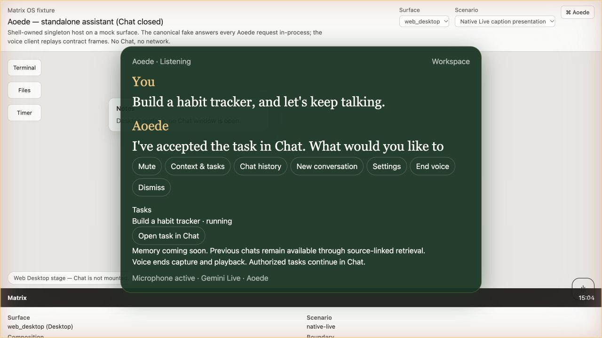
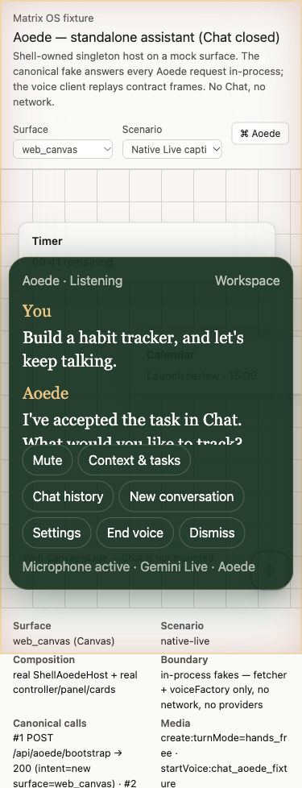
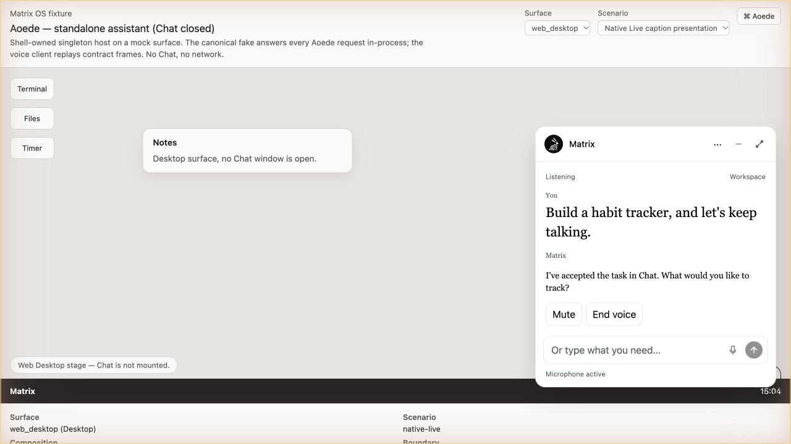

# Shared native Live development evidence

These screenshots render the real shared ShellAoedeHost/controller/panel with deterministic fetch and media boundaries. They exercise presentation, not a microphone, provider, builder, or authenticated customer runtime. The native layer is 680 on Web fixtures and 49 in Electron presentation regressions, below protected shell controls. Browser fixtures do not establish physical Electron or Native Mobile evidence.

| Surface | UI | Behavior | State/recovery | Automated tests | Real evidence |
| --- | --- | --- | --- | --- | --- |
| Web Canvas | Shared fixture pass | Deterministic frames pass | Controller regressions pass | pass | Fixture only; production acceptance pending |
| Web Desktop | Shared fixture pass; physical compact widget inspected | Real funded typed Chat pass | Controller regressions pass | pass | Microphone acceptance pending |
| Electron Desktop | Shared component/layer regressions pass; physical compact widget inspected | Real funded typed Chat pass | Auth identity fencing pass | pass | Microphone acceptance pending |
| Web Mobile | Deferred development integration | Deferred | Deferred | Deferred | Pending |
| Native Mobile | Deferred development integration | Deferred | Deferred | Deferred | Pending |

This is an explicitly non-production development slice. Hosted native registration requires fresh Matrix-paid platform eligibility and an explicit rollout allowlist. Full five-surface acceptance is an open spec 547 release gate, including real microphone/barge-in, owner policy, builder/launcher, child approval/result projection and Terminal attachment. No pending row is a parity exemption or claimed pass. The spec's full mobile presentation remains future scope, not shipped functionality. Exact input finality/heard words are tracked in #2174. An isolated test VPS deployment is authorized; merging, production traffic promotion and fleet rollout still require the reviewer/release decisions.

Web Desktop screenshot: document width/scroll width 1280, shared layer 680, both caption lanes and task drawer. Web Canvas screenshot: mobile-width viewport, document width/scroll width 375, shared layer 680, both caption lanes. Neither screenshot represents real audio capture or task execution.

## Matrix-paid relay and isolated VPS checks

The platform relay completed real Gemini 3.8 Live setup, audio, output captions and expense recording. A second synthetic text-driven session accepted a custom lookup response delayed by two seconds. That session observed no audio while the tool was pending; it does not qualify microphone input or simultaneous speech during delayed work. Provider JSON arrived in binary WebSocket frames, now covered by a transport regression. No provider key, raw audio or captions are persisted in expense records.

The isolated test VPS served exact host bundle `v2026.10.05-pr2172-37352208574-1-43a09a0`; gateway, shell and sync services were active. Native platform credential binding is active through isolated preview services. A platform-paid synthetic Gemini turn returned five audio chunks and captions with no provider error. Both physical Web Desktop and Electron Desktop returned the requested typed connection-test response through canonical funded Chat. This does not qualify microphone, app builder or Terminal acceptance.

The native canonical readiness correction has 122 passing tests and a gateway build. The real runtime catalog exposed an additional mismatch: OpenCode supports supervised permissions only, while the first correction required full access. A failing regression reproduced that rejection; the corrected decision now uses supervised permissions, matching typed and delegated canonical admission. A further regression confirmed that native interruption and reconnect must be independent of the selected task harness's cancellation/resume support; the correction matches the registered native adapter. Native media retains an empty source-Chat tool inventory and no delegation grant. Client microphone acceptance remains pending installation and inspection of the corrected bundle.

Client review regressions cover closing the requested app without opening it, identity-fenced result file navigation, a pointer-transparent native Web host with interactive classic controls, and a bounded SSE connection setup that retains owner cancellation after headers. The relevant shared client suite passes 249 tests.

The rendered native Web Canvas fixture also passed a browser hit test: the empty host has `pointer-events: none`, the hit target is beneath that host, and the launcher remains `pointer-events: auto`. This is presentation evidence with simulated media, not real VPS microphone acceptance.

## Compact conversation correction

The shared presentation now follows the approved Figma onboarding Chat widget. It stays a compact white corner conversation through loading, unavailable speech and failed bootstrap; active voice adds the edge halo. Expanding opens the same canonical Chat. Typed messages admit supervised canonical turns on the selected route, retain failed drafts and fence owner/conversation changes. A dedicated helper keeps this workflow outside the controller composition file.

The correction has 200 passing shared UI/controller/Web host/Electron host tests and an Electron build/type check. The full linked-design app-connection onboarding branches are not implemented by this correction. Real voice activation and physical microphone acceptance remain pending; failed runtime readiness is not evidence of an audio transport attempt.

Native audio/task independence correction: native bootstrap and session create no longer consult task readiness or require a selected task account. Managed STT/agent/TTS keeps its selection requirement. Conversation can journal into an owner-bound canonical Chat without a task selection; typed and delegated work fail closed independently until a real route is selected. Platform speech eligibility, live capacity, tickets, ownership, and limits still gate audio. Added failing tests first for no-account bootstrap, unavailable task catalogs, native session creation, speech-funding denial, client-invented selection, and task admission without a route. Real deployment/microphone validation remains pending.
