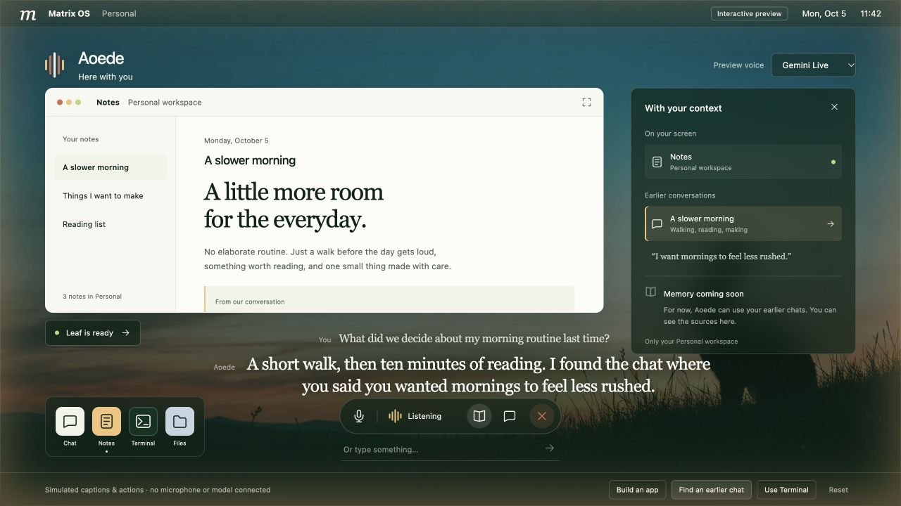
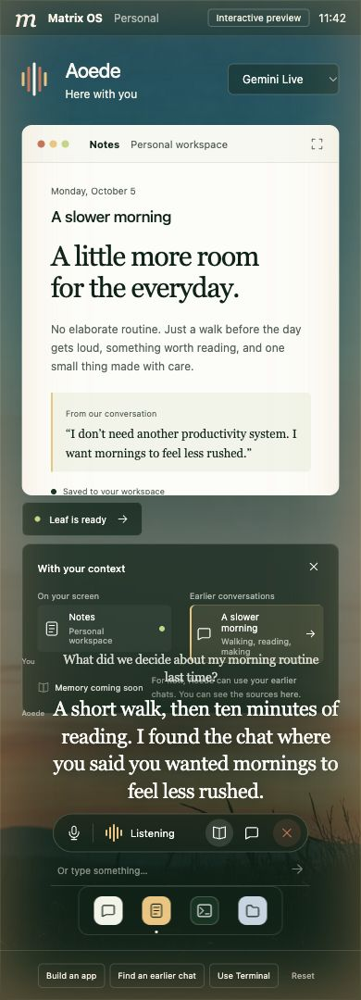

# Aoede interaction preview

Simulated Vite + React UI; no audio capture, provider calls, real commands or user-data writes. Text requests select one of three demonstration scenarios. Switching the provider selector changes its label only.

From this directory, install with `pnpm install --ignore-workspace --frozen-lockfile`, then `bun run dev`, `bun run test`, or `bun run build`. Brand tokens import directly from `packages/brand`; the wallpaper is the existing Matrix dusk asset. The dependencies are isolated from the root workspace. Keep this preview outside the production feature path.

Click **Build an app** to follow a simulated Chat builder task (11 seconds), **Open app** to use the generated tracker, **Find an earlier chat** to inspect the source, or **Use Terminal** to approve/reject a simulated command. Ending voice leaves the demo build running. Reset cancels the demonstration and restores the starting view.

Verified on 2026-10-05: production preview build; nine lifecycle/approval tests; browser checks for build continuing after End voice, opening Leaf, rejecting/approving the terminal demo, and 1280px/390px layouts. These checks validate the interaction study only. Real provider latency, voice quality, transcription accuracy, costs, permissions, and kernel wiring still require the spec's funded integration spike.

Review regressions: recalling an earlier chat or opening Terminal preserves the current build and its progress timers. Context closes through its trigger, close button, outside click or Escape. Conversation history uses a native modal with explicit Tab cycling and restores focus to its trigger. Reset cancels the demonstration.

## Surface matrix

This directory is an isolated interaction study, excluded from production build entrypoints. It does not import or mount any OS client, establish authentication, capture audio, or execute a real task. Browser widths are evidence for this study only.

| Surface | UI | Behavior | State/recovery | Automated tests | Real evidence |
| --- | --- | --- | --- | --- | --- |
| Web Canvas | N/A | N/A | N/A | N/A | N/A |
| Web Desktop | N/A | N/A | N/A | N/A | N/A |
| Electron Desktop | N/A | N/A | N/A | N/A | N/A |
| Web Mobile | N/A | N/A | N/A | N/A | N/A |
| Native Mobile | N/A | N/A | N/A | N/A | N/A |

Architectural rationale for all five N/A rows: this PR changes only a standalone fixture under specs; no production renderer consumes it. Shared runtime presentation belongs to #2172 and gateway behavior to #2175. These entries request reviewer approval for the isolated-study scope; they do not waive production surface parity or acceptance. Reviewer approval of this rationale remains a merge prerequisite. No merge is requested.

Standalone study evidence: nine pure lifecycle/caption tests and its production build pass. Browser checks cover background completion without replacing the newer answer, drawer outside/Escape dismissal, history Tab cycling/focus restoration, and 1280/390-pixel layouts (no horizontal overflow at 390). Full production acceptance remains an explicit spec 547 gate.

