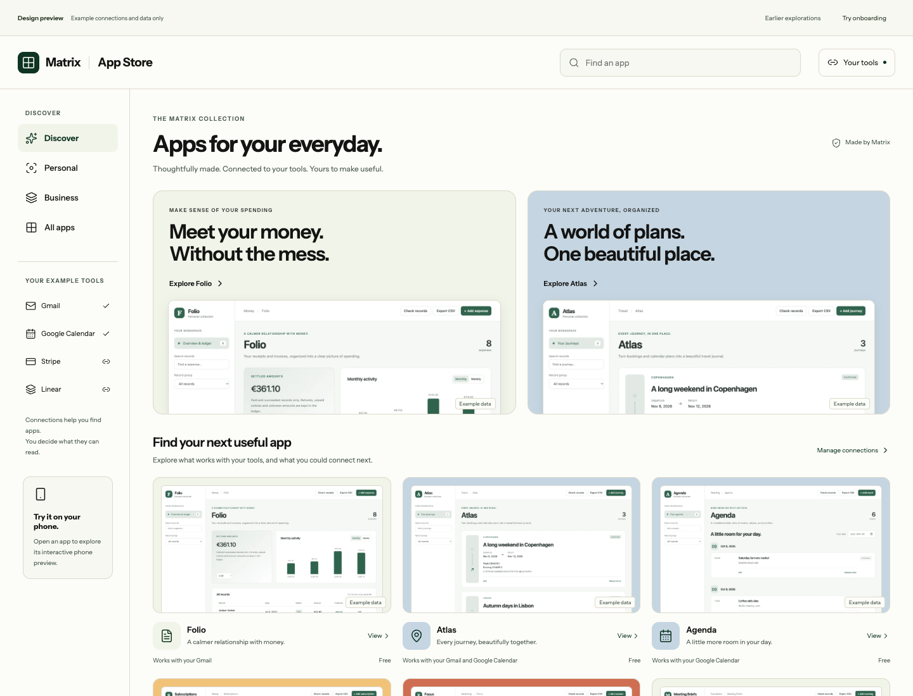
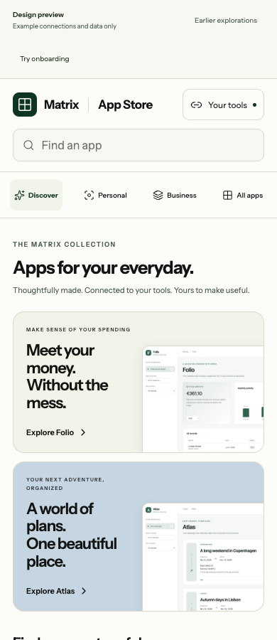
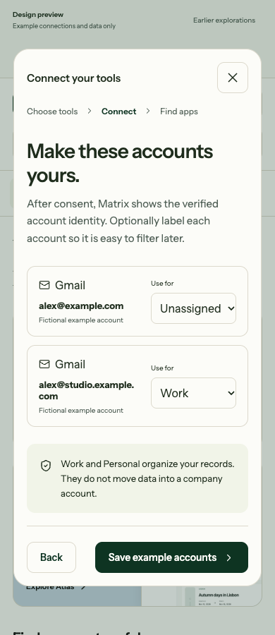

# Design direction

**Premium and minimal:** a crisp storefront, generous actual app previews, restrained color, and clear navigation. The user selected this direction after rejecting the first local design. This is the direction to develop; it is not approval of the current implementation or evidence of launch readiness.

The storefront should answer three things immediately: what an app does, what it looks like, and how it fits the user's tools. Keep the product ahead of the marketing. Connections help discovery; consent and import setup have their own focused steps.

## Exploration and decision

| Direction | Composition | Assessment |
| --- | --- | --- |
| A: Curated collection | Serif editorial headline, warm paper, two large app cards | Rejected in the first exploration; too much introductory space before apps. Retain only as comparison evidence. |
| B: Connected workspace | Compact rail, tool inventory, searchable app rows | Useful navigation structure; the original treatment still felt too much like an administration screen. Not an approved visual direction. |
| C: Guided start | Tool choices paired with outcomes before the catalog | Useful first-visit logic; should become focused onboarding rather than dominate everyday browsing. Not an approved visual direction. |
| D: Refined storefront | Compact header/search, quiet collection navigation, real app previews near the top, restrained accent fields | Current direction, following the user's premium/minimal preference. Continue reviewing the running composition on phones and computers. |

The interactive React exploration retains A–C behind explicit comparison controls and opens D by default. The comparison controls and fictional-data label are review chrome, not production store navigation.

## Reference observations

- [Apple's App Store overview](https://www.apple.com/app-store/) describes editorial discovery, app product pages and privacy information. Use the emphasis on helping people understand an app before downloading it; do not copy Apple's branding or imply their approval process applies to Matrix.
- [Notion's connections gallery](https://www.notion.com/connections) presents recognizable tools, categories and a scannable gallery. Borrow clear tool recognition, while keeping a Matrix app distinct from the connector supplying its information.
- [Shopify App Store](https://apps.shopify.com/) separates storefront discovery from individual app evaluation. The useful principle is progressive disclosure: a concise card first, fuller capability and rating information in details. Matrix has no fabricated popularity or review history.
- [Airtable integrations](https://www.airtable.com/integrations) is a reference for explaining connected workflows. Matrix's recommendations still depend on its verified inventory and curated actions rather than the number of integrations a provider advertises.

These are design interpretations of the referenced official surfaces, not a claim that their complete onboarding or authorization flows were tested.

## Store composition

Use `@matrix-os/brand` for Matrix chrome/setup. Favor its paper surface and neutral text for the store, with forest as an action color. App previews carry the character; restrained blue, warm gold and coral framing can distinguish collections. Use a clean sans-serif hierarchy, subtle separators, real icons and limited shadow. Avoid a giant introductory headline, repeated full-width marketing sections, fake statistics and decorative gradients.

On wide windows, a compact collection rail supports Discover, Personal, Business and All apps. Search remains visible in the header. Your apps joins this shared navigation when verified installation state is wired. Two featured apps introduce concrete tasks with their actual interfaces. The catalog below uses comparable screenshot cards: icon/name, one benefit, relevant connection state and the real install/open status. Featured screenshot crops must keep useful app content visible without distorting it.

On phones, turn the rail into accessible collection controls and move search into its own full-width row. Preserve every collection and action. Featured cards become full-width compact compositions. Details use a full-width scrollable presentation with a reachable close/Back action. Preview controls switch between a real screenshot and an interactive phone composition; they must not simply shrink a desktop screenshot and call it mobile.

The current screenshot assets are actual connected-starter interfaces with fictional records. They establish provenance, not eight finished bespoke designs. The [hero briefs](app-briefs.md) define the intended individual experiences. Replace listing screenshots only after those implementations exist and their phone flows pass; never generate an image of an unbuilt app and present it as a screenshot.

## Onboarding integration

Use the short scenes in [onboarding-ux.md](onboarding-ux.md). Offer connection setup during first use, from Your tools, and from a selected listing. Browsing and previews remain available before consent. Start with one tool; do not ask for a full workspace migration.

Show verified account identity before optional Personal/Work designation. Keep account selection for an app's import separate from connection setup. Returning from consent preserves the selected listing, preview mode and draft choices. A rejected/cancelled connection does not erase existing accounts or imply installation failure.

App detail → permissions/target review → installation confirmation → exact-account/range setup is a continuous flow. Progress copy distinguishes local app publication from receipt reconciliation and actual source processing. The current walkthrough uses explicitly labeled example connections, permissions and rating choices; it sends no OAuth, install, import or rating requests.

## Interaction and accessibility

- Make every touch target at least 44×44 pixels, with visible keyboard focus and usable native form controls. Do not advertise keyboard shortcuts unless implemented.
- Keep dialogs focus-contained, dismissible and scrollable. Return focus to the triggering control. Preserve the underlying detail view while a connection dialog is open.
- Keep search, long labels, errors and primary actions usable at 360/390 pixels and during resize. Phone input text must not trigger unwanted automatic zoom.
- Never hide essential functionality to obtain a clean screenshot. Give dense tables/charts an accessible summary and explicit contained scrolling when necessary.
- Motion supports state changes; avoid continuous decorative movement. Respect reduced motion. Native Back, safe areas, keyboard and background recovery require actual native verification before release.

## Evidence and remaining work

The prototype has strict TypeScript and a production Vite build. Its browser flow check covers 360, 390, 600, 820, 1024 and 1440 pixels: search/empty state, connection walkthrough, optional account designation, preserved existing connections, return to the selected phone preview, permission review before example completion, optional stars and no private API requests. The actual demo fixtures have separate bounded CRUD/CAS/reset and network-policy checks.

See [spec.md](spec.md) and [plan.md](plan.md) for production launch gates. The prototype is not OAuth, installation, a public demo endpoint, rating persistence or Native Mobile capability implementation. Those remain implementation units, with exact release/client evidence required. The mobile app-building policy is a separate change that requires phone-first composition and real authenticated save/reopen checks; policy text is not host implementation.
