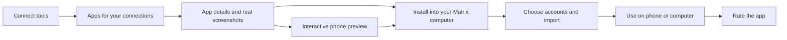

# Matrix App Store

Connect the tools you already use and discover beautiful apps that turn their information into something useful. Install an app into your own Matrix computer, use it on your phone or computer, and rate it after installation.

The October 15 launch contains free, reviewed first-party apps, recommendations based on connected tools, real screenshots, installation, star ratings, and interactive mobile previews. Community publishing follows later. Mobile is a launch requirement for both the store and its installed apps.

## Scope and decisions

- Target eight deliberately designed launch apps; launch with at least five that meet every quality gate. Keep the broader 24-app Personal/Business lineup as the product roadmap. Unfinished apps remain unlisted rather than inflating the launch count.
- All launch apps are free. Apps may consume ordinary Matrix AI usage during a clearly requested import; free installation does not imply unlimited inference or third-party subscriptions.
- Star ratings are included. Written reviews, author responses, moderation queues, payments, community publishing and organization distribution are outside this launch.
- Personal and Business are discovery collections. A Work account label is a record filter, not an organization ownership boundary. Installed app records belong to the selected computer owner.
- No automatic ingestion after connecting a tool. Connecting unlocks recommendations; an installed app asks for exact accounts, range and import confirmation.
- Preserve existing customized apps and owner data. No silent replacement or automatic application of app updates. Versioned app updates require a later, explicit customization-aware lifecycle.
- The user confirmed October 15, free first-party apps, star ratings and mobile previews on October 6. They subsequently required generated apps to work in Native Mobile as well as responsive web views.

## User journey

### 1. Connect tools

Offer connection setup from onboarding, App Store and app details. Show supported tools with their actual Matrix actions; distinguish supported, connected, reconnect needed and coming soon. Start with Gmail, Google Calendar, Drive, Linear, GitHub, Slack, Notion, Stripe and PostHog where their curated actions are available. Users can skip connections and try apps with example data or use manual apps such as Focus.

Use the existing OAuth workflow. Mark a connection complete only after authoritative inventory reconciliation confirms its ID and active status. Handle reconnects and status changes as well as newly appearing IDs. Preserve the app/detail the user came from when returning from consent. Cancellation leaves the previous connections and app state intact.

For multiple accounts, show a readable identity and optional Personal/Work designation. Names and designations may change; immutable connection IDs identify accounts. Never choose a default mailbox silently. Credentials stay with the integration authority.

New integrations use the existing managed-connector registration path, curated action schemas and risk policy. Pipedream availability alone does not establish Matrix support. Add and test read actions, discovery, scopes, account selection, errors and pagination before marking a tool supported. Custom MCP is a separate workflow; an arbitrary discovered tool is not automatically an App Store data source.

### 2. Get app recommendations

After inventory or supported-action changes, show up to eight suggestions with a concrete reason: “Works with your Gmail,” “Uses your Calendar and Gmail,” or “Connect Stripe to use Revenue.” Recommendations use connection metadata and authoritative supported-action discovery. They do not read email bodies, calendar entries or documents.

Use one shared deterministic derivation across all OS views. Rank apps with every required source/action available first, then apps needing one tool, then the wider collection; editorial launch priority breaks ties. Show useful apps that need no connections. Optional sources improve an app without blocking its primary flow. Installation and import readiness are separate states.

An inventory failure is an unknown state with retry. Do not show connected tools as missing or claim import readiness when action availability is unknown. Recommendations explain why an app fits, avoid repeatedly promoting an installed app, and remain stable while background refreshes settle.

### 3. Browse, preview and install

The store has Recommended, Personal, Business and Your apps views, search, categories and connection filters. Cards show icon, one clear benefit, an actual app screenshot, relevant tools, and the install/open action. Show real rating averages and counts when available; show “No ratings yet” for zero ratings. Do not display invented install counts, sample reviews or popularity.

Details include the app's main use case, real desktop and phone screenshots, an interactive preview, required/optional tools, permissions, release version, publisher and supported actions. Screenshots use clearly labeled fictional records and correspond to the listed release. They never contain owner invoices, journeys, emails or account identifiers. Preview fixtures are not seeded into installations.

Before installation, show what the app can access and which computer receives it. A signed-in user explicitly selects a target if they have multiple computers. New accounts can browse and preview before provisioning; installation then follows the existing sign-in/computer setup flow and resumes the selected listing. Missing integrations do not prevent installing an app that remains useful with manual input; its source features offer connection setup.

Installation states are install, installing, installed/open, recoverable incomplete installation, and retryable failure. Success requires completed publication and a usable registered app. Retrying is idempotent. Open resolves a validated installed-app identity against current inventory; no app can launch an arbitrary name, path or URL supplied by a frame.

### 4. Set up and use the app

An app starts with an intentional empty state and one useful primary action. Select exact connections and Personal/Work filters. Explain the import range and data sources, then let the user request processing. Folio defaults to the last three calendar months; Atlas defaults to the full current year. User changes to these defaults remain available.

Imports bind every source read to the selected connection ID, label and email snapshot. Connection changes stop the import for reselection. Preserve evidence, distinguish plans from bookings and unknown values from zero, deduplicate by immutable source identity, and retain owner corrections. Show progress, failures, partial results and capped coverage accurately. A dispatched request is not a completed import. Source writes, cancellation services and email sending are outside these read-only launch flows.

All primary features work in Web Canvas, Web Desktop, Electron Desktop, Web Mobile and Native Mobile. Presentation adapts to the space; data, actions, account choices, errors and persistence stay equivalent. Mobile navigation, charts, forms, maps, record editing, imports and save/reopen must be verified in the actual native app. Do not substitute desktop-only notices or simulated saves for the required functionality.

### 5. Rate an app

After a verified installation, offer an optional one-to-five-star rating in app details and Your apps. One current rating exists per verified owner/listing; the owner can change or remove it. The server derives reviewer identity from authentication, checks eligibility, and updates the aggregate atomically. Ratings are never required for using an app and no review is submitted automatically.

Public responses contain only aggregate stars/counts. The signed-in owner can read their own vote. Display a decimal average and its sample count; do not round stored aggregates to whole stars. Ratings contribute no fabricated ranking or import outcome.

## Launch apps and design bar

See [app briefs](app-briefs.md) for eight proposed hero experiences and the wider 12 Personal/12 Business idea library. The existing owner Folio and Atlas demonstrate the intended design quality. Their reusable releases require sanitized source, portable builds, complete phone flows and empty owner storage; private owner content is never packaged.

Every hero needs an app-specific hierarchy and signature interaction, readable real-data views, useful empty/loading/error/conflict states, and purposeful motion. The shared connected starter is infrastructure, not evidence that 24 distinct finished products exist. At least five polished apps must pass all launch gates; extra catalog entries cannot compensate for missing mobile functionality, ratings or the main user journey.

## Mobile and preview contract

R1. The App Store itself supports browsing, connecting, recommendations, details, installing/opening, and rating in all five OS views.

R2. The same installed app code supports phone layouts and the real authenticated data/integration capabilities it needs. The Native Mobile host supplies a narrow MatrixOS capability bridge; app authors do not duplicate credentials or networking for each platform. The Web Mobile host must route Open into its existing app stack.

R3. A phone preview runs the listed release with a dedicated fictional-data adapter, without installing or connecting tools. Its responsive layout and meaningful interactions are real. It is available from a phone layout toggle and a stable, public “Preview on your phone” link/QR code. The URL contains listing/release identity only, never owner IDs, connection IDs, launch tokens or personal-data references.

R4. Preview execution is isolated from installed-app execution. Use a configured, reviewed demo origin/context that receives no Matrix authentication cookies or bearer headers. Disable cookie sharing in the native preview WebView, inject no owner bridge, prohibit provider/kernel/data calls, restrict navigation and network access, and serve only allowlisted immutable demo assets. Any interactive edits remain temporary and reset on reload. Demonstrate origin, cookie, CSP and asset-loading isolation in a spike before publishing the endpoint; do not weaken CORS or runtime auth to make a preview render.

R5. Verify at 360, 390, 600, 820, 1024 and 1440 CSS pixels, intermediate app window sizes, landscape, safe-area insets, large text, reduced motion and supported color modes. Touch targets are at least 44×44 pixels. Controls stay reachable with the on-screen keyboard; drafts survive resize/background/foreground. Essential chart/table data stays accessible, with labeled deliberate scrolling for genuine two-dimensional content.

R6. Native Mobile verification uses the Expo dev client or a packaged client, with the real WebView and authenticated Matrix computer. A browser screenshot or Expo Go does not prove native support. Release the required native client capability alongside the gateway/app artifacts and record exact versions tested. No unsupported mobile notice is part of the launch product.

## Architecture and ownership

| Concern | Source of truth |
| --- | --- |
| Public listings, release references, verified install receipts and ratings | Existing platform Postgres/Kysely domain, extended deliberately |
| First-party package code, approved actions and preview assets | Reviewed immutable release/catalog authority with content digests |
| Connected account identity, credentials and supported actions | Existing platform integration authority and gateway projections |
| Installed source/build files and customization | Selected owner's Matrix home |
| App records, evidence and per-app local state | Owner Postgres namespace |
| Pending receipt delivery and retry state | Bounded owner-runtime durable journal/outbox |

Use stable listing identity independently of display name, slug and local folder. A release identifies its package digest, manifest/schema version, required capabilities and preview assets. The public listing references that release; runtime installation accepts only an approved first-party listing/release identity. It never accepts arbitrary remote URLs, caller paths or build commands. Trust comes from release authority, not a downloaded manifest's claim.

Keep one release/catalog projection across platform metadata, recommendations, installation and previews. Extend the existing `apps_registry`, `app_installs` and `app_ratings` domain after checking migrations and deployed schema. Do not implement the stale SQLite migration or duplicate organization model from older specs. Preserve backward compatibility for internal callers while replacing unsafe public mutation semantics.

Count a unique owner/listing installation only after runtime confirmation of completed publication. A client “Install” click is not a receipt. Confirmation uses a platform-verified machine principal bound to its owner and reviewed package release; the browser cannot submit an authoritative receipt. Publication and database writes span separate resources: a verified manifest can exist before its receipt is delivered. Reconcile that bounded orphan idempotently on retry, without overwriting owner files. Record related journal/outbox writes together in an owner DB transaction. A platform outage must not undo a completed local installation.

For ratings, serialize mutations on the listing row inside a transaction, upsert/delete the owner's unique vote, recompute aggregates, then commit. Eligibility uses confirmed installation receipts, not caller-provided `userId` or a self-reported filesystem path. Legacy customized apps remain usable; unverified legacy installs do not fabricate store statistics or rating eligibility. Account deletion removes private vote/receipt references according to the existing owner deletion policy and recomputes affected aggregates.

## Proposed boundaries and authentication

Names below are the proposed launch contract, not claims that these routes are already available. Preserve existing conventions where practical and verify production proxy routing explicitly.

| Boundary | Authority | Public | Mutating |
| --- | --- | --- | --- |
| Platform store listing/detail and aggregate rating reads | Approved public projection; bounded IDs/filters/cursors | Yes | No |
| Immutable preview assets and listing/release preview lookup | Allowlisted published release; no owner data | Yes | No |
| Gateway connection setup, inventory and action discovery | Verified runtime owner, existing integration authority | No | Setup/sync as existing APIs define |
| Gateway recommendations | Verified owner; credential-free metadata only | No | No |
| Gateway listing/release installation | Verified owner and selected-runtime binding; approved package | No | Yes |
| Platform confirmed-install ingestion | Verified active machine principal bound to owner/release | No | Yes |
| Platform own-rating read | Clerk-verified owner | No | No |
| Platform rating upsert/delete | Clerk-verified owner plus confirmed-install eligibility | No | Yes |
| Installed-app bridge actions | Current owner/runtime/frame generation and manifest capabilities; server authorization | No | As the exact allowlisted action defines |

Public reads must be mounted before unrelated platform administrator-secret middleware, and the app-domain proxy must route them to the platform store deliberately. Owner mutations require user authentication independently of that public read path. No public publish/install-intent endpoint may trust caller identity or count arbitrary clicks.

Validate all request/query/path fields with bounded Zod schemas. Apply bodyLimit to every mutation, including DELETE; validate ratings as integers 1–5; cap listing/results, request IDs, message payloads, pending bridge requests and preview assets. Default external API timeout is 10 seconds; file downloads 30 seconds. Use explicit origin policy, generic client errors and safe logs. Any server-side user-controlled URL needs the existing SSRF boundary; the launch installer and previews accept no such URLs.

Native bridge envelopes bind the installed slug, current frame, owner/runtime selection and launch generation. Allow only capability-specific actions and exact method/path pairs. Keep credentials inside native networking, invalidate pending work on logout/runtime/frame changes, reject replay/malformed/oversized messages, and never grant generic HTTP or filesystem access. Preserve production restrictions on direct integration execution. Reuse shared capability schemas and derivations rather than duplicating business logic in five clients.

## Acceptance and launch gates

| ID | Observable result |
| --- | --- |
| A1 | Connect Gmail from a listing; cancel safely or finish consent; verified inventory updates suggestions without reading messages. Reconnect/status transitions also update them. |
| A2 | Gmail suggests relevant Personal apps; Calendar adds Agenda/Atlas/Meeting Briefs; missing or unavailable actions never produce false readiness. No connection still offers Focus and previews. |
| A3 | Browse/search/details show actual desktop and phone screenshots, declared capabilities and truthful rating states. No owner content or invented statistics is shipped. |
| A4 | Install and retry produce one complete usable app; existing customized apps remain byte-identical. Lost receipt delivery eventually reconciles once without duplicate counts. |
| A5 | Choose two Personal accounts and a Work account; bounded imports stay tied to their IDs, preserve manual edits and report incomplete coverage. A replaced connection fails before a source read. |
| A6 | Every launched hero completes its main task and saves/reopens in all five OS views, including Native Mobile; Web Mobile Open actually opens the installed app. |
| A7 | Phone preview runs the exact listed release without installation/login, shows example data, supports its main interaction and exposes no owner/native/provider capabilities. A QR link contains no secrets. |
| A8 | Ineligible/anonymous rating attempts fail. Concurrent ratings, edits, deletes and retries produce one vote per owner and exact count/decimal average. No automatic feedback submission occurs. |
| A9 | Narrow layouts, keyboard, safe areas, long labels, large text, back navigation, reduced motion, theme changes and background recovery preserve functionality and drafts. |
| A10 | Real production proxy/auth wiring, migration compatibility, Linux installation, native bridge teardown and preview isolation pass end-to-end checks; reviewed release and client versions are recorded. |
| A11 | At least five app-specific designs pass the same gates; the planned eight and wider 24 ideas are not advertised as shipped until verified. |
| A12 | Separate public-docs PR explains connection recommendations, installation, ratings, previews, phone use, data ownership and actual update policy. |

Target discovery-to-install under one minute after login/computer readiness, with installation latency measured separately from source imports. Track connect completion → recommendations shown → details/preview → confirmed install → first useful action → repeat use, plus install/bridge/import errors. Collect listing/release IDs and coarse funnel outcomes only; no email/document content, amounts, destinations, account emails or OAuth credentials enter analytics. Ratings remain optional and independent of these metrics.

## Existing foundations and changes required

The pending curated gallery in spec 549 supplies 24 definitions, bounded readiness, real example-data screenshots, a safe first-party installer, owner records and exact-account import requests. It is unfinished release work, not a shipped App Store. Older specs 039/058 provide product context; this spec governs the October 15 scope and supersedes their broader publishing/organization requirements for this launch.

Code inspection found launch gaps: platform store route composition is administrator-gated despite its public comment; its standalone mutations trust caller identity and its install endpoint counts intent; rating aggregation/eligibility needs tightening. Web Mobile supplies an empty Open callback. Native Mobile opens an app session but does not inject the MatrixOS bridge. Mobile integration parsing also loses action metadata and needs supported OAuth URL/status transition handling. These are implementation work in [plan.md](plan.md), not product exclusions.

## Outside October 15

Community publishing/uploads, arbitrary third-party code execution, publisher moderation/audits, payments/revenue sharing, org app distribution, app-specific automatic updates/rollback, scheduled imports, bank synchronization, source writeback, flight booking/status services and unsupported integration claims. Keep stable listing/release/capability seams so these can be designed later without weakening the launch boundary.
