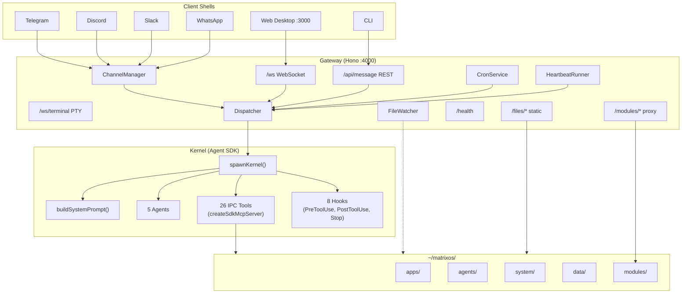

import { Callout } from 'fumadocs-ui/components/callout';

## System Architecture

### Gateway Endpoints

| Endpoint | Purpose |
|----------|---------|
| `/ws` | Main WebSocket (chat, file watcher events) |
| `/ws/terminal` | PTY WebSocket (xterm.js to node-pty) |
| `/api/message` | REST endpoint for kernel dispatch |
| `/api/channels/status` | Connected channel status |
| `/files/*` | Static file serving from ~/matrixos/ |
| `/modules/*` | Reverse proxy to module ports (3100-3999) |
| `/api/theme` | Current theme JSON |
| `/api/cron` | Cron job list |
| `/api/tasks` | Task list + creation |
| `/health` | Health check |

## Packages

### `packages/kernel/`

The AI kernel. Key files:

| File | Purpose |
|------|---------|
| `spawn.ts` | `spawnKernel()` -- entry point, calls `query()` and `resume` |
| `options.ts` | `kernelOptions()` -- assembles system prompt, IPC, agents, hooks |
| `prompt.ts` | `buildSystemPrompt()` -- constructs the system prompt with SOUL, skills, context |
| `ipc-server.ts` | `createIpcServer()` -- 26 IPC tools via `createSdkMcpServer()` |
| `agents.ts` | Core agent definitions, `parseFrontmatter()`, `loadCustomAgents()` |
| `hooks.ts` | All hook implementations (safety, snapshots, permissions, healing) |
| `soul.ts` | SOUL identity loading (`loadSoul()`, `loadIdentity()`, `loadUser()`) |
| `schema.ts` | Drizzle ORM schema (tasks, messages, memories) |
| `db.ts` | Database setup (WAL mode, migrations) |

### `packages/gateway/`

Hono HTTP/WebSocket gateway. Key files:

| File | Purpose |
|------|---------|
| `server.ts` | `createGateway()` -- initializes all services, routes, WebSocket |
| `dispatcher.ts` | `createDispatcher()` -- serial/concurrent queue, kernel invocation |
| `watcher.ts` | File watcher (chokidar) -- broadcasts file:change events |
| `channels/` | Channel adapters (Telegram, Discord, Slack, WhatsApp) |
| `cron.ts` | `createCronService()` -- scheduled task execution |
| `heartbeat.ts` | `createHeartbeatRunner()` -- periodic kernel health checks |
| `conversations.ts` | `createConversationStore()` -- multi-session persistence |

### `packages/platform/`

Multi-tenant cloud orchestrator (Hono :9000). Manages container provisioning via dockerode, Drizzle for tenant data, Clerk auth integration, and Cloudflare Tunnel configuration.

### `shell/`

Next.js 16 web desktop. The primary visual shell. Renders the desktop with windows, dock, chat panel, terminal, settings, and Mission Control. Uses WebSocket for real-time streaming and file change events.

## Request Flow

Here's the complete path of a user message from input to response:

1. **User sends a message** via WebSocket (`/ws`), REST (`/api/message`), or a channel adapter
2. **Gateway receives it** in `createGateway()` and passes it to `dispatcher.dispatch()`
3. **Dispatcher queues it** in the serial FIFO queue (or concurrent queue if configured)
4. **Task is created** in SQLite via `createTask()`, then claimed via `claimTask()`
5. **`spawnKernel()` is called** with the message and `KernelConfig` (db, homePath)
6. **System prompt is built** by `buildSystemPrompt()`:
   - SOUL identity (`soul.md`, `identity.md`, `user.md`)
   - Skills table of contents (`buildSkillsToc()`)
   - Active processes (from tasks table)
   - Available agents and their descriptions
7. **Agent SDK `query()` is called** with the system prompt and available tools
8. **Tokens stream back** as `KernelEvent`s through the gateway to the client as `ServerMessage`s
9. **If the agent uses a tool**, a `tool_use` block is returned:
   - The kernel executes the IPC tool via `createSdkMcpServer()`
   - `PreToolUse` hooks run first (safety guards, permission checks)
   - The tool executes (file ops, task management, skill loading, etc.)
   - `PostToolUse` hooks run after (git snapshots, state updates, shell notifications)
   - The result is returned to the kernel
10. **`resume()` is called** with tool results to continue the conversation
11. **The final response** streams back to the user
12. **Task is completed** via `completeTask()` (or `failTask()` on error)

<Callout type="info" title="Serial by default">
  The dispatcher processes one message at a time by default. This prevents file system corruption from concurrent writes. Enable concurrent dispatch with `maxConcurrency` in the dispatcher config, where each process registers in the tasks table.
</Callout>

## The Computer Metaphor

| Traditional OS | Matrix OS |
|---------------|-----------|
| CPU | Claude Opus 4.6 |
| RAM | Context window (1M tokens) |
| Kernel | Main agent + `spawnKernel()` |
| Processes | 5 sub-agents (Builder, Researcher, Deployer, Healer, Evolver) |
| Syscalls | Read, Write, Edit, Bash (file tools) |
| Disk | `~/matrixos/` (apps, data, system, agents) |
| Drivers | MCP servers (IPC tools) |
| IPC | File coordination + SQLite task queue |
| Shell | Web desktop, Telegram, CLI (any renderer) |
| Device drivers | Channel adapters |
