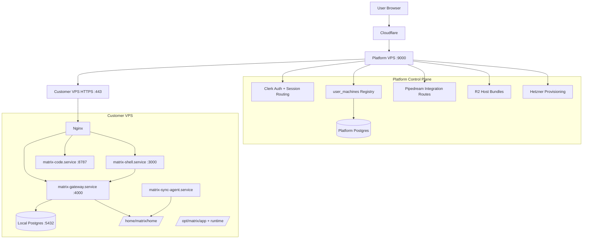

import { Callout } from 'fumadocs-ui/components/callout';

## Architecture At A Glance

Matrix OS has two major runtime layers:

- **Platform control plane**: shared services for auth, routing, provisioning, integrations, host-bundle publication, and recovery orchestration.
- **Customer VPS runtime**: one VPS per active user, running that user's Matrix gateway, shell, code editor, app assets, local Postgres, sync, and backup services.


```mermaid
graph TD
    User[User Browser] --> CF[Cloudflare]
    CF --> Platform[Platform VPS :9000]

    subgraph PlatformBox[Platform Control Plane]
      Auth[Clerk Auth + Session Routing]
      Machines[user_machines Registry]
      Integrations[Pipedream Integration Routes]
      Bundles[R2 Host Bundles]
      Provision[Hetzner Provisioning]
      PDB[(Platform Postgres)]
    end

    Platform --> Auth
    Platform --> Machines
    Platform --> Integrations
    Platform --> Bundles
    Platform --> Provision
    Machines --> PDB

    Platform --> Customer[Customer VPS HTTPS :443]

    subgraph CustomerBox[Customer VPS]
      Nginx[Nginx]
      Shell[matrix-shell.service :3000]
      Gateway[matrix-gateway.service :4000]
      Code[matrix-code.service :8787]
      Sync[matrix-sync-agent.service]
      Pg[(Local Postgres :5432)]
      Home[/home/matrix/home/]
      Runtime[/opt/matrix/app + runtime/]
    end

    Customer --> Nginx
    Nginx --> Shell
    Nginx --> Gateway
    Nginx --> Code
    Gateway --> Pg
    Gateway --> Home
    Shell --> Gateway
    Sync --> Home
```

## Platform Control Plane

`packages/platform/` owns shared platform concerns:

- Clerk/session auth for `app.matrix-os.com` and `code.matrix-os.com`.
- `{handle}.matrix-os.com` routing.
- `user_machines` registry for customer VPSes.
- Hetzner provisioning, registration, deletion, and recovery flows.
- Host-bundle serving through `/system-bundles/*`.
- Pipedream integration credentials and user-scoped integration routes.
- Platform Postgres for control-plane records.

The platform does not run the user's gateway, shell, code-server, apps, or app database in production. It resolves who the user is and proxies to that user's VPS.

## Customer VPS Runtime

Each customer VPS is bootstrapped by cloud-init and the Matrix host bundle.

Runtime files:

- `/opt/matrix/env/host.env`: machine identity, handle, Clerk user id, `DATABASE_URL`, `PLATFORM_INTERNAL_URL`, and per-host tokens.
- `/opt/matrix/env/r2.env`: R2 credentials for backup/sync.
- `/opt/matrix/app`: gateway, shell, packages, and bundled default apps.
- `/opt/matrix/runtime`: Node, code-server, and bundled coding-agent CLIs.
- `/opt/matrix/bin`: launchers for gateway, shell, code, sync, and update.
- `/home/matrix/home`: user-owned Matrix home.

Services:

- `matrix-gateway.service` runs the Hono gateway.
- `matrix-shell.service` runs the Next.js shell.
- `matrix-code.service` runs code-server.
- `matrix-sync-agent.service` keeps sync flows moving.
- `matrix-db-backup.timer` uploads Postgres snapshots.
- Nginx terminates local HTTPS and routes to shell/gateway/code.

Each customer VPS has its own local Postgres endpoint at `127.0.0.1:5432`. The current bootstrap starts it as a single machine-local `postgres:16` service container named `matrix-postgres` with a local volume. This is not the legacy shared user-runtime container model.

## Gateway

`packages/gateway/` is the user runtime API. It runs on the customer VPS and owns:

- chat/WebSocket routes;
- file serving from the Matrix home;
- app discovery, build, launch, and proxying;
- app data bridge routes;
- canvas routes and realtime subscriptions;
- terminal/workspace/session routes;
- sync and home-mirror integration;
- social and channel adapters where configured;
- integration proxying back to platform-owned routes.

When `DATABASE_URL` is set, the gateway connects to the customer-local Postgres database, bootstraps app/workspace tables, and registers app manifests with `storage.tables`.

## Shell

`shell/` is the primary visual renderer. It is a Next.js 16 + React 19 web shell. Canvas mode is the primary product surface; Desktop remains a compatibility shell.

The shell handles:

- app windows and built-ins;
- Canvas layout and spatial workspaces;
- chat surfaces;
- file/app preview;
- terminal/code entry points;
- settings and integrations UI.

Built-in paths such as `__workspace__`, `__terminal__`, `__file-browser__`, `__preview-window__`, and `__chat__` must be wired in every renderer so they never fall through to normal app file routing.

## Kernel

`packages/kernel/` is the AI kernel layer. Current implementation uses Claude Agent SDK V1 `query()` with `resume`.

Important pieces:

- `spawnKernel()` starts or resumes kernel turns.
- `buildSystemPrompt()` assembles identity, SOUL, skills, context, and rules.
- IPC/MCP tools expose controlled system capabilities.
- Hooks protect files, snapshot changes, and persist state.
- Agent definitions and skills live as files so the OS can expand itself.

The product principle is "AI is the kernel," but the runtime still has conventional services for routing, auth, storage, and UI.

## Apps

First-party and polished apps are Vite + React apps under the Matrix home. Bundled default apps are built by `scripts/build-default-apps.mjs` before host-bundle publication and copied into the user's home on gateway startup.

App manifests use `matrix.json`. Apps that need structured data declare:

```json
{
  "runtime": "vite",
  "build": { "command": "pnpm build", "output": "dist" },
  "storage": {
    "tables": {
      "tasks": {
        "columns": {
          "text": "text",
          "done": "boolean"
        }
      }
    }
  }
}
```

The gateway creates schema-per-app Postgres tables and exposes scoped CRUD through `/api/bridge/query`. App child processes intentionally do not receive raw `DATABASE_URL`.

## Request Flow

### App Domain

1. Browser requests `https://app.matrix-os.com`.
2. Cloudflare sends the request to the platform tunnel.
3. Platform verifies Clerk/session identity.
4. Platform finds the user's `running` `user_machines` row.
5. Platform proxies to `https://<customer-vps-ip>:443`.
6. Customer nginx routes shell/gateway/code requests to local services.

### Handle Domain

1. Browser requests `https://alice.matrix-os.com`.
2. Platform resolves `alice` to a customer VPS.
3. Platform proxies to that VPS.
4. The customer gateway/shell serves the user workspace.

### App Data

1. App calls `/api/bridge/query`.
2. Gateway validates app/table/action payload.
3. Gateway uses Kysely against the customer-local Postgres database.
4. Gateway broadcasts generic data-change events after mutations.

## Data Boundaries

| Data | Owner | Location |
| --- | --- | --- |
| Platform users, machine rows, routing state | Platform | Platform Postgres |
| Clerk sessions and auth verification | Platform/Clerk | Clerk + platform |
| Pipedream provider credentials | Platform | Platform integration store |
| User files and apps | User | Customer VPS Matrix home |
| App/workspace data | User | Customer VPS Postgres |
| Canvas documents | User | Customer VPS Postgres |
| DB snapshots and VPS metadata | User/system recovery | R2 prefix |

## Developer Rules

- Use Postgres/Kysely for new persistence.
- Use Zod 4 from `zod/v4`.
- Use Vite + React for first-party apps.
- Use `/api/bridge/query` for app data, not direct app `DATABASE_URL`.
- Keep platform secrets off customer VPSes unless they are explicitly per-host runtime tokens.
- Add body limits, validation, timeouts, resource caps, and generic client errors on new routes.
- Build and publish a customer host bundle when shell/gateway/default-app/runtime code changes.

<Callout type="warn" title="Production is not the legacy container path">
  Older docs and specs may mention shared per-user Docker containers. Current production user runtime is per-user VPS with host services and local Postgres. Treat `/containers/*` as legacy/local-development compatibility unless you are explicitly working on that path.
</Callout>
