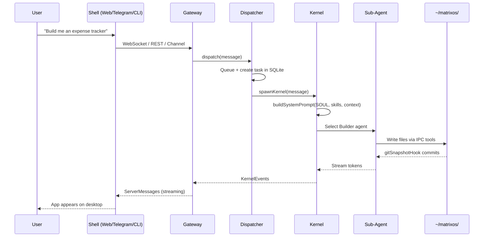

import { Card, Cards } from 'fumadocs-ui/components/card';
import { Callout } from 'fumadocs-ui/components/callout';

## What is Matrix OS?

Matrix OS is an AI-native operating system that combines your OS, messaging, social network, and AI assistant into a single platform. You describe what you need in natural language. It writes the software into existence.

Built on the Claude Agent SDK, Matrix OS treats AI as the kernel. The `spawnKernel()` function in `packages/kernel/src/spawn.ts` invokes `query()` for initial prompts and `resume` for multi-turn conversations. Everything the system creates is persisted as files in `~/matrixos/`.

<Callout type="info" title="Everything you create is a file you own">
  Apps live in `~/matrixos/apps/`, config in `~/matrixos/system/`, agent prompts in `~/matrixos/agents/`. Back up your entire OS by copying a folder.
</Callout>

## How It Works

## Core Principles

<Cards>
  <Card title="Everything Is a File">
    The file system is the single source of truth. Config, agents, skills, themes, data -- all files you own and can inspect, copy, or version with git.
  </Card>
  <Card title="Agent Is the Kernel">
    The Claude Agent SDK is the kernel. `query()` with `resume` handles multi-turn conversations. Five specialized sub-agents handle different task types.
  </Card>
  <Card title="Headless Core, Multi-Shell">
    The core works without a UI. The web desktop is one of many shells -- Telegram, WhatsApp, Discord, Slack, and CLI all connect to the same kernel.
  </Card>
  <Card title="Self-Healing and Self-Expanding">
    The Healer agent detects broken modules and restores them from git snapshots. The Evolver agent writes new agents, skills, and knowledge files on demand.
  </Card>
</Cards>

## The Computer Metaphor

Matrix OS maps the Claude Agent SDK to real computer architecture:

| Component | Maps To |
|-----------|---------|
| CPU | Claude Opus 4.6 |
| RAM | Context window (1M tokens) |
| Kernel | Main agent + `spawnKernel()` |
| Processes | 5 sub-agents (Builder, Researcher, Deployer, Healer, Evolver) |
| Syscalls | Read, Write, Edit, Bash |
| Disk | `~/matrixos/` (apps, data, system, agents) |
| Drivers | MCP servers (IPC tools) |
| IPC | File coordination + SQLite task queue |

## Next Steps

<Cards>
  <Card
    title="Getting Started"
    description="Set up Matrix OS locally and have your first conversation"
    href="/docs/guide/getting-started"
  />
  <Card
    title="Agent System"
    description="Understand the five core agents, SOUL identity, and skills"
    href="/docs/guide/agents"
  />
  <Card
    title="File System"
    description="The home directory, config, themes, and git snapshots"
    href="/docs/guide/file-system"
  />
</Cards>
