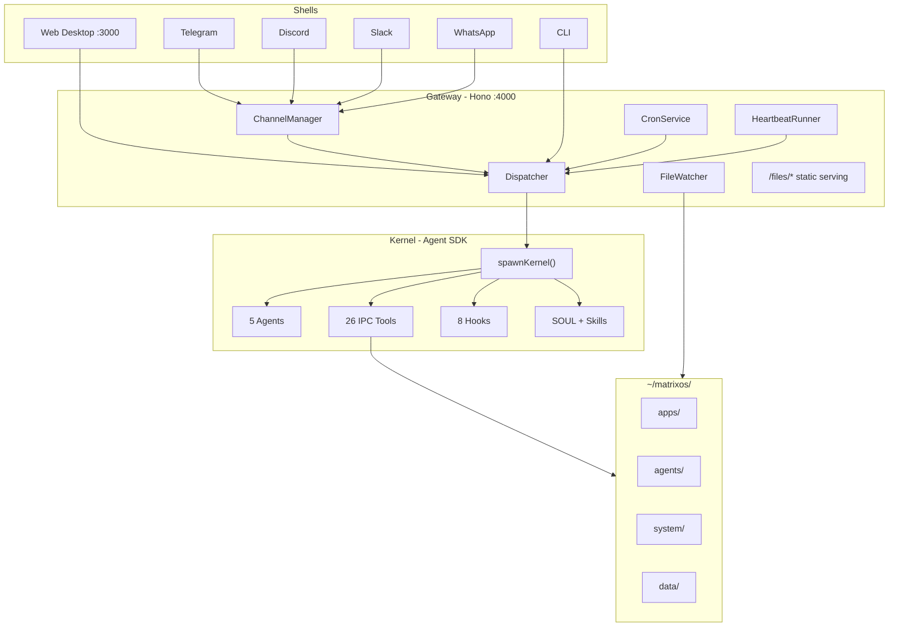

import { Card, Cards } from 'fumadocs-ui/components/card';
import { Callout } from 'fumadocs-ui/components/callout';
import { Step, Steps } from 'fumadocs-ui/components/steps';

Matrix OS is an AI-native operating system built on the Claude Agent SDK. You describe what you need in natural language -- it writes the software, saves it as files you own, and runs it on your desktop.

<Callout type="info" title="Built on Claude Agent SDK">
  The Agent SDK's `query()` with `resume` IS the kernel. Five specialized agents handle building, researching, deploying, healing, and evolving the system. Everything is persisted as files in `~/matrixos/`.
</Callout>

## Quick Start

<Steps>
  <Step>
    ### Clone and install

    ```bash
    git clone https://github.com/hamedmp/matrix-os.git
    cd matrix-os && pnpm install
    ```
  </Step>
  <Step>
    ### Set your API key

    ```bash
    export ANTHROPIC_API_KEY=sk-ant-...
    ```
  </Step>
  <Step>
    ### Start the OS

    ```bash
    bun run dev
    ```

    Open `http://localhost:3000` and start talking to your OS.
  </Step>
</Steps>

## Choose Your Path

<Cards>
  <Card
    title="Getting Started"
    description="Prerequisites, installation, and your first conversation with the AI kernel."
    href="/docs/guide/getting-started"
  />
  <Card
    title="Agent System"
    description="The five core agents, SOUL identity, and the skills system."
    href="/docs/guide/agents"
  />
  <Card
    title="Architecture"
    description="How the kernel, gateway, dispatcher, and shell fit together."
    href="/docs/developer/architecture"
  />
  <Card
    title="IPC Tools & Hooks"
    description="The 26 tools agents use to interact with the system, and the hook lifecycle."
    href="/docs/developer/ipc-tools"
  />
</Cards>

## Core Principles

<Cards>
  <Card title="Everything Is a File">
    Apps, config, agents, skills, themes, SOUL identity -- all stored as real files in `~/matrixos/`. Back up your OS by copying a folder.
  </Card>
  <Card title="Agent Is the Kernel">
    Claude Agent SDK `query()` with `resume` IS the kernel. Every user action flows through AI agents that understand context and take action.
  </Card>
  <Card title="Headless Core, Multi-Shell">
    The core works without a UI. The web desktop, Telegram, WhatsApp, Discord, Slack, and CLI are all shells that connect to the same kernel.
  </Card>
  <Card title="Self-Healing and Self-Expanding">
    The Healer agent detects and repairs failures from git snapshots. The Evolver agent creates new agents, skills, and capabilities on demand.
  </Card>
</Cards>

## Architecture at a Glance



## Web 4 Vision

Matrix OS is the foundation for **Web 4**: your AI runs on all your devices, syncs via peer-to-peer git, communicates through federated identity (`@you:matrix-os.com`), and your AI agent has its own identity (`@you_ai:matrix-os.com`) that negotiates with other AIs on your behalf via the Matrix protocol.

Read the full [Web 4 vision](/whitepaper).

## More Resources

- [DeepWiki](https://deepwiki.com/HamedMP/matrix-os/) -- AI-generated documentation from source code
- [GitHub](https://github.com/hamedmp/matrix-os) -- Source code and issues
- [Whitepaper](/whitepaper) -- The full Web 4 vision
